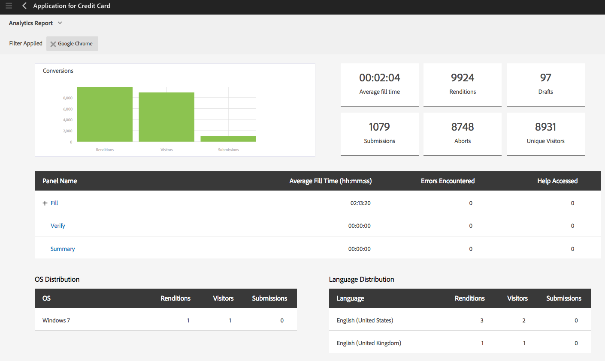

# AEM Forms 분석 보고서 보기 및 이해 {#view-and-understand-aem-forms-analytics-reports}

Adobe Experience Manager Forms은 Adobe Analytics과 통합되어 게시된 양식 및 문서에 대한 성능 지표를 캡처하고 추적할 수 있습니다. 이러한 지표를 분석하는 목표는 양식이나 문서를 보다 유용하게 만드는 데 필요한 변경 사항에 대한 데이터를 기반으로 정보에 입각한 결정을 내리는 것입니다.

## 분석 설정 {#setting-up-analytics}

AEM Forms의 분석 기능은 AEM Forms 추가 기능 패키지의 일부로 사용할 수 있습니다. 추가 기능 패키지 설치에 대한 자세한 내용은 [AEM Forms 설치 및 구성](../../forms/using/installing-configuring-aem-forms-osgi.md).

추가 기능 패키지 외에도 Adobe Analytics 계정이 필요합니다. 솔루션에 대한 자세한 내용은 [Adobe Analytics](https://www.adobe.com/solutions/digital-analytics.html).

AEM Forms 추가 기능 패키지 및 Adobe Analytics 계정이 있으면에서 설명한 대로 Adobe Analytics 계정을 AEM Forms과 통합하고 양식 또는 문서에서 추적을 활성화합니다 [분석 및 보고서 구성](../../forms/using/configure-analytics-forms-documents.md).

### 사용자 상호 작용 정보를 기록하는 방법 {#how-user-interaction-information-is-recorded}

사용자가 양식과 상호 작용할 때 상호 작용이 기록되어 Analytics 서버로 전송됩니다. 다음 목록은 다양한 사용자 활동에 대한 서버 호출을 나타냅니다.

* 방문당 필드당 2회 호출
* 패널 방문용 1개
* 저장용 1개
* 제출용 2개
* 저장용 2개
* 1개의 도움말
* 각 유효성 검사 오류에 대해 1개
* 양식 렌디션의 경우 1 + 기본 패널 방문의 경우 1 + 기본 첫 번째 필드 방문의 경우 1
* 양식 포기용 2

>[!NOTE]
>
>이 목록은 완전하지 않습니다.

### 분석 보고서 보기 {#summary-report}

분석 보고서를 보려면 다음 단계를 수행하십시오.

1. 다음 위치에서 AEM 포털에 로그인합니다. `https://[hostname]:'port'`
1. 클릭 **Forms > Forms 및 문서**.
1. 분석 보고서를 보려는 양식을 선택합니다.
1. 선택 **자세히 > Analytics 보고서**.

**A.** Analytics 보고서 명령

AEM Forms은 아래와 같이 양식 및 양식의 각 패널에 대한 분석 보고서를 표시합니다.

**A.** 전환 **B.** 양식 수준 요약 **C.** 패널 수준 요약 **D.** 방문자 브라우저 - 필터 **E.** 방문자 OS - 필터 **F** 방문자 언어 - 필터

기본적으로 지난 7일 동안의 분석 보고서가 표시됩니다. 최근 15일, 최근 1달 등에 대한 보고서를 보거나 날짜 범위를 지정할 수 있습니다.

>[!NOTE]
>
>최근 7일 및 최근 15일과 같은 옵션에는 분석 보고서를 생성하는 날의 데이터가 포함되지 않습니다. 현재 날짜의 데이터를 포함하려면 현재 날짜를 포함하여 날짜 범위를 지정한 다음 보고서를 실행해야 합니다.

### 적응형 및 HTML5 양식에 대한 전환 그래프 {#conversions-graph-for-adaptive-and-html-forms}

양식 수준 전환 그래프는 다음 주요 성과 지표(KPI)에서 양식의 성과를 확인할 수 있도록 합니다.

* **표현물**: 양식 열기 횟수
* **방문자 수**: 양식에 대한 방문자 수
* **제출**: 양식 제출 횟수

### 적응형 및 HTML5 양식에 대한 Analytics 보고서 {#analytics-report-for-adaptive-and-html-forms}

양식 수준 요약 섹션은 다음 주요 성과 지표(KPI)에서 양식의 성과를 파악할 수 있도록 합니다.

* **평균 채우기 시간**: 양식을 채우는 데 걸린 평균 시간입니다. 사용자가 양식에 시간을 투자했지만 제출하지 않은 경우, 이 시간은 이 계산에 포함되지 않습니다.
* **표현물**: 양식을 렌더링하거나 연 횟수
* **초안**: 양식이 초안으로 저장된 횟수
* **제출**: 양식 제출 횟수
* **중단**: 사용자가 양식 채우기를 시작한 후 양식을 완료하지 않고 떠난 횟수
* **고유 방문자 수**: 고유 방문자가 양식을 렌더링한 횟수입니다. 고유 방문자에 대한 자세한 내용은 [고유 방문자 수, 방문 횟수 및 고객 행동](https://helpx.adobe.com/analytics/kb/unique-visitors-visitor-behavior.html).

### 패널 보고서 {#bottom-summary-report}

패널 수준 요약 섹션은 각 패널에 대한 다음 정보를 형식으로 제공합니다.

* **평균 채우기 시간**: 양식 제출 여부에 관계없이 패널에서 보낸 평균 시간
* **오류 발생**: 패널의 필드에서 사용자가 발생한 평균 오류 개수입니다. 발생한 오류는 필드의 총 오류를 양식의 렌디션 수로 나누어서 로 전달됩니다.
* **도움말 액세스**: 사용자가 패널의 필드에 대한 컨텍스트 내 도움말에 액세스한 평균 횟수입니다. Help Accessed는 필드에 대한 도움말에 액세스한 총 횟수를 양식의 렌디션 횟수로 나누어에 도달합니다.

#### 자세한 패널 보고서 {#detailed-panel-report}

패널 보고서에서 패널 이름을 클릭하여 각 패널에 대한 세부 정보를 볼 수도 있습니다.

상세 보고서에는 패널의 모든 필드에 대한 값이 표시됩니다.

패널 보고서에는 세 개의 탭이 있습니다.

* **시간 보고서**(기본값): 패널의 각 필드를 채우는 데 걸린 시간을 초 단위로 표시합니다
* **오류 보고서**: 필드를 채우는 동안 사용자가 발생한 오류 수를 표시합니다
* **도움말 보고서**: 특정 필드에 대한 도움말에 액세스한 횟수

여러 패널을 사용할 수 있는 경우 패널 사이를 탐색할 수 있습니다.

### 필터: 브라우저, OS 및 언어 {#filters-browser-os-and-language}

브라우저 배포, OS 배포 및 언어 배포 표에는 양식 사용자의 브라우저, OS 및 언어에 따라 렌디션, 방문자 및 제출물이 표시됩니다. 이 테이블에는 기본적으로 최대 5개의 항목이 표시됩니다. 더 보기 를 클릭하여 더 많은 항목을 표시하고 덜 보기 를 클릭하여 정규 5개 이하의 항목으로 돌아갈 수 있습니다.

분석 데이터를 추가로 필터링하려면 테이블에서 항목을 클릭할 수 있습니다. 예를 들어 브라우저 배포 테이블에서 Google Chrome을 클릭하면 보고서가 다음과 같이 Google Chrome 브라우저와 관련된 데이터로 다시 렌더링됩니다.

필터를 적용한 후 패널 보고서를 보면 적용된 필터에 따라 패널 보고서 데이터도 표시됩니다.

필터가 적용되면:

* 한 번에 하나의 필터만 적용할 수 있으므로 배포 테이블은 읽기 전용이 됩니다.
* 적용된 필터의 테이블이 사라집니다.
* 닫기 단추(아래 강조 표시)를 클릭하여 적용된 필터를 제거할 수 있습니다.

### A/B 테스트 {#a-b-testing}

양식에 대해 A/B 테스팅을 활성화하고 설정한 경우 보고서 페이지에 A/B 테스팅 보고서를 표시하는 데 사용할 수 있는 드롭다운이 있습니다. A/B 테스트 보고서는 설정한 양식의 두 버전 비교 성능을 표시합니다.

A/B 테스트에 대한 자세한 내용은 [적응형 양식에 대한 A/B 테스트 만들기 및 관리](../../forms/using/ab-testing-adaptive-forms.md).
