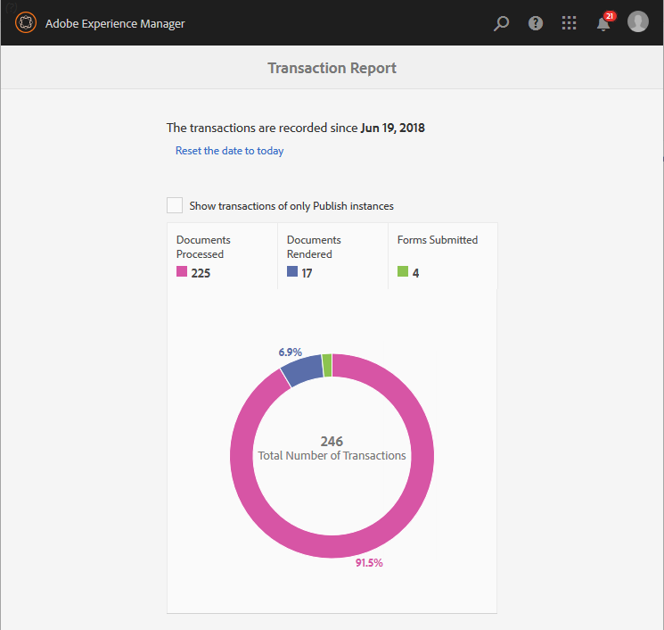

# 거래 보고서 보기 및 이해{#viewing-and-understanding-transaction-reports}

거래 보고서를 사용하면 제출된 양식, 처리된 문서 및 렌더링된 문서의 수를 캡처 및 추적할 수 있습니다. 이러한 거래를 추적하는 데 있어 목표는 제품 사용에 대한 올바른 결정을 내리고 하드웨어 및 소프트웨어에 대한 투자를 재조정하는 것입니다. 자세한 내용은 [AEM Forms 거래 보고서 개요](../../forms/using/transaction-reports-overview.md)를 참조하십시오.

## 거래 보고서 설정 중 {#setting-up-transaction-reports}

거래 보고서 기능은 AEM 양식 추가 기능 패키지의 일부로 사용할 수 있습니다. 모든 작성자 및 게시 인스턴스에 Add-on 패키지를 설치하는 방법에 대한 자세한 내용은 [AEM 양식 설치 및 구성](/help/forms/using/installing-configuring-aem-forms-osgi.md)을 참조하십시오. AEM 양식 Add-on 패키지가 설치되면 다음을 수행합니다.

* 모든 게시 인스턴스에서 역방향 복제 사용
* 거래 보고서 활성화
* 거래 보고서를 볼 수 있는 권한 제공
* (선택 사항) 트랜잭션 플러시 기간 및 보낼 박스 구성 

>[!NOTE]
>
>* AEM Forms 트랜잭션 보고서는 게시 인스턴스만 포함하는 토폴로지를 지원하지 않습니다.
>* 트랜잭션 보고를 사용하기 전에 모든 게시 인스턴스에 대해 역 복제가 활성화되어 있는지 확인합니다.
>* 트랜잭션 데이터는 게시 인스턴스에서 해당 작성자 또는 처리 인스턴스로만 역복제됩니다. 작성자 또는 처리 인스턴스는 데이터를 다른 인스턴스에 더 복제할 수 없습니다.

>

### 모든 게시 인스턴스 {#enable-reverse-replication-on-all-the-publish-instances}에서 역방향 복제 사용

트랜잭션 보고서는 역 복제를 사용하여 게시 인스턴스의 트랜잭션 수를 작성자 인스턴스로 통합합니다. 모든 게시 인스턴스에 역방향 복제를 설정합니다. 역방향 복제를 설정하는 자세한 지침은 [replication](/help/sites-deploying/replication.md)을 참조하십시오.

### 거래 보고서 활성화 {#enable-transaction-reports}

트랜잭션 보고서는 기본적으로 비활성화됩니다. AEM 웹 콘솔에서 보고서를 활성화할 수 있습니다. aem forms 환경에서 트랜잭션 보고서를 활성화하려면 모든 작성 및 게시 인스턴스에 대해 다음 단계를 수행하십시오.

1. AEM 인스턴스에 관리자로 로그인합니다. **도구** > **작업** > **웹 콘솔**&#x200B;로 이동합니다.
1. **Forms 트랜잭션 보고** 서비스를 찾아 엽니다.
1. 트랜잭션 기록 체크박스를 선택합니다. **저장**&#x200B;을 클릭합니다.

   모든 작성자 및 게시 인스턴스에 대해 1-3단계를 반복합니다.

### 거래 보고서 {#provide-rights-to-view-a-transaction-report}을(를) 볼 수 있는 권한을 제공합니다.

fd-administrator 그룹의 구성원만 트랜잭션 보고서를 볼 수 있습니다. 사용자가 거래 보고서를 볼 수 있도록 하려면 사용자를 fd-administrator 그룹의 구성원으로 만드십시오. 사용자를 AEM 그룹의 구성원으로 만드는 방법에 대한 지침은 [사용자, 그룹 및 액세스 권한 관리](/help/sites-administering/user-group-ac-admin.md)를 참조하십시오.

### (선택 사항) 트랜잭션 플러시 기간 및 보낼 박스 구성 {#optional-configure-transaction-flush-period-and-outboxes}

트랜잭션은 저장소에 저장되기 전에 메모리에 캐시됩니다. 기본적으로 캐싱 기간(트랜잭션 플러시 기간)은 60초로 설정됩니다. 기본 캐싱 기간을 변경하려면 다음 단계를 수행합니다.

1. 관리자로 인스턴스를 작성하도록 로그인합니다. **도구** > **작업** > **웹 콘솔**&#x200B;로 이동합니다.
1. **Forms 트랜잭션 저장소 공급자** 서비스를 찾아 엽니다.
1. **트랜잭션 플러시 기간** 필드에 초 수를 지정합니다. **저장**&#x200B;을 클릭합니다.

역방향 복제는 트랜잭션 데이터를 작성 인스턴스의 기본 보관함에 복사합니다. 거래 데이터를 사용자 지정 보관함에 배치할 수 있습니다. 다음 단계를 수행하여 사용자 지정 보낼 상자를 지정합니다.

1. 관리자로 인스턴스를 작성하도록 로그인합니다. **도구** > **작업** > **웹 콘솔**&#x200B;로 이동합니다.
1. **Forms 트랜잭션 저장소 공급자** 서비스를 찾아 엽니다.
1. **보낼 상자** 필드에 사용자 지정 보낼 상자의 이름을 지정합니다. **저장**&#x200B;을 클릭합니다. 지정된 이름의 보낼 편지함이 모든 작성자 인스턴스에 생성됩니다.

## 거래 보고서 {#viewing-the-transaction-report} 보기

작성자 또는 게시 인스턴스에 대한 거래 보고서를 볼 수 있습니다. 작성 인스턴스의 거래 보고서는 구성된 작성자 및 게시 인스턴스에 발생하는 모든 트랜잭션의 합계액을 제공합니다. 게시 인스턴스의 거래 보고서는 기본 게시 인스턴스에만 발생하는 트랜잭션 수를 제공합니다. 보고서를 보려면 다음 단계를 수행합니다.

1. `https://[hostname]:'port'`에 AEM Forms 서버에 로그인합니다.
1. **도구** > **Forms****거래 보고서 보기**&#x200B;로 이동합니다.

## 보고서 {#understanding-the-report} 이해

AEM Forms은 아래 요약 보고서와 같이 구성된 날짜 이후의 거래 보고서를 표시합니다.

* 거래 레코드를 재설정하려면 **날짜를 오늘** 옵션으로 재설정합니다. 날짜를 오늘로 재설정하면 이전의 모든 거래 레코드가 손실됩니다. 작성 인스턴스에서 날짜를 재설정해도 게시 인스턴스의 거래 보고서에 영향을 주지 않고 반대로 변경해도 영향을 주지 않습니다.
* 구성된 게시 인스턴스 또는 게시 팜에서만 발생한 모든 거래를 보려면 **게시 인스턴스만 표시**&#x200B;를 사용합니다.
* 다음 카테고리를 사용합니다.해당 트랜잭션을 보기 위해 **처리된 문서**, **렌더링된 문서** 및 **Forms 제출됨**. 이러한 범주에 계상된 거래 유형에 대해서는 [청구 가능한 거래 보고서 API](../../forms/using/transaction-reports-billable-apis.md)를 참조하십시오.

## 트랜잭션 보고 로그 보기 {#view-transaction-reporting-logs}

트랜잭션 보고에서는 보고서에 표시된 모든 정보와 로그에 일부 추가 정보가 배치됩니다. 로그에 제공된 정보는 고급 사용자에게 유용합니다. 예를 들어, 로그는 보고서에 표시된 3개의 통합 카테고리와 비교하여 트랜잭션을 여러 세부 카테고리로 나눕니다. 로그는 `/crx-repository/logs/` 디렉토리의 `error.log` 파일에서 사용할 수 있습니다. AEM 웹 콘솔에서 트랜잭션 보고서를 활성화하지 않아도 로그를 사용할 수 있습니다.

## 관련 문서 {#related-articles}

* [거래 보고서 개요](../../forms/using/transaction-reports-overview.md)
* [거래 보고서 청구 가능한 API](../../forms/using/transaction-reports-billable-apis.md)
* [사용자 지정 구현에 대한 거래 기록](/help/forms/using/record-transaction-custom-implementation.md)

