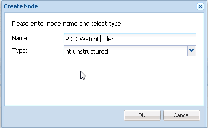

# AEM Forms{#watched-folder-in-aem-forms}의 감시 폴더

관리자는 미리 구성된 워크플로우, 서비스 또는 스크립트 작업을 시작할 때 감시 폴더(예: PDF 파일)에 파일을 배치할 때 추가된 파일을 처리하도록 감시됨 폴더라는 네트워크 폴더를 구성할 수 있습니다. 서비스가 지정된 작업을 수행하면 결과 파일이 지정된 출력 폴더에 저장됩니다. 워크플로, 서비스 및 스크립트에 대한 자세한 내용은 [파일 처리 방법](#variousmethodsforprocessingfiles)을 참조하십시오.

## 감시 폴더 {#create-a-watched-folder} 만들기

다음 방법 중 하나를 사용하여 파일 시스템에서 감시 폴더를 만들 수 있습니다.

* 감시 폴더 구성 노드의 속성을 구성하는 동안 folderPath 속성에 상위 디렉토리의 전체 경로를 입력하고 다음 예제와 같이 만들 감시 폴더의 이름을 추가합니다.`C:/MyPDFs/MyWatchedFolder`
Adobe의 
`MyWatchedFolder`폴더가 존재하지 않으면 AEM Forms에서 지정된 경로에 폴더를 만듭니다.

* 감시 폴더 끝점을 구성하기 전에 파일 시스템에 폴더를 만든 다음 folderPath 속성에 전체 경로를 제공합니다. folderPath 속성에 대한 자세한 내용은 [감시 폴더 속성](#watchedfolderproperties)을 참조하십시오.

>[!NOTE]
>
>클러스터된 환경에서 감시 폴더로 사용되는 폴더는 파일 시스템 또는 네트워크에서 액세스 가능하고 쓰기 가능하며 공유되어야 합니다. 클러스터의 각 응용 프로그램 서버 인스턴스에는 동일한 공유 폴더에 대한 액세스 권한이 있어야 합니다. Windows의 경우 모든 서버에 매핑된 네트워크 드라이브를 만들고 folderPath 속성에 매핑된 네트워크 드라이브의 경로를 지정합니다.

## 감시 폴더 구성 노드 {#create-watched-folder-configuration-node} 만들기

감시 폴더를 구성하려면 감시 폴더 구성 노드를 만듭니다. 구성 노드를 만들려면 다음 단계를 수행하십시오.

1. 관리자로 CRX-DE lite에 로그인하고 /etc/fd/watchfolder/config 폴더로 이동합니다.

1. `nt:unstructured` 유형의 노드를 만듭니다. 예를 들어 감시 폴더

   >[!NOTE]
   >
   >감시 폴더 노드 이름은 공백과 특수 문자를 포함할 수 없습니다.

1. 노드에 다음 속성을 추가합니다.

   * `folderPath`
   * `inputProcessorType`
   * `inputProcessorId`
   * `outputFilePattern`

   지원되는 속성의 전체 목록은 [감시 폴더 속성](#watchedfolderproperties)을 참조하십시오.

1. **모두 저장**&#x200B;을 클릭합니다. 노드를 만들고 속성을 저장한 후 `input`, `result`, `failure`, `preserve` 및 `stage` 폴더가 `folderPath` 속성에 지정된 경로에 생성됩니다.

   검색 작업은 정의된 시간 간격에서 감시 폴더 검색을 시작합니다.

## 감시 폴더 속성 {#watchedfolderproperties}

감시 폴더에 대해 다음 속성을 구성할 수 있습니다.

* **folderPath(문자열)**:정의된 시간 간격으로 검색할 폴더의 경로입니다. 클러스터된 환경의 경우 해당 폴더는 서버에 대한 전체 액세스 권한을 가진 모든 서버와 공유 위치에 있어야 합니다. 필수 속성입니다.
* **inputProcessorType(문자열)**:시작할 프로세스 유형입니다. 워크플로우, 스크립트 또는 서비스를 지정할 수 있습니다. 필수 속성입니다.
* **inputProcessorId(문자열)**:inputProcessorId 속성의 동작은 inputProcessorType 속성에 지정된 값을 기반으로 합니다. 필수 속성입니다. 다음 목록은 inputProcessorType 속성의 가능한 모든 값과 inputProcessorType 속성에 대한 해당 필수 요소에 대해 설명합니다.

   * 워크플로우의 경우 실행할 워크플로우 모델을 지정합니다. 예: /etc/workflow/models/&lt;workflow_name>/jcr:content/model
   * 스크립트에서 실행할 스크립트의 JCR 경로를 지정합니다. 예: /etc/fd/watchfolder/test/testScript.ecma
   * 서비스의 경우 OSGi 서비스를 찾는 데 사용되는 필터를 지정합니다. 서비스는 com.adobe.aemfd.watchfolder.service.api.ContentProcessor Interface의 구현으로 등록됩니다.

* **runModes(문자열)**:워크플로우 실행을 위해 허용되는 실행 모드의 쉼표로 구분된 목록. 몇 가지 예는 다음과 같습니다.

   * 작성자

   * 페이지를

   * 작성자,게시

   * 게시, 작성자

>[!NOTE]
>
>감시 폴더를 호스팅하는 서버에 지정된 실행 모드가 없는 경우 감시 폴더는 서버의 실행 모드에 관계없이 항상 활성화됩니다.

* **outputFilePattern(문자열)**:출력 파일의 패턴입니다. 폴더 또는 파일 패턴을 지정할 수 있습니다. 폴더 패턴을 지정하면 출력 파일의 이름이 워크플로우에 설명된 대로 지정됩니다. 파일 패턴을 지정하는 경우 출력 파일의 이름은 파일 패턴에 설명된 대로 지정됩니다. [파일 및 폴더 ](../../forms/using/watched-folder-in-aem-forms.md#p-file-and-folder-patterns-p) 패턴은 출력 파일의 디렉토리 구조를 지정할 수도 있습니다. 필수 속성입니다.

* **stageFileExpirationDuration(Long, default -1)**:처리를 위해 이미 선택한 입력 파일/폴더가 시간 초과되어 오류로 표시된 것으로 처리되기 전에 대기할 시간(초)입니다. 이 만료 메커니즘은 이 속성의 값이 양수일 때만 활성화됩니다.

>[!NOTE]
>
>이 메커니즘을 사용하여 입력 시간이 초과된 것으로 표시되어도 여전히 백그라운드에서 처리되고 있을 수 있지만 예상보다 많은 시간이 소요됩니다. 시간 제한 메커니즘이 시작되기 전에 입력 내용을 소비한 경우 처리가 나중에 완료되어 출력이 결과 폴더에 버립니다. 컨텐츠를 시간 제한 전에 소비하지 않은 경우 나중에 컨텐츠를 소비하려고 할 때 처리 시 오류가 발생할 수 있으며 이 오류는 동일한 입력을 위해 실패 폴더에도 기록됩니다. 반면, 간헐적인 작업/워크플로우 오류로 인해 입력 처리가 활성화되지 않는 경우(만료 메커니즘이 해결할 수 있는 시나리오), 물론 이러한 두 가지 이벤트 중 어느 것도 발생하지 않습니다. 따라서 시간 초과로 인해 실패로 표시된 실패 폴더의 항목에 대해(상당한 시간 후 처리되지 않은 파일 형식 메시지, 오류로 표시) [실패 로그]에서 결과 폴더(및 같은 입력을 위해 다른 항목의 실패 폴더 자체)를 스캔하여 이전에 설명한 이벤트 중 실제로 발생했는지 여부를 확인하는 것이 좋습니다.

* **deleteExpiredStageFileOnlyWhenThrottled(Boolean, 기본 true):** 감시 폴더가 제한될 때만 만료 메커니즘이 활성화되어야 하는지 여부입니다. 조절이 활성화되면 처리 안 됨 상태로 남아 있는 파일(간헐적인 작업/워크플로우 오류 발생)이 전체 일괄 처리에 대해 경계 감소를 수행할 수 있으므로 제한된 감시 폴더에 대해 메커니즘이 더 적합합니다. 이 속성이 true(기본값)로 유지되면 제한되지 않은 감시 폴더에 대해 만료 메커니즘이 활성화되지 않습니다. 속성이 false로 유지되면 stageFileExpirationDuration 속성이 양수이면 메커니즘은 항상 활성화됩니다.

* **pollInterval(긴)**:감시 폴더를 입력하여 검사하는 간격(초)입니다. [스로틀] 설정을 사용하지 않는 경우 [투표 간격]은 평균 작업을 처리하는 시간보다 길어야 합니다.그렇지 않으면 시스템에 과부하가 발생할 수 있습니다. 기본값은 5입니다. 자세한 내용은 배치 크기에 대한 설명을 참조하십시오. 폴아웃 간격 값은 1보다 크거나 같아야 합니다.
* **excludeFilePattern(문자열)**:감시 폴더에서 스캔하고 선택하는 파일과 폴더를 결정하는 데 사용하는 세미콜론(;)으로 구분된 패턴 목록. 이 패턴이 있는 파일 또는 폴더는 처리를 위해 스캔되지 않습니다. 이 설정은 입력이 여러 파일이 있는 폴더일 때 유용합니다. 폴더 내용을 감시 폴더에서 선택한 이름의 폴더로 복사할 수 있습니다. 이렇게 하면 폴더를 입력 폴더로 완전히 복사하기 전에 감시 폴더가 처리할 폴더를 선택할 수 없습니다. 기본값은 null입니다.
[파일 패턴](../../forms/using/watched-folder-in-aem-forms.md#p-file-and-folder-patterns-p)을 사용하여 다음을 제외할 수 있습니다.

   * 특정 파일 이름 확장자가 있는 파일;예: *.dat, *.xml, .pdf, *.*
   * 특정 이름의 파일;예를 들어 data*는 data1, data2 등의 파일 및 폴더를 제외합니다.
   * 다음 예와 같이 이름과 확장명에 합성 표현식이 있는 파일:

      * Data[0-9][0-9][0-9].[dD][aA]&#39;port&#39;
      * *.[dD][Aa]&#39;port&#39;
      * *.[Xx][Mm][Ll]

파일 패턴에 대한 자세한 내용은 [파일 패턴 정보](../../forms/using/watched-folder-in-aem-forms.md#p-file-and-folder-patterns-p)를 참조하십시오.

* **includeFilePattern(String)**:감시 폴더에서 스캔하여 선택하는 폴더와 파일을 결정하는 데 사용하는 세미콜론(;)으로 구분된 패턴 목록. 예를 들어 IncludeFilePattern이 input*인 경우 입력*과 일치하는 모든 파일과 폴더가 선택됩니다. 여기에는 input1, input2 등의 파일 및 폴더가 포함됩니다. 기본값은 *이며 모든 파일과 폴더를 나타냅니다. 파일 패턴을 사용하여 다음을 포함할 수 있습니다.

   * 특정 파일 이름 확장자가 있는 파일;예: *.dat, *.xml, .pdf, *.*
   * 특정 이름의 파일;예를 들어, data.*에는 data1, data2 등의 파일 및 폴더가 포함됩니다.

* 다음 예와 같이 이름과 확장명에 합성 표현식이 있는 파일:

   * Data[0-9][0-9][0-9].[dD][aA]&#39;port&#39;

      * *.[dD][Aa]&#39;port&#39;
      * *.[Xx][Mm][Ll]

파일 패턴에 대한 자세한 내용은 [파일 패턴 정보](../../forms/using/watched-folder-in-aem-forms.md#p-file-and-folder-patterns-p)

* **waitTime(Long)**:폴더 또는 파일을 만든 후 스캔하기 전에 대기할 시간(밀리초)입니다. 예를 들어 대기 시간이 3,600,000밀리초(1시간)이고 파일이 1분 전에 만들어진 경우 이 파일은 59분 이상 경과하면 선택됩니다. 기본값은 0입니다. 이 설정은 파일이나 폴더가 입력 폴더에 완전히 복사되도록 하는 데 유용합니다. 예를 들어 처리할 대용량 파일이 있고 파일을 다운로드하는 데 10분이 걸리는 경우 대기 시간을 10*60 *1000밀리초로 설정합니다. 이렇게 하면 감시 폴더가 10분이 채 되지 않은 경우 해당 파일을 스캔할 수 없습니다.
* **purgeDuration(Long)**:결과 폴더의 파일 및 폴더가 이 값보다 크면 삭제됩니다. 이 값은 일 단위로 측정됩니다. 이 설정은 결과 폴더가 꽉 차지 않도록 확인하는 데 유용합니다. -1일 값은 결과 폴더를 삭제하지 않음을 나타냅니다. 기본값은 -1입니다.
* **resultFolderName(문자열)**:저장된 결과가 저장되는 폴더. 결과가 이 폴더에 나타나지 않으면 실패 폴더를 확인하십시오. 읽기 전용 파일은 처리되지 않고 실패 폴더에 저장됩니다. 이 값은 다음 파일 패턴을 사용하는 절대 경로나 상대 경로일 수 있습니다.

   * %F = 파일 이름 접두어
   * %E = 파일 이름 확장명
   * %Y = 년(전체)
   * %y = 년(마지막 2자리)
   * %M = 월
   * %D = 월 중 일
   * %d = 연도
   * %H = 시간(24시간)
   * %h = 시간(12시간)
   * %m = 분
   * %s = 초
   * %l = 밀리초
   * %R = 무작위 숫자(0에서 9 사이)
   * %P = 프로세스 또는 작업 ID

   예를 들어 2009년 7월 17일 오후 8시이고 C:/Test/WF0/failure/%Y/%M/%D/%H/ 결과 폴더는 C:/Test/WF0/failure/2009/07/17/20입니다.

   경로가 절대 경로가 아니라 상대 경로인 경우 감시 폴더 내에 폴더가 생성됩니다. 기본값은 감시 폴더 내의 결과 폴더인 result/%Y/%M/%D/입니다. 파일 패턴에 대한 자세한 내용은 [파일 패턴 정보](../../forms/using/watched-folder-in-aem-forms.md#p-file-and-folder-patterns-p)를 참조하십시오.

>[!NOTE]
>
>결과 폴더의 크기가 작을수록 더 나은 감시 폴더가 수행됩니다. 예를 들어 감시 폴더에 대한 예상 로드가 매 시간마다 1000개 파일인 경우 한 시간마다 새 하위 폴더가 생성되도록 결과/%Y%M%D%H와 같은 패턴을 시도해 보십시오. 로드가 작은 경우(예: 하루에 1000개 파일) 결과/%Y%M%D와 같은 패턴을 사용할 수 있습니다.

* **failureFolderName(문자열)**:오류 파일이 저장되는 폴더. 이 위치는 항상 감시 폴더를 기준으로 합니다. 결과 폴더에 대해 설명된 대로 파일 패턴을 사용할 수 있습니다. 읽기 전용 파일은 처리되지 않고 실패 폴더에 저장됩니다. 기본값은 실패입니다/%Y/%M/%D/.
* **preserveFolderName(문자열):** 처리 성공 후 파일이 저장되는 위치입니다. 경로는 절대, 상대 또는 null 디렉토리 경로일 수 있습니다. 결과 폴더에 대해 설명된 대로 파일 패턴을 사용할 수 있습니다. 기본값은 preserve/%Y/%M/%D/입니다.
* **batchSize(긴)**:스캔당 선택할 파일 또는 폴더 수입니다. 시스템에 과부하를 방지하는 데 사용;한 번에 너무 많은 파일을 스캔하면 충돌이 발생할 수 있습니다. 기본값은 2입니다.

   [투표 간격] 및 [일괄 처리 크기] 설정은 스캔할 때마다 감시 폴더를 선택하는 파일 수를 결정합니다. 감시 폴더는 Quartz 스레드 풀을 사용하여 입력 폴더를 검색합니다. 스레드 풀은 다른 서비스와 공유됩니다. 스캔 간격이 작은 경우, 스레드는 입력 폴더를 자주 스캔합니다. 파일이 감시 폴더에 자주 드롭되는 경우 스캔 간격을 작게 유지해야 합니다. 파일이 간혹 삭제되는 경우에는 다른 서비스에서 스레드를 사용할 수 있도록 더 큰 스캔 간격을 사용하십시오.

   많은 양의 파일을 삭제하는 경우 일괄 처리 크기를 크게 만듭니다. 예를 들어 감시 폴더 종단점에서 시작한 서비스가 분당 700개의 파일을 처리할 수 있고 사용자가 동일한 속도로 파일을 입력 폴더에 드롭한 다음 일괄 처리 크기를 350초로 설정하고 투표 간격을 30초로 설정하면 감시 폴더를 너무 자주 스캔할 필요가 없습니다.

   파일을 감시 폴더에 드롭하면 입력에 있는 파일이 나열되므로 스캔하는 초당 발생 가능한 성능을 줄일 수 있습니다. 스캔 간격을 늘리면 성능이 향상될 수 있습니다. 삭제할 파일의 볼륨이 작은 경우 [일괄 처리 크기]와 [투표 간격]을 적절하게 조정합니다. 예를 들어 초당 10개의 파일이 삭제되면 pollInterval을 1초로 설정하고 [일괄 처리 크기]를 10으로 설정해 봅니다

* **throttleOn(부울)**:이 옵션을 선택하면 AEM Forms이 지정된 시간에 처리하는 감시 폴더 작업 수를 제한합니다. 최대 작업 수는 배치 크기 값에 의해 결정됩니다. 기본값 값이 true입니다. ([조정 정보](../../forms/using/watched-folder-in-aem-forms.md#p-about-throttling-p)를 참조하십시오.)

* **overwriteDuplicateFilename(부울)**:[True]로 설정하면 결과 폴더의 파일과 폴더 보존 파일을 덮어씁니다. [False]로 설정하면 이름에 숫자 인덱스 접미어를 사용하는 파일 및 폴더가 사용됩니다. 기본값은 False입니다.
* **preserveOnFailure(부울)**:서비스에서 작업을 실행하지 못하는 경우 입력 파일을 보존합니다. 기본값은 true입니다.
* **inputFilePattern(문자열)**:감시 폴더의 입력 파일 패턴을 지정합니다. 파일의허용 목록에 추가하다를 만듭니다.
* **비동기(부울)**:호출 유형을 비동기 또는 동기식으로 식별합니다. 기본값은 true(비동기)입니다. 파일 처리는 리소스를 사용하는 작업입니다. 스캔 작업의 기본 스레드를 질식시키지 않도록 비동기 플래그의 값을 true로 유지합니다. 클러스터 환경에서는 사용 가능한 서버에서 처리되는 파일에 대해 로드 밸런싱을 활성화하려면 플래그를 true로 유지하는 것이 중요합니다. 플래그가 false인 경우 스캔 작업은 자체 스레드 내에서 각 최상위 파일/폴더에 대한 처리를 순차적으로 수행합니다. 단일 서버 설정의 워크플로우 기반 처리 등 특별한 이유 없이 플래그를 false로 설정하지 마십시오.

>[!NOTE]
>
>기본적으로 워크플로우는 비동기적입니다. 값을 false로 설정해도 비동기 모드에서 워크플로우가 시작됩니다.

* **enabled(부울)**:감시 폴더에 대한 검색을 비활성화하고 활성화합니다. 감시 폴더 검색을 시작하려면 true로 설정합니다. 기본값은 true입니다.
* **payloadMapperFilter:** 폴더를 감시 폴더로 구성하면 감시 폴더 내에 폴더 구조가 만들어집니다. 구조에는 입력, 출력(결과) 받기, 오류를 위해 데이터 저장, 긴 기간의 프로세스에 대한 데이터 보존, 다양한 단계에 대한 데이터 저장을 위한 폴더가 있습니다. 감시 폴더의 폴더 구조는 Forms 중심 워크플로우의 페이로드 역할을 할 수 있습니다. 페이로드 매퍼에서는 입력, 출력 및 처리를 위해 감시 폴더를 사용하는 페이로드의 구조를 정의할 수 있습니다. 예를 들어 기본 매퍼를 사용하는 경우 [payload]\input 및 [payload]\output 폴더를 사용하여 감시 폴더의 컨텐츠를 매핑합니다. 기본적으로 2개의 페이로드 매퍼 구현을 사용할 수 있습니다. [사용자 지정 구현](../../forms/using/watched-folder-in-aem-forms.md#creating-a-custom-payload-mapper-filter)이 없는 경우 즉시 사용 가능한 구현 중 하나를 사용하십시오.

   * **기본 매퍼:** 기본 페이로드 매퍼를 사용하여 감시 폴더의 입력 및 출력 내용을 페이로드의 개별 입력 및 출력 폴더에 유지합니다. 또한 워크플로우의 페이로드 경로에는 [페이로드]/input/ 및 [페이로드]/출력 경로를 사용하여 컨텐츠를 검색하고 저장합니다.

   * **단순 파일 기반 페이로드 매퍼:** 단순 파일 기반 페이로드 매퍼를 사용하여 입력 및 출력 내용을 페이로드 폴더에 직접 유지합니다. 기본 매퍼와 같은 추가 계층 구조는 만들어지지 않습니다.

### 사용자 지정 구성 매개 변수 {#custom-configuration-parameters}

위에 나열된 감시 폴더 구성 속성과 함께 사용자 지정 구성 매개 변수를 지정할 수도 있습니다. 사용자 지정 매개 변수는 파일 처리 코드로 전달됩니다. 이 변수를 사용하면 코드가 매개 변수의 값을 기반으로 동작을 변경할 수 있습니다. 매개 변수를 지정하려면:

1. CRXDE-Lite에 로그인하고 감시 폴더 구성 노드로 이동합니다.
1. 속성 매개 변수를 추가합니다.&lt;property_name> 를 감시 폴더 구성 노드로 설정합니다. 속성 유형은 부울, 날짜, 소수, 이중, 긴 및 문자열만 사용할 수 있습니다. 단일 및 다중 값 속성을 지정할 수 있습니다.

>[!NOTE]
>
>속성의 데이터 유형이 Double이면 해당 속성의 값에 소수점 값을 지정합니다. 데이터 유형이 Double이고 값에 소수점이 지정되지 않은 모든 속성에 대해 유형은 Long으로 변환됩니다.

이러한 속성은 처리 코드에 맵&lt;문자열, 개체> 유형의 변경 불가능한 맵으로 전달됩니다. 처리 코드는 ECMAScript, 워크플로우 또는 서비스일 수 있습니다. 속성에 제공된 값은 맵에서 키-값 쌍으로 사용할 수 있습니다. 키는 속성의 이름이고 값은 속성 값입니다. 사용자 지정 구성 매개 변수에 대한 자세한 내용은 다음 이미지를 참조하십시오.


필수 속성, 선택적 속성, 몇 가지 구성 매개 변수가 포함된 샘플 감시 폴더 구성 노드입니다.

#### 워크플로우에 대한 변수 변경 가능 {#mutable-variables-for-workflows}

워크플로우 기반 파일 처리 방법에 대한 변경 가능한 변수를 만들 수 있습니다. 이러한 변수는 워크플로우의 단계 간에 흐르는 데이터의 컨테이너 역할을 합니다. 이러한 변수를 만들려면:

1. CRXDE-Lite에 로그인하고 감시 폴더 구성 노드로 이동합니다.

1. workflow.var 속성을 추가합니다.&lt;variable_name> 를 감시 폴더 구성 노드로 설정합니다.

   속성 유형은 부울, 날짜, 소수, 이중, 긴 및 문자열만 사용할 수 있습니다. 다중값 속성도 지원됩니다. 다중값 속성의 경우 워크플로우 단계에서 사용할 수 있는 값은 지정된 유형의 배열입니다.

   >[!NOTE]
   >
   >속성의 데이터 유형이 Double이면 해당 속성의 값에 소수점 값을 지정합니다. 데이터 유형이 Double이고 값에 소수점이 지정되지 않은 모든 속성에 대해 유형은 Long으로 변환됩니다.

>[!NOTE]
>
>JCR 사양에서는 속성에 대한 기본값을 지정합니다. 기본값은 처리를 위한 워크플로우 단계에 사용할 수 있습니다. 따라서 적절한 기본값을 지정합니다.


## 파일 처리를 위한 다양한 방법 {#variousmethodsforprocessingfiles}

워크플로우, 서비스 또는 스크립트를 시작하여 감시 폴더의 문서를 처리할 수 있습니다.

### 서비스를 사용하여 감시 폴더의 파일 처리   {#using-a-service-to-process-files-of-a-watched-folder-nbsp}

서비스는 `com.adobe.aemfd.watchfolder.service.api.ContentProcessor` 인터페이스의 사용자 정의 구현입니다. 몇 가지 사용자 지정 속성과 함께 OSGi에 등록됩니다. 구현의 사용자 지정 속성은 고유하게 만들고 구현을 식별하는 데 도움이 됩니다.

#### ContentProcessor 인터페이스의 사용자 정의 구현 {#custom-implementation-of-the-contentprocessor-interface}

사용자 지정 구현은 처리 컨텍스트(com.adobe.aemfd.watchfolder.service.api.ProcessorContext 유형의 객체)를 수락하고, 컨텍스트에서 입력 문서 및 구성 매개 변수를 읽고, 입력을 처리하고, 출력을
컨텍스트 파악 ProcessorContext에는 다음과 같은 API가 있습니다.

* **getWatchFolderId**:감시 폴더의 ID를 반환합니다.
* **getInputMap**:맵 유형의 맵을 반환합니다. 맵의 키는 입력 파일의 파일 이름과 파일 내용이 포함된 문서 객체입니다. getinputMap API를 사용하여 입력 파일을 읽습니다.
* **getConfigParameters**:맵 유형의 변경 불가능한 맵을 반환합니다. 맵에
감시 폴더의 구성 매개 변수.

* **setResult**:ContentProcessor 구현은 API를 사용하여 출력 문서를 결과 폴더에 기록합니다. 출력 파일의 이름을 setResult API에 지정할 수 있습니다. API는 지정된 출력 폴더/파일 패턴에 따라 제공된 파일을 사용하거나 무시할 수 있습니다. 폴더 패턴을 지정하면 출력 파일의 이름이 워크플로우에 설명된 대로 지정됩니다. 파일 패턴을 지정하는 경우 출력 파일의 이름은 파일 패턴에 설명된 대로 지정됩니다.

예를 들어 다음 코드는 사용자 지정 foo=bar 속성을 가진 ContentProcessor 인터페이스의 사용자 정의 구현입니다.

```java
@Component(metatype = true, immediate = true, label = "WF Test Service", description = "WF Test Service")
@Service(value = {OutputWriter.class, ContentProcessor.class})
@Property(name = "foo", value = "bar")
public class OutputWriter implements ContentProcessor {
```

[감시 폴더](../../forms/using/watched-folder-in-aem-forms.md#p-create-watched-folder-configuration-node-p)를 구성하는 동안 inputProcessorId 속성을 (foo=bar) 및 inputProcessorType 속성을 서비스로 지정하는 경우, 위에 언급된 서비스(사용자 정의 구현)를 사용하여 감시 폴더의 입력 파일을 처리합니다.

다음 예제는 ContentProcessor 인터페이스의 사용자 정의 구현이기도 합니다. 이 예에서 서비스는 입력 파일을 수락하고, 파일을 임시 위치에 복사하고, 파일의 내용이 포함된 문서 객체를 반환합니다. 문서 객체의 내용이 결과 폴더에 저장됩니다. 결과 폴더의 실제 경로는 [감시 폴더 구성 노드](../../forms/using/watched-folder-in-aem-forms.md#p-create-watched-folder-configuration-node-p)에 구성됩니다.

```java
@Component(immediate = true)
@Service(value = ContentProcessor.class)
@Property(name = "serviceSelector", value = "testProcessor1")
public class TestContentProcessor1 implements ContentProcessor {
    @Override
    public void processInputs(ProcessorContext context) throws Exception {
        Map.Entry<String, Document> e = context.getInputMap().entrySet().iterator().next();
        File f = new File((String) context.getConfigParameters().get("tempDir"),
                context.getConfigParameters().get("outPrefix") + e.getKey());
        e.getValue().copyToFile(f);
        context.setResult(f.getName(), new Document(f, true));
    }
}
```

### 스크립트를 사용하여 감시 폴더 {#using-scripts-to-process-files-of-a-watched-folder} 파일의 처리

스크립트는 감시 폴더에 배치된 문서를 처리하기 위해 작성된 ECMAScript 불만 사용자 지정 코드입니다. 스크립트는 JCR 노드로 표시됩니다. 표준 ECMAScript 변수(로그, 슬링 등) 외에도 스크립트에는 가변 processorContext가 있습니다. 이 변수는 ProcessorContext 유형입니다. ProcessorContext에는 다음과 같은 API가 있습니다.

* **getWatchFolderId**:감시 폴더의 ID를 반환합니다.
* **getInputMap**:맵 유형의 맵을 반환합니다. 맵의 키는 입력 파일의 파일 이름과 파일 내용이 포함된 문서 객체입니다. getinputMap API를 사용하여 입력 파일을 읽습니다.
* **getConfigParameters**:맵 유형의 변경 불가능한 맵을 반환합니다. 맵에는 감시 폴더의 구성 매개 변수가 포함되어 있습니다.
* **setResult**:ContentProcessor 구현은 API를 사용하여 출력 문서를 결과 폴더에 기록합니다. 출력 파일의 이름을 setResult API에 지정할 수 있습니다. API는 지정된 출력 폴더/파일 패턴에 따라 제공된 파일을 사용하거나 무시할 수 있습니다. 폴더 패턴을 지정하면 출력 파일의 이름이 워크플로우에 설명된 대로 지정됩니다. 파일 패턴을 지정하는 경우 출력 파일의 이름은 파일 패턴에 설명된 대로 지정됩니다.

다음 코드는 ECMAScript의 예입니다. 입력 파일을 수락하고, 파일을 임시 위치에 복사하고, 파일의 내용이 포함된 문서 객체를 반환합니다. 문서 객체의 내용이 결과 폴더에 저장됩니다. 결과 폴더의 실제 경로는 [감시 폴더 구성 노드](../../forms/using/watched-folder-in-aem-forms.md#p-create-watched-folder-configuration-node-p)에 구성됩니다.

>[!NOTE]
>
>출력 폴더 및 파일 이름 접두사는 감시 폴더 구성 매개 변수에 따라 결정됩니다.

```java
var inputMap = processorContext.getInputMap();
var params = processorContext.getConfigParameters();
var entry = inputMap.entrySet().iterator().next();
var tempFile = new Packages.java.io.File(params.get("tempDir"), params.get("outPrefix") + entry.getKey());
entry.getValue().copyToFile(tempFile);
processorContext.setResult(tempFile.getName(), new Packages.com.adobe.aemfd.docmanager.Document(tempFile, true));
```

#### 스크립트 및 보안 고려 사항의 위치 {#location-of-scripts-and-security-considerations}

기본적으로 고객이 스크립트를 배치할 수 있는 컨테이너 폴더(/etc/fd/watchfolder/scripts)가 제공되며 감시 폴더 프레임워크에서 사용되는 기본 서비스 사용자에게는 이 위치에서 스크립트를 읽는 데 필요한 권한이 있습니다.

사용자 지정 위치에 스크립트를 배치하려는 경우 기본 서비스-사용자에게 사용자 지정 위치에 대한 읽기 권한이 없을 수 있습니다. 이러한 시나리오의 경우 다음 단계를 수행하여 사용자 지정 위치에 필요한 권한을 제공합니다.

1. 프로그램 방식으로 또는 https://&#39;[server]:[port]&#39;/crx/explorer 콘솔을 통해 시스템 사용자를 만듭니다. 기존 시스템 사용자를 사용할 수도 있습니다. 일반 사용자 대신 여기에서 시스템 사용자와 작업하는 것이 중요합니다.
1. 스크립트가 저장되는 사용자 정의 위치에서 새로 만들었거나 기존 시스템 사용자에게 읽기 권한을 제공합니다. 여러 사용자 지정 위치를 가질 수 있습니다. 모든 사용자 지정 위치에 최소 읽기 권한을 제공합니다.
1. Felix 구성 콘솔(/system/console/configMgr)에서 감시 폴더의 서비스 사용자 매핑을 찾습니다. 이 매핑은 &#39;매핑:adobe-aemds-core-watch-folder=..&#39;
1. 매핑을 클릭합니다. &#39;adobe-aemds-core-watch-folder:scripts=fd-service&#39; 항목의 경우 fd-서비스를 사용자 지정 시스템 사용자의 ID로 변경합니다. 저장을 클릭합니다.

이제 구성된 사용자 지정 위치를 사용하여 스크립트를 저장할 수 있습니다.

### Workflow를 사용하여 감시 폴더 {#using-a-workflow-to-process-files-of-a-watched-folder} 파일 처리

워크플로우를 통해 Experience Manager 활동을 자동화할 수 있습니다. 워크플로우는 특정 순서로 실행되는 일련의 단계로 구성됩니다. 각 단계에서는 페이지 활성화 또는 이메일 메시지 전송과 같은 별개의 활동을 수행합니다. 워크플로우는 저장소, 사용자 계정 및 Experience Manager 서비스의 자산과 상호 작용할 수 있습니다. 따라서 워크플로우는 복잡한 작업을 조정할 수 있습니다.

* 워크플로우를 만들기 전에 다음 사항을 고려하십시오.
* 단계 출력을 모든 후속 단계에서 사용할 수 있어야 합니다.
이전 단계에서 생성된 기존 출력을 업데이트(또는 삭제할 수도 있음)할 수 있어야 합니다.
* 변경 가능한 변수는 단계 간에 사용자 지정 동적 데이터를 플로우하는 데 사용됩니다.

워크플로우를 사용하여 파일을 처리하려면 다음 단계를 수행하십시오.

1. `com.adobe.aemfd.watchfolder.workflow.api.WorkflowContextProcessor` 인터페이스의 구현을 만듭니다. 이것은 서비스에 대해 만들어진 구현과 유사합니다.

   >[!NOTE]
   >
   >전체 구현을 ECMAScript에서만 만들 수 있습니다.

1. Workflow 단계에서 com.adobe.aemfd.watchfolder.api.WorkflowContextService 유형의 OSGi 서비스를 찾고 다음 인수로 서비스의 execute() 메서드를 호출합니다.

   * WorkflowContextProcessor 인터페이스의 사용자 정의 구현
   * workItem
   * workflowSession
   * 메타데이터

Java 프로그래밍 언어를 사용하여 워크플로우를 구현하는 경우 AEM 워크플로우 엔진은 workItem, workflowSession 및 메타데이터 변수에 대한 값을 제공합니다. 이러한 변수는 사용자 지정 WorkflowProcess 구현의 execute() 메서드에 인수로 전달됩니다.

ECMAScript를 사용하여 워크플로우를 구현하는 경우 AEM 워크플로 엔진은 graniteWorkItem, graniteWorkflowSession 및 메타데이터 변수에 대한 값을 제공합니다. 이러한 변수는 WorkflowContextService.execute() 메서드에 인수로 전달됩니다.

processWorkflowContext()에 대한 인수는 com.adobe.aemfd.watchfolder.workflow.api.WorkflowContext 유형의 객체입니다. WorkflowContext 인터페이스에는 위에 언급된 워크플로우 관련 고려 사항을 용이하게 하는 다음과 같은 API가 있습니다.

* getWorkItem:WorkItem 변수의 값을 반환합니다. 이 변수는 WorkflowContextService.execute() 메서드에 전달됩니다.
* getWorkflowSession:WorkflowSession 변수의 값을 반환합니다. 이 변수는 WorkflowContextService.execute() 메서드에 전달됩니다.
* getMetadata:메타데이터 변수 값을 반환합니다. 이 변수는 WorkflowContextService.execute() 메서드에 전달됩니다.
* getCommittedVariables:이전 단계로 설정된 변수를 나타내는 읽기 전용 개체 맵을 반환합니다. 이전 단계에서 변수가 수정되지 않으면 감시 폴더를 구성하는 동안 지정된 기본값이 반환됩니다.
* getCommittedResults:읽기 전용 문서 맵을 반환합니다. 맵은 이전 단계에서 생성된 출력 파일을 나타냅니다.
* setVariable:WorkflowContextProcessor 구현에서는 변수를 사용하여 단계 사이에 흐르는 사용자 지정 동적 데이터를 나타내는 변수를 조작합니다. 변수의 이름 및 유형은 감시 폴더[를 구성하는 동안 지정한 변수의 이름과 같습니다. ](../../forms/using/watched-folder-in-aem-forms.md#p-configure-the-watched-folder-p) 변수의 값을 변경하려면 null이 아닌 값으로 setVariable API를 호출합니다. 변수를 제거하려면 null 값으로 setVariable()을 호출합니다.

다음 ProcessorContext API도 사용할 수 있습니다.

* getWatchFolderId:감시 폴더의 ID를 반환합니다.
* getInputMap:맵&lt;문자열, 문서> 유형의 맵을 반환합니다. 맵의 키는 입력 파일의 파일 이름과 파일 내용이 포함된 문서 객체입니다. getinputMap API를 사용하여 입력 파일을 읽습니다.
* getConfigParameters:맵&lt;문자열, 개체> 유형의 변경 불가능한 맵을 반환합니다. 맵에는 감시 폴더의 구성 매개 변수가 포함되어 있습니다.
* setResult:ContentProcessor 구현에서는 API를 사용하여 출력 문서를 결과 폴더에 기록합니다. 출력 파일의 이름을 setResult API에 지정할 수 있습니다. API는 지정된 출력 폴더/파일 패턴에 따라 제공된 파일을 사용하거나 무시할 수 있습니다. 폴더 패턴을 지정하면 출력 파일의 이름이 워크플로우에 설명된 대로 지정됩니다. 파일 패턴이 지정된 경우 출력 파일의 이름은 파일 패턴에 설명된 대로 지정됩니다

워크플로우에서 사용할 때 setResult API에 대한 고려 사항:

* 전체 워크플로우 출력에 기여하는 새 출력 문서를 추가하려면 이전 단계에서 출력 파일 이름으로 사용되지 않은 파일 이름으로 setResult API를 호출합니다.
* 이전 단계에서 생성된 출력을 업데이트하려면 이전 단계에서 이미 사용한 파일 이름으로 setResult API를 호출합니다.
* 이전 단계에서 생성된 출력을 삭제하려면 이전 단계에서 이미 사용한 파일 이름과 내용이 null인 setResult를 호출합니다.

>[!NOTE]
>
>다른 시나리오에서 내용이 null인 setResult API를 호출하면 오류가 발생합니다.

다음 예는 워크플로우 단계로 구현됩니다. 이 예에서 ECMAscript는 변수 stepCount를 사용하여 현재 워크플로우 인스턴스에서 단계가 호출된 횟수를 추적합니다.
출력 폴더의 이름은 현재 단계 번호, 원본 파일 이름 및 outPrefix 매개 변수에 지정된 접두사의 조합입니다.

ECMAScript는 워크플로 컨텍스트 서비스에 대한 참조를 가져오고 WorkflowContextProcessor 인터페이스의 구현을 만듭니다. WorkflowContextProcessor 구현은 입력 파일을 받아 파일을 임시 위치에 복사하고 복사한 파일을 나타내는 문서를 반환합니다. 부울 변수 purgePrevious의 값을 기준으로 현재 단계에서는 단계가 현재 워크플로우 인스턴스에서 시작될 때 동일한 단계로 마지막으로 생성된 출력을 삭제합니다. 마지막으로 wfSvc.execute 메서드가 호출되어 WorkflowContextProcessor 구현을 실행합니다. 출력 문서의 컨텐츠는 감시 폴더 구성 노드에 언급된 물리적 경로의 결과 폴더에 저장됩니다.

```javascript
log.error("Watch-folder workflow script called for step: " + graniteWorkItem.getNode().getTitle());
var wfSvc = sling.getService(Packages.com.adobe.aemfd.watchfolder.workflow.api.WorkflowContextService);
// Custom WorkflowContextProcessor implementation which defines the processWorkflowContext() method purely in JS
var impl = { processWorkflowContext: function (wfContext) {
    var wfId = wfContext.getWatchFolderId();
    var inputMap = wfContext.getInputMap();
    var paramMap = wfContext.getConfigParameters();
    var preResults = wfContext.getCommittedResults();
    var preVars = wfContext.getCommittedVariables();
    log.info("WF ID: " + wfId); // workflowId of type String
    log.info("Inputs: " + inputMap); // Input map of type Map<String, Document>
    log.info("Params: " + paramMap); // Config params of type Map<String, Object>
    log.info("Old results: " + preResults);
    log.info("Old variables: " + preVars);
    var currStepNumber = new Packages.java.lang.Long(new Packages.java.lang.Long(preVars.get("stepCount")).longValue() + 1);
    log.info("Current step number: " + currStepNumber);
    wfContext.setVariable("stepCount", currStepNumber);
    var entry = inputMap.entrySet().iterator().next();
    var tempFile = new Packages.java.io.File(paramMap.get("tempDir"), paramMap.get("outPrefix") + "STEP-" + currStepNumber + "-" + entry.getKey());
    entry.getValue().copyToFile(tempFile);
    var fName = tempFile.getName();
    var outDoc = new Packages.com.adobe.aemfd.docmanager.Document(tempFile, true);
    wfContext.setResult(tempFile.getName(), outDoc);
    var prevStepOutName = paramMap.get("outPrefix") + "STEP-" + (currStepNumber - 1) + "-" + entry.getKey();
    if (preResults.containsKey(prevStepOutName) && paramMap.get("purgePrevious").booleanValue()) {
        log.info("Purging previous step output " + prevStepOutName);
        wfContext.setResult(prevStepOutName, null);
    }
} }
wfSvc.execute(impl, graniteWorkItem, graniteWorkflowSession, metaData);
log.info("Exiting workflow script!")
```

### 페이로드 매퍼 필터 만들기를 클릭하여 감시 폴더의 구조를 워크플로우 {#create-payload-mapper-filter-to-map-structure-of-a-watched-folder-to-the-payload-of-a-workflow} 페이로드에 매핑합니다.

감시 폴더를 만들면 감시 중인 폴더 내에 폴더 구조가 만들어집니다. 폴더 구조에는 스테이지, 결과, 보존, 입력 및 실패 폴더가 있습니다. 폴더 구조는 워크플로우에 대한 입력 페이로드 역할을 할 수 있으며 워크플로우에서 출력을 허용할 수 있습니다. 또한 실패 지점이 있을 경우 이를 나열할 수도 있습니다.

페이로드 구조가 감시 폴더 구조와 다른 경우 사용자 정의 스크립트를 작성하여 감시 폴더의 구조를 페이로드에 매핑할 수 있습니다. 이러한 스크립트를 페이로드 매퍼 필터라고 합니다. 기본적으로 AEM Forms은 페이로드 매퍼 필터를 제공하여 감시 폴더의 구조를 페이로드에 매핑합니다.

#### 사용자 지정 페이로드 매퍼 필터 {#creating-a-custom-payload-mapper-filter} 만들기

1. [Adobe 클라이언트 SDK](https://repo.adobe.com/nexus/content/groups/public/com/adobe/aemfd/aemfd-client-sdk/6.3.0/aemfd-client-sdk-6.3.0.jar)를 다운로드합니다.
1. 마스터 기반 프로젝트의 빌드 경로에 클라이언트 SDK를 설정합니다. 시작하려면 원하는 IDE에서 다음 고급 기반 프로젝트를 다운로드하여 열 수 있습니다.
1. 요구 사항에 맞게 샘플 번들에서 사용할 수 있는 페이로드 매퍼 필터 코드를 편집합니다.
1. 사용자 지정 페이로드 매퍼 필터의 번들을 만들려면 maven을 사용합니다.
1. [AEM 번들 콘솔](https://localhost:4502/system/console/bundles)을 사용하여 번들을 설치합니다.

   이제 사용자 지정 페이로드 매퍼 필터가 AEM 감시 폴더 UI에 나열됩니다. 워크플로우에서 사용할 수 있습니다.

   다음 예제 코드는 페이로드를 기준으로 저장된 파일에 대해 간단한 파일 기반 매퍼를 구현합니다. 이 기능을 사용하여 시작할 수 있습니다.

   ```java
   package com.adobe.aemfd.watchfolder.workflow;
   import com.adobe.aemfd.docmanager.Document;
   import com.adobe.aemfd.watchfolder.workflow.api.payload.PayloadMapper;
   import com.adobe.aemfd.watchfolder.workflow.api.payload.WorkflowExecutionContext;
   import com.adobe.aemfd.watchfolder.workflow.api.payload.WorkflowInitializationContext;
   import com.adobe.aemfd.watchfolder.workflow.api.payload.WorkflowVariable;
   import com.adobe.granite.workflow.exec.Workflow;
   import org.apache.felix.scr.annotations.Component;
   import org.apache.felix.scr.annotations.Service;
   import org.apache.sling.api.resource.ResourceResolver;
   import javax.jcr.Binary;
   import javax.jcr.Node;
   import java.util.Collection;
   import java.util.HashMap;
   import java.util.Map;
   @Component(immediate = true)
   @Service(value = PayloadMapper.class)
   public class SimpleFileBasedPayloadMapper implements PayloadMapper {
   @Override
   public Node createPayload(WorkflowInitializationContext wfInitCtxt, Node stagingFolder, String uniquePayloadName,
   Map<String, Binary> inputs, Collection<WorkflowVariable> variableDefs) throws Exception {
   Node dirNode = stagingFolder.addNode(uniquePayloadName, "sling:Folder");
   for (Map.Entry<String, Binary> bins: inputs.entrySet()) {
   Node fileNode = dirNode.addNode(bins.getKey(), "nt:file");
   Node resNode = fileNode.addNode ("jcr:content", "nt:resource");
   resNode.setProperty("jcr:data", bins.getValue());
   }
   return dirNode;
   }
   @Override
   public Map<String, Document> getInputs(WorkflowInitializationContext wfInitCtxt, WorkflowExecutionContext wfExecCtxt,
   Node payload, ResourceResolver resourceResolver) throws Exception {
   return null; //To change body of implemented methods use File | Settings | File Templates.
   }
   @Override
   public void setOutput(WorkflowInitializationContext wfInitCtxt, WorkflowExecutionContext wfExecCtxt, Node payload,
   String fileName, Binary contents, int outputMode) throws Exception {
   //To change body of implemented methods use File | Settings | File Templates.
   }
   @Override
   public Map<String, Document> getIntermediateOutputs(WorkflowInitializationContext wfInitCtxt,
   WorkflowExecutionContext wfExecCtxt, Node payload,
   ResourceResolver resourceResolver) throws Exception {
   return null; //To change body of implemented methods use File | Settings | File Templates.
   }
   @Override
   public Map<String, Document> getFinalOutputs(WorkflowInitializationContext wfInitCtxt, Workflow workflow, Node payload,
   ResourceResolver resourceResolver) throws Exception {
   Map<String, Object> params = wfInitCtxt.getConfigParameters();
   Map<String, Document> result = new HashMap<String, Document>();
   for (Map.Entry<String, Object> me: params.entrySet()) {
   String key = me.getKey();
   if (key.startsWith("pm.outfile.")) {
   String fName = (String) me.getValue();
   Document d = new Document(payload.getPath() + "/" + fName, resourceResolver);
   result.put(fName, d);
   }
   }
   return result;
   }
   @Override
   public void setVariable(WorkflowInitializationContext wfInitCtxt, WorkflowExecutionContext wfExecCtxt, Node payload,
   WorkflowVariable variable) throws Exception {
   //To change body of implemented methods use File | Settings | File Templates.
   }
   @Override
   public Map<String, Object> getVariables(WorkflowInitializationContext wfInitCtxt, WorkflowExecutionContext wfExecCtxt,
   Node payload) throws Exception {
   return null; //To change body of implemented methods use File | Settings | File Templates.
   }
   }
   ```

## 사용자가 감시 폴더 {#how-users-interact-with-a-watched-folder}와 상호 작용하는 방법

감시 폴더 끝점의 경우 사용자는 데스크톱에서 입력 파일이나 폴더를 감시 폴더로 복사하거나 드래그하여 파일 처리 작업을 시작할 수 있습니다. 도착 순서로 파일이 처리됩니다.

감시 폴더 끝점의 경우 작업에 하나의 입력 파일만 필요한 경우 사용자는 해당 파일을 감시 폴더의 루트에 복사할 수 있습니다.

작업에 둘 이상의 입력 파일이 포함되어 있는 경우, 사용자는 모든 필수 파일을 포함하는 감시 폴더 계층 외부의 폴더를 만들어야 합니다. 이 새 폴더에는 입력 파일(및 프로세스에 필요한 경우 DCX 파일)이 포함되어야 합니다. 작업 폴더가 생성되면 사용자는 해당 폴더를 감시 폴더의 입력 폴더로 복사합니다.

>[!NOTE]
>
>응용 프로그램 서버가 감시 폴더의 파일에 대한 액세스를 삭제했는지 확인합니다. AEM Forms에서 스캔한 파일을 입력 폴더에서 삭제할 수 없는 경우 연관된 프로세스가 무기한 시작됩니다.

## 감시 폴더 {#additional-information-about-the-watched-folders}에 대한 추가 정보

### {#about-throttling} 조정 정보

감시 폴더 끝점에 대해 조절이 활성화되면 지정된 시간에 처리되는 감시 폴더 작업 수를 제한합니다. 최대 작업 수는 감시 폴더 끝점에서도 구성할 수 있는 일괄 처리 크기 값에 의해 결정됩니다. 제한 제한에 도달하면 감시 폴더의 입력 디렉토리에 있는 수신 문서가 폴링되지 않습니다. 또한 다른 감시 폴더 작업이 완료되고 다른 투표 작업이 시도될 때까지 문서는 입력 디렉토리에 남아 있습니다. 동기 처리를 위해 단일 여론 조사에서 처리된 모든 작업은 단일 스레드에서 연속적으로 처리되는 경우에도 제한 한계로 계산됩니다.

>[!NOTE]
>
>스로틀링은 클러스터에 따라 확장되지 않습니다. 조절이 활성화되면 클러스터 전체가 지정된 시간에 배치 크기에 지정된 작업 수보다 많은 작업을 처리하지 않습니다. 이 제한은 클러스터 전체에 적용되며 클러스터의 각 노드에만 국한되지 않습니다. 예를 들어 일괄 처리 크기가 2인 경우 두 개의 작업을 처리하는 단일 노드에서 제한 제한에 도달하고, 작업 중 하나가 완료될 때까지 다른 노드가 입력 디렉토리를 폴링하지 않을 수 있습니다.

#### 조절이 작동하는 방식 {#how-throttling-works}

감시 폴더는 각 pollInterval에서 입력 폴더를 스캔하고, [일괄 처리 크기]에 지정된 파일 수를 선택하고 이러한 각 파일에 대한 대상 서비스를 호출합니다. 예를 들어 일괄 처리 크기가 4인 경우 각 스캔에서 감시 폴더는 4개의 파일을 선택하고 4개의 호출 요청을 생성하며 대상 서비스를 호출합니다. 이러한 요청이 완료되기 전에 [감시 폴더]를 호출하면 이전 4개의 작업이 완료되었는지 여부에 관계없이 4개의 작업이 다시 시작됩니다.

조절은 이전 작업이 완료되지 않은 경우 감시 폴더가 새 작업을 호출하지 못하게 합니다. 감시 폴더는 진행 중인 작업을 감지하고 진행 중인 일괄 처리 크기 빼기 작업을 기준으로 새 작업을 처리합니다. 예를 들어 두 번째 호출에서 완료된 작업 수가 3개 뿐이며 하나의 작업이 진행 중인 경우 감시 폴더는 3개의 작업만 더 호출합니다.

* 감시 폴더는 진행 중인 작업 수를 확인하기 위해 단계 폴더에 있는 파일 수에 의존합니다. 스테이지 폴더에서 파일이 처리되지 않은 상태로 남아 있는 경우 감시 폴더는 더 이상 작업을 호출하지 않습니다. 예를 들어 배치 크기가 4개, 작업이 3개 지연되는 경우 감시 폴더는 후속 조사에서 하나의 작업만 호출합니다. 스테이지 폴더에 파일이 처리되지 않은 상태로 유지되는 여러 가지 시나리오가 있습니다. 작업이 지연되면 관리자는 감시 폴더가 스테이지 폴더 밖으로 파일을 이동하도록 프로세스 관리 페이지의 프로세스를 종료할 수 있습니다.
* 감시 폴더를 호출하기 전에 AEM Forms 서버가 다운될 경우 관리자는 파일을 스테이지 폴더 밖으로 이동할 수 있습니다. 자세한 내용은 [실패 지점 및 복구](../../forms/using/watched-folder-in-aem-forms.md#p-failure-points-and-recoveryfailure-points-and-recovery-p)를 참조하십시오.
* AEM Forms 서버가 실행 중이지만 Job Manager 서비스가 다시 호출될 때 감시 폴더가 실행되고 있지 않은 경우, 순서가 지정된 시퀀스에서 서비스가 시작되지 않을 때 관리자가 파일을 스테이지 폴더 밖으로 이동할 수 있습니다. 자세한 내용은 [실패 지점 및 복구](../../forms/using/watched-folder-in-aem-forms.md#p-failure-points-and-recoveryfailure-points-and-recovery-p)를 참조하십시오.

### 실패 지점 및 복구실패 지점 및 복구 {#failure-points-and-recoveryfailure-points-and-recovery}

각 투표 이벤트에서 감시 폴더는 입력 폴더를 잠가 포함 파일 패턴과 일치하는 파일을 스테이지 폴더로 이동한 다음 입력 폴더를 잠금 해제합니다. 두 개의 스레드가 동일한 파일 세트를 선택하여 두 번 처리하지 않도록 잠금이 필요합니다. 작은 pollInterval과 큰 일괄 처리 크기로 이러한 문제가 발생할 가능성이 높아집니다. 파일이 스테이지 폴더로 이동되면 다른 스레드가 폴더를 검색할 수 있도록 입력 폴더의 잠금이 해제됩니다. 한 스레드에서 파일을 처리하는 동안 다른 스레드가 스캔할 수 있으므로 이 단계는 높은 처리량을 제공하도록 도와줍니다.

파일이 스테이지 폴더로 이동되면 각 파일에 대한 호출 요청이 생성되고 대상 서비스가 호출됩니다. 감시 폴더가 단계 폴더의 파일을 복구할 수 없는 경우가 있습니다.

* 감시 폴더를 통해 호출 요청을 만들기 전에 서버가 다운되면 스테이지 폴더의 파일이 스테이지 폴더에 남아 있고 복구되지 않습니다.

* 감시 폴더가 단계 폴더의 각 파일에 대한 호출 요청을 성공적으로 만들고 서버가 충돌하는 경우 호출 유형에 따라 두 가지 비헤이비어가 있습니다.

   * **동기**:[감시 폴더]가 서비스를 동기식으로 호출하도록 구성된 경우 스테이지 폴더의 모든 파일이 스테이지 폴더에서 처리되지 않은 상태로 유지됩니다.
   * **비동기**:이 경우 감시 폴더는 작업 관리자 서비스에 의존합니다. 작업 관리자 서비스가 감시 폴더를 호출하면 단계 폴더의 파일이 호출 결과에 따라 보존 또는 실패 폴더로 이동됩니다. 작업 관리자 서비스가 감시 폴더를 호출하지 않으면 파일이 스테이지 폴더에서 처리되지 않은 상태로 유지됩니다. 이러한 상황은 작업 관리자가 다시 전화할 때 감시 폴더가 실행되지 않을 때 발생합니다.

#### 스테이지 폴더 {#recover-unprocessed-source-files-in-the-stage-folder}에서 처리되지 않은 소스 파일 복구

감시 폴더가 단계 폴더의 소스 파일을 처리할 수 없는 경우 처리되지 않은 파일을 복구할 수 있습니다.

1. 응용 프로그램 서버 또는 노드를 다시 시작합니다.

1. 감시 폴더를 중지하여 새 입력 파일을 처리할 수 없습니다. 이 단계를 건너뛸 경우 스테이지 폴더에서 처리되지 않은 파일을 확인하는 것은 훨씬 더 어렵습니다. 감시 폴더에서 새 입력 파일을 처리하지 못하게 하려면 다음 작업 중 하나를 수행합니다.

   * 감시 폴더의 includeFilePattern 속성을 새 입력 파일(예: NOMATCH 입력)과 일치하지 않는 값으로 변경합니다.
   * 새 입력 파일을 만드는 프로세스를 일시 중단합니다.

   AEM Forms이 모든 파일을 복구하여 처리할 때까지 기다립니다. 대부분의 파일은 복구되고 새로운 입력 파일은 올바르게 처리됩니다. 감시 폴더가 복구되고 파일을 처리할 때까지 기다리는 시간은 호출할 작업의 길이와 복구할 파일 수에 따라 다릅니다.

1. 처리할 수 없는 파일을 확인합니다. 적절한 시간을 기다린 후 이전 단계를 완료했지만 아직 처리되지 않은 파일이 단계 폴더에 남아 있으면 다음 단계로 이동합니다.

   >[!NOTE]
   >
   >스테이지 디렉토리에서 파일의 날짜 및 시간 스탬프를 볼 수 있습니다. 파일 수 및 일반적인 처리 시간에 따라 고정될 수 있을 정도로 오래된 파일을 결정할 수 있습니다.

1. 처리되지 않은 파일을 스테이지 디렉토리에서 입력 디렉토리로 복사합니다.

1. 2단계에서 감시 폴더가 새 입력 파일을 처리하지 못하게 한 경우 파일 패턴 포함을 이전 값으로 변경하거나 비활성화한 프로세스를 다시 활성화합니다.

### 감시 폴더를 함께 연결 {#chain-watched-folders-together}

감시 폴더를 서로 연계하여 하나의 감시 폴더의 결과 문서가 다음 감시 폴더의 입력 문서인지 확인할 수 있습니다. 각 감시 폴더는 다른 서비스를 호출할 수 있습니다. 이렇게 감시 폴더를 구성하면 여러 서비스를 호출할 수 있습니다. 예를 들어, 감시 폴더 하나가 PDF 파일을 Adobe PostScript®로 변환하고, 두 번째 감시 폴더는 PostScript 파일을 PDF/A 형식으로 변환할 수 있습니다. 이렇게 하려면 첫 번째 끝점에 의해 정의된 감시 폴더의 결과 폴더를 설정하여 두 번째 끝점에 의해 정의된 감시 폴더의 입력 폴더를 가리킵니다.

첫 번째 변환에서 출력하면 \path\result으로 이동합니다. 두 번째 변환에 대한 입력은 \path\result이고 두 번째 변환에서 출력하는 경우 \path\result\result (또는 두 번째 변환에 대해 [결과 폴더] 상자에 정의하는 디렉토리)로 이동합니다.

### 파일 및 폴더 패턴 {#file-and-folder-patterns}

관리자는 서비스를 호출할 수 있는 파일 유형을 지정할 수 있습니다. 각 감시 폴더에 대해 여러 파일 패턴을 설정할 수 있습니다. 파일 패턴은 다음 파일 속성 중 하나일 수 있습니다.

* 특정 파일 이름 확장자가 있는 파일;예: *.dat, *.xml, .pdf, *.*
* 특정 이름의 파일;예를 들어, data.*
* 다음 예와 같이 이름과 확장명에 합성 표현식이 있는 파일:

   * Data[0-9][0-9][0-9].[dD][aA]&#39;port&#39;
   * *.[dD][Aa]&#39;port&#39;
   * *.[Xx][Mm][Ll]

* 관리자는 결과를 저장할 출력 폴더의 파일 패턴을 정의할 수 있습니다. 출력 폴더(결과, 보존 및 실패)에 대해 관리자는 다음 파일 패턴을 지정할 수 있습니다.
* %Y = 년(전체)
* %y = 년(마지막 2자리)
* %M = 월,
* %D = 월 중 일,
* %d = 일 년,
* %h = 시간,
* %m = 분,
* %s = 초,
* %R = 0-9 사이의 난수
* %J = 작업 이름

예를 들어 결과 폴더의 경로는 C:\Adobe\Adobe LiveCycle ES4\BarcodedForms\%y\%m\%d일 수 있습니다.

출력 매개 변수 매핑은 다음과 같은 추가 패턴을 지정할 수도 있습니다.

* %F = 소스 파일 이름
* %E = 소스 파일 이름 확장명

출력 매개 변수 매핑 패턴이 &quot;File.separator&quot;(경로 구분 기호)로 끝나는 경우 폴더가 생성되고 내용이 해당 폴더에 복사됩니다. 패턴이 &quot;File.separator&quot;로 끝나지 않으면 해당 이름으로 컨텐트(결과 파일 또는 폴더)가 만들어집니다.

## 감시 폴더 {#using-pdf-generator-with-a-watched-folder}에 PDF Generator 사용

워크플로우, 서비스 또는 스크립트를 시작하여 입력 파일을 처리하도록 감시 폴더를 구성할 수 있습니다. 다음 섹션에서는 ECMAScript를 시작하도록 감시 폴더를 구성합니다. ECMAScript는 PDF Generator를 사용하여 Microsoft Word(.docx) 문서를 PDF 문서로 변환합니다.

PDF 생성기로 감시 폴더를 구성하려면 다음 단계를 수행하십시오.

1. [ECMAScript 만들기](../../forms/using/watched-folder-in-aem-forms.md#p-create-an-ecmascript-p)
1. [워크플로우 만들기](../../forms/using/watched-folder-in-aem-forms.md#p-create-a-workflow-p)
1. [감시 폴더 구성](../../forms/using/watched-folder-in-aem-forms.md#p-configure-the-watched-folder-p)

### ECMAScript {#create-an-ecmascript} 만들기

ECMAScript는 PDF Generator의 createPDF API를 사용하여 Microsoft Word(.docx) 문서를 PDF 문서로 변환합니다. 스크립트를 만들려면 다음 단계를 수행하십시오.

1. 브라우저 창에서 CRXDE lite를 엽니다. URL은 https://&#39;[server]:[port]&#39;/crx/de입니다.

1. /etc/workflow/scripts로 이동하여 PDFG라는 폴더를 만듭니다.

1. PDFG 폴더에서 pdfg-openOffice-sample.ecma라는 파일을 만들고 파일에 다음 코드를 추가합니다.

   ```javascript
   var wfSvc = sling.getService(Packages.com.adobe.aemfd.watchfolder.workflow.api.WorkflowContextService);
   // Custom ContentProcessor implementation which defines the processInputs() method purely in JS
   var impl = { processWorkflowContext: function (wrkfContext) {
   
     //  var logger = Packages.org.slf4j.LoggerFactory.getLogger("cmb-mergeandprint-sample.ecma");
                   var inputMap=wrkfContext.getInputMap();
   
                   var distiller = sling.getService(com.adobe.pdfg.service.api.DistillerService);
                   var generatePDF = sling.getService(com.adobe.pdfg.service.api.GeneratePDFService);
                   var pdfgConfig = sling.getService(com.adobe.pdfg.service.api.PDFGConfigService);
       var result = new Packages.java.util.HashMap();
       var entry = inputMap.entrySet().iterator().next();
       var pdfgOut = generatePDF.createPDF(entry.getValue(), ".docx", "Standard OpenOffice", "Standard", "No Security", null, null);
                   var convertedDoc = pdfgOut.get("ConvertedDoc");
   //   logger.info("SuccessFully saved the document to Ouput Node");
       wrkfContext.setResult(entry.getKey().substring(0, entry.getKey().lastIndexOf('.'))+".pdf",convertedDoc); // Ownership flag set to true for auto temp-file deletion.
   
   } }
   
   wfSvc.execute(impl, graniteWorkItem, graniteWorkflowSession, metaData);
   ```

1. 파일을 저장하고 닫습니다.

### 워크플로 {#create-a-workflow} 만들기

1. 브라우저 창에서 AEM Workflow UI를 엽니다.
https://[servername]:&#39;port&#39;/workflow

1. 모델 보기에서 **새로 만들기**&#x200B;를 클릭합니다. 새 워크플로 대화 상자에서 **제목**&#x200B;을 지정하고 **확인**&#x200B;을 클릭합니다.

   

1. 새로 만든 작업 흐름을 선택하고 **편집**&#x200B;을 클릭합니다. 워크플로우가 새 창에서 열립니다.

1. 기본 워크플로우 단계를 삭제합니다. 사이드 킥에서 프로세스 단계를 워크플로우로 드래그하여 놓습니다.

   

1. 프로세스 단계를 마우스 오른쪽 단추로 클릭하고 **편집**&#x200B;을 선택합니다. 단계 속성 창이 나타납니다.

1. 프로세스 탭에서 ECMAScript를 선택합니다. 예를 들어 [ECMAScript 만들기](#p-create-an-ecmascript-p)에서 만든 pdfg-openOffice-sample.ecma 스크립트입니다. **핸들러 고급** 옵션을 활성화하고 **확인**&#x200B;을 클릭합니다.

   

### 감시 폴더 {#configure-the-watched-folder} 구성

1. 브라우저 창에서 CRXDE lite를 엽니다. https://&#39;[서버]:[포트]&#39;/crx/de/

1. /etc/fd/watchfolder/config/ 폴더로 이동하여 nt:unstructured 유형의 노드를 만듭니다.

   

1. 노드에 다음 속성을 추가합니다.

   * folderPath(문자열):정의된 시간 간격으로 검색할 폴더의 경로입니다. 폴더는 서버에 대한 전체 액세스 권한이 있는 모든 서버와 공유된 위치에 있어야 합니다.
inputProcessorType(문자열):시작할 프로세스 유형입니다. 이 자습서에서 작업 흐름을 지정합니다.

   * inputProcessorId(문자열):inputProcessorId 속성의 동작은 inputProcessorType 속성에 지정된 값을 기반으로 합니다. 이 예에서 inputProcessorType 속성 값은 workflow입니다. 따라서 inputProcessorId 속성에 대해 PDFG 작업 과정의 다음 경로를 지정합니다./etc/workflow/models/pdfg/jcr:content/model

   * outputFilePattern(문자열):출력 파일의 패턴입니다. 폴더 또는 파일 패턴을 지정할 수 있습니다. 폴더 패턴을 지정하면 출력 파일의 이름이 워크플로우에 설명된 대로 지정됩니다. 파일 패턴을 지정하는 경우 출력 파일의 이름은 파일 패턴에 설명된 대로 지정됩니다.
   위에 언급된 필수 속성 외에도 감시 폴더는 몇 가지 선택적 속성을 지원합니다. 선택적 속성에 대한 전체 목록 및 설명은 [감시 폴더 속성](#watchedfolderproperties)을 참조하십시오.

