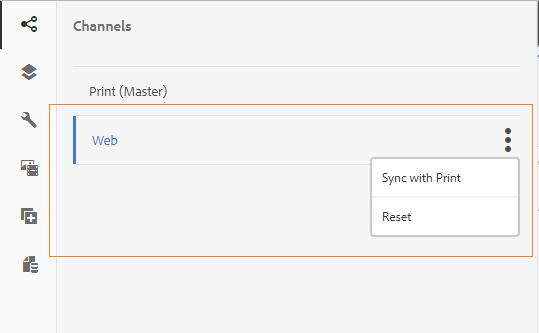

# 인쇄 채널 및 웹 채널{#print-channel-and-web-channel}

인터랙티브 커뮤니케이션은 다음 두 채널을 통해 전달할 수 있습니다.인쇄 및 웹 페이지를 참조하십시오. 인쇄 채널은 보험료 납부에 대한 미리 알림과 같은 인쇄물과 같은 PDF 및 용지 커뮤니케이션을 제작하는 데 사용되는 반면 웹 채널은 웹 사이트의 신용카드 명세서와 같은 온라인 경험을 제공하는 데 사용됩니다.

인터랙티브 커뮤니케이션 작성자는 문서 조각 및 이미지와 같은 에셋을 재사용하여 인터랙티브 커뮤니케이션의 인쇄 및 웹 버전을 모두 제작할 수 있습니다.

[대화형 통신 만들기](../../forms/using/create-interactive-communication.md)에 대한 사전 요구 사항 중 하나는 서버에서 인쇄 및/또는 웹 채널에 대한 템플릿을 사용할 수 있도록 하는 것입니다. 템플릿 작성자가 AEM 자체에서 웹 채널 템플릿을 만드는 동안 인쇄 채널 템플릿 XDP는 Adobe Forms Designer에서 만들고 서버에 업로드됩니다.

## 인쇄 채널 {#printchannel}

인터랙티브 커뮤니케이션의 인쇄 채널에서는 XFA 양식 템플릿인 XDP를 사용합니다. XDP는 Adobe Forms Designer에서 디자인됩니다. 인쇄 채널 템플릿 만들기에 대한 자세한 내용은 [레이아웃 디자인](../../forms/using/layout-design-details.md)을 참조하십시오. 대화형 통신에서 인쇄 채널 템플릿을 사용하려면 템플릿을 AEM Forms 서버에 업로드해야 합니다.

### 대화형 통신 인쇄 채널 템플릿 업로드 {#upload-interactive-communication-print-channel-template}

템플릿을 업로드하려면 양식 사용자 그룹의 구성원이어야 합니다. XDP(인쇄 채널 템플릿)를 AEM Forms에 업로드하려면 다음 단계를 수행하십시오.

1. **[!UICONTROL Forms]** > **[!UICONTROL Forms &amp; 문서]**&#x200B;를 선택합니다.

1. **[!UICONTROL 만들기]** > **[!UICONTROL 파일 업로드]**&#x200B;를 누릅니다.

   적절한 인쇄 채널 템플릿(XDP)을 찾아 선택하고 **[!UICONTROL 열기]**&#x200B;를 누릅니다.

## 웹 채널 {#web-channel}

템플릿 작성자 및 관리자는 웹 템플릿을 만들고, 편집하고, 활성화할 수 있습니다. 다른 사용자가 웹 템플릿을 작성하도록 허용하려면 해당 사용자에게 권한을 부여해야 합니다. 자세한 내용은 [사용자, 그룹 및 액세스 권한 관리](/help/sites-administering/user-group-ac-admin.md)를 참조하십시오.

### 웹 채널 템플릿 작성 {#authoring-web-channel-template}

웹 채널 템플릿을 만들려면 먼저 템플릿 폴더를 만들어야 합니다. 템플릿 폴더 내에 웹 템플릿을 만들면 양식 사용자가 템플릿을 기반으로 대화형 커뮤니케이션의 웹 채널을 만들 수 있도록 템플릿을 활성화해야 합니다.

웹 채널 템플릿을 작성하려면 다음 단계를 완료하십시오.

1. 아직 Interactive Communication 웹 템플릿이 없는 경우 템플릿 폴더를 만듭니다. 자세한 내용은 [페이지 템플릿 - 편집 가능](/help/sites-developing/page-templates-editable.md)의 템플릿 폴더를 참조하십시오.

   1. **[!UICONTROL 도구]**  > **[!UICONTROL 구성 브라우저]**&#x200B;를 탭합니다.
      * 자세한 내용은 [구성 브라우저](/help/sites-administering/configurations.md) 설명서를 참조하십시오.
   1. 구성 브라우저 페이지에서 **[!UICONTROL 만들기]**&#x200B;를 탭합니다.
   1. 구성 만들기 대화 상자에서 폴더의 제목을 지정하고 **[!UICONTROL 편집 가능한 템플릿]**&#x200B;을 선택한 다음 **[!UICONTROL 만들기]**&#x200B;를 누릅니다.

      폴더가 생성되어 구성 브라우저 페이지에 나열됩니다.

1. 해당 템플릿 폴더로 이동하여 웹 템플릿을 만듭니다.

   1. **[!UICONTROL 도구]** > **[!UICONTROL 템플릿]** > **`[Folder]`**&#x200B;을 선택하여 해당 템플릿 폴더로 이동합니다.
   1. **[!UICONTROL 만들기]**&#x200B;를 누릅니다.
   1. **[!UICONTROL 대화형 통신 - 웹 채널]**&#x200B;을 선택하고 **[!UICONTROL 다음]**&#x200B;을 탭합니다.
   1. 템플릿 제목과 설명을 입력한 다음 **[!UICONTROL 만들기]**&#x200B;를 탭합니다.

      템플릿이 생성되고 대화 상자가 나타납니다.

   1. **[!UICONTROL 열기]**&#x200B;를 눌러 템플릿 편집기에서 만든 템플릿을 엽니다.

      템플릿 편집기가 나타납니다.

      

      템플릿을 만들거나 편집할 때 템플릿 작성자가 정의할 수 있는 다양한 측면이 있습니다. 템플릿을 만들거나 편집하는 것은 페이지 작성과 유사합니다. 자세한 내용은 [페이지 템플릿 만들기](/help/sites-authoring/templates.md)에서 템플릿 편집 - 템플릿 작성자를 참조하십시오.

1. 대화형 통신 작성을 위해 이 템플릿을 사용하려면 템플릿을 활성화합니다.

   1. **[!UICONTROL 도구]**  > **[!UICONTROL 템플릿]**&#x200B;을 탭합니다.
   1. 해당 템플릿으로 이동하여 선택한 다음 **[!UICONTROL Enable]**&#x200B;을 탭하고 경고 메시지에서 **[!UICONTROL Enable]**&#x200B;을 탭합니다.

      템플릿이 활성화되고 해당 상태가 활성화됨으로 표시됩니다. 이제 새로 만든 웹 채널 템플릿을 사용할 수 있는 대화형 통신을 만들 수 있습니다.

### 웹 채널 {#print-channel-as-master-for-web-channel}의 마스터로 채널 인쇄

대화형 통신을 작성하는 동안 작성자는 이 옵션을 선택하여 인쇄 채널과 동기화된 웹 채널을 만들 수 있습니다. 웹 채널에 대한 마스터로 인쇄 채널을 사용하면 웹 채널의 컨텐츠, 상속 및 데이터 바인딩이 인쇄 채널에서 파생되고 인쇄 채널에서 수행된 변경 사항이 웹 채널에 반영될 수 있습니다. 그러나 대화형 통신 작성자는 필요에 따라 웹 채널의 특정 구성 요소에 대한 상속을 중단할 수 있습니다.

 

