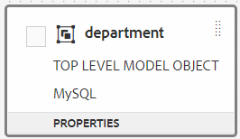

# 양식 데이터 모델 작업{#work-with-form-data-model}


양식 데이터 모델 편집기는 양식 데이터 모델을 편집하고 구성하기 위한 직관적인 유저 인터페이스와 도구를 제공합니다. 편집기를 사용하여 양식 데이터 모델의 관련 데이터 소스의 데이터 모델 개체, 속성 및 서비스를 추가하고 구성할 수 있습니다. 또한 데이터 소스 없이 데이터 모델 개체 및 속성을 만들고 나중에 해당 데이터 모델 개체 및 속성과 바인딩할 수 있습니다. 미리 보는 동안 적응형 양식 및 인터랙티브한 커뮤니케이션을 미리 채우기 위해 사용할 수 있는 데이터 모델 객체 속성에 대한 샘플 데이터를 생성하고 편집할 수도 있습니다. 양식 데이터 모델에서 구성한 데이터 모델 개체 및 서비스를 테스트하여 데이터 소스와 제대로 통합되었는지 확인할 수 있습니다.

Forms 데이터 통합을 처음 사용하고 데이터 소스를 구성하지 않았거나 양식 데이터 모델을 만든 경우 다음 항목을 참조하십시오.

* [AEM Forms 데이터 통합](/help/forms/using/data-integration.md)
* [데이터 소스 구성](/help/forms/using/configure-data-sources.md)
* [양식 데이터 모델 만들기](/help/forms/using/create-form-data-models.md)

양식 데이터 모델 편집기를 사용하여 수행할 수 있는 다양한 작업 및 구성에 대한 자세한 내용은 을 참조하십시오.

>[!NOTE]
>
>양식 데이터 모델을 만들고 사용할 수 있으려면 **fdm-author** 및 **forms-user** 그룹 모두의 멤버여야 합니다. 해당 그룹의 구성원이 되려면 AEM 관리자에게 문의하십시오.

## 데이터 모델 개체 및 서비스 {#add-data-model-objects-and-services} 추가

데이터 소스가 있는 양식 데이터 모델을 만든 경우 양식 데이터 모델 편집기를 사용하여 데이터 모델 개체 및 서비스를 추가하고, 해당 속성을 구성하고, 데이터 모델 개체 간에 연결을 만들고, 양식 데이터 모델 및 서비스를 테스트할 수 있습니다.

양식 데이터 모델의 사용 가능한 데이터 소스에서 데이터 모델 개체 및 서비스를 추가할 수 있습니다. 추가된 데이터 모델 개체는 모델 탭에 표시되지만 추가된 서비스는 서비스 탭에 표시됩니다.

데이터 모델 개체 및 서비스를 추가하려면:

1. AEM 작성자 인스턴스에 로그인하고 **[!UICONTROL Forms > 데이터 통합]**&#x200B;으로 이동한 다음 데이터 모델 개체를 추가할 양식 데이터 모델을 엽니다.
1. 데이터 소스 창에서 데이터 소스를 확장하여 사용 가능한 데이터 모델 개체 및 서비스를 봅니다.
1. 양식 데이터 모델에 추가할 데이터 모델 개체 및 서비스를 선택하고 **[!UICONTROL 선택한 항목 추가]**&#x200B;를 탭합니다.

   

   선택한 데이터 모델 개체 및 서비스

   모델(Model) 탭에는 모든 데이터 모델 개체 및 양식 데이터 모델에 추가된 해당 속성이 그래픽으로 표시됩니다. 각 데이터 모델 개체는 양식 데이터 모델의 상자로 표현됩니다.

   

   모델 탭에 추가된 데이터 모델 개체가 표시됩니다.

   >[!NOTE]
   >
   >데이터 모델 개체 상자를 길게 끌거나 드래그하여 컨텐트 영역에서 구성할 수 있습니다. 양식 데이터 모델에 추가된 모든 데이터 모델 개체는 데이터 소스 창에서 회색으로 표시됩니다.

   서비스 탭에는 추가된 서비스가 나열됩니다.

   

   서비스 탭에는 데이터 모델 서비스가 표시됩니다.

   >[!NOTE]
   >
   >데이터 모델 개체 및 서비스 외에도 OData 서비스 메타데이터 문서에는 두 데이터 모델 개체 간의 연결을 정의하는 탐색 속성이 포함되어 있습니다. 자세한 내용은 [OData 서비스](#work-with-navigation-properties-of-odata-services)의 탐색 속성을 사용한 작업을 참조하십시오.

1. 양식 모델 개체를 저장하려면 **[!UICONTROL 저장]**&#x200B;을 누릅니다.

   >[!NOTE]
   >
   >적응형 양식 규칙을 사용하여 양식 데이터 모델의 서비스 탭에서 구성한 서비스를 호출할 수 있습니다. 구성된 서비스는 규칙 편집기의 호출 서비스 작업에서 사용할 수 있습니다. 이러한 서비스를 적응형 양식 규칙에서 사용하는 방법에 대한 자세한 내용은 [규칙 편집기](/help/forms/using/rule-editor.md)에서 서비스 호출 및 규칙 값 설정을 참조하십시오.

## 데이터 모델 개체 및 자식 속성 {#create-data-model-objects-and-child-properties} 만들기

### 데이터 모델 개체 {#create-data-model-objects} 만들기

구성된 데이터 소스에서 데이터 모델 개체를 추가할 수 있지만 데이터 소스 없이 데이터 모델 개체나 개체를 만들 수도 있습니다. 양식 데이터 모델에서 데이터 소스를 구성하지 않은 경우 특히 유용합니다.

데이터 소스 없이 데이터 모델 개체를 만들려면 다음을 수행하십시오.

1. AEM 작성자 인스턴스에 로그인하고 **[!UICONTROL Forms > 데이터 통합]**&#x200B;으로 이동한 다음 데이터 모델 개체 또는 엔티티를 만들 양식 데이터 모델을 엽니다.
1. **[!UICONTROL 엔티티 만들기]**&#x200B;를 누릅니다.
1. 데이터 모델 만들기 대화 상자에서 데이터 모델 개체의 이름을 지정하고 **[!UICONTROL 추가]**&#x200B;를 탭합니다. 데이터 모델 개체가 양식 데이터 모델에 추가됩니다. 새로 추가된 데이터 모델 개체는 데이터 소스에 바인딩되지 않으며 다음 이미지에 표시된 대로 속성이 없습니다.

   

다음으로 언바운드 데이터 모델 개체에 하위 속성을 추가할 수 있습니다.

### 하위 속성 {#child-properties} 추가

양식 데이터 모델 편집기를 사용하면 데이터 모델 개체에 자식 속성을 만들 수 있습니다. 만들 때의 속성은 데이터 소스의 속성에 바인딩되지 않습니다. 나중에 자식 속성을 포함하는 데이터 모델 개체의 다른 속성과 바인딩할 수 있습니다.

자식 속성을 만들려면:

1. 양식 데이터 모델에서 데이터 모델 개체를 선택하고 **[!UICONTROL 하위 속성 만들기]**&#x200B;를 탭합니다.
1. **[!UICONTROL 자식 속성 만들기]** 대화 상자에서 속성에 대한 이름과 데이터 유형을 각각 **[!UICONTROL 이름]** 및 **[!UICONTROL 유형]** 필드에 지정합니다. 속성에 대한 제목과 설명을 선택적으로 지정할 수 있습니다.
1. 속성이 계산된 속성이면 계산됨을 활성화합니다. 계산된 속성의 값은 규칙 또는 식을 기반으로 평가됩니다. 자세한 내용은 [속성 편집](#edit-properties)을 참조하십시오.
1. 데이터 모델 객체가 데이터 소스에 바인딩되면 추가된 자식 속성은 동일한 이름 및 데이터 유형의 부모 데이터 모델 객체의 속성에 자동으로 바인딩됩니다.

   데이터 모델 개체 속성을 사용하여 자식 속성을 수동으로 바인딩하려면 **[!UICONTROL 참조 바인딩]** 필드 옆에 있는 찾아보기 아이콘을 누릅니다. **[!UICONTROL 개체 선택]** 대화 상자에는 부모 데이터 모델 개체의 모든 속성이 나열됩니다. 바인딩할 속성을 선택하고 눈금 아이콘을 누릅니다. 자식 속성과 동일한 데이터 유형의 속성만 선택할 수 있습니다.

1. **[!UICONTROL 완료]**&#x200B;를 눌러 자식 속성을 저장하고 **[!UICONTROL 저장]**&#x200B;을 눌러 양식 데이터 모델을 저장합니다.. 이제 자식 속성이 데이터 모델 개체에 추가됩니다.

데이터 모델 개체 및 속성을 만든 후 양식 데이터 모델을 기반으로 적응형 양식 및 대화형 통신을 계속 만들 수 있습니다. 나중에 사용 가능하고 구성한 데이터 소스가 있으면 양식 데이터 모델을 데이터 소스와 바인딩할 수 있습니다. 바인딩은 연결된 적응형 양식 및 대화형 통신에서 자동으로 업데이트됩니다. 양식 데이터 모델을 사용하여 적응형 양식 및 대화형 통신을 만드는 방법에 대한 자세한 내용은 [양식 데이터 모델 사용](/help/forms/using/using-form-data-model.md)을 참조하십시오.

### 데이터 모델 개체 및 속성 {#bind-data-model-objects-and-properties} 바인딩

양식 데이터 모델과 통합하려는 데이터 소스를 사용할 수 있으면 [데이터 소스 업데이트](/help/forms/using/create-form-data-models.md#update)에 설명된 대로 양식 데이터 모델에 추가할 수 있습니다. 그런 다음 언바운드 데이터 모델 개체 및 속성을 바인딩하려면 다음을 수행합니다.

1. 양식 데이터 모델에서 데이터 원본과 연결할 언바운드 데이터 소스를 선택합니다.
1. **[!UICONTROL 속성 편집]**&#x200B;을 누릅니다.
1. **[!UICONTROL 속성 편집]** 창에서 **[!UICONTROL 바인딩]** 필드 옆에 있는 찾아보기 아이콘을 누릅니다. 양식 데이터 모델에 추가된 데이터 소스를 나열하는 **[!UICONTROL 개체 선택]** 대화 상자가 열립니다.

   

1. 데이터 소스 트리를 확장하고 바인딩할 데이터 모델 개체를 선택하고 눈금 아이콘을 누릅니다.
1. **[!UICONTROL 완료]**&#x200B;를 눌러 속성을 저장한 다음 **[!UICONTROL 저장]**&#x200B;을 눌러 양식 데이터 모델을 저장합니다. 이제 데이터 모델 개체가 데이터 소스와 바인딩됩니다. 데이터 모델 개체가 더 이상 언바운드로 표시되지 않습니다.

   

## 서비스 {#configure-services} 구성

데이터 모델 개체에 대한 데이터를 읽고 쓰려면 다음을 수행하여 읽기 및 쓰기 서비스를 구성합니다.

1. 데이터 모델 개체의 맨 위에 있는 확인란을 선택하여 선택하고 **[!UICONTROL 속성 편집]**&#x200B;을 탭합니다.

   

   속성을 편집하여 데이터 모델 개체에 대한 읽기 및 쓰기 서비스를 구성합니다.

   속성 편집 대화 상자가 열립니다.

   

   속성 편집 대화 상자

   >[!NOTE]
   >
   >데이터 모델 개체 및 서비스 외에도 OData 서비스 메타데이터 문서에는 두 데이터 모델 개체 간의 연결을 정의하는 탐색 속성이 포함되어 있습니다. 양식 데이터 모델에 OData 서비스 데이터 소스를 추가하면 데이터 모델 개체의 모든 탐색 속성에 대해 양식 데이터 모델에서 사용할 수 있는 서비스가 있습니다. 이 서비스를 사용하여 해당 데이터 모델 개체의 탐색 속성을 읽을 수 있습니다.
   >
   >
   >서비스 사용에 대한 자세한 내용은 [OData 서비스](#work-with-navigation-properties-of-odata-services)의 탐색 속성을 사용한 작업을 참조하십시오.

1. 데이터 모델 개체가 최상위 모델 개체인지 여부를 지정하려면 **[!UICONTROL 최상위 수준 개체]**&#x200B;를 전환합니다.

   양식 데이터 모델에 구성된 데이터 모델 개체는 양식 데이터 모델을 기반으로 하는 적응형 양식의 콘텐츠 브라우저의 데이터 모델 개체 탭에서 사용할 수 있습니다. 두 데이터 모델 객체 간의 연결을 추가하면 연결하려는 데이터 모델 객체가 데이터 모델 객체 탭의 연관 데이터 모델 객체 아래에 중첩됩니다. 중첩된 데이터 모델이 최상위 개체인 경우 데이터 모델 개체 탭에 별도로 나타납니다. 따라서 두 개의 엔트리가 중첩된 계층 구조 내부와 외부의 엔트리로 나타나 양식 작성자를 혼동하게 할 수 있습니다. 연결된 데이터 모델 개체가 중첩된 계층에만 나타나도록 하려면 [최상위 수준 개체] 속성을 비활성화하십시오.

1. 선택한 데이터 모델 개체에 대해 읽기 및 쓰기 서비스를 선택합니다. 서비스에 대한 인수가 나타납니다.

   

   직원 데이터 소스에 대해 구성된 읽기 및 쓰기 서비스

1. 읽기 서비스 인수에 대해 [사용자 프로필 특성, 요청 특성 또는 리터럴 값](#bindargument)에 인수를 바인딩하도록 을 탭하고 바인딩 값을 지정합니다.
1. **[!UICONTROL 완료]**&#x200B;인수를 저장하려면 **[!UICONTROL 완료]**&#x200B;를 누른 다음 **[!UICONTROL 저장]**&#x200B;을 눌러 양식 데이터 모델을 저장합니다.

### 읽기 서비스 인수 바인딩 {#bindargument}

바인딩 값을 기반으로 사용자 프로필 특성, 요청 특성 또는 리터럴 값에 읽기 서비스 인수를 바인딩합니다. 이 값은 데이터 소스에서 지정된 값과 관련된 세부 정보를 가져오기 위해 인수로 서비스에 전달됩니다.

#### 리터럴 값 {#literal-value}

**[!UICONTROL 바인딩 대상]** 드롭다운 메뉴에서 **[!UICONTROL 리터럴]**&#x200B;을 선택하고 **[!UICONTROL 바인딩 값]** 필드에 값을 입력합니다. 값과 연관된 세부 사항은 데이터 소스에서 검색됩니다. 정적 값과 연관된 세부 사항을 검색하려면 이 옵션을 사용합니다.

이 예제에서는 `mobilenum` 인수의 값으로 **4367655678**&#x200B;에 연결된 세부 정보를 데이터 소스에서 검색합니다. 모바일 번호 인수의 값을 전달하는 경우 연결된 세부 사항에는 고객 이름, 고객 주소 및 구/군/시 등의 속성이 포함될 수 있습니다.


#### 사용자 프로필 속성 {#user-profile-attribute}

**[!UICONTROL 바인딩 대상]** 드롭다운 메뉴에서 **[!UICONTROL 사용자 프로필 속성]**&#x200B;을 선택하고 **[!UICONTROL 바인딩 값]** 필드에 특성 이름을 입력합니다. AEM 인스턴스에 로그인한 사용자의 세부 사항은 속성 이름을 기반으로 데이터 소스에서 검색됩니다.

**[!UICONTROL 바인딩 값]** 필드에 지정된 특성 이름은 사용자의 특성 이름이 될 때까지 전체 바인딩 경로를 포함해야 합니다. 다음 URL을 열어 CRXDE의 사용자 세부 정보에 액세스합니다.

`https://[server-name]:[port]/crx/de/index.jsp#/home/users/`


이 예에서 `grios` 사용자의 **[!UICONTROL 바인딩 값]** 필드에 `profile.empid`을 지정합니다.


`id` 인수는 사용자 프로필의 `empid` 특성 값을 가져와서 읽기 서비스에 인수로 전달합니다. 로그인한 사용자와 관련된 `empid`에 대한 직원 데이터 모델 개체에서 연결된 속성의 값을 읽고 반환합니다.

#### 요청 속성 {#request-attribute}

요청 속성을 사용하여 데이터 소스에서 관련 속성을 검색합니다.

1. **[!UICONTROL 바인딩 대상]** 드롭다운 메뉴에서 **[!UICONTROL 요청 특성]**&#x200B;을 선택하고 **[!UICONTROL 바인딩 값]** 필드에 특성 이름을 입력합니다.

1. head.jsp용 [overlay](../../../help/sites-developing/overlays.md)을 만듭니다. 오버레이를 만들려면 CRX DE를 열고 `https://<server-name>:<port number>/crx/de/index.jsp#/libs/fd/af/components/page2/afStaticTemplatePage/head.jsp` 파일을 `https://<server-name>:<port number>/crx/de/index.jsp#/apps/fd/af/components/page2/afStaticTemplatePage/head.jsp`에 복사합니다.

   >[!NOTE]
   >
   > * 정적 템플릿을 사용하는 경우 다음 위치에서 head.jsp를 오버레이합니다.
      >   `/libs/fd/af/components/page2/afStaticTemplatePage/head.jsp`
   > * 편집 가능한 템플릿을 사용하는 경우 다음 위치에서 aftemplatedpage.jsp를 오버레이합니다.
      >   `/libs/fd/af/components/page2/aftemplatedpage/aftemplatedpage.jsp`


1. 요청 속성에 대해 [!DNL paramMap]을(를) 설정합니다. 예를 들어, apps 폴더의 .jsp 파일에 다음 코드를 포함합니다.

   ```javascript
   <%Map paraMap = new HashMap();
    paraMap.put("<request_attribute>",request.getParameter("<request_attribute>"));
    request.setAttribute("paramMap",paraMap);
   ```

   예를 들어, 아래 코드를 사용하여 데이터 소스에서 요구하는 값을 검색합니다.


   ```javascript
   <%Map paraMap = new HashMap();
   paraMap.put("petId",request.getParameter("petId"));
   request.setAttribute("paramMap",paraMap);%>
   ```

세부 사항은 요청에 지정된 속성 이름을 기반으로 데이터 소스에서 검색됩니다.

예를 들어 요청에서 속성을 `petid=100`으로 지정하면 데이터 소스의 속성 값에 연결된 속성이 검색됩니다.

## 연결 추가 {#add-associations}

일반적으로 데이터 소스의 데이터 모델 객체 간에 연결되어 있습니다. 이러한 연결은 일대일 또는 일대다 관계가 될 수 있습니다. 예를 들어, 직원과 연관된 여러 개의 종속 항목이 있을 수 있습니다. 이 연결을 일 대 다 연결이라고 하며 연결된 데이터 모델 개체를 연결하는 줄에 `1:n`로 묘사합니다. 하지만, 한 협회에서 특정 직원 ID에 대한 고유한 직원 이름을 반환하면 이를 1대1 연결이라고 합니다.

데이터 소스의 관련 데이터 모델 객체를 양식 데이터 모델에 추가하면 해당 연관성이 유지되고 화살표 줄에 연결된 것으로 표시됩니다. 양식 데이터 모델에서 서로 다른 데이터 소스에 걸쳐 데이터 모델 개체 간의 연결을 추가할 수 있습니다.

>[!NOTE]
>
>JDBC 데이터 소스의 사전 정의된 연결은 양식 데이터 모델에서 유지되지 않습니다. 수동으로 만들어야 합니다.

연결을 추가하려면:

1. 데이터 모델 개체의 맨 위에 있는 확인란을 선택하여 선택하고 **[!UICONTROL 연결 추가]**&#x200B;를 탭합니다. 연결 추가 대화 상자가 열립니다.

   

   >[!NOTE]
   >
   >데이터 모델 개체 및 서비스 외에도 OData 서비스 메타데이터 문서에는 두 데이터 모델 개체 간의 연결을 정의하는 탐색 속성이 포함되어 있습니다. 양식 데이터 모델에서 연결을 추가할 때 이러한 탐색 속성을 사용할 수 있습니다. 자세한 내용은 [OData 서비스](#work-with-navigation-properties-of-odata-services)의 탐색 속성을 사용한 작업을 참조하십시오.

   연결 추가 대화 상자가 열립니다.

   

   연결 추가 대화 상자

1. 연결 추가 창에서:

   * 연결의 제목을 지정합니다.
   * 연결 유형(하나 대 일 또는 하나 대 다)을 선택합니다.
   * 연결할 데이터 모델 개체를 선택합니다.
   * 선택한 모델 개체에서 데이터를 읽을 읽기 서비스를 선택합니다. 읽기 서비스 인수가 나타납니다. 필요할 경우 편집하려면 인수를 변경하고 연결할 데이터 모델 개체의 속성에 바인딩합니다.

   다음 예에서 Dependents 데이터 모델 개체의 읽기 서비스에 대한 기본 인수는 `dependentid`입니다.

   

   종속 항목 읽기 서비스에 대한 기본 인수는 종속적입니다.

   그러나 이 예제에서 인수는 연결된 데이터 모델 개체 사이의 공통 속성이어야 합니다. 이 속성은 `Employeeid`입니다. 따라서 `Employeeid` 인수는 Employee 데이터 모델 개체의 `id` 속성에 바인딩되어야 Dependents 데이터 모델 개체에서 연결된 종속 세부 사항을 가져올 수 있습니다.

   

   인수 및 바인딩이 업데이트되었습니다.

   **[!UICONTROL 완료]**&#x200B;를 눌러 인수를 저장합니다.

1. **[!UICONTROL 완료]**&#x200B;를 눌러 연결을 저장한 다음 **[!UICONTROL 저장]**&#x200B;을 눌러 양식 데이터 모델을 저장합니다.
1. 필요에 따라 연결을 더 만들려면 단계를 반복합니다.

>[!NOTE]
>
>추가된 연결은 지정된 제목과 연결된 데이터 모델 객체를 연결하는 선이 있는 데이터 모델 객체 상자에 나타납니다.
>
>해당 확인란을 선택하고 **[!UICONTROL 연결 편집]**&#x200B;을 탭하여 연결을 편집할 수 있습니다.


## 속성 편집 {#properties}

양식 데이터 모델에 추가된 데이터 모델 개체, 속성 및 서비스의 속성을 편집할 수 있습니다.

속성을 편집하려면:

1. 양식 데이터 모델에서 데이터 모델 개체, 속성 또는 서비스 옆에 있는 확인란을 선택합니다.
1. **[!UICONTROL 속성 편집]**&#x200B;을 누릅니다. 선택한 모델 개체, 속성 또는 서비스에 대한 **[!UICONTROL 속성 편집]** 창이 열립니다.

   * **데이터 모델 개체**:읽기 및 쓰기 서비스를 지정하고 인수를 편집합니다.
   * **속성**:속성의 유형, 하위 유형 및 형식을 지정합니다. 선택한 속성이 데이터 모델 개체의 기본 키인지 여부를 지정할 수도 있습니다.
   * **서비스**:서비스에 대한 입력 모델 개체, 출력 유형 및 인수를 지정합니다. Get 서비스의 경우 배열을 반환할지 여부를 지정할 수 있습니다.

   

   가져오기 서비스에 대한 속성 편집 대화 상자

1. **[!UICONTROL 완료]**&#x200B;를 눌러 속성을 저장한 다음 **[!UICONTROL 저장]**&#x200B;을 눌러 양식 데이터 모델을 저장합니다.

### 계산된 속성 {#computed} 만들기

계산된 속성은 규칙이나 식을 기반으로 값을 계산하는 속성입니다. 규칙을 사용하여 계산된 속성의 값을 문자 문자열, 숫자, 수학 표현식의 결과 또는 양식 데이터 모델에 있는 다른 속성의 값으로 설정할 수 있습니다.

예를 들어, 기존 **FirstName** 및 **LastName** 속성을 연결한 결과로 값을 갖는 계산된 속성 **FullName**&#x200B;을 만들 수 있습니다. 이렇게 하려면 다음을 수행하십시오.

1. 데이터 유형이 String인 `FullName` 이름의 새 속성을 만듭니다.
1. **[!UICONTROL Computed]**&#x200B;을(를) 활성화하고 **[!UICONTROL Done]**&#x200B;을 눌러 속성을 만듭니다.

   

   FullName 계산 속성이 만들어집니다. 계산된 속성을 나타내는 속성 옆에 있는 아이콘을 확인합니다.

   

1. FullName 속성을 선택하고 **[!UICONTROL 규칙 편집]**&#x200B;을 누릅니다. 규칙 편집기 창이 열립니다.
1. 규칙 편집기 창에서 **[!UICONTROL 만들기]**&#x200B;를 탭합니다. **[!UICONTROL 값 설정]** 규칙 창이 열립니다.

   옵션 선택 드롭다운에서 **[!UICONTROL 수학 표현식]**&#x200B;을 선택합니다. 다른 사용 가능한 옵션은 **[!UICONTROL 양식 데이터 모델 개체]** 및 **[!UICONTROL String]**&#x200B;입니다.

1. 수학 표현식에서 첫 번째 및 두 번째 개체에서 각각 **[!UICONTROL FirstName]** 및 **[!UICONTROL LastName]**&#x200B;을 선택합니다. **[!UICONTROL plus]**&#x200B;를 연산자로 선택합니다.

   **[!UICONTROL 완료]**&#x200B;를 누른 다음 **[!UICONTROL 닫기]**&#x200B;를 눌러 규칙 편집기 창을 닫습니다. 규칙은 다음과 유사합니다.

   

1. 양식 데이터 모델에서 **[!UICONTROL 저장]**&#x200B;을 탭합니다. 계산된 속성이 구성됩니다.

## OData 서비스 {#work-with-navigation-properties-of-odata-services}의 탐색 속성을 사용하여 작업

OData 서비스에서 탐색 속성을 사용하여 두 데이터 모델 개체 간의 연결을 정의합니다. 이러한 속성은 엔티티 유형 또는 복합 유형에 정의됩니다. 예를 들어 샘플 [TripPin](https://www.odata.org/blog/trippin-new-odata-v4-sample-service/) OData 샘플 서비스의 메타데이터 파일에서 추출하는 다음 항목에서는 개인 엔티티에 친구, BestFriend 및 Trips의 3가지 탐색 속성이 포함되어 있습니다.

탐색 속성에 대한 자세한 내용은 [OData 설명서](https://docs.oasis-open.org/odata/odata/v4.0/errata03/os/complete/part3-csdl/odata-v4.0-errata03-os-part3-csdl-complete.html#_Toc453752536)를 참조하십시오.

```xml
<edmx:Edmx xmlns:edmx="https://docs.oasis-open.org/odata/ns/edmx" Version="4.0">
<script/>
<edmx:DataServices>
<Schema xmlns="https://docs.oasis-open.org/odata/ns/edm" Namespace="Microsoft.OData.Service.Sample.TrippinInMemory.Models">
<EntityType Name="Person">
<Key>
<PropertyRef Name="UserName"/>
</Key>
<Property Name="UserName" Type="Edm.String" Nullable="false"/>
<Property Name="FirstName" Type="Edm.String" Nullable="false"/>
<Property Name="LastName" Type="Edm.String"/>
<Property Name="MiddleName" Type="Edm.String"/>
<Property Name="Gender" Type="Microsoft.OData.Service.Sample.TrippinInMemory.Models.PersonGender" Nullable="false"/>
<Property Name="Age" Type="Edm.Int64"/>
<Property Name="Emails" Type="Collection(Edm.String)"/>
<Property Name="AddressInfo" Type="Collection(Microsoft.OData.Service.Sample.TrippinInMemory.Models.Location)"/>
<Property Name="HomeAddress" Type="Microsoft.OData.Service.Sample.TrippinInMemory.Models.Location"/>
<Property Name="FavoriteFeature" Type="Microsoft.OData.Service.Sample.TrippinInMemory.Models.Feature" Nullable="false"/>
<Property Name="Features" Type="Collection(Microsoft.OData.Service.Sample.TrippinInMemory.Models.Feature)" Nullable="false"/>
<NavigationProperty Name="Friends" Type="Collection(Microsoft.OData.Service.Sample.TrippinInMemory.Models.Person)"/>
<NavigationProperty Name="BestFriend" Type="Microsoft.OData.Service.Sample.TrippinInMemory.Models.Person"/>
<NavigationProperty Name="Trips" Type="Collection(Microsoft.OData.Service.Sample.TrippinInMemory.Models.Trip)"/>
</EntityType>
```

양식 데이터 모델에서 OData 서비스를 구성할 때 엔티티 컨테이너의 모든 탐색 속성이 양식 데이터 모델의 서비스를 통해 사용할 수 있게 됩니다. 이 TripPin OData 서비스의 예에서 양식 데이터 모델에서 하나의 `GET LINK` 서비스를 사용하여 `Person` 개체 컨테이너의 3개 탐색 속성을 읽을 수 있습니다.

다음은 TripPin OData 서비스의 `Person` 엔터티에 있는 3개의 탐색 속성에 대해 결합된 서비스인 양식 데이터 모델의 `GET LINK of Person /People` 서비스를 강조 표시합니다.


양식 데이터 모델의 서비스 탭에 `GET LINK` 서비스를 추가하면 속성을 편집하여 출력 모델 객체와 서비스에 사용할 탐색 속성을 선택할 수 있습니다. 예를 들어 다음 예제의 `GET LINK of Person /People` 서비스는 Trip을 출력 모델 객체로 사용하고 탐색 속성을 Trips로 사용합니다.


>[!NOTE]
>
>**NavigationPropertyName** 인수의 **기본값** 필드에서 사용할 수 있는 값은 **Return 배열의 상태에 따라 달라집니다.** 전환 단추. 활성화되면 컬렉션 유형의 탐색 속성이 표시됩니다.

이 예제에서는 출력 모델 객체를 Person으로 선택하고 탐색 속성 인수를 Friends 또는 BestFriend로 선택할 수도 있습니다(**Return 배열 여부에 따라 다름).** 이 활성화되어 있거나 비활성화되어 있습니다.)


마찬가지로 양식 데이터 모델에서 연결을 추가할 때 `GET LINK` 서비스를 선택하고 내비게이션 속성을 구성할 수 있습니다. 그러나 탐색 속성을 선택하려면 **[!UICONTROL 바인딩 대상 필드]**&#x200B;이 **리터럴**&#x200B;으로 설정되어 있는지 확인하십시오.


## 샘플 데이터 {#sample} 생성 및 편집

양식 데이터 모델 편집기를 사용하면 계산된 속성을 비롯한 모든 데이터 모델 개체 속성에 대한 샘플 데이터를 양식 데이터 모델에서 생성할 수 있습니다. 각 속성에 대해 구성된 데이터 유형을 준수하는 임의 값 집합입니다. 샘플 데이터를 다시 생성해도 유지된 데이터를 편집하고 저장할 수도 있습니다.

샘플 데이터를 생성하고 편집하려면 다음을 수행합니다.

1. 양식 데이터 모델을 열고 **[!UICONTROL 샘플 데이터 편집]**&#x200B;을 탭합니다. 샘플 데이터 편집 창에서 샘플 데이터를 생성하고 표시합니다.

   

1. **[!UICONTROL 샘플 데이터 편집]** 창에서 필요에 따라 데이터를 편집하고 **[!UICONTROL 저장]**&#x200B;을 탭합니다.

그런 다음 샘플 데이터를 사용하여 양식 데이터 모델에 따라 인터랙티브 커뮤니케이션을 미리 채우고 테스트할 수 있습니다. 자세한 내용은 [양식 데이터 모델 사용](/help/forms/using/using-form-data-model.md)을 참조하십시오.

## 데이터 모델 개체 및 서비스 테스트 {#test-data-model-objects-and-services}

양식 데이터 모델은 구성되지만 사용하기 전에 구성된 데이터 모델 개체 및 서비스가 예상대로 작동하는지 테스트할 수 있습니다. 데이터 모델 개체 및 서비스를 테스트하려면:

1. 데이터 모델 개체 또는 서비스를 양식 데이터 모델에서 선택하고 각각 **[!UICONTROL 테스트 모델 개체]** 또는 **[!UICONTROL 테스트 서비스]**&#x200B;를 탭합니다.

   양식 데이터 모델 테스트 창이 열립니다.

   

1. 양식 데이터 모델 테스트 창의 입력 창에서 테스트할 데이터 모델 개체 또는 서비스를 선택합니다.

1. 테스트 코드에서 인수 값을 지정하고 **[!UICONTROL 테스트]**&#x200B;를 누릅니다. 테스트를 성공적으로 수행하면 [출력] 창의 출력이 반환됩니다.

   

마찬가지로 양식 데이터 모델에서 다른 데이터 모델 개체 및 서비스를 테스트할 수 있습니다.

## 입력 데이터 {#automated-validation-of-input-data} 의 자동화된 유효성 검사

양식 데이터 모델은 DermisBridge API를 호출할 때 입력으로 받은 데이터를 검증합니다(양식 데이터 모델에서 사용할 수 있는 유효성 검사 기준). 유효성 검사는 API를 호출하는 데 사용되는 쿼리 개체에 설정된 `ValidationOptions` 플래그를 기반으로 합니다.

플래그는 다음 값 중 하나로 설정할 수 있습니다.

* **전체**:FDM은 모든 제약 조건을 기준으로 유효성 검사를 수행합니다.
* **해제**:유효성 검사 없음
* **기본**:FDM은 &#39;필수&#39; 및 &#39;nullable&#39; 제약 조건을 기반으로 유효성 검사를 수행합니다.

`ValidationOptions`플래그 값이 설정되지 않은 경우 입력 데이터에 대해 **BASIC** 유효성 검사가 수행됩니다.

다음은 유효성 검사 플래그를 **FULL**&#x200B;로 설정하는 예입니다.

```java
operationOptions.setValidationOptions(ValidationOptions.FULL);
```

>[!NOTE]
>
>입력 데이터의 속성에 대해 제공하는 값은 메타데이터 문서의 속성에 대해 정의된 데이터 유형과 일치해야 합니다.\
>값이 속성에 대해 정의된 데이터 유형과 일치하지 않는 경우 DermisBridge API는 `ValidationOptions` 플래그 값에 관계없이 예외를 표시합니다. 로그 수준이 디버그로 설정된 경우 오류가 **error.log** 파일에 기록됩니다.

양식 데이터 모델은 데이터 유형 제약 조건 목록을 기반으로 입력 데이터를 검증합니다. 입력 데이터에 대한 제약 조건 목록은 데이터 소스에 따라 다를 수 있습니다.

다음 표는 데이터 소스를 기반으로 입력 데이터에 대한 제약 조건을 나열합니다.

<table>
 <tbody> 
  <tr> 
   <td>제한</td> 
   <td>설명</td> 
   <td>입력 데이터 소스</td> 
  </tr> 
  <tr> 
   <td>required</td> 
   <td>true이면 매개 변수를 입력 데이터에 포함해야 합니다.</td> 
   <td>Swagger, WSDL 및 데이터베이스</td> 
  </tr> 
  <tr> 
   <td>nullable</td> 
   <td>true이면 입력 데이터에서 매개 변수 값을 Null로 설정할 수 있습니다.</td> 
   <td>WSDL, Odata 및 데이터베이스</td> 
  </tr> 
  <tr> 
   <td>maximum</td> 
   <td>숫자 값의 상한을 지정합니다. 상단으로 지정된 최대 값을 입력 데이터의 매개 변수에 할당할 수도 있습니다.</td> 
   <td>Swagger 및 WSDL</td> 
  </tr> 
  <tr> 
   <td>minimum</td> 
   <td>숫자 값에 대해 하한 값을 지정합니다. 하한값으로 지정된 최소값을 입력 데이터의 매개 변수에 할당할 수도 있습니다.</td> 
   <td>Swagger 및 WSDL</td> 
  </tr> 
  <tr> 
   <td>exclusiveMaximum</td> 
   <td>숫자 값의 상한을 지정합니다. 상단으로 지정된 최대 값은 입력 데이터의 매개 변수에 할당될 수 없습니다.</td> 
   <td>Swagger 및 WSDL</td> 
  </tr> 
  <tr> 
   <td>exclusiveMinimum</td> 
   <td>숫자 값에 대해 하한 값을 지정합니다. 하한값으로 지정된 최소값은 입력 데이터의 매개 변수에 할당할 수 없습니다.</td> 
   <td>Swagger 및 WSDL</td> 
  </tr> 
  <tr> 
   <td>minLength</td> 
   <td>문자열에 포함된 문자 수에 대해 하한을 지정합니다. 하한값으로 지정된 최소값을 입력 데이터의 매개 변수에 할당할 수도 있습니다.</td> 
   <td>Swagger 및 WSDL</td> 
  </tr> 
  <tr> 
   <td>maxLength</td> 
   <td>문자열에 포함된 문자 수의 상한을 지정합니다. 상단으로 지정된 최대 값을 입력 데이터의 매개 변수에 할당할 수도 있습니다.</td> 
   <td>Swagger, WSDL, Odata 및 데이터베이스</td> 
  </tr> 
  <tr> 
   <td>패턴</td> 
   <td>고정 문자 시퀀스를 지정합니다. 입력 문자열은 문자가 지정된 패턴을 준수하는 경우에만 유효성이 확인됩니다.</td> 
   <td>스웨거</td> 
  </tr> 
  <tr> 
   <td>minItems</td> 
   <td>배열에 있는 최소 항목 수를 지정합니다. 하한값으로 지정된 최소값을 입력 데이터의 매개 변수에 할당할 수도 있습니다.</td> 
   <td>Swagger 및 WSDL</td> 
  </tr> 
  <tr> 
   <td>maxItems</td> 
   <td>배열에 있는 최대 항목 수를 지정합니다. 상단으로 지정된 최대 값을 입력 데이터의 매개 변수에 할당할 수도 있습니다.</td> 
   <td>Swagger 및 WSDL</td> 
  </tr> 
  <tr> 
   <td>uniqueItems</td> 
   <td>true이면 배열의 모든 요소가 입력 데이터에서 고유해야 합니다.</td> 
   <td>스웨거</td> 
  </tr> 
  <tr> 
   <td>enum(문자열)<br /> <br /> </td> 
   <td>입력 데이터의 매개 변수 값을 고정 문자열 값 세트로 제한합니다. 각 요소가 고유한 요소가 하나 이상 있는 배열이어야 합니다.</td> 
   <td>Swagger, WSDL 및 Odata</td> 
  </tr> 
  <tr> 
   <td>열거형(숫자)<br /> <br /> </td> 
   <td>입력 데이터의 매개 변수 값을 고정 숫자 값 세트로 제한합니다. 각 요소가 고유한 요소가 하나 이상 있는 배열이어야 합니다.</td> 
   <td>WSDL</td> 
  </tr> 
 </tbody> 
</table>

이 예에서 입력 데이터는 Swagger 파일에 정의된 최대, 최소 및 필수 제한 사항을 기반으로 검증됩니다. 입력 데이터는 주문 ID가 있고 해당 값이 1에서 10 사이의 경우에만 검증 기준을 충족합니다.

```json
   parameters: [
   {
   name: "orderId",
   in: "path",
   description: "ID of pet that needs to be fetched",
   required: true,
   type: "integer",
   maximum: 10,
   minimum: 1,
   format: "int64"
   }
   ]
```

입력 데이터가 유효성 검사 기준을 충족하지 않을 경우 예외가 표시됩니다. 로그 수준이 **Debug**&#x200B;로 설정된 경우 오류가 **error.log** 파일에 기록됩니다. 예,

```verilog
21.01.2019 17:26:37.411 *ERROR* com.adobe.aem.dermis.core.validation.JsonSchemaValidator {"errorCode":"AEM-FDM-001-044","errorMessage":"Input validations failed during operation execution.","violations":{"/orderId":["numeric instance is greater than the required maximum (maximum: 10, found: 16)"]}}
```

## 다음 단계 {#next-steps}

적응형 양식 및 인터랙티브 커뮤니케이션 워크플로우에서 사용할 수 있는 작업 양식 데이터 모델이 있습니다. 자세한 내용은 [양식 데이터 모델 사용](/help/forms/using/using-form-data-model.md)을 참조하십시오.
