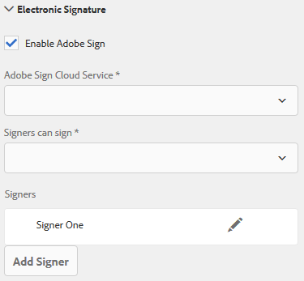
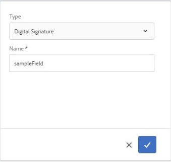

# 응용 양식{#using-adobe-sign-in-an-adaptive-form}에서 [!DNL Adobe Sign] 사용

[!DNL Adobe Sign] 적응형 양식에 전자 서명 워크플로우를 적용할 수 있습니다. 전자 서명을 사용하면 법률, 영업, 급여, 인사 관리 등 다양한 영역에서 문서를 처리할 수 있는 워크플로우를 향상시킬 수 있습니다.

일반적인 [!DNL Adobe Sign] 및 적응형 양식 시나리오에서 사용자는 적응형 양식을 채워 서비스에 적용합니다. 예를 들어, 대출 및 신용 카드 신청에는 모든 대출자와 공동 지원자의 법적 서명이 필요합니다. 유사한 시나리오에 대해 전자 서명 워크플로우를 사용하려면 [!DNL Adobe Sign]을 AEM [!DNL Forms]과 통합할 수 있습니다. 몇 가지 예는 [!DNL Adobe Sign]을 사용하여 다음을 수행할 수 있습니다.

* 자동화된 제안, 견적 및 계약 프로세스를 통해 모든 디바이스에서 거래를 성사시킬 수 있습니다.
* 인사 관리 프로세스를 보다 신속하게 완료하여 직원에게 디지털 경험을 제공할 수 있습니다.
* 계약 주기 시간을 단축하고 신규 업체의 가입 절차를 보다 신속하게 진행할 수 있습니다.
* 일반적인 프로세스를 자동화하는 디지털 워크플로우를 구축할 수 있습니다.

[!DNL Adobe Sign] AEM과의 통합  [!DNL Forms] 지원:

* 단일 및 여러 사용자 서명 워크플로우
* 순차적 및 동시 서명 워크플로우
* 양식 내 및 양식 외 서명 경험
* 익명 또는 로그인 사용자로 양식 서명
* 동적 서명 프로세스(AEM [!DNL Forms] 워크플로우와 통합)
* 기술 자료, 전화 및 소셜 프로필을 통한 인증

적응형 양식](https://medium.com/adobetech/using-adobe-sign-to-e-sign-an-adaptive-form-heres-the-best-way-to-do-it-dc3e15f9b684)과 함께 Adobe Sign을 사용하여 더 나은 서명 환경을 만드는 모범 사례를 알아봅니다.[

## 전제 조건 {#prerequisites}

적응형 양식에서 [!DNL Adobe Sign]을(를) 사용하기 전에:

* AEM [!DNL Forms] 클라우드 서비스가 [!DNL Adobe Sign]을(를) 사용하도록 구성되어 있는지 확인합니다. 자세한 내용은 [Adobe Sign과 AEM Forms](../../forms/using/adobe-sign-integration-adaptive-forms.md)을(를) 참조하십시오.
* 서명자 목록 준비 모든 서명자의 이메일 주소를 필요로 합니다.

## 응용 양식 {#configure-adobe-sign-for-an-adaptive-form}에 대해 [!DNL Adobe Sign] 구성

적응형 양식에 대해 [!DNL Adobe Sign]을 구성하려면 다음 단계를 수행하십시오.

1. [Adobe 서명을 위한 적응형 양식 속성 편집](../../forms/using/working-with-adobe-sign.md#enableadobesign)
1. [적응형 양식에 Adobe Sign 필드 추가](../../forms/using/working-with-adobe-sign.md#addadobesignfieldstoanadaptiveform)
1. [적응형 양식에 Adobe Sign 사용](../../forms/using/working-with-adobe-sign.md#enableadobsignforanadaptiveform)
1. [적응형 양식의 Adobe Sign Cloud Service 선택](../../forms/using/working-with-adobe-sign.md#selectadobesigncloudserviceforanadaptiveform)

1. [적응형 양식에 Adobe Sign 서명자 추가](../../forms/using/working-with-adobe-sign.md#addsignerstoanadaptiveform)
1. [적응형 양식의 작업 제출 선택](../../forms/using/working-with-adobe-sign.md#selectsubmitactionforanadaptiveform)

### [!DNL Adobe Sign] {#enableadobesign}에 대한 응용 양식 속성 편집

기존 또는 새 적응형 양식의 [!DNL Adobe Sign]에 대한 적응형 양식 속성을 구성합니다.

[Adobe 서명을 위한 적응형 양식 만들기](../../forms/using/working-with-adobe-sign.md#create-an-adaptive-form-for-adobe-sign) 는 기본 적응형 양식을 만드는 단계를 설명합니다. 적응형 양식을 만드는 동안 사용할 수 있는 다른 옵션은 [적응형 양식 만들기](../../forms/using/creating-adaptive-form.md)를 참조하십시오.

#### [!DNL Adobe Sign] {#create-an-adaptive-form-for-adobe-sign}에 대한 응용 양식 만들기

서명 사용 응용 양식을 만들려면 다음 단계를 수행합니다.

1. **[!UICONTROL Adobe Experience Manager]** > **[!UICONTROL Forms]** > **[!UICONTROL Forms &amp; 문서]**&#x200B;로 이동합니다.
1. **[!UICONTROL 만들기]**&#x200B;를 누르고 **[!UICONTROL 적응형 양식]**&#x200B;을 선택합니다. 템플릿 목록이 나타납니다. 템플릿을 선택하고 **[!UICONTROL 다음]**&#x200B;을 누릅니다.
1. **[!UICONTROL 기본]** 탭에서 다음을 수행합니다.

   1. 적응형 양식의 **[!UICONTROL 이름]** 및 **[!UICONTROL 제목]**&#x200B;을 지정합니다.

   1. AEM [!DNL Forms]으로 [!DNL Adobe Sign]을(를) 구성하는 동안 만든 [구성 컨테이너](../../forms/using/adobe-sign-integration-adaptive-forms.md#configure-adobe-sign-with-aem-forms)를 선택합니다.

      >[!NOTE]
      >
      >**[!UICONTROL Adobe Sign Cloud Service]** 드롭다운 목록에는 이 필드에서 선택하는 구성 컨테이너에 구성된 클라우드 서비스가 표시됩니다. **[!UICONTROL Adobe Sign]** 활성화 옵션을 선택하면 응용 양식 속성의 **[!UICONTROL 전자 서명]** 섹션에서 **[!UICONTROL Adobe Sign Cloud Service]** 드롭다운 목록을 사용할 수 있습니다.

1. **[!UICONTROL 양식 모델]** 탭에서 다음 옵션 중 하나를 선택합니다.

   * **[!UICONTROL 양식 템플릿을 기록 문서]** 옵션으로 선택하고 기록 문서 템플릿을 선택합니다. 적응형 양식을 기반으로 양식 템플릿을 사용하는 경우 서명을 위해 전송된 문서는 연결된 양식 템플릿을 기반으로 하는 필드만 표시합니다. 응용 양식의 모든 필드는 표시되지 않습니다.

   * **[!UICONTROL 레코드 문서 생성]** 옵션을 선택합니다. [기록 문서] 옵션을 사용하는 경우 적응형 양식이 활성화된 경우 서명을 위해 전송된 문서에 적응형 양식의 모든 필드가 표시됩니다.

1. **[!UICONTROL 만들기를 누릅니다.]** 서명 사용 응용 양식이 생성되며, 이 양식을 사용하여 필드를 추가할 수  [!DNL Adobe Sign] 있습니다.

#### [!DNL Adobe Sign] {#editafsign}에 대한 응용 양식 편집

기존 적응형 양식에서 [!DNL Adobe Sign]을 사용하려면 다음 단계를 수행하십시오.

1. **[!UICONTROL Adobe Experience Manager]** > **[!UICONTROL Forms]** > **[!UICONTROL Forms &amp; 문서]**&#x200B;로 이동합니다.
1. 적응형 양식을 선택하고 **[!UICONTROL 속성]**&#x200B;을 누릅니다.
1. **[!UICONTROL 기본]** 탭에서 AEM [!DNL Forms]로 [!DNL Adobe Sign]를 구성하는 동안 만든 [구성 컨테이너](../../forms/using/adobe-sign-integration-adaptive-forms.md#configure-adobe-sign-with-aem-forms)를 선택합니다.
1. **[!UICONTROL 양식 모델]** 탭에서 다음 옵션 중 하나를 선택합니다.

   * **[!UICONTROL 양식 템플릿을 기록 문서]** 옵션으로 선택하고 기록 문서 템플릿을 선택합니다. 적응형 양식을 기반으로 양식 템플릿을 사용하는 경우 서명을 위해 전송된 문서는 연결된 양식 템플릿을 기반으로 하는 필드만 표시합니다. 응용 양식의 모든 필드는 표시되지 않습니다.

   * **[!UICONTROL 레코드 문서 생성]** 옵션을 선택합니다. [기록 문서] 옵션을 사용하는 경우 적응형 양식이 활성화된 경우 서명을 위해 전송된 문서에 적응형 양식의 모든 필드가 표시됩니다.

1. **[!UICONTROL 저장 및 닫기]**&#x200B;를 누릅니다. 응용 양식이 [!DNL Adobe Sign]에 대해 활성화됩니다.

### 적응형 양식 {#addadobesignfieldstoanadaptiveform}에 Adobe Sign 필드 추가

[!DNL Adobe Sign] 에 적응형 양식에 배치할 수 있는 다양한 필드가 있습니다. 이러한 필드에는 서명, 이니셜, 회사 또는 제목과 같은 다양한 유형의 데이터가 적용되며 서명 중에 추가 정보를 수집할 수 있습니다. [!DNL Adobe Sign] 블록 구성 요소를 사용하여 적응형 양식의 여러 위치에 [!DNL Adobe Sign] 필드를 배치할 수 있습니다.

적응형 양식에 필드를 추가하고 이러한 필드와 관련된 다양한 옵션을 사용자 정의하려면 다음 단계를 수행하십시오.

1. 구성 요소 브라우저에서 적응형 양식으로 **[!UICONTROL Adobe Sign 블록]** 구성 요소를 드래그하여 놓습니다. [!DNL Adobe Sign] 블록 구성 요소에는 지원되는 모든 [!DNL Adobe Sign] 필드가 있습니다. 기본적으로 응용 양식에 **서명** 필드를 추가합니다.

   

   기본적으로 게시된 적응형 양식에는 [!DNL Adobe Sign] 블록이 표시되지 않습니다. 서명 문서에서만 볼 수 있습니다. [!DNL Adobe Sign] 블록 구성 요소의 속성에서 [!DNL Adobe Sign] 블록 가시성을 변경할 수 있습니다.

   >[!NOTE]
   >
   >    * 적응형 양식에 [!DNL Adobe Sign] 블록을 반드시 사용해야 하는 것은 아닙니다. [!DNL Adobe Sign] [!DNL Adobe Sign] 블록을 사용하고 서명자를 위한 필드를 추가하지 않는 경우, 기본 서명 필드가 서명 문서 하단에 표시됩니다.
   >    * 기록 문서를 자동으로 생성하는 적응형 양식에 대해서만 [!DNL Adobe Sign] 블록을 사용합니다. 사용자 지정 XDP를 사용하여 기록 문서 또는 적응형 양식 기반 양식 템플릿을 생성하는 경우 [!DNL Adobe Sign] 블록이 지원되지 않습니다.

1. **[!UICONTROL Adobe Sign 블록]** 구성 요소를 선택하고 **편집**  아이콘을 누릅니다. 필드의 필드 및 형식 모양을 추가하는 옵션이 표시됩니다.

   

   **A.** 필드를 선택하고  [!DNL Adobe Sign] 추가합니다. **B.** 블록을  [!DNL Adobe Sign] 전체 화면 보기로 확장

1. **[!UICONTROL Adobe Sign] 필드**  아이콘을 누릅니다. [!DNL Adobe Sign] 필드를 선택하고 추가하는 옵션이 표시됩니다.

   **[!UICONTROL 유형]** 드롭다운 필드를 확장하여 [!DNL Adobe Sign] 필드를 선택하고 완료  아이콘을 눌러 선택한 필드를 [!DNL Adobe Sign] 블록에 추가합니다. **[!UICONTROL 유형]** 드롭다운 필드에는 서명, 서명자 정보 및 데이터 필드 유형이 포함되어 있습니다. [!DNL Adobe Sign] AEM  [!DNL Forms] 지원 필드와의 통합은   Typedrop-down 상자에만 나열됩니다. [!DNL Adobe Sign] 필드에 대한 자세한 내용은 [Adobe Sign 설명서](https://helpx.adobe.com/sign/help/field-types.html)를 참조하십시오.

   

   필드에 고유한 이름을 입력해야 합니다. 필수 옵션을 선택하여 필드를 필수로 표시할 수도 있습니다. **[!UICONTROL 이름]** 및 **[!UICONTROL 필수]** 옵션 외에도 일부 [!DNL Adobe Sign] 필드에 더 많은 옵션이 있습니다. 예를 들어 마스크 및 여러 줄. 또한 각 [!DNL Adobe Sign] 필드에 대해 필드가 동일한 블록에 있는지 또는 다른 [!DNL Adobe Sign] 블록에 있는지 여부를 고유한 이름을 지정합니다.

   드롭다운 목록에서 **[!UICONTROL 디지털 서명]**&#x200B;을 선택한 경우 적응형 양식에 디지털 서명을 적용할 수 있습니다.

   * 클라우드 서명을 사용하여 신뢰 서비스 제공업체에서 호스팅하는 [디지털 ID](https://helpx.adobe.com/sign/kb/digital-certificate-providers.html)로 서명할 수 있습니다.
   * 스마트 카드, USB 토큰 또는 파일 기반 디지털 ID를 사용하여 Adobe Acrobat 또는 Reader을 사용하여 문서를 로컬로 다운로드합니다.

### 응용 양식 {#enableadobsignforanadaptiveform}에 대해 [!DNL Adobe Sign] 사용

기본적으로 [!DNL Adobe Sign]은(는) 적응형 양식에 대해 활성화되지 않습니다. 다음 단계를 수행하여 활성화합니다.

1. 컨텐츠 브라우저에서 **[!UICONTROL 양식 컨테이너]**&#x200B;를 누르고 **[!UICONTROL 구성]**  아이콘을 누릅니다. 속성 브라우저를 열고 적응형 양식 컨테이너 속성을 표시합니다.
1. 속성 브라우저에서 **[!UICONTROL 전자 서명]** 아코디언을 확장하고 **[!UICONTROL Adobe Sign 사용]** 옵션을 선택합니다. 응용 양식에 대해 [!DNL Adobe Sign]을(를) 활성화합니다.

### [!DNL Adobe Sign] Cloud Service 및 서명 주문 {#selectadobesigncloudserviceforanadaptiveform} 선택

AEM [!DNL Forms] 인스턴스에 대해 여러 [!DNL Adobe Sign] 서비스를 구성할 수 있습니다. 각 기능(Human Resource, Finance 등)에 대해 별도의 서비스 세트를 갖는 것이 좋습니다. 서명된 문서의 추적 및 보고가 더 쉬워졌습니다. 예를 들어, 은행에 여러 부서가 있습니다. 문서를 더 잘 추적하기 위해 각 부서에 대해 별도의 구성을 지정할 수 있습니다.

한 문서에 여러 명의 서명자가 있을 수도 있습니다. 예를 들어 신용 카드 지원에는 여러 명의 지원자가 포함될 수 있습니다. 은행에서 신청을 처리하기 전에 모든 지원자의 서명을 받아야 한다. 여러 서명자 시나리오의 경우 순차적 또는 동시 순서로 문서에 서명하도록 선택할 수 있습니다.

클라우드 서비스와 서명 순서를 선택하려면 다음 단계를 수행하십시오.

1. 컨텐츠 브라우저에서 **[!UICONTROL 양식 컨테이너]**&#x200B;를 누르고 **[!UICONTROL 구성]**  아이콘을 누릅니다. 속성 브라우저를 열고 적응형 양식 컨테이너 속성을 표시합니다.
1. 속성 브라우저에서 **[!UICONTROL 전자 서명]** 아코디언을 확장하고 **[!UICONTROL Adobe Sign 사용]** 옵션을 선택합니다. 응용 양식에 대해 [!DNL Adobe Sign]을(를) 활성화합니다.
1. 이미 구성된 [!DNL Adobe Sign] Cloud Services 목록에서 클라우드 서비스를 선택합니다.

   **[!UICONTROL Adobe Sign Cloud Service]** 목록이 비어 있는 경우 [AEM Forms](../../forms/using/adobe-sign-integration-adaptive-forms.md)과 함께 Adobe Sign 구성 문서를 따라 서비스를 구성합니다.

   드롭다운에는 도구 > **[!UICONTROL Cloud Services]** > **[!UICONTROL Adobe Sign]**&#x200B;의 `global` 폴더에 있는 클라우드 서비스가 나열됩니다. 또한 적응형 양식을 만들 때 **[!UICONTROL 구성 컨테이너]** 필드에서 선택하는 폴더에 있는 클라우드 서비스도 드롭다운에 나열됩니다.

1. **[!UICONTROL 서명자가]** 서명할 수 있음 대화 상자에서 서명 순서를 선택합니다. [!DNL Adobe Sign] 가수들은 임의의 순서대로  **[!UICONTROL 다른]**  서명자 ****  뒤 또는동시에적응형 양식에 서명할 수 있습니다.

   한 명의 서명자가 서명을 위해 양식을 한 번에 하나씩 받는 순차적 순서를 따릅니다. 서명자가 문서 서명을 완료하면 다음 서명자에게 양식이 전송됩니다.

   동시에 여러 서명자가 한 번에 양식에 서명할 수 있습니다.

1. [적응형 양식에 서명자를 추가하고 ](../../forms/using/working-with-adobe-sign.md#addsignerstoanadaptiveform) Done   saveicon을 눌러 변경 사항을 저장합니다.

### 적응형 양식 {#addsignerstoanadaptiveform}에 서명자 추가

적응형 양식에 서명자 한 명 또는 여러 명의 서명자만 사용할 수 있습니다. 서명자를 추가할 때 서명자에 대한 인증 세부 사항을 구성할 수도 있습니다. 양식 작성자와 가수가 같은 사람인지를 선택할 수도 있습니다. 서명자에 대한 다양한 세부 정보를 추가하고 제공하려면 다음 단계를 수행합니다.

1. 컨텐츠 브라우저에서 **[!UICONTROL 양식 컨테이너]**&#x200B;를 누르고 **[!UICONTROL 구성]**  아이콘을 누릅니다. 응용 양식 컨테이너 속성이 있는 속성 브라우저를 엽니다.
1. 속성 브라우저에서 **[!UICONTROL 전자 서명]** 아코디언을 확장하고 **[!UICONTROL Adobe Sign 사용]** 옵션을 선택합니다. 응용 양식에 대해 [!DNL Adobe Sign]을(를) 활성화합니다.
1. **[!UICONTROL 서명자 구성]**&#x200B;에서 **[!UICONTROL 서명자 추가]**&#x200B;를 누릅니다. 적응형 양식에 서명자가 추가됩니다. 적응형 양식에 [!DNL Adobe Sign] 서명자를 여러 개 추가할 수 있습니다.
   

1. **편집**  아이콘을 클릭하여 서명자에 대한 다음 정보를 지정합니다.

   * **[!UICONTROL 제목]:** 서명자를 고유하게 식별할 제목을 지정합니다.

   * **[!UICONTROL 서명자와 양식 작성자가 동일합니까?]양식** 작성자와 첫 번째 서명자가  **같은 사람이면 [예]를 선택합니다**. 이 옵션이 **아니요,**&#x200B;로 설정된 경우 적응형 양식의 서명 단계 구성 요소를 사용하지 마십시오. 양식에 서명 단계 구성 요소가 포함되어 있으면 해당 필드는 자동으로 예로 설정됩니다.

   * **[!UICONTROL 서명자 이메일 주소]:** 서명자의 이메일 주소를 지정합니다. 서명자는 지정된 이메일 주소를 사용하여 문서/양식에 서명하도록 수신됩니다. 양식 필드에 제공된 이메일 주소를 사용하거나, 로그인한 사용자의 AEM 사용자 프로필에 사용하거나, 이메일 주소를 수동으로 입력할 수 있습니다. 이것은 필수 단계이다. 첫 번째 서명자 또는 유일한 서명자(단일 서명자의 경우)의 이메일 주소가 AEM 클라우드 서비스를 구성하는 데 사용되는 [!DNL Adobe Sign] 계정과 동일하지 않은지 확인합니다.

   * **[!UICONTROL 서명자 인증 방법]:** 서명을 위한 양식을 열기 전에 사용자를 인증할 방법을 지정합니다. 전화, 기술 자료 및 소셜 ID 기반 인증 중에서 선택할 수 있습니다.
   >[!NOTE]
   >
   >    * 기본적으로 소셜 ID 기반 인증은 Facebook, Google 및 LinkedIn을 사용하여 인증할 수 있는 옵션을 제공합니다. [!DNL Adobe Sign] 지원에 문의하여 다른 소셜 인증 공급자를 활성화할 수 있습니다.

   * **[!DNL Adobe Sign]채우기 또는 서명할 필드:** 서명자의  [!DNL Adobe Sign] 필드를 선택합니다. 응용 양식에는 여러 개의 [!DNL Adobe Sign] 필드가 있을 수 있습니다. 서명자에 대한 특정 필드를 활성화하도록 선택할 수 있습니다. 이 필드에는 사용 가능한 모든 [!DNL Adobe Sign] 블록이 표시됩니다. 블록을 선택하면 블록의 모든 필드가 선택됩니다. X 아이콘을 사용하여 필드를 선택 취소할 수 있습니다.

   

   위의 이미지에는 두 개의 예 [!DNL Adobe Sign] 블록:개인 정보 및 Office 세부 사항

   완료  아이콘을 누릅니다. 서명자가 추가되고 구성됩니다.

### 적응형 양식 {#selectsubmitactionforanadaptiveform}에 대한 작업 제출 선택

이후 적응형 양식에 [!DNL Adobe Sign] 필드를 추가하고, 양식 컨테이너에서 [!DNL Adobe Sign]을 활성화하고, [!DNL Adobe Sign] Cloud Service을 선택하고, [!DNL Adobe Sign] 서명자를 추가한 다음 적응형 양식에 적합한 제출 작업을 선택합니다. 적응형 양식 제출 작업에 대한 자세한 내용은 [제출 작업 구성](../../forms/using/configuring-submit-actions.md)을 참조하십시오.

또한 모든 서명자가 양식에 서명한 후에만 [!DNL Adobe Sign] 활성화된 적응형 양식이 제출됩니다. 양식 포털의 Pending Sign 섹션에서 부분적으로 서명된 양식을 찾을 수 있습니다. [!DNL Adobe Sign] Configuration Service는 투표  [!DNL Adobe Sign] 서버를  [일반 ](../../forms/using/adobe-sign-integration-adaptive-forms.md) 상호 작용으로 유지하여 서명 상태를 확인합니다. 모든 서명자가 양식 서명을 완료하면 제출 작업 서비스가 시작되고 양식이 제출됩니다. 사용자 지정 제출 작업을 사용하고 양식에 [!DNL Adobe Sign]이(가) 사용된 경우 사용자 지정 제출 작업을 업데이트하여 제출 작업 서비스를 사용합니다.

<!-- Remove when forms portal goes live
>[!NOTE]
>
>Data of the adaptive form is stored temporarily on Forms Portal. It is recommended to use [custom storage for Forms Portal](/help/forms/using/configuring-draft-submission-storage.md). It ensures that the PII (personally identifiable information) data is not stored on AEM servers. 
-->

양식 서명 환경이 준비되어 있습니다. 양식을 미리 보고 서명 환경을 확인할 수 있습니다. 게시된 양식에서 서명자가 이메일을 통해 서명하기 위한 양식을 받을 때 [!DNL Adobe Sign] 블록 필드가 표시됩니다. 이 경험을 폼 없는 서명 경험이라고도 합니다. 첫 번째 서명자에 대해 양식 서명 환경을 구성할 수도 있습니다. 자세한 내용은 [양식 서명 경험 만들기](../../forms/using/working-with-adobe-sign.md#create-in-form-signing-experience)를 참조하십시오.

## 응용 양식 {#configure-cloud-signatures-for-an-adaptive-form}에 대한 클라우드 서명 구성

클라우드 기반의 디지털 서명 또는 원격 서명은 데스크탑, 모바일 및 웹에서 사용할 수 있는 차세대 디지털 서명이며, 더욱 높은 수준의 규정 준수 및 서명자 인증을 보장할 수 있습니다. 클라우드 기반의 디지털 서명을 사용하여 적응형 양식에 서명할 수 있습니다.

Adobe 서명](../../forms/using/working-with-adobe-sign.md#enableadobesign)에 대한 응용 양식 속성을 편집한 후 다음 단계를 수행하여 응용 양식에 클라우드 서명 필드를 추가합니다.[

1. 구성 요소 브라우저에서 적응형 양식으로 **[!UICONTROL Adobe Sign 블록]** 구성 요소를 드래그하여 놓습니다. [!UICONTROL Adobe Sign 블록] 구성 요소에는 지원되는 모든 [!DNL Adobe Sign] 필드가 있습니다. 기본적으로 응용 양식에 **[!UICONTROL 서명]** 필드를 추가합니다.

   

1. **[!UICONTROL Adobe Sign 블록]** 구성 요소를 선택하고 **편집**  아이콘을 누릅니다. 필드의 필드 및 형식 모양을 추가하는 옵션이 표시됩니다.

   

   **A.** 필드를 선택하고  [!DNL Adobe Sign] 추가합니다. **B.** 블록을  [!DNL Adobe Sign] 전체 화면 보기로 확장

1. **[!UICONTROL Adobe Sign 필드]**  아이콘을 누릅니다. [!DNL Adobe Sign] 필드를 선택하고 추가하는 옵션이 표시됩니다.

   **[!UICONTROL 유형]** 드롭다운 필드를 확장하여 **[!UICONTROL 디지털 서명]**&#x200B;을 선택하고 **완료** 아이콘을 눌러 선택한 필드를 [!DNL Adobe Sign] 블록에 추가합니다.

   

   필드에 고유한 이름을 입력해야 합니다.

   다음을 사용하여 적응형 양식에 디지털 서명 적용:

   * 클라우드 서명:트러스트 서비스 공급자가 호스팅하는 [디지털 ID](https://helpx.adobe.com/sign/kb/digital-certificate-providers.html)로 서명합니다.
   * Adobe Acrobat 또는 Reader:스마트 카드, USB 토큰 또는 파일 기반 디지털 ID를 사용하여 서명하려면 Adobe Acrobat 또는 Reader으로 문서를 다운로드하여 엽니다.

   적응형 양식에 클라우드 서명 필드를 추가한 후 다음 단계를 수행하여 구성 프로세스를 완료합니다.

   * [적응형 양식에 Adobe Sign 사용](../../forms/using/working-with-adobe-sign.md#enableadobsignforanadaptiveform)
   * [적응형 양식의 Adobe Sign Cloud Service 선택](../../forms/using/working-with-adobe-sign.md#selectadobesigncloudserviceforanadaptiveform)
   * [적응형 양식에 Adobe Sign 서명자 추가](../../forms/using/working-with-adobe-sign.md#addsignerstoanadaptiveform)
   * [적응형 양식의 작업 제출 선택](../../forms/using/working-with-adobe-sign.md#selectsubmitactionforanadaptiveform)

## 양식 서명 경험 만들기 {#create-in-form-signing-experience}

사용자는 양식을 채울 때 적응형 양식에 서명할 수도 있습니다. 이 경험을 양식 서명 경험이라고도 합니다. 양식 서명 환경은 여러 서명자 환경에서 첫 번째 싱어에게만 제공됩니다. 적응형 양식의 양식 서명 환경을 만들려면 다음 단계를 수행하십시오.

1. [서명 단계 구성 요소를 추가하고 구성합니다](../../forms/using/working-with-adobe-sign.md#add-and-configure-the-signature-step-component).
1. [요약 단계 구성 요소를 추가합니다](../../forms/using/working-with-adobe-sign.md#configure-the-thank-you-page-or-summary-step-component).

### 서명 단계 구성 요소 {#add-and-configure-the-signature-step-component} 추가 및 구성

서명 단계 구성 요소를 사용하여 채워진 양식에 전자 서명할 영역을 제공합니다. 서명 단계 구성 요소가 포함된 섹션을 렌더링하면 채워진 양식의 서명 가능한 PDF 버전이 표시됩니다. 서명 단계 구성 요소는 양식에 사용할 수 있는 전체 너비를 차지합니다. 서명 단계 구성 요소를 포함하는 섹션에는 다른 구성 요소가 없는 것이 좋습니다.

서명 단계 구성 요소를 구성하려면 다음 단계를 수행하십시오.

1. 구성 요소 브라우저에서 **[!UICONTROL 서명 단계]** 구성 요소를 양식에 드래그하여 놓습니다.
1. 새로 추가된 서명 단계 구성 요소를 선택하고 **구성**  아이콘을 누릅니다. 속성 브라우저를 열고 서명 단계 속성을 표시합니다. 다음 속성을 구성합니다.

   * **[!UICONTROL 이름]**:구성 요소의 이름을 지정합니다.

   * **[!UICONTROL 제목]:** 구성 요소의 고유한 제목을 지정합니다.
   * **[!UICONTROL 템플릿 메시지]:** 서명 PDF를 로드하는 동안 표시할 메시지를 지정합니다. [!DNL Adobe Sign] 서비스는 서명 PDF를 준비하고 로드하는 데 시간이 다소 소요됩니다.
   * **[!UICONTROL 서명 서비스]:** 옵션을  **[!DNL Adobe Sign]** 선택합니다.

   * **[!UICONTROL 기존 전자 서명 구성 요소]** 사용: [AEM Forms 작업 영역](../../forms/using/introduction-html-workspace.md), AEM  [!DNL Forms] 앱 또는 기본 응용 양식에 기존 전자 서명 구성 요소가 있는 경우 기존 전자 서명 구성 요소  **사용 옵션을** 선택합니다.

   * **[!UICONTROL 구성]**:구성([!DNL Adobe Sign] Cloud Service)을 선택합니다. 드롭다운 상자는 **기존 전자 서명 구성 요소 사용** 옵션이 활성화된 경우에만 사용할 수 있습니다.

   * **[!UICONTROL CSS 클래스]**:구성 요소의 CSS 클래스를 지정합니다.

   완료  아이콘을 눌러 변경 내용을 저장합니다.

   

   >[!NOTE]
   >
   > * **[!UICONTROL 서명 단계]** 구성 요소를 양식에 드래그하여 놓으면 **[!UICONTROL 서명자와 양식을 채우는 사람이 동일합니까?]** 옵션이 자동으로 [예]로  **설정됩니다**. 양식을 계속 작동시켜야 합니다.
      >
      > 
   * 최상의 경험을 위해 서명 단계 구성 요소 뒤에 요약 단계 구성 요소를 사용합니다. [요약] 단계는 서명 단계 구성 요소에서 양식 서명을 완료한 후 자동으로 그리고 즉시 양식을 제출합니다. 요약 단계를 사용하지 않는 경우 자동 제출은 [Adobe Sign Configuration Service](../../forms/using/adobe-sign-integration-adaptive-forms.md#configure-adobe-sign-scheduler-to-sync-the-signing-status)를 사용하여 설정된 간격만 트리거됩니다.
      > 몇 가지 우수 사례는 다음과 같습니다.
   > * 서명 단계를 포함하는 응용 양식 패널은 항상 응용 양식의 마지막 패널 또는 두 번째 패널에 있습니다. 마지막 패널에 [요약] 단계가 포함된 경우에만 두 번째 마지막 패널이 될 수 있습니다.
   > * 서명 또는 요약 단계 구성 요소를 포함하는 패널에는 다른 구성 요소가 포함될 수 없습니다.
   > * 서명 단계가 포함된 응용 양식에는 제출 단추를 사용할 수 없습니다.
   > * 서명 단계가 포함된 적응형 양식에 대한 제출은 백그라운드 서비스 또는 요약 단계를 통해 처리됩니다. 양식을 채우는 구성된 서명자가 한 명인 경우 요약 단계를 사용하여 적응형 양식 제출을 처리하는 장점은 서명자가 양식에 서명했다고 즉시 평가하고 제출 작업을 호출하는 것입니다. 백그라운드 서비스를 통해 구성된 모든 서명자가 양식에 서명했는지 여부를 평가하고 적응형 양식 제출을 지연시킬 수 있습니다.
   > * 사용자가 서명 또는 요약 단계가 포함된 패널에서 뒤로 이동할 수 없도록 양식을 디자인합니다.

### 감사 인사 페이지 또는 요약 단계 구성 요소 {#configure-the-thank-you-page-or-summary-step-component} 구성

**요약 단계** 구성 요소는 자동으로 양식을 제출하고 사용자 지정된 요약 페이지 내에 정보를 채우고 제출된 양식의 요약을 표시합니다. 또한 반품 맵에 필요한 정보를 가져옵니다. 요약 단계 구성 요소는 양식에 사용할 수 있는 전체 너비를 차지합니다. 요약 단계 구성 요소를 포함하는 섹션에는 다른 구성 요소가 없는 것이 좋습니다.

이제 양식 서명 환경을 사용할 수 있습니다. 양식을 미리 보고 서명 환경을 확인할 수 있습니다.

## FAQ {#frequently-asked-questions}

**Q:** 다른 적응형 양식에 적응형 양식을 포함할 수 있습니다. 포함된 적응형 양식을 [!DNL Adobe Sign]으로 사용할 수 있습니까?
**Ans:** No, AEM [!DNL Forms] 는 서명을 위해  [!DNL Adobe Sign] 활성화된 적응형 양식을 포함하는 적응형 양식 사용을 지원하지 않습니다.

**Q:** 고급 템플릿을 사용하여 적응형 양식을 만들고 편집용으로 열면 &quot;전자 서명 또는 서명자가 올바르게 구성되지 않았습니다.&quot;라는 오류 메시지가 표시됩니다. 표시됩니다. 오류 메시지를 해결하는 방법?
**Ans:** 고급 템플릿을 사용하여 만든 적응형 양식이 사용하도록 구성되었습니다 [!DNL Adobe Sign]. 오류를 해결하려면 [!DNL Adobe Sign] 클라우드 구성을 만들고 선택하고 적응형 양식의 [!DNL Adobe Sign] 서명자를 구성합니다.

**Q: 적응형 양식의 정적 텍스트 구성 요소에서** 텍스트 태그를 사용할  [!DNL Adobe Sign] 수 있습니까?
**Ans:** 예. 텍스트 구성 요소의 텍스트 태그를 사용하여 기록 문서 [!DNL Adobe Sign] (레코드  [자동 생성 문서만](../../forms/using/generate-document-of-record-for-non-xfa-based-adaptive-forms.md) ) 활성화된 적응형 양식에 필드를 추가할 수 있습니다. 텍스트 태그를 만드는 절차와 규칙에 대해 알아보려면 [Adobe Sign 설명서](https://helpx.adobe.com/sign/using/text-tag.html)를 참조하십시오. 또한 적응형 양식에는 텍스트 태그에 대한 지원이 제한되어 있습니다. 텍스트 태그를 사용하여 [Adobe Sign 블록](../../forms/using/working-with-adobe-sign.md#configure-cloud-signatures-for-an-adaptive-form)에서 지원하는 필드만 만들 수 있습니다.

**Q:** AEM은  [!DNL Forms] Adobe Sign  [!UICONTROL 블록과 서명 ] 단계 구성 요소를 모두 제공합니다. 적응형 양식에서 동시에 사용할 수 있습니까?
**Ans:** 양식에서 두 구성 요소를 동시에 사용할 수 있습니다. 다음은 이러한 구성 요소를 사용하기 위한 몇 가지 권장 사항입니다.

**Adobe Sign 블록:**  [!UICONTROL Adobe Sign Blockbox를 사용하여 ] 적응형 양식의   아무 곳에나 Adobe 서명 필드를 추가할 수 있습니다. 서명자에게 특정 필드를 할당할 수도 있습니다. 응용 양식을 미리 보거나 게시한 경우 기본적으로 [!UICONTROL Adobe Sign] 블록이 표시되지 않습니다. 이러한 블록은 서명 문서에서만 활성화됩니다. 서명 문서에서 서명자에게 할당된 필드만 활성화됩니다. [!UICONTROL Adobe ] Signblock은 첫 번째 및 후속 서명자와 함께 사용할 수 있습니다.

**서명 단계 구성 요소:** 서명 단계 구성 요소를 사용하여 양식 서명 환경을 만들 수 있습니다. 양식을 작성하는 동안 첫 번째 서명자만 서명할 수 있습니다. 서명 단계 구성 요소가 포함된 섹션을 렌더링하면 서명 가능한 양식 PDF 버전이 표시됩니다. 일반적으로 양식의 마지막 섹션이나 마지막 섹션 뒤에 요약 구성 요소가 옵니다.

## 문제 해결 {#troubleshoot}

### [!DNL Adobe Sign] 계약 실패  {#adobe-sign-agreement-failures}

****
문제 [!DNL Adobe Sign] 적응형 양식에 대해 서비스가 구성된 경우 서비스가 기본 적응형 양식에  [!DNL Adobe Sign] 대한 계약을 만들지 못합니다.

**해상도**

* 적응형 양식에 사용된 Adobe Sign 클라우드 서비스](../../forms/using/adobe-sign-integration-adaptive-forms.md)의 [구성을 확인하십시오.
* [!DNL Adobe Sign] 클라우드 서비스를 구성하는 데 사용되는 [!DNL Adobe Sign] 서버의 API 응용 프로그램에 필요한 권한이 있는지 확인합니다.
* 여러 [!DNL Adobe Sign] 클라우드 서비스를 사용하는 경우 모든 서비스의 **[!UICONTROL oAuth URL]**&#x200B;을(를) 동일한 **[!UICONTROL Adobe Sign 공유]**&#x200B;로 가리킵니다.

* 별도의 이메일 주소를 사용하여 [!DNL Adobe Sign] 계정과 첫 번째 서명자 및 단일 서명자에 대해 구성합니다. 첫 번째 서명자 또는 유일한 서명자(단일 서명자의 경우)의 이메일 주소는 AEM 클라우드 서비스를 구성하는 데 사용되는 [!DNL Adobe Sign] 계정과 같을 수 없습니다.

### [!DNL Adobe Sign] 활성화된 응용 양식에 대해 구성된 AEM [!DNL Forms] 작업 과정이 {#adobe-sign-aem-form-workflow-failures}을(를) 시작하지 않음

**문제**
적응형  [!DNL Adobe Sign] 양식에 대해 구성된 경우 워크플로우 호출 옵션을 사용하여 구성된  [!DNL Forms] 워크플로우가 시작되지 않습니다.

**해상도**

* 서명 단계 없이 [!DNL Adobe Sign]을 사용하거나 양식에 여러 사람의 서명이 필요한 경우 AEM [!DNL Forms] 서버는 스케줄러가 모든 사람이 양식에 서명했는지 확인하기를 기다립니다. 스케줄러는 모든 사람이 서명을 완료하고 워크플로우가 적응형 양식을 성공적으로 제출한 후에만 시작되는 경우에만 적응형 양식을 제출합니다. [스케줄러](adobe-sign-integration-adaptive-forms.md)의 간격을 줄여 양식 서명 상태를 빠르게 확인하고 양식 제출을 강화할 수 있습니다.

## 관련 문서 {#related-articles}

* [AEM Forms과 Adobe Sign 통합](../../forms/using/adobe-sign-integration-adaptive-forms.md)
* [적응형 양식과 함께 Adobe Sign을 사용하기 위한 모범 사례](https://medium.com/adobetech/using-adobe-sign-to-e-sign-an-adaptive-form-heres-the-best-way-to-do-it-dc3e15f9b684)
* [AEM Forms에서 Adobe Sign 사용(비디오)](https://helpx.adobe.com/experience-manager/kt/forms/using/adobe-sign-integration-feature-video.html)
