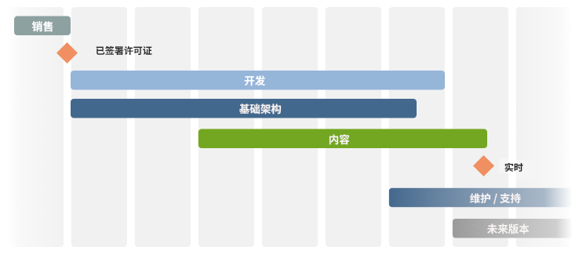

# 검사 목록 - 추가 참조{#the-checklist-further-reference}

이 페이지에서는 [프로젝트 관리 - 우수 사례 검사 목록](/help/managing/best-practices.md)에 의해 적용되는 문서 및 원칙을 상세히 설명하고 보완하기 위한 세부 정보를 제공합니다.

## AEM - 무엇을 사용할 예정입니까?{#aem-what-will-you-be-using}

>[!CAUTION]
>
>이 하위 섹션의 목록은 완벽하지는 않지만, 소개로 작성되었습니다.

### AEM {#features-within-aem} 내의 기능

AEM을 구현할 때(특히 처음) AEM](https://www.adobe.com/kr/marketing/experience-manager.html)의 [기능 및 워크플로우를 검토하여 필요한 영역을 확인해야 합니다.

사용할 AEM의 기능과 디자인에 미치는 영향을 고려해 보십시오.예:

* [상거래](/help/commerce/cif-classic/administering/ecommerce.md)
* [스크린](https://docs.adobe.com/content/help/ko-KR/experience-manager-screens/user-guide/aem-screens-introduction.html)
* [자산](/help/assets/assets.md)
* [태그](/help/sites-administering/tags.md)
* [다중 사이트 관리 및 번역](/help/sites-administering/msm-and-translation.md)
* [양식](/help/forms/home.md)
* [커뮤니티](/help/communities/deploy-communities.md)
* [Livefyre](https://answers.livefyre.com/product/livefyre-for-adobe-experience-manager-aem/livefyre-for-adobe-experience-manager/)

또한 AEM의 다양한 버전에서 [릴리스 노트](/help/release-notes/release-notes.md)를 확인하여 새로운 기능이 언제 추가되었는지 확인하십시오.

### 통합 {#integrations}

AEM은 다른 Adobe 제품 및/또는 타사 서비스와 통합할 수 있습니다. 따라서 원하는 대로 성능과 기능을 향상시킬 수 있습니다.

자세한 내용은 [솔루션 통합](/help/sites-administering/integration.md)을 참조하십시오.

## 마이그레이션 또는 업그레이드?{#migrate-or-upgrade}

다음 중 하나를 선택해야 하는 경우가 가장 중요합니다.

* 기존 설치를 업그레이드합니다.
* 컨텐츠를 현재 시스템에서 신규 설치로 마이그레이션합니다.

이전 버전에서 현재 버전으로 이동할 때에는 다음 두 가지 옵션이 있습니다.

* [패키지 관리자](/help/sites-administering/package-manager.md)를 사용하여 이전 시스템에서 새 시스템으로 모든 컨텐츠 및 응용 프로그램 코드를 내보냅니다.
*  이전 시스템을 즉시 업그레이드합니다. 대부분의 경우 이 옵션이 권장됩니다.

## 기본 접지 규칙 {#basic-ground-rules}

어떤 프로젝트에서도 마찬가지로, 가능한 한 빨리 기본 원칙을 세우는 것이 중요하다. 이러한 쿠키에는 다음이 포함됩니다.

>[!NOTE]
>
>이러한 포인트는 일반적이며, [우수 사례 검사 목록](/help/managing/best-practices.md)은 AEM과 관련된 세부 사항을 처리합니다.

* **역할**

   이러한 정보는 명확히 정의되어야 하며 프로젝트에 관련된 모든 사람에게 알려져야 합니다. 또한 다음을 강조 표시하는 것이 좋습니다.

   * 의사 결정권자
   * 연락처

* **책임**

   * 각 역할에 대해 프로젝트와 관련된 책임에 대한 명확한 정의를 통해 혼동을 방지할 수 있습니다.

* **참여**

   가능한 한 빨리 이해관계자를 참여시켜 프로젝트 *이해관계자*&#x200B;가 되도록 유도하여 프로젝트 성공에 대한 헌신을 높일 수 있습니다.

   * 고객 측면에는 작성자가 포함되어 있으며, 작성자는 매일 시스템과 작업해야 합니다.
   * 프로젝트 팀 내에 품질 보증을 담당하는 사람도 포함됩니다. 고객의 요구 사항을 더 잘 이해할수록 테스트를 계획할 수 있습니다.

* **통신 경로**

   * 이러한 내용을 과도하게 형식화해서는 안 되지만, 특정 정의는 주요 사람에게 항상 정보를 제공하고 따라서 최신 정보를 유지할 수 있도록 해야 합니다. 외부 당사자와의 소통에 특별한 관심을 기울여야 한다.

* **프로세스**

   정의할 프로세스는 개별 프로젝트에 따라 다릅니다. 다음 사항을 고려하여 이러한 간단한 작업을 다시 시도하십시오.

   * 타사와 상호 작용할 프로세스(및 통신 경로) 정의예: 디자인 에이전시 및 기타 소프트웨어 공급업체
   * 고객은 종종 고유한 프로젝트 관리 및 보고 절차 및 도구를 갖게 됩니다.

* **추적 도구**

   버그, 작업 및 프로젝트의 다른 측면에 대한 정보를 추적하는 데 사용할 수 있는 많은 도구가 있습니다. 자세한 내용은 [잠재적 도구 개요](#overview-of-potential-tools)를 참조하십시오.

   * 여기에서 주목해야 할 핵심 사항은 정보의 한 복사본만 유지하고 정보를 공유하여 사용 중인 도구에 대한 액세스(따라서)하는 것입니다. 이를 통해 유지 관리가 용이하고 불일치를 방지할 수 있습니다.

* **범위**

   다양한 수준에서 프로젝트에 의해 다루어야 하는 사항을 명확히 정의합니다.

   * 개별 릴리스(반복 릴리스 프로세스가 사용되는 경우 고객에게 제공되는지 내부 테스트 팀에 제공되는지 여부에 상관없이)입니다.
   * AEM 프로젝트.
   * 전체 프로젝트;타사 소프트웨어, 테스트에 미치는 영향, 조직 문제 및 기타 여러 가지 사항을 포함합니다.
   * 특정 측면에서는 프로젝트 범위 내에 *이 아닌*&#x200B;를 지정하는 데에도 유용할 수 있습니다. 이것은 필수적인 문제로 제한되어야 하지만, 혼동 및 잘못된 가정을 방지하는 데 도움이 될 수 있습니다.

* **보고**

   보고할 정보, 어떤 형태, 얼마나 자주, 누구에게 대해 명확히 정의하십시오.

* **용어**

   * 사용할 약어 및/또는 고객별 용어를 정의합니다.

* **가정**

   * 발생할 가정을 정의합니다.

이 정보는 프로젝트 안내서 내에 정의할 수 있습니다.Wiki를 사용하면 진행 중인 변경 사항이 효율적으로 처리되도록 할 수도 있습니다. 이러한 속성이 정의될 때마다, 주요 요소는 다음과 같습니다.

* 정보를 정의하고 유지 관리합니다
* 관련된 모든 사람들에게 정보가 명확하게 전달된다. 표준 프로젝트 관리 방식이지만 명확한 역할 정의와 양호한 커뮤니케이션이 프로젝트를 수행 또는 중단시킬 만큼 자주 반복될 수는 없습니다.
* 추적 중인 정보는 한 버전만 유지됩니다.예를 들어 버그 추적, 문제 추적 등이 있습니다.

## 주요 성능 지표 및 Target 지표 {#key-performance-indicators-and-target-metrics}

조직에서는 주요 성과 지표(KPI)를 사용하여 목표에 도달하는 동안 성과를 평가합니다. 이러한 지표는 구체적인 목표가 얼마나 효과적으로 충족되는지를 보여주는 데 사용할 수 있는 측정 가능한 가치입니다.

이러한 지표는 다음과 같습니다.

* 비즈니스:

   * 주요 비즈니스 목표를 측정하는 데 사용됩니다.
   * 비즈니스/시나리오에 적합한 KPI를 정의, 측정 방법, 사용 방법 및 누구에 따라 정확하게 선택하는 것이 중요합니다.

* 공연:

   * 시스템의 성능을 측정하는 방법을 정의합니다.
   * 페이지 로드 시간, 서버 응답 시간 및 데이터베이스 쿼리 성능이 일부 예제에 해당됩니다.

일부 지표(전부는 아님)는 사용자가 식별하고 정의하는 대상 지표를 기반으로 할 수 있습니다.

### Target 지표 {#target-metrics}

지표는 웹 사이트의 품질에 대한 수량 측정을 정의하는 데 사용됩니다. 기본적으로 달성하려는 성능 목표에 대한 정의이며 [KPI(주요 성과 지표)](#key-performance-indicators-and-target-metrics)를 정의하는 데 사용할 수 있습니다.

많은 지표를 정의할 수 있지만, 자주 정의하는 지표는 성능 및 동시성에 대한 목표를 다룹니다. 특히, 정량화가 어려울 수 있고 종종 *감성* 평가를 받기 쉽습니다.

* &quot;우리 웹 사이트는 *너무 느리게*&#x200B;오늘&quot; - 언제 *느리게*&#x200B;가 적합합니까?

* &quot;내 동료가 로그인하면 모두 *모두 정지*&#x200B;로 분쇄됩니다.&quot; - 시스템에서 지원할 수 있는 동시 사용자 수는 몇 명입니까?
* &quot;검색할 때 시스템 *이 halt* &quot;(으)로 분쇄됩니다. 어떤 종류의 검색 요청이 시스템에 영향을 줍니까?
* &quot;파일을 다운로드하는 데 *페이지*&#x200B;가 소요됨&quot; - 허용되는 다운로드 시간(일반적인 네트워크 조건에서)은 얼마입니까?

Target 지표는 프로젝트를 시작할 때 다음과 같이 정의됩니다.

* 제공할 웹 사이트의 예상 차원을 나타냅니다
* 달성하려는 최소 품질을 나타냅니다.
* 이러한 요소가 실제로 측정되는 방식을 정의합니다.
* [주요 성능 지표](#key-performance-indicators-and-target-metrics)의 기초로 사용됩니다.

타겟 지표를 정의할 때 항상 주의해야 하는 것처럼

* 너무 높게 설정하면 완전히 불가능한 경우도 있습니다
* 너무 낮은 변동을 설정하면 강조 표시되지 않을 수 있습니다
* 반복적이고 일관되게 측정할 수 있도록 하기 위해
* 측정되는 여러 요인들 간에 균형을 맞추다
* 특정 지표는 테스트 환경과 관련되지만, 일부는 프로덕션 웹 사이트에 측정 및 재현성이 있어야 하는 실제 사례를 반영해야 합니다
* 웹 사이트에 대한 해당 중요도에 따라 지표의 우선 순위를 지정합니다
* 실제로 모니터링할 수 있는 세트로 지표 제한

프로젝트를 개발할 때 적절히 업데이트 및 조정할 수 있습니다. 프로젝트가 성공적으로 구현되면 설치 및 지속적인 작업을 위한 필수 서비스 수준을 모니터링/관리하는 데 도움이 되는 데 사용할 수 있습니다.

이러한 지표를 적절하게 사용하는 경우 유용한 도구를 제공할 수 있습니다.무책임하게 사용될 때 그들은 시간을 낭비할 수 있다. 늘 그렇듯이, 여러분은 여러분이 무엇을 측정하고 있는지, 어떻게 측정하고 있는지 그리고 그 이유를 이해할 필요가 있습니다.

>[!NOTE]
>
>이 섹션은 고려될 기본 원칙과 문제들을 다룰 것입니다. 각 설치마다 다르므로 측정할 실제 값은 달라집니다.

### 모든 것은 프로젝트 디자인 {#everything-rests-on-your-project-design}에 있습니다

측정할 모든 지표는 어떤 식으로 프로젝트의 디자인에 영향을 받습니다. 반대로, 많은 문제들은 디자인 변화에 의해 가장 잘 해결될 것이다.

따라서 디자인을 결정하기 전에 *대상 지표를 정의해야 합니다.* 이를 통해 이러한 요소를 기반으로 디자인을 최적화할 수 있습니다. 프로젝트가 개발되면 기본 디자인 원칙을 변경하기가 어려울 것입니다.

웹 사이트의 구조를 만들 때 AEM 웹 사이트에 대해 권장되는 구조를 따르십시오. 다음 문제 및/또는 원칙을 이해하는지 확인하십시오.

* 웹 사이트 컨텐츠를 구성하는 방법
* 템플릿 및 구성 요소 작동 방식.
* 캐싱이 작동하는 방식.
* 개인화된 컨텐츠의 영향.
* 검색 기능 작동 방식.
* CSS 및 관련 기술을 사용하여 작고 중복되지 않는 HTML 코드를 만드는 방법.

디자인이 지침을 따르지 않는다고 생각되거나, 일부 의미를 잘 모르는 경우 프로그래밍 단계를 시작하거나 콘텐츠를 채우기 전에 이러한 문제를 명확히 하십시오.

### 인프라 {#infrastructure}

인프라를 정의하거나 평가하려면 다음과 같은 대상 값을 정의하는 데 도움이 됩니다.

* 방문자/일평균과 피크 모두
* 히트/일평균과 피크 모두
* 사용 가능한 웹 페이지 수
* 웹 컨텐츠 볼륨

사용자의 상황 및 웹 사이트의 전략적 중요도에 따라 인프라 평가 및 선택에 도움이 됩니다.

* 서버 수
* AEM 인스턴스 수(작성자 및 게시)

### 공연 {#performance}

평가할 수 있는 몇 가지 성능 요소가 있습니다.

* 개별 페이지에 대한 응답 시간 을 고려하여 다음을 고려합니다.

   * 작성 환경의 응답 시간
   * 게시 환경의 응답 시간

* 검색 요청에 대한 응답 시간

이 섹션은 [성능 최적화](/help/sites-deploying/configuring-performance.md)와 함께 읽을 수 있으며, 실제로 성능을 측정하는 기술 세부 사항을 확장합니다.

#### 개별 페이지에 대한 응답 시간 {#response-times-for-individual-pages}

주요 문제는 웹 사이트가 방문자 요청에 응답하는 시간입니다.

이 값은 각 요청에 대해 다르지만 평균 타겟 값을 정의할 수 있습니다. 이 값이 달성 가능하고 유지 관리할 수 있는 것으로 확인되면 웹 사이트의 성능을 모니터링하고 잠재적 문제의 개발을 나타내는 데 사용할 수 있습니다

작성 및 게시 환경의 다른 대상

타깃팅할 응답 시간은 대상 대상을 반영하는 작성자 및 게시 환경에서 다릅니다.

* **작성 환경**

   이 환경은 컨텐츠 입력 및 업데이트 작성자가 사용하므로 다음을 수행해야 합니다.

   * 콘텐츠 페이지를 업데이트할 때 높은 수의 요청을 생성하는 소수의 사용자를 대상으로 하며, 해당 페이지의 개별 요소를 제공합니다
   * 최대한 빨리 컨텐츠를 웹 사이트로 가져올 수 있도록 생산성을 극대화하십시오

* **게시 환경**

   이 환경에는 사용자가 사용할 수 있는 컨텐츠가 포함되어 있습니다.

   * 속도는 여전히 중요하지만, 작성 환경보다 속도가 느리는 경우도 종종 있습니다
   * 추가 성능 향상 메커니즘이 적용되는 경우가 많습니다.

      * 컨텐츠가 캐시됩니다
      * 로드 밸런싱이 적용됨

#### 대상 응답 시간 {#setting-target-response-times} 설정

그렇다면 달성 가능한(평균) 응답 시간을 어떻게 결정할 수 있습니까? 이것은 종종 경험의 문제입니다.

* 웹 사이트에서 과거 경험
* AEM을 사용한 경험
* 평균 응답 시간을 초과하는 복잡한 페이지 인식(가능한 경우 개별적으로 최적화되어야 함)

그러나(제어된 상황에서는) 다음 지침을 적용할 수 있습니다.

* 페이지 요청의 70%가 100ms 이내에 응답해야 합니다.
* 페이지 요청의 25%는 100ms-300ms 이내에 응답해야 합니다.
* 페이지 요청의 4%는 300ms-500ms 이내에 응답해야 합니다.
* 페이지 요청의 1%는 500ms-1000ms 이내에 응답해야 합니다.
* 어떤 페이지도 1초보다 느리게 응답해야 하지 않습니다.

위의 숫자는 다음 조건을 가정합니다.

* 게시 시 측정(작성 환경 및/또는 CFC 오버헤드 없음)
* 서버에서 측정됨(네트워크 오버헤드 없음)
* 캐시되지 않음(AEM 출력 캐시 없음, Dispatcher 캐시 없음)
* 종속성이 많은 복잡한 항목(HTML, JS, PDF, ...)에 대해서만 발생합니다.
* 시스템에 다른 로드 없음

응답 시간을 모니터링하는 데 사용할 수 있는 몇 가지 메커니즘이 있습니다.

* **AEM request.log를 사용하여 응답 시간 모니터링**

   성능 분석을 위한 좋은 시작점은 요청 로그입니다. 다른 정보 중에서 이 정보를 사용하여 개별 요청의 응답 시간을 볼 수 있습니다. 자세한 내용은 [성능 최적화](/help/sites-deploying/configuring-performance.md) 를 참조하십시오.

* **HTML 주석을 사용하여 응답 시간 모니터링**

   HTML 주석을 사용하여 각 페이지의 소스 내에 응답 시간 정보를 포함할 수 있습니다.

   `</body> </html>v <-- Page took 58 milliseconds to be rendered by the server --> Response times for search requests`

#### 검색 요청 {#search-requests}

검색 요청은 두 측면에서 웹 사이트에 상당한 영향을 줄 수 있습니다.

* 실제 검색의 응답 시간

   * 빠른 검색 기능은 웹 사이트의 품질 목표입니다

* 일반 성능에 미치는 영향

   * 검색 함수는 컨텐츠의 섹션이나 특별히 추출된 인덱스를 스캔해야 하므로 최적화되지 않은 경우 전체 시스템의 성능에 영향을 줄 수 있습니다

검색 요청에 대한 타겟을 설정하는 것은 다음과 같은 경우에 따라 경험의 문제입니다.

* AEM 경험
* 다른 목표에 비해 검색 사용 빈도에 대한 평가
* 지속성 관리자
* 검색 색인
* 검색 기능의 복잡성검색 용어 1개만 입력할 수 있는 기본 검색 기능은 고급 검색보다 빠르게 AND/OR/NOT을 사용하여 복잡한 검색 문을 작성할 수 있습니다.

프로젝트 처음부터 이러한 계획을 계획하고 통합해야 합니다. 모니터링할 수 있는 메커니즘은 다음과 같습니다.

* **AEM request.log를 사용하여 검색 응답 시간 모니터링**

   request.log를 사용하여 검색 요청에 대한 응답 시간을 모니터링할 수 있습니다.자세한 내용은 [성능 최적화](/help/sites-deploying/configuring-performance.md) 를 참조하십시오.

* **검색 응답 시간을 측정하기 위한 프로그램 메커니즘**

   검색 요청 및 해당 성능에 대해 수집하는 정보를 사용자 지정하려면 프로젝트 소스 코드에 정보 수집을 포함하는 것이 좋습니다.자세한 내용은 [성능 최적화](/help/sites-deploying/configuring-performance.md) 를 참조하십시오.

### 동시 실행 {#concurrency}

웹 사이트는 작성자와 게시 환경 모두에서 많은 사용자/방문자가 사용할 수 있게 됩니다. 테스트 시 사용한 것보다 숫자가 많기도 하지만 변화무쌍하고 예측하기도 어렵습니다. 성능에 부정적인 영향을 주지 않고 평균 동시 사용자/방문자 수를 위해 웹 사이트를 설계해야 합니다. 다시 `request.log`을 사용하여 동시성 테스트를 수행할 수 있습니다.자세한 내용은 [성능 최적화](/help/sites-deploying/configuring-performance.md) 를 참조하십시오.

동시 사용자 수에 대한 Target은 환경 유형에 따라 달라집니다.

* **작성 환경**

   * 일반적으로 동시 사용자 수를 정확하게 예측할 수 있습니다. 모두 동시에 활성화되지는 않지만, 총 몇 명의 작성자가 있는지 알 수 있습니다.

* **게시 환경**

   * 이것은 예측하기 더 어렵기 때문에 목표 값을 선택해야 합니다. 이는 새 웹 사이트에 대한 현실적인 기대와 함께 현재 웹 사이트의 경험을 기반으로 해야 합니다.
   * 특별 이벤트(예: 새롭고 매우 인기 있는 컨텐츠를 게시할 때)는 기대치를 초과할 수 있으며 심지어 기능(특정 이벤트에 대한 티켓이 판매에 제공될 때 언론에 가끔 보고됨)도 초과할 수 있습니다.

### 용량 및 볼륨 {#capacity-and-volume}

관련 지표를 논의하기 전에 용어의 빠른 정의를 참조하십시오.

* **볼륨**

   * 시스템에서 처리 및 전달되는 출력의 양입니다.

* **용량**

   * 볼륨을 전달하는 시스템의 기능입니다.
   * 각 단계에서 용량 및 볼륨은 아래 표에 표시된 대로 다르게 측정됩니다. 최상의 성능을 위해 각 단계에서 용량이 볼륨과 일치하는지, 용량과 볼륨이 모든 단계에서 공유되는지 확인하십시오. 예를 들어, 모든 요청에 대해 서버에서 탐색하는 대신 클라이언트 컴퓨터에서 탐색을 계산하거나 캐시에 저장할 수 있습니다.

* **용량 및 볼륨**

   | 대상 / 위치 | 용량 | 볼륨 |
   |---|---|---|
   | 클라이언트 | 사용자 컴퓨터의 계산 능력. | 페이지 레이아웃의 복잡성입니다. |
   | 네트워크 | 네트워크 대역폭. | 페이지 크기(코드, 이미지 등)입니다. |
   | Dispatcher 캐시 | 웹 서버의 서버 메모리(주 메모리 및 하드 드라이브). | 웹 서버(주 메모리 및 하드 드라이브). 캐시된 페이지의 수 및 크기입니다. |
   | 출력 캐시 | AEM 서버의 서버 메모리(주 메모리 및 하드 드라이브). | 출력 캐시의 페이지 수 및 크기, 페이지당 종속성 수입니다. 디스패처 캐시가 이 볼륨을 낮춥니다. |
   | 웹 서버 | 웹 서버의 계산 능력. | 요청 금액입니다. 캐싱은 이 볼륨을 낮춥니다. |
   | 템플릿 | 웹 서버의 계산 능력. | 템플릿의 복잡성. |
   | 저장소 | 저장소의 성능입니다. | 저장소에서 로드된 페이지 수입니다. |

### 기타 지표 {#other-metrics}

앞의 섹션에서는 정의할 기본 지표에 대해 자세히 설명합니다.

특정 요구 사항에 따라 격리하거나 위의 분류를 고려하여 추가 지표를 정의하는 것이 유용할 수 있습니다.

그러나 웹 사이트의 모든 측면을 측정하고 정의하려고 하지 않고, 쉽고 안정적으로 작동하는 작은 정확한 코어 지표 세트를 사용하는 것이 좋습니다. 그 자체로 웹 사이트가 사용자에게 전달되는 즉시 변화하고 발전하기 시작합니다.

## 보안 {#security}

보안은 중요하고 점점 더 많은 도전이다. 이 ***은(는) 프로젝트의 가장 이른 단계에서 고려 및 계획되어야 합니다.***

[보안 검사 목록](/help/sites-administering/security-checklist.md)에서는 배포 시 AEM 설치가 안전한지 확인하는 데 수행해야 하는 단계에 대해 자세히 설명합니다. 다른 보안 측면은 [보안(개발 시)](/help/sites-developing/security.md) 및 [사용자 관리 및 보안](/help/sites-administering/security.md)에서 다룹니다.

## 병렬 및 반복 작업 {#parallel-and-iterative-tasks}

>[!NOTE]
>
>다음을 수행합니다.
>
>* AEM 프로젝트의 *첫 번째* 구현과 관련된 개요를 제공합니다.
>* 요약 개요특정 단계/이정표/작업에 대해서는 [프로젝트 검사 목록](/help/managing/best-practices.md)을 참조하십시오.
>* 어떤 시간이든 이론적이죠.

>

표준 AEM 프로젝트를 새로 구현하려면 다음과 같은 작업을 고려해야 합니다.

* 판매 프로세스에서 핸드오버입니다.
* 고객 애플리케이션 구현(**개발**).
* 고객 사이트에서 인프라(및 관련 프로세스)의 설치 및 구성(**인프라**)
* 컨텐츠(**Content**)를 만들거나 마이그레이션합니다.
* 작업으로 핸드오버(**유지 관리/지원**).
* 후속 릴리스.

모든 측면에서 반복적인 접근 방식을 사용하는 것이 좋습니다.

>[!NOTE]
>
>프로젝트 시작을 **Soft Launch**(가용성 감소, 여러 반복) 및 **Hard Launch**(전체 가용성 - 라이브)로 분할하여 프로덕션 환경의 현실적인 조건에서 조정, 최적화 및 사용자 교육을 수행할 수 있습니다.

>[!NOTE]
>
>프로젝트의 수명 주기 동안 수행(또는 평가)해야 하는 작업의 예는 [프로젝트 검사 목록](/help/managing/best-practices.md)을 참조하십시오.

각 카테고리에 대한 일부 포인트는 다음과 같습니다.

* **개발**

   * 먼저 기본 아키텍처를 정의합니다.
   * 개발에 여러 반복(단거리) 사용:

      * 첫 번째 스프린트는 첫 번째 전체 개발 주기와 같습니다.
      * 첫 번째 스프린트는 테스트 환경에 첫 번째 배포를 생성합니다.
      * 모든 스프린트에는 충분한 결과가 있다.
      * 각 스프린트는 고객 사인오프를 받습니다(피드백이 있는 구조화된 테스트의 최소).
   * 프로젝트 중에 사용 가능한 AEM 버전 업데이트에 대한 이벤트를 계획합니다.
   * 인쇄 기간 동안 테스트 및 최적화를 계획합니다.
   * 안정화 및 최적화 단계 계획
   * 추가 릴리스에 대해 계획할 항목 로그를 만듭니다.
   * 파트너 참여 및 핸드오버 계획

* **인프라**

   * 먼저 기본 아키텍처를 정의합니다.

      * 성능 요구 사항을 정의합니다.
      * 성능 목표를 정의합니다(즉, 기대를 명확하게 정의).
      * 하드웨어 및 인프라 아키텍처 정의크기 조정을 포함합니다.
      * 배포를 정의합니다.
   * 여러 반복 사용첫 번째 스프린트 및 초기 구성의 경우:

      * 개발 환경.
      * 개발 프로세스.
      * 테스트 환경.
      * 배포 프로세스(구성 관리 포함)
   * 여러 로드 테스트를 계획합니다.
   * 인쇄 기간 동안 테스트 및 최적화를 계획합니다.
   * 안정화 및 최적화 단계를 계획합니다.
   * 가능한 한 빨리 프로덕션 환경에 배포합니다(작업 팀이 경험을 얻기 위해 시스템을 설정하도록 함).
   * 가능한 한 빨리 명명된 사용자를 사용하고 정의된 역할을 사용하십시오.
   * 교육 계획(예: 관리자 교육).
   * 작업에 대한 핸드오버 계획.

* **컨텐트**

   * 기본 아키텍처:
      * 컨텐츠 계층 구조를 제어합니다.
      * 컨텐츠 개념을 정의하는 데 도움이 됩니다.
      * MSM 사용 및 레이아웃을 정의합니다.
      * 역할, 그룹, 워크플로우 및 권한을 정의합니다.
   * 오프라인 페이지 만들기가 유용한지 여부를 고려하십시오.
   * 첫 번째 페이지 및 컨텐츠를 미리 만들 계획(테스트 및 피드백에서 사용).
   * 기존 컨텐츠 마이그레이션을 계획합니다.
   * 리팩터링 후 &quot;스프린트 내 마이그레이션&quot;을 계획합니다.
   * &quot;컨텐츠 번다운&quot;(go-live 컨텐츠에 대한 사이트 맵)을 계획합니다.

## 시간 및 작업 예상 {#estimating-time-and-effort}

그런 다음 결과 작업 목록에 따라 (높은 수준) 작업 정의에 대한 초기 예상 시간과 노력을 수행할 수 있습니다. 여기에는 누가 (고객 또는 파트너)이 무엇을 하고 언제 무엇을 할 것인지에 대한 표시가 포함되어야 합니다.

다음 목록에는 표준 근사 및 관련 작업의 상호 관계, 따라서 비용이 표시됩니다.

>[!CAUTION]
>
>이 수치는 초기 추정치에만 사용할 수 있다. 숙련된 AEM 개발자는 세부 분석을 수행해야 합니다.

| 단계 | 작업 |
|---|---|
| 개발 | 각 구성 요소 노드에 대한 대략적인 추정 2~4시간은 모든 개발 요구 사항을 다룹니다. |
| 개발자 테스트 | 개발 15% |
| 후속 작업 | 개발 10% |
| 설명서 | 개발 15% |
| JavaDoc 설명서 | 개발 10% |
| 버그 수정 | 개발 15% |
| 프로젝트 관리 | 지속적인 프로젝트 관리 및 거버넌스에 대한 프로젝트 비용의 20% |

그런 다음 사용 가능한 자원 또는 필요한 자원을 최종 기한 및 비용에 연결할 수 있습니다.

## 참조 아키텍처 {#reference-architecture}

AEM 아키텍처에 대한 템플릿 솔루션을 제공하기 위해 참조 아키텍처가 제공됩니다. 참조 아키텍처는 확장, 안정성 및 보안 등 엔터프라이즈 시스템에 공통적으로 발생하는 문제를 해결합니다.

다음 사이트 지표를 정의해야 합니다.

| 분류 | 정의 |
|---|---|
| 인터넷 사이트 수 |  |
| 인트라넷 사이트 수 |  |
| 코드 베이스의 수(예: 인터넷과 인트라넷이 다른 경우) |  |
| 개별 페이지 수 |  |
| 사이트 방문 횟수/일 |  |
| 페이지 보기 수/일 |  |
| 데이터 전송 / 요일의 볼륨(GB) |  |
| 동시 사용자 수(폐쇄된 사용자 그룹) |  |
| 동시 방문자 수(게시) |  |
| 동시 작성자 수 |  |
| 등록된 작성자 수 |  |
| 페이지 활성화/작업일 수 |  |
| 배포 중 페이지 활성화 수 |  |

## 잠재적 도구 개요 {#overview-of-potential-tools}

다음 목록은 사용할 수 있는 도구를 알려줍니다. 이것은 광범위한 추천 목록이 아니라 소개로 작성되었으며, 사용자가 선호하는 다른 도구의 사용을 막지 말아야 합니다.

<table>
 <tbody>
  <tr>
   <td><strong>제품</strong></td>
   <td><strong>설명</strong></td>
  </tr>
  <tr>
   <td>AEM</td>
   <td>
AEM 자체는 애플리케이션을 모니터링, 테스트, 조사 및 디버깅하는 데 도움이 되는 다양한 메커니즘을 제공합니다.다음을 포함합니다.

    <ul>
     <li><a href="/help/sites-developing/developer-mode.md">개발자 모드</a></li>
     <li><a href="/help/sites-developing/hobbes.md">테스트 콘솔</a></li>
     <li><a href="/help/sites-administering/operations-dashboard.md">작업 대시보드</a></li>
     <li><a href="/help/sites-authoring/content-insights.md">컨텐츠 인사이트</a></li>
     <li><a href="/help/sites-authoring/author-environment-tools.md#content-tree">컨텐츠 트리</a></li>
    </ul> </td>
  </tr>
  <tr>
   <td> </td>
   <td> </td>
  </tr>
  <tr>
   <td>셀레늄</td>
   <td> Seleniumis 오픈 소스 테스트 도구입니다. 테스트는 브라우저에서 직접 실행됩니다. 사용자가 작동하는 방식을 에뮬레이션합니다.</td>
  </tr>
  <tr>
   <td>Microsoft Project</td>
   <td>일반적으로 사용되는 프로젝트 관리 도구입니다.</td>
  </tr>
  <tr>
   <td>지라</td>
   <td> Jiraris 는 소프트웨어 버그의 세부 사항을 추적하고 관리하기 위한 오픈 소스 도구입니다. 워크플로우는 필요에 따라 버그 세부 사항에 적용할 수 있습니다.</td>
  </tr>
  <tr>
   <td>Git</td>
   <td> 수정 제어 소프트웨어를 지정합니다.</td>
  </tr>
  <tr>
   <td>Eclipse</td>
   <td>
Eclipse는 다양한 프로젝트로 구성된 오픈 소스 IDE입니다. 이들은 라이프사이클에서 소프트웨어를 구축, 배포 및 관리할 수 있는 확장 가능한 프레임워크, 도구 및 런타임으로 구성된 개방형 개발 플랫폼을 구축하는 데 중점을 두고 있습니다.
 
자세한 내용은 <a href="/help/sites-developing/howto-projects-eclipse.md">Eclipse</a>를 사용하여 AEM 프로젝트를 개발하는 방법 을 참조하십시오.
 </td>
  </tr>
  <tr>
   <td>IntelliJ</td>
   <td>
포괄적인 기능을 제공하는 전문(따라서 라이센스 비용에 대한 부담) IDE입니다. 
 
자세한 내용은 <a href="/help/sites-developing/ht-intellij.md">IntelliJ IDEA</a>를 사용하여 AEM 프로젝트를 개발하는 방법 을 참조하십시오.
 </td>
  </tr>
  <tr>
   <td>Maven</td>
   <td> Maven은 프로젝트의 빌드 프로세스(소프트웨어 및 설명서)를 관리할 수 있는 소프트웨어 프로젝트 관리 및 이해 도구입니다.</td>
  </tr>
 </tbody>
</table>

## 추가 읽기 {#further-reading}

또한 다음 섹션은 특별히 관심이 있습니다.

* [시작하기](/help/sites-deploying/deploy.md#getting-started)
* [기술 요구 사항](/help/sites-deploying/technical-requirements.md)
* [인스턴스 모니터링 및 유지 관리](/help/sites-deploying/monitoring-and-maintaining.md)

### 우수 사례 {#best-practices}

Adobe은 모든 단계 및 대상에 대한 추가 우수 사례를 제공합니다.

* [배포](/help/sites-deploying/best-practices.md)
* [작성](/help/sites-authoring/best-practices.md)
* [관리](/help/sites-administering/administer-best-practices.md)
* [개발](/help/sites-developing/best-practices.md)
* [프로젝트 관리](/help/managing/best-practices.md)
