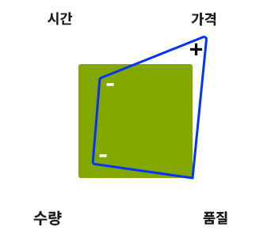

# 프로젝트 관리 - 우수 사례 검사 목록{#managing-projects-best-practices-checklist}

Adobe Experience Manager(AEM)을 구현하는 프로젝트를 관리하려면 프로젝트를 구현하기 전후에 수행해야 하는 문제 및(관련) 결정을 인식하기 위한 계획 및 이해가 필요합니다.

도움이 되도록 우수 사례는 다음과 같이 구성됩니다.

* 이러한 우수 사례를 사용하여 진행 상황을 추적하고 모니터링할 수 있는 [대화형 검사 목록](/help/managing/best-practices-checklist.md)

   * 단계, 이정표 및 성향에 따라 입력 및 결과물을 정의합니다.
   * 진행 상황과 프로젝트 상태를 나타내는 자동 개요(품질, 상태 및 완결성)를 제공합니다.

* 설명서는 [검사 목록](/help/managing/best-practices-checklist.md)을 직접 기반으로 다음 내용을 자세히 설명합니다.

   * [프로젝트 ](#projectheartbeat) 하트비트 분석.
   * [Roleoverview별 ](#status-by-role) 상태
   * [단계 및 이정표](#phases-and-milestones).
   * [모든 ](#persona) 단계에서 주요 인사 및 이들의 참여
   * [필수 문서 및 결과물](#required-documents-and-deliverables)의 [용어집](/help/managing/best-practices-glossary.md).

* [특정 ](/help/managing/best-practices-further-reference.md) 영역에 대한 자세한 내용을 제공하기 위한 추가 참조 자료

## 프로젝트 하트비트 대시보드 {#project-heartbeat-dashboard}

**프로젝트 하트비트** 워크시트는 프로젝트에 대한 중요한 지표에 대한 그래픽 개요를 제공합니다.

* **위상 품질**

   * 프로젝트 전체의 [필수 문서 및 결과물](#required-documents-and-deliverables)의 품질을 나타냅니다.

* **단계 상태**

   * 프로젝트에 대한 높은 수준의 상태 표시기위험할 수 있는 영역을 강조 표시하는 데 유용합니다.

* **위상 완결성**

   * 프로젝트 중 어느 시점에서 프로젝트의 각 단계에 대해 이미 완료되었음을 나타냅니다.

## 역할별 상태 {#status-by-role}

**역할별 상태 워크시트는[**&#x200B;상태&#x200B;**,**&#x200B;품질&#x200B;**및**&#x200B;완결성&#x200B;**](#projectheartbeat)에 대한 자세한 분류를**[&#x200B;단계&#x200B;](#phases-and-milestones)**및**[&#x200B;모습&#x200B;](#persona)**표시합니다.**

## 단계 및 이정표 {#phases-and-milestones}

프로젝트 계획은 고유한(높은 수준) 단계로 분류됩니다.

각 단계에는 자체 이정표가 포함되어 있습니다. 각 [persona](#persona)(또는 역할)에 대해 정의된 산출물을 생성하는 데 필요한 문서와 함께 관련 이정표가 나열됩니다.

>[!NOTE]
>
>개별 필수 문서와 결과물 간에 직접 1:1 관계가 없습니다.

### 준비 {#preparation}

프로젝트 준비는 전체 프로젝트의 기초가 됩니다. 다음과 같은 사항에 대한 명확한 목표 및 기대와 함께 주요 요구 사항을 정의해야 합니다.

* **비즈니스 근거**

   * 그 사업을 착수하기 위한 근본적인 이유와 정당성.

* **범위 및 예약**

   * 필요한 사항 및 기간을 정의하는 기본 범위 및 대략적인 일정을 사용할 수 있어야 합니다.이렇게 하면 해당 상황을 명확하게 하는 데 도움이 될 경우 범위 밖에 있는 항목을 정의할 수도 있습니다.

프로젝트를 준비, 계획 및 실행하고 솔루션을 구현하는 방법은 고정 예산, 고정 타임라인, 컨텐츠 수량, 필요한 품질 등 현재 운영 중인 제한 사항의 영향을 받습니다.

늘 그렇듯이, 어떤 요소든 조절하면 다른 요소들에 영향을 줄 것이다. 예를 들어 시간을 줄이지만 동일한 수준의 품질을 요구하는 것은 사용자가 제공할 수 있는 컨텐츠 양을 줄이면서도 가격을 높일 수 있습니다. 예산은 중요한 요소이기 때문에 그러한 관계를 잊을 수 없다.

4가지 요소:

#### 이정표 {#milestones}

* **유효성 검사**

   이 단계에서는 프로젝트 목표를 확인하고 확인해야 합니다.예:

   * 어떤 것을 성취하고 싶습니까?
   * 누가 이득을 볼 것인가?
   * 범위가 무엇입니까?

      * 이 정보가 상황을 명확히 하는 데 도움이 되면 범위 밖에 있는 항목을 정의할 수도 있습니다.
   * 성공을 어떻게 정의할 것인가?
   * 성공을 어떻게 측정할 것인가?
   * 비즈니스 및 기술적 요구 사항은 무엇입니까?
   * 교체할 이전 시스템이 있습니까? 그리고 있다면 마이그레이션할 데이터가 있습니까?
   * 누가 연루될 것인가?
   * 진도를 어떻게 측정할 것인가?
   * 프로젝트 수명 동안 얼마나 자주 진행 상황을 검토할 건가요?

* **예산**

   프로젝트를 시작하기 전에 구현에 소요되는 비용을 안정적이고 현실적인 추정이 필요합니다.

   * 검증 이정표의 정보를 추정의 기준으로 사용합니다.
   * 당신의 견지에서 현실적이어야 합니다.
   * 클라이언트가 적용할 수 있는 모든 클라이언트 지침, 프로세스 또는 제한 사항을 고려 및 준수합니다.
   * 만일의 사태에 대한 고려와 검토 프로세스는 추후에 예산에 대한 검토나 구체화가 필요합니다.
   * 비용은 많은 형태로 옵니다.구매, 리소스 및 요금 사용 등을 비롯한 다양한 세그먼트를 선택할 수 있습니다.

### 계획 {#planning}

프로젝트를 계획하면 준비가 통합됩니다. 이 슬라이드에서는 목표 및 기대치를 명확한 커뮤니케이션과 함께 진행 상황을 측정하기 위한 엄격한 검토와 함께, 구체적인 작업으로 구성되는 잘 정의된 로드맵으로 전환해야 합니다.

#### 이정표 {#milestones-1}

* **핸드오버**

   깨끗한 핸드오버는 적절한 성향/그룹이 프로젝트 내에서 자신들의 책임을 인지하도록 합니다.

   로드맵, 범위, 목표, 요구 사항 및 KPI를 포함한 모든 관련 측면을 완벽하게 이해할 수 있도록 전체 세부 사항을 제공/생성해야 합니다.

* **위험 평가**

   불쾌한 놀라움을 피하려면 위험 평가를 사용하여 영향과 확률과 함께 잠재적 위험을 식별하고 수량화합니다.

   이 작업은 프로젝트 수명 주기 초기에 수행되어야 모든 취약점이 식별 및 평가될 수 있습니다. 결과에 따라 전체 요구 사항을 구현할 수 있는지 여부 및 필요한 경우 적절한 조치를 취하여 추적할 수 있는지 여부에 대해 이해 당사자에게 보고할 수 있습니다.

* **통신**

   커뮤니케이션은 항상 모든 프로젝트의 성공에 핵심입니다. 모든 사람이 다음 작업을 수행할 수 있도록 명확하고 효율적으로 커뮤니케이션해야 합니다.

   * 동일한 기본 목표를 위한 작업
   * 동일한 정보 베이스에서
   * 동일한 채널 사용

* **시작**

   킥오프 회의는 프로젝트가 시작되고 있다는 인식을 높이기 위해 사용됩니다. 좋은 기회입니다.

   * 모든 이해관계자(또는 적어도 단체 대표)를 초대합니다.
   * 그 프로젝트에 관한 주요 사실을 제시하라.
   * 질문에 답합니다.
   * 모든 사람이 동일한 기술 자료를 가지고 있는지 확인합니다.
   * 이 작업에 참여할 모든 사용자로부터 헌신을 받으십시오.

      * 프로젝트 시작 부분에 프라임 플레이어(예상 작성자 포함)를 참여시키면 프로젝트에 대한 헌신이 늘어날 가능성이 높아집니다.

### 개발 준비 {#development-preparation}

개발을 계획하는 것은 필요한 지식을 가진 팀이 프로젝트를 견고한 디자인을 기반으로 구축되도록 하는 데 중요합니다.

#### 이정표 {#milestones-2}

* **개발 팀 인력 및 교육**

   프로젝트를 시작하기 전에 개발 팀이 적절하게 배치되어 모든 팀 구성원이 해당 작업에 대한 교육을 받아야 합니다.

* **컨텐츠 아키텍처**

   컨텐츠 아키텍처는 컨텐츠의 향후 아키텍처를 정의하고 설명합니다.다음을 포함합니다.

   * 컨텐츠 트리자산 포함
   * 기본 구조물;캠페인 등 포함
   * 다중 사이트 및 다국어 구조(MSM, 번역 등)
   * 지원 컨텐츠(태그 및 태깅 개념 포함)
   * 캐싱 및 콘텐츠 재사용 전략

* **시스템 아키텍처**

   시스템 아키텍처는 시스템의 개념적 뷰를 정의합니다.포함(다른 정보 포함):

   * [모든 ](/help/sites-deploying/recommended-deploys.md#deployment-scenarios) 필수 환경을 위한 시스템 구조
   * 하위 시스템
   * 타사 시스템
   * 인터페이스하드웨어, 소프트웨어 및 인간 상호 작용
   * 각 환경에 대한 서버[기술 요구 사항](/help/sites-deploying/technical-requirements.md) 및 [하드웨어 크기 조정 지침](/help/managing/hardware-sizing-guidelines.md) 을 참조하십시오.

   * 각 환경에 대한 프로세스예를 들어 배포 및 유지 관리 요구 사항
   * 유지 관리 활동(데이터 저장소 GC, TarPM 최적화 등)
   *  Dispatcher 캐싱
   *  ClusteringPublish/Authorshare
   * 클라이언트측 성능(JS는 축소, 오목, css 스프라이트, 총 http 요청 수 등)입니다

* **애플리케이션 아키텍처**

   응용 프로그램 아키텍처는 제안된 응용 프로그램의 동작을 정의하고 설명합니다.

   핵심 사항:

   * 서로 및 사용자와 상호 작용하는 방법입니다.
   * 내부 구조가 아니라 애플리케이션에서 사용하고 생성할 데이터입니다.

   이 정의는 다음과 같습니다.

   * 프로젝트의 기본 코드 구조
   * 코드 아티팩트(번들, 패키지 등)
   * 템플릿/구성 요소 및 그 관계의 분류
   * 필수 사용자 지정에 대한 높은 수준의 세부 정보(특정 오버레이는 나중에 수행)
   * 솔루션에 필요한 워크플로우 디자인(예: 컨텐츠 작성, 승인, 게시, 변형, 가져오기, 내보내기 등)
   * MSM, Commerce, 타사 통합과 같은 복잡한 모듈에 대한 특별 고려 사항입니다

* **시스템 통합**

   시스템 통합을 사용하려면 다음을 계획(그런 다음 구현)해야 합니다.

   * 모든 하위 시스템 및 [솔루션 통합](/help/sites-administering/integration.md)을 하나로 결합하여 하나의 일관된 시스템으로 운영하는 방법
   * 타사 시스템을 통합하는 방법타사 시스템이 다운되었을 때 오프라인/온라인, 클라이언트측/브라우저 측 또는 폴오버 처리와 같은 특별한 고려 사항과 함께 사용할 수 있습니다

* **테스트 개념**

   개발을 시작하기 전에 프로젝트에 대한 모든 [testing](/help/sites-developing/planning.md) 요구 사항에 대한 심층적이고 포괄적인 개념을 구성해야 합니다.

   여기에는 다음 항목이 포함되어야 합니다.

   * 수행할 모든 테스트에 대한 세부 정보
   * 해당 테스트에 필요한 컨텐츠 준비
   * 사용할 테스트 도구의 정보입니다
   * 테스트에 누가 참여할 것인지 높은 수준의 표시특히 QA 팀 외부 그룹
   * 테스트 자동화 세부 사항예를 들어 Selenium 또는 AEM 개발자 모드 사용

* **Experience Design**

   XD(Experience Design)에는 솔루션에 대한 사용자 경험을 디자인하는 작업이 포함됩니다.

   사용자 경험은 작성자와 웹 사이트의 최종 사용자 모두를 위해 분석 및 개발되어야 합니다.

* **지원 설정**

   개발 전에 배포, 릴리스, 테스트 및 보고서 문제에 필요한 모든 지원 프로세스를 설정해야 합니다.

   또한 [Adobe 지원 포털](https://helpx.adobe.com/kr/marketing-cloud/contact-support.html)을 참조하십시오.

### 작업 계획 및 작업 {#operations-planning-and-operations}

이와 유사하게 프로젝트 수명 주기의 모든 단계에 대해 필요한 환경을 갖도록 작업을 적절하게 계획해야 합니다. 유지 관리를 위한 적절한 프로세스가 필요합니다.

#### 이정표 {#milestones-3}

* **권한**

   솔루션을 사용할 모든 사용자/그룹에 대해 역할 및 권한 개념을 계획하고 구현해야 합니다.

   예:

   * 각 역할에 대한 `read`/ `write` 액세스 정의가 있는 역할 목록(즉, 그룹)

   * 게시 환경에 영향을 주는 권한 사용 정의예: `replicate`
   * 최소한의 권한을 가진 사용자의 경우 워크플로우를 정의해야 합니다
   * `editor` 그룹의 사용자는 `admin` 권한이 없거나 `administrators` 그룹의 구성원이 아니어야 합니다

   자세한 내용은 [사용자 관리 및 보안](/help/sites-administering/security.md)을 참조하십시오.

* **모니터링 및 유지 관리**

   모니터링 및 유지 관리는 솔루션 가동 시 원활하게 작동하도록 하는 주요 측면입니다. 이를 위해 다음을 정의해야 합니다.

   * 모니터링해야 하는 사항
   * 유지 관리 작업일반적인 경우와 특별한 경우를 모두 포함하십시오

   자세한 내용은 [모니터링 및 유지 관리](/help/sites-deploying/monitoring-and-maintaining.md)도 참조하십시오.

* **마이그레이션**

   이전 시스템의 모든 컨텐츠는 마이그레이션을 위해 검토 및 검증되어야 합니다.

* **복구 계획**

   복구 계획이 적소에 있는지 확인합니다. 긴급 상황에서는 AEM의 생산 사용을 확보하기 위해 이 기능을 사용할 수 있어야 합니다. 백업, 복원, 폴오버 등과 같은 상황을 다룹니다.

### 개발 {#development}

개발은 코딩 이상의 것을 필요로 하는 중요한 단계이다.

#### 이정표 {#milestones-4}

* **개발 환경**

   다음을 포함한 개발 환경을 계획 및 문서화합니다.

   * 아키텍처
   * [개발 도구](/help/sites-developing/dev-tools.md)

      * 일반적인 환경은 다음과 같이 구성됩니다.

         * 문제 추적 시스템지라와 같은
         * IDE;예: Eclipse
         * 빌드 관리 도구Maven과 같은
         * 지속적인 통합을 위한 도구젠킨스 같은
         * 버전 제어 도구GIT/SVN과 같은
         * 빌드 객체 저장소 관리자아르키바/넥서스 등
   * 타사 소프트웨어 통합/종속성
   * [솔루션 통합/종속성](/help/sites-administering/integration.md)
   * 배포 대상

* **테스트 시스템**

   다음을 포함한 테스트 환경을 계획 및 문서화합니다.

   * 아키텍처
   * 개발 빌드에 대한 종속성야간 빌드 포함
   * 타사 소프트웨어 통합/종속성 테스트의 가능성 또는 제한 사항
   * 테스트 도구
   * 자동화된 테스트 전략

* **프로덕션 시스템**

   다음을 포함한 프로덕션 환경을 계획 및 문서화합니다.

   * 아키텍처
   * 배포 대상
   * 타사 소프트웨어 통합/종속성
   * 보안 설정
   * 프로덕션 설정에서 [Tough Day 테스트](/help/sites-developing/tough-day.md)를 실행하여 확인한 기본 성능
   * 성능 테스트 요구 사항[품질 보증 우수 사례](/help/sites-deploying/configuring-performance.md#best-practices-for-quality-assurance) 참조

* **통합**

   다음을 포함하여 시스템의 모든 측면과 [솔루션 통합](/help/sites-administering/integration.md)을 계획, 문서 및 테스트합니다.

   * 자동화된 테스트 전략
   * 자동화된 프로세스를 [개발에서 테스트로 응용 프로그램을 이동한 다음 프로덕션](/help/managing/enterprise-devops.md#code-movement)
   * 자동화된 프로세스를 [프로덕션에서 테스트 및 개발으로 컨텐츠 이동](/help/managing/enterprise-devops.md#content-movement)

* **마이그레이션**

   컨텐츠 마이그레이션의 모든 측면을 계획, 문서 및 테스트다음을 포함합니다.

   * 컨텐츠 아키텍처
   * 마이그레이션 전략

* **통신**

   모든 팀 구성원 및 프로젝트 페르소나가 필요에 따라 최신 상태로 유지되는지 확인하십시오.

* **설명서**

   솔루션을 완전히 문서화합니다.다음을 포함합니다.

   * 작업 설명서
   * 업그레이드에 영향을 줄 수 있는 모든 사용자 지정
   * 릴리스 노트

### 성능 및 테스트 {#performance-and-testing}

새 응용 프로그램을 사용할 수 있게 되면 기능과 [performance](/help/sites-deploying/configuring-performance.md)에 대해 엄격한 테스트를 수행해야 합니다.

>[!NOTE]
>
>모든 테스트 팀은 중립을 유지하고 테스트 결과를 전달하도록 허용해야 합니다.
>
>결과에 미치는 영향을 평가하고 적절한 조치를 결정하는 것은 프로젝트 관리자의 책임입니다.

#### 이정표 {#milestones-5}

* **최종 사용자 수락 테스트**

   [UAT(사용자 수락 테스트](/help/sites-developing/acceptance-signoff.md) )는 다음 사항을 확인해야 합니다.

   * 이 솔루션은 사용자/고객 요구 사항을 충족합니다
   * 고객/사용자는 솔루션(기능, 디자인 및 성능)을 수락합니다

   고객 핸드오버를 위한 공식 확인 목록이 있어야 합니다.스냅샷에 대해 야간 단위로 자동화 및 실행 결과는 프로젝트 관리자 및 개발 팀에 전송해야 합니다

* **성능 및 로드 테스트**

   성능 및 로드 테스트는 솔루션이 평균 및 최대 로드 시 필요한 성능 수준을 충족하는지 확인하는 데 사용됩니다.

   성능 테스트에 대한 자세한 내용은 다음을 참조하십시오.

   * [성능 테스트](/help/sites-deploying/configuring-performance.md)
   * [테스트 계획 및 실행 방법](/help/sites-developing/planning.md)

   * [기본 성능 지침](/help/sites-deploying/configuring-performance.md#basic-performance-guidelines)
   >[!NOTE]
   >
   >이 과정은 AEM의 일반적인 사용 중에 계속되어야 하지만, 이러한 초기 단계는 가장 중요합니다.

### 롤아웃 {#rollout}

새 응용 프로그램을 롤아웃하려면 Go Live가 원활하게 수행되도록 신중한 계획이 필요합니다. 여기에는 높은 수준의 보안 확인, 모든 예상 사용자 교육 및 모든 문제가 해결되었음을 확인하기 위한 여러 연습 실행 등이 포함됩니다.

#### 이정표 {#milestones-6}

* **준비**

   준비 및 계획은 원활한 롤아웃을 보장하는 데 도움이 됩니다.

* **교육**

   모든 관련 직원이 교육을 받았는지 확인합니다.

   과정 카탈로그에서 [Adobe Experience Manager](https://training.adobe.com/training/courses.html#solution=adobeExperienceManager)을 참조하십시오.

* **숙련된 관리자**

   솔루션 관리자가 다음을 보유하고 있는지 확인합니다.

   * 교육 받음
   * 적절한 교육 자료를 받았습니다.
   * 적절한 설명서를 받았습니다

* **숙련된 사용자**

   작성자가 다음을 보유하는지 확인합니다.

   * 교육 받음
   * 적절한 교육 자료를 받았습니다.
   * 적절한 설명서를 받았습니다.예를 들어 사용 안내서

* **Penetration Tests**

   침투 테스트는 컴퓨터 시스템에 대한 공격을 시뮬레이션하여 잠재적인 보안 취약점을 파악합니다.

* **Penetration/Security 테스트**

   솔루션의 보안을 보장하기 위해 더 광범위한 보안 테스트와 함께 특정 침투 테스트를 수행합니다.

   자세한 내용은 [보안 검사 목록](/help/sites-administering/security-checklist.md)을 참조하십시오.

### Go Live {#go-live}

Go Live가 가능한 한 부드러워지기를 원하는 것입니다. 마지막 단계도 정리 실행을 위한 계획이 필요합니다.

#### 이정표 {#milestones-7}

* **준비**

   준비 및 계획은 원활한 Go Live를 보장하는 데 도움이 됩니다.

* **보안**

   내부 및 외부 사용자 및 해당 컨텐츠에 대한 솔루션의 보안을 확인합니다.

* **대체**

   라이브로 전환하기 전에 폴백에 필요한 모든 시스템, 절차 및 메커니즘이 있는지 확인하십시오.

* **지원**

   지원 서비스가 적소에 준비되어 있는지 확인하십시오.

* **전환**

   프로덕션 환경 및 사용자로의 전환을 계획 및 실행합니다.

* **롤아웃**

   연기 테스트를 준비하고 실행합니다.

## 모습 {#persona}

확인 목록은 사용자에 의해 디자인됩니다. 프로젝트 라이프 사이클에 중요한 역할을 합니다.

또한 특정 작업에 관련된 [다른 가상](#other-persona)도 있습니다.

### 프로젝트 스폰서 {#project-sponsor}

프로젝트 후원자는 다음과 같습니다.

* 프로젝트에 대한 비즈니스 사례를 제공/제시할 책임이 있습니다.
* 프로젝트 범위를 구체화하고 정의하는 주요 사항다음을 포함합니다.

   * 성공에 대한 정의 및 기준
   * 기본 KPI

* 클라이언트 로드맵을 기반으로 주요 이정표를 제공합니다.

### 프로젝트 관리자 {#project-manager}

프로젝트 관리자는 다음과 같습니다.

* 프로젝트 후원자가 제공하는 요구 사항(예: 범위, KPI, 성공 기준 및 정의)을 기반으로 프로젝트의 전체 게재를 담당합니다.
* 예산을 정의하고 해당 예산을 기반으로 프로젝트를 자원을 관리합니다.
* 프로젝트에 관련된 모든 사용자에 대한 주요 통신 지점입니다.

### 아키텍트 {#architect}

솔루션 설계자:

* 솔루션 및 시스템의 높은 수준의 디자인을 담당합니다.
* AEM에 대한 구현 전략을 정의하는 데 도움이 됩니다. 예를 들어, 클러스터된 설치를 구현할지, 콜드 대기 환경을 구현할지 또는 컨텐츠 전달 네트워크(CDN)가 필요한 경우를 들 수 있습니다.
* 또한 클라이언트 요구 사항을 기반으로 AEM 솔루션 아키텍처를 정의합니다. 여기에는 사용자 역할(관련 권한 있음), 템플릿 및 구성 요소 간의 관계 또는 다중 사이트 관리를 사용할 시점에 대한 개념이 포함될 수 있습니다.

### 비즈니스 분석가 {#business-analyst}

비즈니스 분석가:

* 는 주로 높은 수준의 요구 사항을 수집하고 분석한 다음 이러한 요구 사항을 사양으로 변환해야 합니다.

   * 개발 계획을 수립할 때 사용할 프로젝트 관리자의 경우
   * 개발팀이 설계 및 개발 과정에서 작업할 수 있도록 합니다.

* 클라이언트와 긴밀히 협력하여 요구 사항을 분석합니다. 이 변수들은 다음과 일치합니다.

   * 성공의 정의.
   * 성공의 기준.
   * KPI(비즈니스 및 성능 기반)

### 개발 리드 {#development-lead}

개발 리드:

* 프로젝트의 기술 전달을 담당합니다.
* 클라이언트 요구 사항을 준수하는 개발 방법을 선택해야 합니다.
* 개발 전략을 구성합니다.

   * 비즈니스 및 성능 KPI와 일치하는지 확인
   * 성공 기준 및 정의를 고려함

* 설계자와 긴밀히 협력하여(특히 AEM용 개발 전략을 작성할 때) 템플릿과 구성 요소 간의 관계, 타사 애플리케이션에 대한 통합 전략 및 모든 특수 기능과 같은 측면을 정의합니다.

### 품질 리드 {#quality-lead}

품질 리드:

* 배송의 품질은 책임집니다.성공 기준 및 클라이언트가 정의한 KPI를 충족하는지 확인합니다.
* 모든 이해 관계자와 일치하는 품질 지표를 정의하고 테스트 계획을 작성하고 이를 실행합니다.
* 보고서를 만들어 프로젝트 이해 당사자에게 전달합니다.

### 시스템 엔지니어 {#system-engineer}

시스템 엔지니어:

* 프로젝트 인프라를 감독해야 합니다.
* 다음 사항에 대한 책임이 있습니다.

   * 내부 개발 및 테스트 환경 설정
   * 클라이언트 시스템에 해당 시스템 일치

* 하드웨어 권장 사항을 제공하고, 다양한 구현을 모니터링하고, 라이브로 전환하기 전과 후에 모두 작업 지원을 제공합니다.

### 보안 리드 {#security-lead}

보안 리드:

* 솔루션의 전체 보안 개념을 담당하며, 클라이언트의 요구 사항과 정책에 부합하는지 확인합니다.
* 모든 하드웨어 기반 보안 개념에 대한 보안 개념, 보안 작업 및 권장 사항을 제공합니다.영역 및 방화벽과 같은

### 기타 가상 사용자 {#other-persona}

* 이해 관계자

   * 프로젝트 성공에 대한 관심(지분)이 있는 사람(종종 비즈니스 출신) 그들은 종종 예산에 기여한다.

* 법적

   * 계약 협상 시 법률적인 조언이 필요하다.

* 트레이너

   * 프로젝트의 규모와 특성에 따라 전문 트레이너가 해당 그룹을 위한 교육 세션을 개발하고 제공하는 데 사용될 수 있다.

* 테크니컬 라이터

   * 프로젝트 규모와 성격에 따라 전문 기술자를 사용해서 특정한 그룹을 위한 지침과 매뉴얼을 작성할 수 있습니다;예: 시스템 관리자를 위한 유지 관리 설명서 또는 작성자를 위한 사용 안내서

* 시스템 관리자

   * 시스템의 지속적인 운영을 책임집니다.

* 작성자 및 최종 사용자

   * 웹 사이트 컨텐츠를 만들고 유지 관리하는 데 시스템을 사용할 사람.

## 필수 문서 및 결과물 {#required-documents-and-deliverables}

확인 목록은 각 이정표에 대한 **필수 문서** 및 **결과물**&#x200B;을 포함합니다.

* 이들 사이에는 1:1 관계가 없습니다.예를 들어, 필요한 문서 그룹이 단일 결과물을 생성할 수 있습니다.
* 동일한 이정표 동안 한 성향에서 산출물을 다른 성향에 필요한 문서가 될 수 있습니다.

### 필수 문서 {#required-documents}

**필수 문서**&#x200B;는 결과물을 생성할 때 적절한 사용자가 필요로 합니다.

각 **필수 문서**&#x200B;에 대해 모습은 다음을 표시해야 합니다.

* **Y/N**:수신했는지 여부
* **1-3**:수신된 문서의 품질 표시.

### 결과물 {#deliverables}

각 이정표에 대해 해당 사용자는 특정 문서를 전달하여 특정 이정표에 대한 책임을 이행해야 합니다.

각 **결과물**&#x200B;에 대해 다음 내용이 표시되어야 합니다.

* **Y/N**:완료되었는지 여부.

결과물은 종종 현재 또는 이후 이정표에 대해 **필수 문서**&#x200B;로 사용됩니다.

## 관련 우수 사례 {#related-best-practices}

배포, 관리, 개발 또는 작성에 대한 우수 사례가 필요하면 다음을 참조하십시오.

* AEM 프로젝트 관리와 관련된 기타 우수 사례 및 지침:
   * [하드웨어 크기 조정 지침](/help/managing/hardware-sizing-guidelines.md)
   * [엔터프라이즈 DevOps](/help/managing/enterprise-devops.md)
   * [SEO 및 URL 관리 우수 사례](/help/managing/seo-and-url-management.md)
   * [AEM 및 웹 접근성 지침](/help/managing/web-accessibility.md)
   * [일반 데이터 보호 규정](/help/managing/data-protection-and-privacy.md)*  [모범 사례 배포 및 유지 관리](/help/sites-deploying/best-practices.md)
* [관리 우수 사례](/help/sites-administering/administer-best-practices.md)
* [개발 우수 사례](/help/sites-developing/best-practices.md)
* [작성 우수 사례](/help/sites-authoring/best-practices.md)

## 주요 설명서 영역 {#key-documentation-areas}

* AEM 설명서
또한 AEM 설명서의 다음 섹션은 특별히 관심이 있습니다(하지만 이 목록은 완전하지 않음).

   * [보안](/help/sites-developing/security.md)
   * [권장 배포](/help/sites-deploying/recommended-deploys.md)
   * [엔터프라이즈 DevOps](/help/managing/enterprise-devops.md)
   * [하드웨어 크기 조정](/help/managing/hardware-sizing-guidelines.md)
   * AEM 개념:

      * [개발 - 기본 사항](/help/sites-developing/the-basics.md)
      * [MSM 개념](/help/sites-administering/msm.md)
      * [HTL(HTML Template Language)](https://docs.adobe.com/content/help/ko-KR/experience-manager-htl/using/overview.html)

* 관련 설명서

   * Adobe Experience Cloud - [Adobe Experience Cloud 계획](https://helpx.adobe.com/marketing-cloud/how-to/planning.html)
