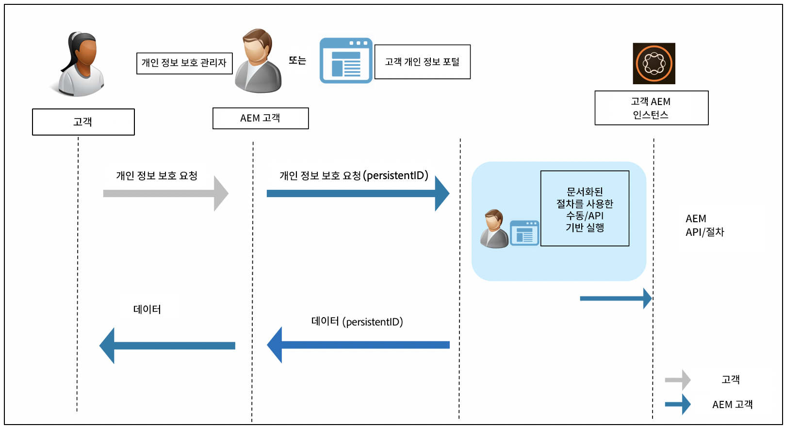

# 데이터 보호 및 데이터 개인정보 보호 규정을 위한 Adobe Experience Manager 준비 {#aem-readiness-for-data-protection-and-data-privacy-regulations}

>[!WARNING]
>
>이 문서의 콘텐츠는 법률적인 조언을 포함하지 않으며, 법률적인 조언을 대체하지 않습니다.
>
>데이터 보호 및 데이터 개인정보 보호 규정에 대한 자세한 내용은 귀사의 법무 부서에 문의하십시오.

>[!NOTE]
>
>개인정보 보호 문제에 대한 Adobe의 대응 및 Adobe 고객에게 의미하는 바에 대한 자세한 내용은 [Adobe 개인정보 보호 센터](https://www.adobe.com/kr/privacy.html)를 참조하십시오.

Adobe은 고객 개인정보 보호 관리자 또는 AEM 관리자가 데이터 보호 및 데이터 개인정보 보호 요청을 처리할 수 있도록 문서 및 절차를 제공하고 있습니다(가능한 경우 API 포함). 이러한 규정을 준수하는 데 도움이 될 수 있습니다. 고객은 문서화된 절차를 통해 수동으로 또는 가능한 경우 외부 포털 또는 서비스에서 API에 호출하여 규제 요청을 실행할 수 있습니다.

>[!CAUTION]
>
>여기에 문서화된 세부 사항은 Adobe Experience Manager으로 제한됩니다.
>
>다른 Adobe 온디맨드 서비스의 데이터 및 관련 개인정보 보호 요청 시 해당 서비스에 대한 조치가 필요합니다.
>
>자세한 내용은 [Adobe의 개인정보 보호 센터](https://www.adobe.com/kr/privacy.html)를 참조하십시오.

## 소개 {#introduction}

Adobe Experience Manager의 인스턴스 및 해당 인스턴스에서 실행되는 애플리케이션은 Adobe 고객이 소유 및 운영합니다.

따라서 GDPR, CCPA 및 기타 데이터 보호 규정에 대한 책임은 고객에게 있습니다.

간략하게 소개하면 데이터 개인정보 보호 및 보호에 대한 규정에는 다음 역할이 따라야 할 새 규칙이 포함되어 있습니다.

* 비즈니스 엔티티(CCPA) 및/또는 데이터 컨트롤러(GDPR)

* 서비스 공급자(CCPA) 및/또는 데이터 프로세서(GDPR)

이들 규정에서의 주요 프로비전은 다음과 같습니다.

1. 직접 또는 간접적으로 식별 가능한 데이터와 같이 모든 고유 ID를 포함하도록 개인 데이터의 정의 확장

2. 동의 요구 사항 강화

3. 삭제 권한(데이터 삭제)에 대한 집중 강화

4. 데이터 판매 옵트아웃

Adobe Experience Manager의 경우

* 인스턴스 및 해당 인스턴스에서 실행되는 애플리케이션은 고객이 소유 및 운영합니다.

   * 고객은 비즈니스 엔티티 및 서비스 공급자, 데이터 컨트롤러 및 데이터 프로세서를 포함한 규정 역할을 관리합니다.

   * 아래 다이어그램에 표시된 바와 같이 Adobe Experience Platform Privacy Service는 AEM용 워크플로의 일부가 아닙니다.

* AEM에는 고객의 개인정보 보호 관리자 및/또는 AEM 관리자가 수동으로 또는 가능한 경우 API를 통해 개인정보 보호 규정 요청을 실행하도록 하는 문서 및 절차가 포함되어 있습니다.

* 새 서비스나 UI는 추가되지 않았습니다.

   * 대신 개인정보 보호 규정 요청을 처리하는 고객 UI/포털에서 사용할 수 있도록 절차 및 API가 문서화되었습니다.

* AEM에는 개인정보 보호 요청 워크플로 지원을 위한 맞춤형 툴링이 포함되지 않습니다.

   * Adobe은 고객의 개인 정보 보호 관리자 및 AEM 관리자를 위한 문서 및 절차를 제공하여 개인 정보 보호 규정과 관련된 요청을 수동으로 실행할 수 있도록 합니다.

Adobe은 Adobe Experience Manager에 대한 액세스, 삭제 및 옵트아웃과 관련된 개인 정보 보호 요청 처리를 위한 절차를 제공하고 있습니다. 경우에 따라 고객 개발 포털 또는 스크립트에서 호출하여 자동화를 지원할 수 있는 API를 사용할 수 있습니다.

다음 다이어그램은 개인정보 보호 요청 워크플로의 형태를 보여 줍니다(Adobe Experience Manager 6.5를 사용하여 설명함).

## Adobe Experience Manager 및 규정 준비 {#aem-and-regulatory-readiness}

AEM의 제품 영역에 대한 규제 설명서는 아래 섹션을 참조하십시오.

## AEM Foundation {#aem-foundation}

[AEM Foundation에 대한 데이터 보호 및 개인 정보 보호 요청 처리](/help/sites-administering/handling-gdpr-requests-for-aem-platform.md)를 참조하십시오.

## AEM이 총 사용량 통계 수집을 옵트인하는 중 {#aem-opting-into-aggregate-usage-statistics-collection}

[집계된 사용 통계 수집](/help/sites-deploying/opt-in-aggregated-usage-statistics.md)을 참조하십시오.

## AEM Sites {#aem-sites}

[AEM Sites - 데이터 보호 및 개인 정보 보호 준비 완료](/help/sites-administering/gdpr-compliance-sites.md)를 참조하세요.

## AEM Commerce {#aem-commerce}

[AEM Commerce - 데이터 보호 및 개인 정보 보호 준비](/help/sites-administering/gdpr-compliance-commerce.md)를 참조하십시오.

## AEM Mobile {#aem-mobile}

[AEM Mobile - 데이터 보호 및 개인 정보 보호 준비](/help/mobile/aem-mobile-gdpr-compliance.md)를 참조하십시오.

## Adobe Target 및 Adobe Analytics과 AEM 통합 {#aem-integration-with-adobe-target-adobe-analytics}

이러한 Adobe Experience Manager 통합은 데이터 보호 및 개인정보 보호(예: GDPR 또는 CCPA) 준비 서비스와 함께 제공됩니다. 통합과 관련하여 Adobe Target 또는 Adobe Analytics의 개인 데이터는 AEM에 저장되지 않습니다.

자세한 내용은 다음을 참조하십시오.

* [Adobe Target - 개인정보 보호 개요](https://developer.adobe.com/target/before-implement/privacy/cmp-privacy-and-general-data-protection-regulation/?lang=en)

* [Adobe Analytics 데이터 개인정보 보호 워크플로](https://experienceleague.adobe.com/docs/analytics/admin/admin-tools/data-governance/an-gdpr-workflow.html)

## AEM Communities {#aem-communities}

AEM Communities은 데이터 주체에 데이터 이동성, 액세스 권한 및 [즉시 사용 가능한 API](/help/communities/user-ugc-management-service.md)에 의해 잊혀질 권리를 부여합니다. 이러한 API를 사용하면 사용자 생성 컨텐츠를 대량으로 삭제 및 내보내고 승인 가능한 ID를 통해 식별된 사용자 계정을 비활성화할 수 있습니다. 그러나 CRXDE Lite에서 사용자 노드를 삭제하면 영구적으로 사용자 계정을 삭제할 수 있으므로 시스템에서 쉽게 옵트아웃할 수 있습니다.

또한 AEM Communities은 권한이 있는 구성원이 사용자의 기여도와 세부 정보를 찾고 삭제할 수 있는 벌크 중재 콘솔로 인해 개인 정보를 디자인적으로 제공합니다. 멤버 관리 콘솔을 통해 기여자를 금지하는 지점으로 제한할 수 있습니다. 또한 데이터 주체가 작성한 기여를 삭제할 수 있도록 허용합니다.

## AEM Forms {#aem-forms}

AEM Forms에는 비즈니스 프로세스를 조정하고 디지털 트랜잭션을 완료할 수 있도록 데이터를 캡처, 처리 및 저장하는 구성 요소와 워크플로가 포함되어 있습니다. 서로 다른 구성 요소는 서로 다른 데이터 저장소를 사용하며 사용자 지정 데이터 저장소와의 통합도 허용합니다. 다음 설명서는 구성 요소에 대한 데이터 보호 및 개인정보 보호(예: GDPR 또는 CCPA) 워크플로우를 지원하기 위해 사용자 데이터에 액세스하고 처리하는 절차와 지침을 설명합니다.

* [Forms 포털](/help/forms/using/forms-portal-handling-user-data.md)
* [서신 관리](/help/forms/using/correspondence-management-handling-user-data.md)
* [Adobe Sign과 통합](/help/forms/using/integration-adobe-sign-handling-user-data.md)
* [OSGi의 Forms 중심 워크플로](/help/forms/using/forms-workflow-osgi-handling-user-data.md)
* [Forms JEE 워크플로](/help/forms/using/forms-workflow-jee-handling-user-data.md)(AEM Forms JEE만 해당)
* [문서 보안](/help/forms/using/document-security-handling-user-data.md)(AEM Forms JEE만 해당)
* [사용자 관리](/help/forms/using/user-management-handling-user-data.md)(AEM Forms JEE만 해당)
