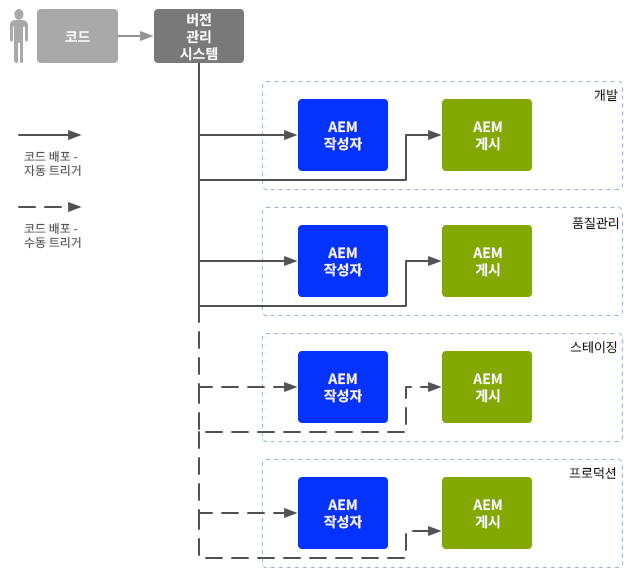
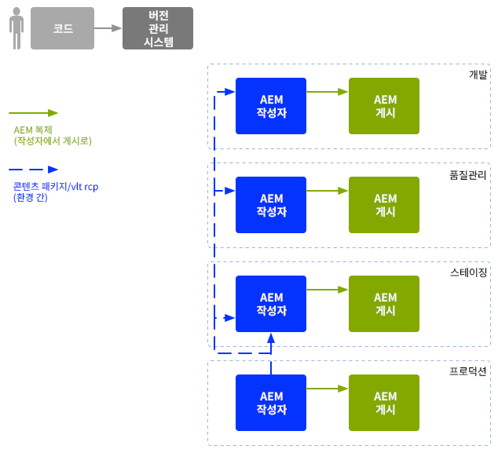

# 기업 개발 운영{#enterprise-devops}

DevOps는 다음 작업에 필요한 프로세스, 방법 및 커뮤니케이션을 다룹니다.

* 다양한 환경에서 소프트웨어를 손쉽게 배포할 수 있습니다.
* 개발, 테스트 및 배포 팀 간의 공동 작업을 간소화할 수 있습니다.

DevOps는 다음과 같은 문제를 방지하는 데 목적이 있습니다.

* 수동 오류.
* 잊혀진 요소;예: 파일, 구성 세부 사항.
* 불일치;예를 들어, 개발자의 로컬 환경과 다른 환경 간에

## 환경 {#environments}

AEM(Adobe Experience Manager) 배포는 일반적으로 여러 환경에서 다른 목적으로 사용되는 여러 환경으로 구성됩니다.

* [개발](#development)
* [품질 보증](#quality-assurance)
* [스테이징](#staging)
* [프로덕션](#production-author-and-publish)

>[!NOTE]
>
>제작 환경에는 작성자 및 게시 환경이 하나 이상 있어야 합니다.
>
>다른 모든 환경도 제작 환경을 반영하고 조기 테스트를 활성화하기 위해 작성자 및 게시 환경으로 구성되는 것이 좋습니다.

### 개발 {#development}

개발자는 필요한 모든 기능을 갖춘 제안된 프로젝트(웹 사이트, 모바일 애플리케이션, DAM 구현 등)를 개발하고 사용자 정의할 책임이 있습니다. 절차는 다음과 같습니다.

* 필요한 요소를 개발하고 사용자 정의합니다.예를 들어 템플릿, 구성 요소, 워크플로우, 애플리케이션
* 디자인 실현
* 필요한 기능을 구현하는 데 필요한 서비스 및 스크립트 개발

개발 [환경의](/help/sites-developing/best-practices.md) 구성은 일반적으로 다음과 같이 구성되지만 다양한 요인에 따라 달라질 수 있습니다.

* 통합된 코드 베이스를 제공하기 위해 버전 제어가 가능한 통합 개발 시스템입니다. 각 개발자가 사용하는 개별 개발 환경에서 코드를 병합하고 통합하는 데 사용됩니다.
* 개발자별 개인 환경보통 지역 기계에 상주합니다. 코드가 버전 제어 시스템과 적절하게 동기화됩니다

시스템의 규모에 따라 개발 환경에 작성자 및 게시 인스턴스가 모두 포함될 수 있습니다.

### 품질 보증 {#quality-assurance}

이 환경은 품질 보증 팀에서 귀하의 새 시스템을 종합적으로 [테스트하는](/help/sites-developing/test-plan.md) 데 사용됩니다.디자인과 기능 모두 여기에는 적절한 컨텐츠가 포함된 작성 및 게시 환경이 있어야 하며 전체 테스트 세트를 활성화하는 데 필요한 모든 서비스를 제공해야 합니다.

### 스테이징 {#staging}

스테이징 환경은 구성, 코드 및 컨텐츠와 같은 프로덕션 환경의 미러링이어야 합니다.

* 실제 배포를 구현하는 데 사용되는 스크립트를 테스트하는 데 사용됩니다.
* 프로덕션 환경에 배포하기 전에 최종 테스트(디자인, 기능 및 인터페이스)에 사용할 수 있습니다.
* 스테이징 환경이 항상 프로덕션 환경과 동일하지는 않지만, 성능 및 로드 테스트를 활성화하려면 최대한 가까이 있어야 합니다.

### 제작 - 작성자 및 게시 {#production-author-and-publish}

프로덕션 환경은 구현을 실제로 [작성하고 게시하는](/help/sites-authoring/author.md#concept-of-authoring-and-publishing) 데 필요한 환경으로 구성됩니다.

제작 환경은 하나 이상의 작성자 인스턴스와 하나의 게시 인스턴스로 구성됩니다.

* 컨텐츠 입력을 위한 [작성](#author) 인스턴스입니다.
* 방문자/사용자가 사용할 수 있는 컨텐츠의 [게시](#publish) 인스턴스입니다.

프로젝트의 규모에 따라 여러 작성자 및/또는 게시 인스턴스로 구성되는 경우가 많습니다. 더 낮은 수준에서 저장소도 여러 인스턴스로 클러스터될 수 있습니다.

#### 작성 {#author}

작성자 인스턴스는 일반적으로 내부 방화벽 뒤에 있습니다. 이는 사용자와 동료가 다음과 같은 작성 작업을 수행하는 환경입니다.

* 전체 시스템 관리
* 컨텐츠 입력
* 컨텐츠의 레이아웃 및 디자인 구성
* 컨텐츠를 게시 환경에 활성화

활성화된 컨텐츠는 패키징되어 작성 환경의 복제 대기열에 배치됩니다. 그런 다음 복제 프로세스가 해당 컨텐츠를 게시 환경으로 전송합니다.

게시 환경에서 생성된 데이터를 다시 작성 환경으로 복제하기 위해 작성 환경의 복제 리스너는 게시 환경을 폴링하고 게시 환경의 역방향 복제 수신 상자에서 해당 컨텐츠를 검색합니다.

#### 게시 {#publish}

게시 환경은 일반적으로 비무장지대(DMZ)에 있습니다. 이것은 방문자가 웹 사이트 또는 모바일 응용 프로그램의 형태로 귀하의 컨텐츠에 액세스하여 상호 작용하는 환경입니다.공개 또는 인트라넷에 게시할 수 있습니다. 게시 환경:

* 작성 환경에서 복제된 컨텐츠 보유
* 방문자가 해당 컨텐츠를 사용할 수 있도록 함
* 댓글 또는 기타 양식 제출과 같이 방문자가 생성한 사용자 데이터를 저장합니다.
* 을(를) 보낼 편지함에 추가하도록 구성할 수 있습니다.

게시 환경은 실시간으로 동적으로 컨텐츠를 생성하며 각 개별 사용자에 맞게 컨텐츠를 개인화할 수 있습니다.

## 코드 이동 {#code-movement}

코드는 항상 아래에서 위로 전파되어야 합니다.

* 코드는 처음에 로컬 및 통합 개발 환경에서 개발되었습니다.
* 이후 QA 환경에 대한 철저한 테스트
* 그런 다음 스테이징 환경에서 다시 테스트했습니다.
* 그런 다음 코드를 프로덕션 환경에 배포해야 합니다.

코드(예: 사용자 정의된 웹 애플리케이션 기능 및 디자인 템플릿)는 일반적으로 다른 컨텐츠 저장소 간에 패키지를 내보내고 가져와서 전송합니다. 의미가 있는 경우 이 복제를 자동 프로세스로 구성할 수 있습니다.

AEM 프로젝트는 종종 코드 배포를 트리거합니다.

* 자동:를 참조하십시오.
* 수동:스테이징 및 프로덕션 환경에 대한 배포는 보다 관리적인 방식으로, 종종 수동으로 수행됩니다.자동화가 가능한 경우

## 컨텐츠 이동 {#content-movement}

제작 과정용으로 만들어지는 컨텐츠는 **항상** 제작 작성자 인스턴스에서 작성되어야 합니다.

작성자가 로컬 시스템이나 하위 환경에서 컨텐츠를 만든 다음 프로덕션 환경으로 이동시키는 것은 좋은 방법이 아니며 오류 및 불일치가 발생할 수 있으므로 컨텐츠는 낮은 환경에서 더 높은 환경으로 이동하는 코드를 따라서는 안 됩니다.

프로덕션 컨텐츠를 스테이징 환경에서 효율적이고 정확한 테스트 환경을 제공하려면 프로덕션 환경에서 스테이징 환경으로 옮겨야 합니다.

>[!NOTE]
>
>따라서 스테이징 컨텐츠를 프로덕션과 지속적으로 동기화해야 하는 것은 아니며, 정기적인 업데이트도 충분하지만, 특히 새로운 코드 반복을 테스트하기 전에 더욱 그렇습니다. QA 및 개발 환경에 있는 컨텐츠를 자주 업데이트할 필요는 없으며 프로덕션 컨텐츠를 잘 표현해야 합니다.

컨텐츠 전송 가능:

* 여러 환경 간 - 패키지를 내보내고 가져올 수 있습니다.
* 서로 다른 인스턴스 간 - 컨텐츠를 직접 복제([AEM 복제](/help/sites-deploying/replication.md))하여(HTTP 또는 HTTPS, 연결 사용)

