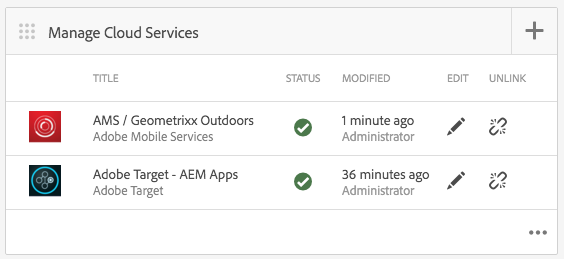

# Adobe Target 구성 Cloud Service {#configuring-adobe-target-cloud-service}

{{ue-over-mobile}}

>[!NOTE]
>
>이 문서는 Adobe Experience Manager 참조에 대한 권장 시작점인 [AEM(AEM Mobile) 모바일 시작하기](/help/mobile/getting-started-aem-mobile.md) 안내서의 일부입니다.

콘텐츠 작성자가 모바일 앱에 대한 타겟팅된 콘텐츠를 생성하기 전에 수행해야 하는 몇 가지 단계가 있습니다. 사용자 및 그룹에 적합한 권한 세트를 가져오고, 클라우드 서비스를 만들고, 활동용 애플리케이션을 구성하고, 마지막으로 콘텐츠를 생성합니다.

앞으로 [AEM Mobile 하이브리드 참조 응용 프로그램](https://github.com/Adobe-Marketing-Cloud-Apps/aem-mobile-hybrid-reference)이 AEM Mobile 대시보드를 통해 배포되고 액세스할 수 있다고 가정합니다.

## 권한 {#permissions}

개인화 콘솔에 액세스해야 하는 사용자는 `target-activity-authors` 그룹의 일부여야 합니다. 사용자 및 그룹 설정의 일부로 target-activity-group을 apps-admins 그룹에 추가하는 것이 좋습니다. target-activity-authors 그룹을 추가하면 사용자가 Personalization 탐색 메뉴 항목을 볼 수 있습니다.

개인화 Admin Console에 액세스할 수 있는 사용자 또는 그룹을 target-activity-authors 그룹에 추가하지 않으면 사용자가 개인화 콘솔을 볼 수 없습니다.

## 클라우드 서비스 {#cloud-services}

모바일 애플리케이션에서 작동하는 타겟팅된 콘텐츠를 가져오려면 Adobe Target 서비스와 Adobe Mobile Services 서비스의 두 가지 서비스를 구성해야 합니다. Adobe Target 서비스는 클라이언트 요청을 처리하고 개인화된 콘텐츠를 반환하기 위한 엔진을 제공합니다. Adobe Mobile Services 서비스는 AMS Cordova 플러그인이 사용하는 ADBMobileConfig.json 파일을 통해 Adobe 서비스와 모바일 애플리케이션 간의 연결을 제공합니다. AEM Mobile 대시보드에서 두 서비스를 추가하여 애플리케이션을 구성할 수 있습니다.

## Adobe Target Cloud Service {#adobe-target-cloud-service}

AEM Mobile 대시보드에서 관리 Cloud Service을 찾아 + 단추를 클릭합니다.

Cloud Service 추가 마법사에서 &quot;Adobe Target&quot; 클라우드 서비스 카드를 선택하고 다음을 클릭합니다.

구성 선택 드롭다운에서 구성을 만들거나 기존 구성에서 선택할 수 있습니다. 구성을 만들려면 드롭다운에서 &quot;구성 만들기&quot;를 선택합니다. Target 구성의 제목을 입력합니다. Target 계정과 연결된 클라이언트 코드, 이메일 및 암호를 입력합니다. 이러한 필드의 값을 모를 경우 Adobe Target 지원 센터에 문의하십시오. 자격 증명의 유효성을 검사하려면 &quot;확인&quot; 단추를 클릭하십시오. 확인되면 제출 단추를 클릭하여 클라우드 서비스를 만듭니다.

만들어지는 클라우드 서비스는 마법사를 통해 모바일 애플리케이션과 자동으로 연결됩니다. cq:cloudserviceconfigs 속성 값은 앱 그룹 노드의 jcr:content 노드에서 설정됩니다. 하이브리드 앱 샘플의 경우 자동으로 생성된 프레임워크 노드를 가리키는 값이 /etc/cloudservices/testandtarget/adobe-target—aem-apps/framework인 /content/mobileapps/hybrid-reference-app/jcr:content에 설정됩니다. 프레임워크 노드에는 기본적으로 성별 및 연령의 두 가지 속성이 설정되어 있습니다. 프레임워크는 AEM 미리보기에서만 사용되며 장치에는 영향을 주지 않습니다.

마법사를 완료한 후 Cloud Service 관리 타일에는 Target 클라우드 서비스가 포함되지만 누락된 Adobe 모바일 서비스 계정에 대한 경고가 포함되어 있습니다.

## Adobe 모바일 서비스 {#adobe-mobile-service}

AMS(Adobe 모바일 서비스) 계정을 응용 프로그램에 연결해야 합니다. 또한 AMS 서비스는 Target 클라이언트 코드 정보가 포함된 필수 ADBMobileConfig.json 파일을 제공합니다. AMS 계정과의 연결을 만들기 전에 AMS에 대한 권한이 있는 사용자가 AMS 계정을 수정해야 합니다.

### 클라이언트 코드 {#client-code}

AMS 서비스에 로그인하려면 [https://mobilemarketing.adobe.com](https://mobilemarketing.adobe.com/)을(를) 방문하여 모바일 애플리케이션을 선택하고 설정을 클릭하십시오. SDK Target Options 필드를 찾아 필드에 클라이언트 코드를 넣고 Save 를 클릭합니다.

클라이언트 코드가 모바일 애플리케이션과 연결되었으므로 AMS 클라우드 서비스가 Adobe 모바일 대시보드를 통해 구성되면 서비스 설정에 대한 설정이 ADBMobileConfig.json 파일을 통해 전달됩니다.

### Adobe 모바일 서비스 Could Service {#adobe-mobile-service-could-service}

이제 AMS가 구성되었으므로 Adobe 모바일 대시보드에서 모바일 애플리케이션을 연결할 차례입니다. AEM Mobile 대시보드에서 관리 Cloud Service을 찾아 + 단추를 클릭합니다.

Mobile Services Adobe 카드를 선택하고 다음 을 클릭합니다.

만들기 또는 선택 마법사 단계에서 Mobile Service 드롭다운을 선택하고 구성 만들기 항목을 선택합니다. 제목, 회사, 사용자 이름, 암호를 입력하고 적절한 데이터 센터를 선택합니다. 이러한 값을 모를 경우 Adobe Mobile Service 관리자에게 문의하여 값을 받으십시오. 모든 필드를 작성한 후 **확인**&#x200B;을 클릭합니다. 확인 프로세스는 AMS로 이동하여 계정에 대한 자격 증명을 확인하고, 유효성 검사에 성공하면 드롭다운에서 연결된 모바일 애플리케이션을 선택할 수 있는 모바일 애플리케이션 목록이 채워집니다. 제출 단추를 클릭하여 마법사를 완료합니다. 프로세스는 구성 데이터 및 애플리케이션과의 임의의 연관된 분석을 획득하는 데 약간의 시간이 걸릴 수 있다. 프로세스가 완료되면 모달에서 **완료**&#x200B;를 클릭하여 Adobe 모바일 대시보드로 돌아갑니다.

모바일 대시보드로 돌아가면 Cloud Service 관리 타일에 AMS 클라우드 서비스가 포함됩니다. 또한 지표 분석 타일은 라이프사이클 보고서로 채워집니다.

## Target 콘텐츠 동기화 핸들러 {#target-content-sync-handlers}

컨텐츠를 사용자의 장치에 전달하기 위해 컨텐츠는 AEM 컨텐츠 작성자가 만든 오퍼를 렌더링하여 생성됩니다. 대상 오퍼의 렌더링을 처리하기 위해 오퍼를 처리하는 새로운 콘텐츠 동기화 핸들러가 있습니다. 하이브리드 참조 응용 프로그램을 샘플로 사용하는 en(영어) 콘텐츠 패키지에는 [mobileappoffers](https://github.com/Adobe-Marketing-Cloud-Apps/aem-mobile-hybrid-reference/blob/master/aem-package/content-author/src/main/content/jcr_root/content/mobileapps/hybrid-reference-app/en/_jcr_content/pge-app/app-config-dev/targetOffers/.content.xml) 처리기와 함께 ContentSyncConfig가 포함됩니다. 다음 단계는 장치에 오퍼를 렌더링하는 데 중요합니다. mobileappoffers 핸들러에는 애플리케이션에 사용되는 개인화 활동의 경로를 식별하는 경로 속성이 있습니다.

예를 들어 */content/campaigns/hybridref*&#x200B;에 활동이 있는 경우 이 경로를 복사하여 mobileappoffers 처리기의 *path* 속성에 값으로 붙여 넣으십시오.

하이브리드 참조 애플리케이션의 경우 두 개의 mobileappoffers 핸들러가 있으며 하나는 개발용이고 하나는 제작용입니다.

mobileappoffers 처리기의 path 속성에 활동 경로가 설정되면 처리기를 저장합니다. 이제 핸들러가 모바일 장치에 대한 오퍼 렌더링을 시작할 준비가 되었습니다.

### 렌더링 모드 {#render-mode}

mobileappoffers 처리기는 게시 및 개발 설정에 대해 다르게 구성됩니다. 게시 설정의 경우 cq:ContentSyncConfig 노드에 *publish* 값이 설정된 *renderMode* 속성이 있습니다. mobileappoffers 처리기가 renderMode를 참조하고 게시로 설정된 경우 만들어지는 mbox id를 편집합니다. 기본적으로 AEM에서 만드는 mbox에는 mbox id에 —author 값이 추가됩니다. 이는 활동이 게시되지 않았으며 오퍼 확인에 게시되지 않은 캠페인을 사용해야 함을 나타냅니다.

Adobe Mobile Dashboard를 통해 콘텐츠를 스테이징하면 스테이징된 콘텐츠는 프로덕션 준비 콘텐츠로 간주되고 비개발 콘텐츠 동기화 구성을 통해 렌더링됩니다. 이러한 방식으로 렌더링하면 —작성자가 모든 mbox ID에서 제거되고 게시된 활동을 Target 서버에서 사용할 수 있습니다. 스테이징된 콘텐츠를 테스트하기 전에 활동이 게시되었는지 확인하십시오.

## 콘텐츠 만들기 {#creating-content}

클라우드 서비스가 만들어지고 mobileappoffers 핸들러가 구성되었으므로 이제 콘텐츠 작성자가 타깃팅된 경험을 생성할 수 있습니다.
