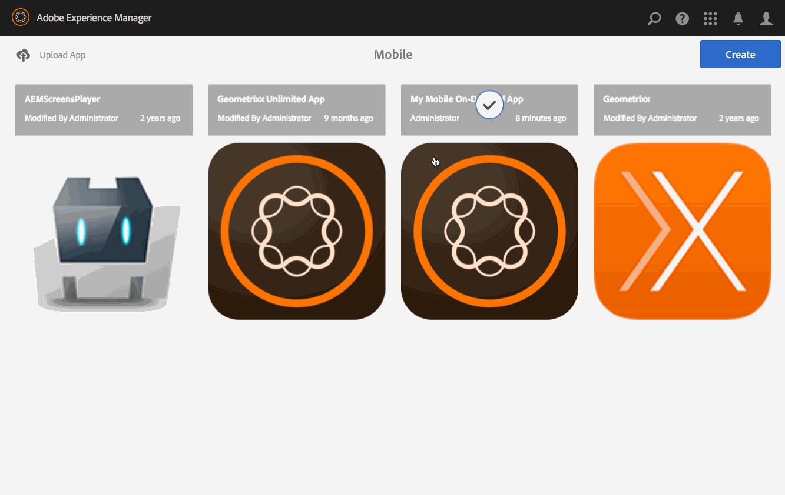

# 프리플라이트 {#previewing-with-preflight}을 사용하여 미리 보기

이 페이지에서는 Preflight 앱을 사용한 미리 보기에 대해 설명합니다.

>[!NOTE]
>
>단일 페이지 애플리케이션 프레임워크 기반 클라이언트측 렌더링(예: 응답)이 필요한 프로젝트에는 SPA 편집기를 사용하는 것이 좋습니다. [추가 정보](/help/sites-developing/spa-overview.md).

응용 프로그램에 대해 다음 작업이 전체적으로 수행됩니다.

Mobile On Demand Preflight 앱을 사용하면 액세스 권한이 있는 모든 프로젝트를 볼 수 있습니다. 프로젝트를 선택하고 나면 검색 페이지 및 아티클을 포함하여 앱 콘텐츠를 미리 보면서 앱이 다양한 장치에서 어떻게 표시되고 작동하는지 알 수 있습니다.

>[!NOTE]
>
>Preflight 앱은 기본적으로 PhoneGap Enterprise 뷰어와 유사합니다.

## 프리플라이트 {#previewing-with-preflight-1}을 사용하여 미리 보기

1. 모바일의 카탈로그에서 Mobile On-Demand 앱을 선택합니다.
1. **아티클 관리**(또는 배너/컬렉션) 타일에서 줄임표(...)를 클릭합니다.
1. 작업 표시줄에서 **Preflight**&#x200B;를 선택합니다.
1. 대화 상자에서 **프리플라이트 활성화**&#x200B;를 클릭합니다.
1. 이제 Mobile On-Demand Preflight 앱에서 앱을 미리 볼 수 있습니다.

>[!NOTE]
>
>AEM Preflight 앱은 콘텐츠 및 검색 페이지 미리 보기에 사용됩니다. Preflight 앱에 대한 자세한 내용을 살펴보려면 [여기](https://helpx.adobe.com/digital-publishing-solution/help/preflight-app.html)를 클릭하십시오.
>
>AEM Preflight 앱은 [iTunes App Store](https://itunes.apple.com/us/app/adobe-experience-manager-mobile/id1042687518?mt=8), [Google Play Store](https://play.google.com/store/apps/details?id=com.adobe.dps.preflight&amp;hl=en) 및 [Windows Store](https://www.microsoft.com/en-us/store/p/adobe-experience-manager-mobile-preflight/9nblggh5wmxq)에서 다운로드할 수 있습니다.

### {#getting-ahead} 앞에 가져오기

컨텐츠 작성에 대한 자세한 내용은 AEM Mobile 응용 프로그램에서 컨텐츠를 만들고 관리하는 다음 리소스를 참조하십시오.

* [AEM Mobile 애플리케이션 대시보드](/help/mobile/mobile-apps-ondemand-application-dashboard.md)
* [컨텐츠 관리](/help/mobile/mobile-apps-ondemand-manage-content-ondemand.md)

## 추가 리소스 {#additional-resources}

AEM Mobile On-demand Services 앱 만들기에 대한 다른 2가지 역할과 책임에 대한 자세한 내용은 다음 리소스를 참조하십시오.

* [AEM Mobile On-demand Services용 AEM 컨텐츠 개발](/help/mobile/aem-mobile-on-demand.md)
* [AEM Mobile On-demand Services 앱용 AEM 콘텐츠 제작](/help/mobile/mobile-apps-ondemand.md)
