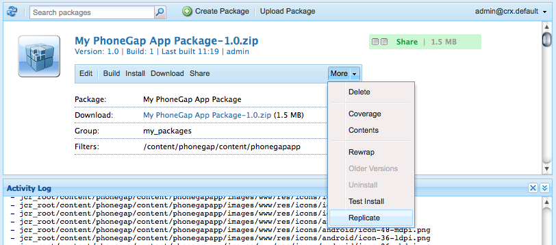

# 모바일 애플리케이션 구축{#building-mobile-applications}

>[!NOTE]
>
>Adobe 단일 페이지 애플리케이션 프레임워크 기반 클라이언트측 렌더링(예: React)이 필요한 프로젝트에는 SPA Editor를 사용하는 것이 좋습니다. [자세히 알아보기](/help/sites-developing/spa-overview.md).

테스트하거나 앱스토어에 게시하기 위해 장치 또는 시뮬레이터에 설치할 애플리케이션을 빌드합니다. PhoneGap 명령줄 인터페이스를 사용하여 로컬로 애플리케이션을 빌드하거나 PhoneGap Build을 사용하여 클라우드에서 애플리케이션을 빌드할 수 있습니다.

GitHub에서 사용할 수 있는 코드를 사용하여 모바일 애플리케이션을 구축하는 방법에 대한 전체 단계별 문서를 사용할 수 있습니다 [여기](https://helpx.adobe.com/experience-manager/using/aem62_mobile.html).

## 게시 인스턴스로 응용 프로그램 이동 {#moving-the-application-to-the-publish-instance}

모바일 애플리케이션의 설치된 인스턴스에 콘텐츠 업데이트를 제공하고 게시된 콘텐츠를 사용하여 애플리케이션을 빌드할 수 있도록 애플리케이션 파일을 게시 인스턴스로 이동합니다. 애플리케이션은 저장소의 두 노드 분기로 구성됩니다.

* `/content/phonegap/apps/<application name>`: 작성자가 만들고 활성화하는 웹 페이지입니다.
* `/content/phonegap/content/<application name>`: 애플리케이션 구성 파일 및 컨텐츠 동기화 구성

>[!NOTE]
>
>애플리케이션 파일을 게시 인스턴스로 이동하지 않으면 콘텐츠 작성자가 콘텐츠 동기화 캐시를 업데이트할 수 없습니다.

에서 파일을 이동하기만 하면 됩니다. `/content/phonegap/content/<application name>` 게시 인스턴스로 분기합니다. 의 파일 `/content/phonegap/apps/<application name>` 작성자가 페이지를 활성화하면 분기가 이동됩니다.

AEM에서는 벌크 컨텐츠를 게시 인스턴스로 이동하는 두 가지 방법을 제공합니다.

* [트리 활성화 명령 사용](/help/sites-authoring/publishing-pages.md) 복제 콘솔에서 게시할 수 있습니다.
* [패키지 만들기](/help/sites-administering/package-manager.md) 에 콘텐츠가 포함되어 있고 패키지를 복제합니다.

예를 들어 phonegapapp이라는 모바일 애플리케이션이 만들어집니다. /content/phonegap/content/phonegapapp 노드를 게시 인스턴스로 이동해야 합니다.

**팁:** 작성자 인스턴스에서 게시 인스턴스로 패키지를 이동하려면 패키지의 Replicate 명령을 사용합니다.



## PhoneGap 명령줄 인터페이스를 사용한 빌드 {#building-using-the-phonegap-command-line-interface}

PhoneGap 명령줄 인터페이스(CLI)를 사용하여 컴퓨터에서 PhoneGap 응용 프로그램을 컴파일합니다. AEM 콘텐츠를 애플리케이션에 포함하기 위해 AEM은 모바일 애플리케이션의 콘텐츠, 콘텐츠 동기화 구성 및 기타 필수 에셋이 포함된 ZIP 파일을 생성합니다. ZIP 파일을 다운로드하여 빌드에 포함합니다.

### 빌드 환경 준비 {#preparing-your-build-environment}

PhoneGap CLI를 사용하여 빌드하려면 Node.js 및 PhoneGap 클라이언트 유틸리티를 설치해야 합니다. 다음 절차를 수행하려면 인터넷 연결이 필요합니다.

1. 다운로드 및 설치 [Node.js](https://nodejs.org/en).
1. 터미널 또는 명령 프롬프트를 열고 다음 노드 명령을 입력하여 PhoneGap 유틸리티를 설치합니다.

   ```shell
   npm install -g phonegap
   ```

   UNIX® 또는 Linux® 시스템에서 명령 접두사를 사용해야 할 수 있습니다 `sudo`.

   터미널은 일련의 HTTP GET 명령의 결과를 보여줍니다. 설치가 완료되면 터미널에 다음 예와 같이 라이브러리가 설치된 위치가 표시됩니다.

   ```xml
   /usr/local/bin/phonegap -> /usr/local/lib/node_modules/phonegap/bin/phonegap.js
   phonegap@3.3.0-0.19.6 /usr/local/lib/node_modules/phonegap
   ├── pluralize@0.0.4
   ├── colors@0.6.0-1
   ├── semver@1.1.0
   ├── qrcode-terminal@0.9.4
   ├── shelljs@0.1.4
   ├── optimist@0.6.0 (...)
   ├── prompt@0.2.11 (...)
   ├── phonegap-build@0.8.4 (...)
   ├── connect-phonegap@0.8.1 (...)
   └── cordova@3.3.0-0.1.1 (...)
   ```

1. (선택 사항) 타깃팅하는 모바일 플랫폼용 SDK를 얻습니다.

   * iOS 플랫폼용 앱을 빌드하려면 의 최신 버전을 설치합니다. [Xcode](https://developer.apple.com/xcode/).
   * Android™ 앱을 빌드하려면 [Android™ SDK](https://developer.android.com/).

### 콘텐츠 ZIP 파일 다운로드 {#downloading-the-content-zip-file}

모바일 애플리케이션의 컨텐츠를 파일 시스템으로 이동합니다.

1. 모바일 애플리케이션 페이지에서 애플리케이션을 선택합니다.
1. (선택 사항) 전체 설치를 위해 응용 프로그램을 빌드하려면 도구 모음에서 캐시 지우기 아이콘 을 누릅니다.

   

   >[!NOTE]
   >
   >캐시에는 설치된 애플리케이션에 대한 콘텐츠 업데이트가 보관됩니다. 캐시된 모든 업데이트를 캐시를 지우는 중입니다.

1. 도구 모음에서 CLI Assets 다운로드 아이콘을 클릭하거나 탭합니다.

   

1. ZIP 파일을 저장한 후 성공 대화 상자에서 닫기 를 클릭합니다.
1. ZIP 파일의 컨텐츠를 추출합니다.

### PhoneGap CLI를 사용한 빌드 {#using-the-phonegap-cli-to-build}

PhoneGap CLI를 사용하여 애플리케이션을 컴파일하고 설치합니다. PhoneGap CLI 사용 방법에 대한 자세한 내용은 PhoneGap 명령줄 인터페이스( )를 참조하십시오.`https://docs.phonegap.com/en/3.0.0/guide_cli_index.md.html`) 설명서를 참조하십시오.

1. 터미널 또는 명령 프롬프트를 열고 현재 디렉터리를 다운로드한 응용 프로그램 ZIP 파일로 변경합니다. 예를 들어 다음 명령을 실행하면 디렉토리가 ng-app-cli.1392137825303.zip 파일로 변경됩니다.

   ```shell
   cd ~/Downloads/ng-app-cli.1392137825303
   ```

1. 타깃팅하는 플랫폼에 대한 phonegap 명령을 입력합니다. 예를 들어 다음 명령은 Android™용 앱을 빌드합니다.

   ```shell
   phonegap build android
   ```

## PhoneGap Build을 사용하여 빌드 {#building-using-phonegap-build}

PhoneGap 클라우드 서비스를 사용하여 앱을 빌드합니다. 이 절차를 수행하려면 먼저 PhoneGap Build 구성을 만들어야 합니다.

### PhoneGap Build에 연결하는 중 {#connecting-to-phonegap-build}

AEM 내에서 PhoneGap Build 서비스를 사용할 수 있도록 PhoneGap Build 구성을 만듭니다. 모바일 애플리케이션을 빌드하는 데 사용할 PhoneGap Build 계정의 사용자 이름과 암호를 입력합니다.

1. 도구 페이지를 엽니다. ([http://localhost:4502/tools.html](http://localhost:4502/tools.html)).
1. CQ 작업 영역에서 Cloud Services 를 클릭합니다.
1. PhoneGap Build에 대한 지금 구성 링크를 클릭합니다.

   

1. 구성 만들기 대화 상자에서 제목 속성의 값을 입력합니다. 기본적으로 Name 속성의 값은 제목에서 파생되지만 이름을 입력할 수 있습니다. 만들기를 클릭합니다.
1. [PhoneGap Build 구성] 대화 상자에서 PhoneGap Build 사용자 이름과 암호를 입력한 다음 [확인]을 클릭합니다.

### PhoneGap Build 사용 {#using-phonegap-build}

다양한 모바일 플랫폼을 위해 컴파일하기 위해 애플리케이션 리소스를 PhoneGap Build에 보냅니다.

1. 모바일 애플리케이션 페이지에서 모바일 애플리케이션을 엽니다. ([http://localhost:4502/mobile.html/content/phonegap](http://localhost:4502/mobile.html/content/phonegap))
1. (선택 사항) 전체 설치를 위해 응용 프로그램을 빌드하려면 응용 프로그램을 선택하고 캐시 지우기 아이콘을 누릅니다.

   

   >[!NOTE]
   >
   >캐시에는 설치된 애플리케이션에 대한 콘텐츠 업데이트가 보관됩니다. 캐시된 모든 업데이트를 캐시를 지우는 중입니다.

1. 시작 페이지를 선택한 다음 원격 빌드 아이콘을 클릭합니다.

   

   **참고:** AEM Beta 베타 버전은 빌드가 성공적으로 완료될 때 받은 편지함 알림을 만들지 않습니다.

1. 성공 대화 상자에서 PhoneGap Build 를 클릭하여 Adobe PhoneGap Build 페이지를 엽니다. `https://build.phonegap.com/apps`. 앱이 나타날 때까지 기다리는 경우 다음에서 PhoneGap Build 상태를 확인할 수 있습니다. `https://status.build.phonegap.com/`.

   빌드 설치에 대한 자세한 내용은 [PhoneGap Build 설명서](https://github.com/phonegap/phonegap-docs/tree/master/docs/4-phonegap-build).

   >[!NOTE]
   >
   >무료 PhoneGap Build 계정은 하나의 개인 응용 프로그램이 허용됩니다. 추가 전용 응용 프로그램을 빌드하는 경우 PhoneGap 빌드가 실패합니다.

### 다음 단계 {#the-next-steps}

빌드 프로세스 다음의 다음 단계는 [앱 구조](/help/mobile/phonegap-structure-an-app.md).
