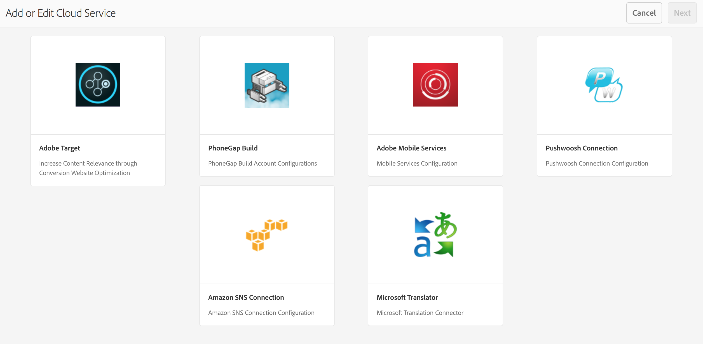

# Adobe Mobile Services 클라우드 서비스 구성 {#configure-your-adobe-mobile-services-cloud-service}

>[!NOTE]
>
>단일 페이지 애플리케이션 프레임워크 기반 클라이언트측 렌더링(예: 응답)이 필요한 프로젝트에 SPA 편집기를 사용하는 것이 좋습니다. [추가 정보](/help/sites-developing/spa-overview.md).

명령 **센터의 모바일** 지표 타일은 모바일 애플리케이션에 대한 실시간 분석을 제공합니다.

Adobe [Mobile Analytics](https://www.adobe.com/ca/solutions/digital-analytics/mobile-web-apps-analytics.html) SDK는 PhoneGap 플러그인을 통해 사용할 수 있습니다. 지표가 수집되어 장치가 연결될 때까지 장치에 캐시되며, 그 때 데이터가 보고 및 분석을 위해 Adobe Mobile Services Cloud로 푸시됩니다.

Adobe Mobile Analytics SDK는 다음을 제공합니다.

1. **모바일 채널을** 위한 데이터 수집 - 모든 주요 운영 체제에서 모바일 웹 사이트 및 앱에 대한 포괄적인 데이터를 수집할 수 있습니다.
1. **모바일 참여 분석** - 모바일 앱, 웹 사이트 또는 비디오에서 소비자의 참여 여부, 고객이 채널을 실행하는 빈도, 채널을 통한 구매 여부 등을 파악할 수 있습니다.
1. **모바일 앱 대시보드 및 보고서** - 앱 및 앱스토어 지표에 대한 라이프사이클 지표가 포함된 사용량 보고서를 가져올 수 있습니다. — 사용자 트렌드, 시작 횟수, 평균 세션 길이, 유지 길이 및 충돌 횟수를 참조하십시오.
1. **모바일 캠페인 분석** - SMS, 모바일 검색 광고, 모바일 디스플레이 광고 및 QR 코드와 같은 모바일 특정 캠페인의 효과를 수량화할 수 있습니다.
1. **지리적 위치 분석** - 앱 사용자가 GPS 위치 또는 관심 위치를 기반으로 모바일 경험을 실행하고 인터랙션하는 위치를 찾을 수 있습니다.
1. **경로 지정 분석** - 사용자가 앱을 탐색하여 사용자의 참여를 유도하는 화면 및 UI 요소와 사용자의 이탈률을 확인하는 방법을 확인할 수 있습니다.

>[!CAUTION]
>
>지표 **분석** 타일은 클라우드 서비스를 구성한 경우에만 대시보드에 표시됩니다.

AEM 명령 센터 지표 타일

## 클라우드 서비스 구성 {#configuring-the-cloud-service}

Adobe Mobile Services Analytics를 활용하려면 Adobe Analytics 계정 정보로 AEM Mobile Analytics Cloud Service를 구성해야 합니다.

1. 오른쪽 상단 아이콘을 클릭하여 앱 대시보드에서 클라우드 서비스 관리 **타일에서** 클라우드 서비스를 추가하거나 편집합니다.

   

1. 클라우드 **서비스 추가 또는 편집** 화면이 표시됩니다. Adobe **Mobile Services를** 선택하고 다음을 **클릭합니다**.

   

1. Mobile Services에서 기존 구성을 **선택하거나** 구성 **만들기를 선택하여** 새 구성을 만듭니다.

   새 구성의 경우 Mobile Services **속성을**&#x200B;입력하고 확인을 클릭합니다&#x200B;**.**

   

   자격 증명이 확인되면 확인 **단추가** 확인됨으로 **변경됩니다**. 모바일 앱 서비스 **선택에서 모바일 서비스 앱을 선택할 수 있습니다**.

   구성을 **설정하려면** 제출을 클릭합니다.

   

1. 클라우드 구성을 설정하면 대시보드에서 동일한 항목을 볼 수 있습니다.

   

   >[!NOTE]
   >
   >클라우드 구성을 설정하면 앱 대시보드에서 지표 **분석** 타일을 볼 수 있습니다.

   

