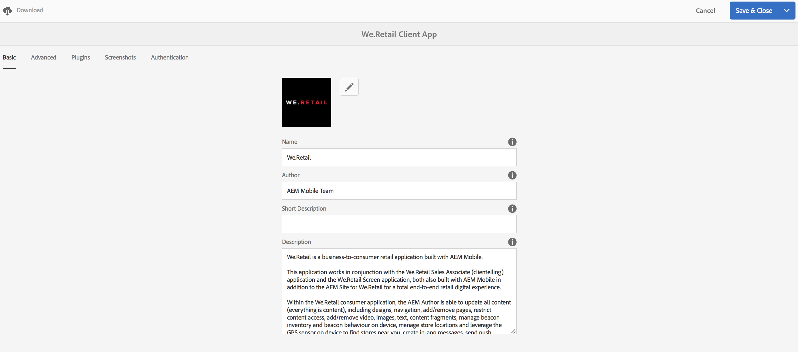

# 사용자 및 사용자 그룹 구성 {#configure-your-users-and-user-groups}

>[!NOTE]
>
>단일 페이지 애플리케이션 프레임워크 기반 클라이언트측 렌더링(예: 응답)이 필요한 프로젝트에는 SPA 편집기를 사용하는 것이 좋습니다. [추가 정보](/help/sites-developing/spa-overview.md).

이 장에서는 사용자 역할과 모바일 앱 제작 및 관리를 지원하도록 사용자 및 그룹을 구성하는 방법에 대해 설명합니다.

## AEM Mobile 응용 프로그램 사용자 및 그룹 관리 {#aem-mobile-application-users-and-group-administration}

AEM 앱에 대한 권한 모델을 구성하고 관리하는 데 도움이 되도록 다음 두 그룹을 사용할 수 있습니다.

* 앱 관리자용 앱 관리자
* 앱 작성자용 앱 작성자

### AEM Mobile 응용 프로그램 내용 작성자(앱 작성자 그룹) {#aem-mobile-application-content-authors-app-author-group}

앱 작성자 그룹의 구성원은 AEM 모바일 애플리케이션 컨텐츠(예: 페이지, 텍스트, 이미지 및 비디오)를 제작할 책임이 있습니다.

#### 그룹 구성 - app-authors {#group-configuration-app-authors}

1. &#39;app-authors&#39;라는 새 사용자 그룹을 만듭니다.

   사용자 Admin Console으로 이동합니다.[http://localhost:4502/libs/granite/security/content/groupadmin.html](http://localhost:4502/libs/granite/security/content/groupadmin.html)

   사용자 그룹 콘솔 내에서 &#39;+&#39; 단추를 선택하여 그룹을 만듭니다.

   이 그룹의 ID를 &#39;app-authors&#39;로 설정하여 이 그룹이 AEM 내에서 모바일 응용 프로그램을 작성하는 데 사용되는 특정 유형의 작성자 사용자 그룹임을 나타낼 수 있습니다.

1. 그룹에 구성원 추가:작성자

   

   작성자 그룹에 앱 작성자 추가

1. 앱 작성자 사용자 그룹을 만들었으므로 이제 [사용자 관리 콘솔](http://localhost:4502/libs/granite/security/content/useradmin.md)을 통해 이 새 그룹에 개별 팀 구성원을 추가할 수 있습니다.

   

   사용자 그룹 편집

1. [권한 콘솔](http://localhost:4502/useradmin)로 이동하고 클라우드 서비스 관리에 권한을 추가합니다.

   * (읽기) /etc/cloudservices
   >[!NOTE]
   >
   >앱 작성자는 AEM에서 기본 컨텐츠 작성자(작성자) 그룹을 확장하여 /content/phonegap 아래에 컨텐츠를 만들 수 있습니다.

### AEM Mobile 응용 프로그램 관리자 그룹(앱 관리자 그룹) {#aem-mobile-application-administrators-group-app-admins-group}

app-admins 그룹의 구성원은 app-authors **AND**&#x200B;에 포함된 동일한 권한으로 응용 프로그램 콘텐츠를 제작할 수 있으며 다음과 같은 책임도 집니다.

* AEM에서 PhoneGap Build 및 Adobe Mobile Services 클라우드 서비스 구성
* 애플리케이션 컨텐츠 동기화 OTA 업데이트 준비, 게시 및 지우기

>[!NOTE]
>
>권한은 AEM 앱 명령 센터에서 일부 사용자 작업의 가용성을 결정합니다.
>
>앱 관리자에게는 사용 가능한 앱 작성자 옵션이 표시되지 않습니다.

#### 그룹 구성 - 앱-관리자 {#group-configuration-app-admins}

1. 앱 관리라는 새 그룹을 만듭니다.
1. 새 app-admins 그룹에 다음 그룹을 추가합니다.

   * content-authors
   * workflow-users

   

1. [권한 콘솔](http://localhost:4502/useradmin)로 이동하고 클라우드 서비스 관리에 권한을 추가합니다.

   * (/etc/cloudservices/mobilesservices의 읽기, 수정, 만들기, 삭제, 복제)
   * (/etc/cloudservices/phonegap-build의 읽기, 수정, 만들기, 삭제, 복제)

1. 동일한 권한 콘솔에서 스테이지에 권한을 추가하고 앱 콘텐츠 업데이트를 게시하고 지우십시오

   * (/etc/packages/mobileapp의 읽기, 수정, 만들기, 삭제, 복제)
   * (읽기) /var/contentsync

   >[!NOTE]
   >
   >패키지 복제는 작성자 인스턴스에서 게시 인스턴스로 앱 업데이트를 게시하는 데 사용됩니다.

   >[!CAUTION]
   >
   >/var/contentsync 액세스가 OOTB가 거부되었습니다.
   >
   >READ 권한을 생략하면 빈 업데이트 패키지가 빌드되고 복제될 수 있습니다.

1. 필요에 따라 이 그룹에 구성원 추가

## 대시보드 타일 권한 {#dashboard-tile-permissions}

대시보드 타일은 사용자의 권한에 따라 다른 작업을 표시할 수 있습니다. 다음은 각 타일에 사용할 수 있는 작업에 대해 설명합니다.

이러한 권한 외에도 현재 앱이 구성된 방식에 따라 동작을 표시하거나 숨길 수도 있습니다. 예를 들어 PhoneGap 클라우드 구성이 앱에 할당되지 않은 경우 &#39;원격 빌드&#39; 동작을 노출할 필요가 없습니다. 이러한 항목은 &#39;**구성 조건**&#39; 섹션 아래에 나열됩니다.

### 앱 타일 관리 {#manage-app-tile}

현재 타일에는 권한이 필요한 작업이 없지만 애플리케이션에 대한 세부 정보 페이지에는 다음 작업이 있습니다.

* *앱* 작성자 및 앱 관리자 편집(UI 트리거 - jcr:write - /content/phonegap/{suffix})
* *앱* 작성자 및 앱 관리자용 다운로드(UI 트리거 - /content/phonegap/{suffix})

아래 이미지는 앱에 대한 다운로드 및 편집 옵션을 보여줍니다.

