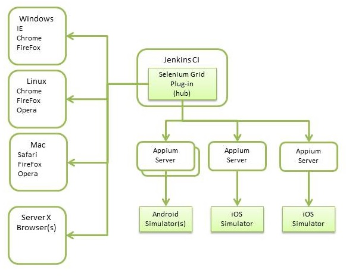

# 모바일 앱 테스트{#testing-mobile-apps}

>[!NOTE]
>
>단일 페이지 애플리케이션 프레임워크 기반 클라이언트측 렌더링(예: React)이 필요한 프로젝트에 SPA 편집기를 사용하는 것이 좋습니다. [추가 정보](/help/sites-developing/spa-overview.md).

시장에 나와 있는 다양한 장치와 출시되는 장치를 고려할 때 앱 테스트가 매우 중요합니다. 이 영역은 앱스토어에서 기능과 유용성이 낮은 평가를 얻을 수 있지만, 단일 오류로 인해 앱이 제거될 수 있습니다. 테스트 계획 및 품질 보증에서는 주의 사항을 고려해야 합니다. 다음 링크는 환경을 식별, 테스트 사례 정의, 테스트 유형, 가정, 고객 참여 등과 같이 일반적으로 해결해야 하는 많은 주제를 다룹니다. 또한 테스트 작업에 도움이 되는 도구도 논의되었습니다. [Hobbes](/help/sites-developing/hobbes.md)과 같은 내부 도구는 웹 기반 UI 테스트에 도움이 될 수 있습니다. [Tough ](/help/sites-developing/tough-day.md) Day는 시뮬레이션된 로드로 인스턴스를 스트레스할 수 있습니다. 테스트 환경에 Selenium과 같은 타사 도구에 대한 경험이 이미 있는 경우 이러한 경험도 사용할 수 있습니다.

모바일 앱을 개발할 때 기존 테스트와 함께 해결해야 하는 장치별 새로운 문제가 많습니다.

* 기능 - 앱에서 모든 요구 사항을 충족합니까?
* 유용성 - 고객이 앱을 쉽게 사용하고 이해할 수 있습니까?
* 성능 - 사용 증가 중에 어떤 상황이 발생합니까? 스와이프 및 회전 슬라이드와 같은 앱 요소가 빠르고 경험에서 멀어지는 것을 방지합니까?
* 실패 또는 중단 - 앱이 실행 중인 동안 수신 호출 또는 알림이 있을 때 어떻게 됩니까? 네트워크 중단이나 전원이 꺼지면 어떻게 됩니까?
* 설치 및 업데이트 - 설치 환경은 어떻게 됩니까? 업데이트는 어떻게 푸시됩니까?
* 기술 - 앱에서 장치에서 너무 많은 전원을 사용하고 있습니까?
* 로컬라이제이션 - 앱의 모든 영역이 번역됩니까?
* 인증 - 앱이 인증되었습니까? 고객이 모든 데이터 개인 정보 보호 법적 요구 사항을 준수한다고 신뢰할 수 있습니까?

이러한 질문은 자동화된 수동 테스트 중에 답변해야 합니다.

## 자동화된 테스트 {#automated-testing}

다양한 화면 크기, 메모리 제한, 입력 방법 및 운영 체제에 대해 자동화된 테스트를 수행할 수 있어야 합니다. 대부분의 테스트 사례를 다룰 뿐만 아니라 새로운 기능이나 장치가 도입되면 회귀 테스트를 가속화할 수 있습니다. 가장 좋은 방법은 자동화 툴이 중복되는 작업을 줄이거나 제한하는 것입니다. 모든 플랫폼에서 테스트 작업을 적용할 수 있도록 도구 또는 프레임워크를 사용하십시오. 다음 차트는 웹 기반 UI 테스트와 모바일 앱 테스트 둘 다에 대한 테스트 환경의 간소화된 구조를 보여줍니다. 차트 왼쪽에는 브라우저가 있는 일련의 Selenium 노드가 표시됩니다. SeleniumGrid는 이러한 노드에 일반적인 웹 기반 UI 테스트를 팜할 수 있습니다. 또한 Selenium 허브는 플랫폼 간 앱 테스트를 위해 App Ium에 연결할 수 있습니다. 시뮬레이터만 표시되지만 Android용 adb 및 iOS 장치용 Xcode 유틸리티를 통합할 수 있습니다. 링크는 이 문서의 후반부에 제공되며, 여기에서 언급된 도구에 대한 특정 세부 정보를 찾을 수 있습니다.

## 수동 테스트 {#manual-testing}

자동화된 테스트 외에도 앱은 수동 테스트 주기를 거쳐야 합니다. 실제 장치에서 앱을 실행하는 고객은 스크립트로 복제할 수 없습니다. 여기서도 선택 사항이 많습니다 하키 앱과 같은 플랫폼을 사용하여 액세스 권한이 있는 사용자를 정의하고 피드백을 수집할 수 있습니다. 또는 전체 프로세스를 UTest, TimedStars 또는 Testn과 같은 서비스에 아웃소싱할 수 있습니다. 내부 테스터 그룹이 있지만 장치 편차가 없다면 장치 풀에서 수동 테스트를 수행할 수 있는 클라우드 서비스가 있습니다. 이런 서비스를 제공하는 것은 SauceLabs입니다. 또한 PhoneGap Enterprise에 원격으로 앱을 빌드하고 승인 테스트 또는 데모 수준으로 로컬 장치에 설치할 수도 있습니다. 최신 기능 및 설명서는 [PhoneGap](https://phonegap.com/) 웹 사이트를 참조하십시오. 어떤 방식이든, 수동 테스트가 필요합니다.

* 테스터를 많이 공격해서
* 대규모 장치 풀에 대해 테스트합니다(이상적인 실제 장치를 사용할 수 없는 경우 시뮬레이터/에뮬레이터).
* 유용한 피드백을 제공합니다.

   * 충돌 보고서,
   * analytics/tracking,
   * 유용성,
   * 관심 영역,
   * 성능,
   * 데이터/소비 전력 등

## 도구 {#tools}

모바일 앱을 테스트하는 데 사용할 수 있는 다양한 도구가 있습니다. 사용할 선택사항은 사용자의 특정 상황에 따라 다릅니다.기능, 가격, 지원, 적용 범위 등 다음은 사용 가능한 일부 도구 및 서비스에 대한 간단한 설명입니다.

**셀레늄**

* WebDriver를 제공하고 다양한 브라우저를 제어하는 테스트 스크립트에 대한 API를 포함하는 프레임워크입니다.
* 실제 장치에서 테스트하는 데 이 플러그인을 AppIum과 함께 사용할 수 있습니다.
* SeleniumGrid는 병렬 테스트를 위해 여러 노드 간에 테스트를 리디렉션합니다.
* Selenium IDE를 사용하면 테스트 사례 작성을 줄일 수 있습니다.

자세한 내용은 [https://www.seleniumhq.org/](https://www.seleniumhq.org/)을 참조하십시오.

**Testdroid**

* 지속적인 통합 후크와 실제 장치 테스트를 통한 클라우드 기반 테스트 서비스.
* 장치 호환성을 확인하고, 로그를 분석하고, 보기를 추적하고, 스크린샷을 수행하고, 성능을 모니터링하는 앱 크롤러가 포함되어 있습니다.

자세한 내용은 [https://testdroid.com/](https://testdroid.com/)을 참조하십시오.

**Appium**

* AppIum은 모바일 테스트를 자동화하기 위한 인기 있는 교차 플랫폼 프레임워크입니다.
* 또한 코드 테스트 사례를 지원하기 위한 기록 기능이 검사자에게 포함되어 있습니다.

자세한 내용은 [https://appium.io/](https://appium.io/)을 참조하십시오.

**SousLabs**

* SauceLabs는 클라우드 기반 테스트를 제공하며 지속적인 통합과 통합됩니다.
* 테스트는 클라우드 환경에서 자동으로 실행되거나 특정 장치 또는 플랫폼을 시작하고 수동 테스트를 수행하여 문제를 디버깅할 수 있습니다.

자세한 내용은 [https://saucelabs.com/](https://saucelabs.com/)을 참조하십시오.

**AppTestNow**

* 모바일 앱을 테스트할 아웃소싱 서비스입니다.
* 대규모 장치 풀을 포함하며 다양한 유형의 테스트를 제공합니다.성능, 품질, 기능, 인증, 로컬라이제이션, 데이터 소비 등

자세한 내용은 [https://www.apptestnow.com](https://www.apptestnow.com/)을 참조하십시오.

**하키 앱**

* 하키앱은 모바일 앱이 개인 앱스토어에 푸시되어 시험자들이 다운로드하여 시도할 수 있는 수동 테스트에 해당합니다.

자세한 내용은 [https://hockeyapp.net/features/](https://hockeyapp.net/features/)을 참조하십시오.

**젠킨스**

* 테스트 도구는 아니지만 Jenkins는 자동화된 테스트에 대한 백본을 제공하는 지속적인 통합 프레임워크입니다. 다양한 타사 플러그인을 사용하여 기능을 확장할 수 있습니다. 한 가지 예를 들어 SeleniumGrid 플러그인은 Selenium 허브 및 노드를 관리하는 데 도움이 되는 UI를 제공합니다.

자세한 내용은 [https://jenkins-ci.org/](https://jenkins-ci.org/) 및 [https://wiki.jenkins-ci.org/display/JENKINS/Plugins](https://wiki.jenkins-ci.org/display/JENKINS/Plugins)을 참조하십시오.
