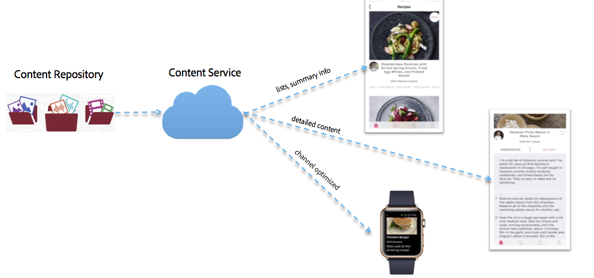

# 컨텐츠 서비스{#content-services}

>[!NOTE]
>
>단일 페이지 애플리케이션 프레임워크 기반 클라이언트측 렌더링(예: 응답)이 필요한 프로젝트에는 SPA 편집기를 사용하는 것이 좋습니다. [추가 정보](/help/sites-developing/spa-overview.md).

>[!CAUTION]
>
>콘텐츠 서비스 기능은 미리 보기 목적으로만 문서화됩니다.
>
>6.3 GA 서비스 팩 1의 출시와 함께 변경될 수 있습니다.

AEM Mobile 컨텐츠 서비스는 AEM에서 관리하는 컨텐츠를 요청하는 간단한 기능입니다. 이 기능은 모든 앱 개발자에게 AEM 컨텐츠 저장소(JCR) 및 웹 프레임워크(Sling)에 대한 깊은 지식이 없어도 컨텐츠를 검색할 수 있는 높은 성능의 방법을 제공합니다. 이를 통해 요청 애플리케이션을 컨텐츠 저장소에서 분리시킬 수 있습니다.

컨텐츠 서비스는 개발자가 해당 컨텐츠의 저장소 구조를 알지 않고도 AEM 관리 컨텐츠에 액세스할 수 있도록 하는 여러 가지 새로운 AEM 구문을 제공합니다.

이러한 구문은 AEM 관리 콘텐츠와 콘텐츠를 소비하는 모바일 앱 간에 추상적 요소를 제공함으로써 유연성을 유지하고 향후 확장을 가능하게 하는 데 필요합니다. 이를 통해 AEM Content Services는 기본 애플리케이션의 컨텐츠 요구 사항과 AEM 컨텐츠 저장소 간의 추상 레이어로 작업할 수 있습니다.

컨텐츠 서비스는 컨텐츠를 자산, 패키징된 HTML(HTML/CSS/JS) 또는 채널 독립적 컨텐츠로 제공할 수 있습니다.

>[!CAUTION]
>
>**전제 조건:**
>
>콘텐츠 서비스를 시작하기 전에 콘텐츠 서비스 플래그를 활성화하십시오. 앱에서 모델을 만들고 관리하려면 구성 브라우저에서 데이터 모델을 활성화해야 합니다.
>
>자세한 내용은 **[콘텐츠 서비스 관리](/help/mobile/developing-content-services.md)** 및 [구성 브라우저](/help/sites-administering/configurations.md) 설명서를 참조하십시오.

구성 브라우저에서 콘텐츠 서비스 플래그와 활성화된 데이터 모델을 설정한 경우 아래 리소스를 참조하여 AEM Mobile Content Services를 시작하고, 모델 관리, 엔티티 관리, AEM Mobile Content Services에 대한 컨텐츠 전달/렌더링 등과 같은 컨텐츠 서비스 개념에 익숙해지십시오.

* 저장소의 모델
* 렌더링 및 전달
