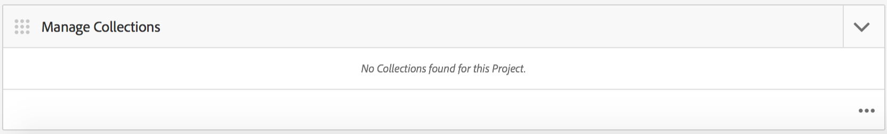

# AEM Mobile 애플리케이션 대시보드 {#aem-mobile-application-dashboard}

>[!NOTE]
>
>단일 페이지 애플리케이션 프레임워크 기반 클라이언트측 렌더링(예: React)이 필요한 프로젝트에 SPA 편집기를 사용하는 것이 좋습니다. [추가 정보](/help/sites-developing/spa-overview.md).

AEM Mobile Application Dashboard 또는 Control Center에서 애플리케이션 및 모바일 앱 컨텐츠를 관리할 수 있습니다.

Control Center의 각 타일로 드릴다운하여 &#39;...&#39;를 클릭하여 세부 정보를 보거나 편집할 수 있습니다. 오른쪽 아래 모서리에 있습니다.

>[!NOTE]
>
>타일의 그래버 아이콘(왼쪽 9 점 상단)을 클릭하여 타일의 순서를 재정렬할 수 있습니다. 주문 변경은 사용자별로 다르며 개별 사용자에 따라 다릅니다.

앱 컨텐츠를 관리하려면 개발자, 컨텐츠 작성자 및 관리자의 공동 작업이 필요합니다. 작성자는 앱 개발자가 생성한 템플릿 및 구성 요소를 기반으로 페이지를 조작합니다.

마지막으로 관리자는 업데이트된 앱 콘텐츠를 전략적으로 게시합니다.

## 앱 타일 관리 {#the-manage-app-tile}

**앱 관리** 타일에는 사용 가능한 애플리케이션 정보가 표시됩니다.

* 제목
* 설명
* 아이콘
* 마지막 수정 날짜
* 마지막 수정자

## 연결 관리 타일 {#the-manage-connection-tile}

**연결 관리** 타일에는 AEM Mobile On-demand Services 연결 정보가 표시됩니다.

* 클라우드 구성 이름
* 프로젝트 이름 및 ID
* 연결 상태

>[!NOTE]
>
>오른쪽 상단에 있는 톱니바퀴를 클릭하여 Mobile On-Demand Cloud 구성을 설정합니다.
>
>자세한 내용은 [Mobile On-Demand Services 구성](/help/mobile/mobile-on-demand-associating-an-on-demand-app-to-cloud-configuration.md)을 참조하십시오.

## 엔티티 관리 {#managing-entities}

이 3개의 타일은 앱 컨텐츠의 상태에 대한 개요를 제공합니다.

* **배너**
* **기사**
* **컬렉션**

오른쪽 아래 모서리의 줄임표(..)를 클릭하여 각 타일을 확장하여 보다 자세한 목록 보기를 제공할 수 있습니다. 이러한 목록 보기를 사용하면 속성 삭제, 업로드 및 편집과 같은 일반적인 Mobile On Demand 작업에 액세스할 수 있습니다.

### 배너 관리 타일 {#the-manage-banners-tile}

**배너 관리** 타일을 사용하면 배너의 콘텐츠를 관리할 수 있습니다. 배너에 대해 다음 정보가 표시됩니다.

* 이미지
* **제목**:배너 이름
* **수정됨**:AEM에서 마지막으로 수정됨
* **업로드됨**:AEM에서 업로드됨
* **게시됨**:AEM에서 마지막으로 게시된 요청
* **소스**:소스(Mobile On Demand에서 로컬 또는 원격 AEM)

다음 이미지는 AEM Mobile Application Dashboard의 **배너 관리** 타일을 보여줍니다.

>[!NOTE]
>
>배너를 만들거나, 삭제하거나, 업데이트하려면 **[배너 관리](/help/mobile/mobile-on-demand-managing-banners.md)**&#x200B;를 참조하십시오.

### 문서 관리 타일 {#the-manage-articles-tile}

**문서 관리** 타일을 사용하면 문서에 대한 컨텐츠를 관리할 수 있습니다. 문서에 대해 다음 정보가 표시됩니다.

* 이미지
* **제목**:문서의 이름
* **수정됨**:AEM에서 마지막으로 수정됨
* **업로드됨**:AEM에서 업로드됨
* **게시됨**:AEM에서 마지막으로 게시된 요청
* **소스**:소스(Mobile On-Demand에서 로컬 또는 원격 AEM)

다음 이미지는 AEM Mobile Application Dashboard의 **문서 관리** 타일을 보여줍니다.

>[!NOTE]
>
>문서를 만들거나, 삭제하거나, 업데이트하려면 [**문서 관리**](/help/mobile/mobile-on-demand-managing-articles.md)&#x200B;를 참조하십시오.

### 컬렉션 관리 타일 {#the-manage-collections-tile}

**컬렉션 관리** 타일을 사용하면 컬렉션의 컨텐츠를 관리할 수 있습니다. 컬렉션에 대해 다음 정보가 표시됩니다.

* 이미지
* **제목**:컬렉션 이름
* **수정됨**:AEM에서 마지막으로 수정됨
* **업로드됨**:AEM에서 업로드됨
* **게시됨**:AEM에서 마지막으로 게시된 요청
* **소스**:소스(Mobile On-Demand에서 로컬 또는 원격 AEM)

다음 이미지는 AEM Mobile Application Dashboard의 **컬렉션 관리** 타일을 보여줍니다.

>[!NOTE]
>
>컬렉션을 만들거나, 삭제하거나, 업데이트하려면 **[컬렉션 관리](/help/mobile/mobile-on-demand-managing-collections.md)**&#x200B;를 참조하십시오.

### 다음 단계 {#the-next-steps}

애플리케이션 대시보드를 잘 알고 있으면 다음 리소스를 참조하여 모바일 앱을 만드십시오.

* [응용 프로그램 만들기 및 구성 작업](/help/mobile/mobile-apps-ondemand-application-create-configure-action.md)
* [클라우드 구성에 온디맨드 앱 연결](/help/mobile/mobile-on-demand-associating-an-on-demand-app-to-cloud-configuration.md)
* [콘텐츠 관리 작업](/help/mobile/mobile-apps-ondemand-manage-content-ondemand.md)

### 추가 리소스 {#additional-resources}

관리자 및 개발자의 역할과 책임에 대해 알아보려면 아래 리소스를 참조하십시오.

* [AEM Mobile On-demand Services용 AEM 컨텐츠 개발](/help/mobile/aem-mobile-on-demand.md)
* [AEM Mobile On-demand Services을 사용할 컨텐츠 관리](/help/mobile/aem-mobile.md)
