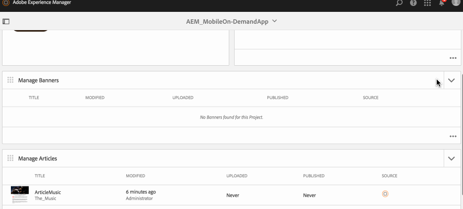

# 배너 관리{#managing-banners}

>[!NOTE]
>
>단일 페이지 애플리케이션 프레임워크 기반 클라이언트측 렌더링(예: 응답)이 필요한 프로젝트에는 SPA 편집기를 사용하는 것이 좋습니다. [추가 정보](/help/sites-developing/spa-overview.md).

컨텐츠 관리 작업은 애플리케이션 내에서 컨텐츠를 만들고 관리하는 데 도움이 되는 기본 구성 요소입니다. 애플리케이션 내의 컨텐츠에 대해 다음 작업이 수행됩니다.

## 배너 개요 {#banners-overview}

배너는 일반적으로 그래픽 홍보 링크를 나타냅니다.

>[!NOTE]
>
>AEM Mobile 앱의 다음 항목에 대한 자세한 내용은 온라인 도움말의 다음 리소스를 참조하십시오.
>
>* [디자인 고려 사항](https://helpx.adobe.com/digital-publishing-solution/help/design-app.html)
   >
   >
* [배너 만들기](https://helpx.adobe.com/digital-publishing-solution/help/creating-banners.html)

>

## 배너 만들기 {#creating-a-banner}

아티클을 만드는 일반 작업 과정은 다음과 같습니다.

1. 사이드 레일에서 **모바일**&#x200B;을 선택합니다.
1. 모바일의 카탈로그에서 Mobile On-Demand 앱을 선택합니다.
1. **배너 관리** 타일의 오른쪽 위 모서리에 있는 아래쪽 화살표를 클릭합니다.
1. 마법사의 각 단계에서 작업하여 새 배너를 계속 만듭니다.
1. 준비가 되면 **만들기**&#x200B;를 클릭합니다.
1. 새 배너가 **배너 관리** 타일에 표시됩니다.

## 새 배너 가져오기 {#importing-a-new-banner}

기존 Mobile On-Demand 컨텐츠는 Mobile On-Demand에서 AEM으로 다운로드(가져오기)할 수 있습니다. 이렇게 하면 로컬 컨텐츠를 편집하고 볼 수 있습니다.

>[!NOTE]
>
>가져오기에는 이미지가 포함되지 않습니다.

새 아티클을 가져오는 작업 과정

1. 모바일의 카탈로그에서 모바일 온디맨드 앱을 선택합니다.
1. **배너 관리** 타일의 오른쪽 상단에 있는 아래쪽 화살표를 클릭하고 배너 가져오기를 선택합니다.
1. 대화 상자에서 **배너 가져오기**&#x200B;를 클릭한 다음 닫기를 클릭합니다.
1. 이제 모바일 온디맨드 아티클이 **배너 관리** 타일에 표시됩니다.

>[!CAUTION]
>
>먼저 Mobile On-Demand 연결을 연결해야 합니다.

## 배너 편집 {#editing-a-banner}

내장된 AEM 드래그 앤 드롭 편집기를 사용하여 아티클을 추가하거나 변경합니다. 텍스트 및 이미지와 같은 구성 요소를 추가/제거할 수 있습니다. DAM 자산의 이미지를 삽입할 수 있습니다.

>[!CAUTION]
>
>AEM에서 만든 배너만 편집기에서 열 수 있습니다.

아티클 편집 워크플로우:

1. 모바일의 카탈로그에서 Mobile On-Demand 앱을 선택합니다.
1. 배너 관리** 타일에서 AEM 소스 배너를 선택합니다**.
1. 목록 보기에서 강조 표시된 배너를 클릭하여 컨텐츠 편집기에서 엽니다.
1. 콘텐츠 편집기를 사용하여 배너 컨텐츠(원고, 이미지, 텍스트 등)를 드래그합니다.

### 배너 내 메타데이터 보기 및 편집 {#viewing-and-editing-the-metadata-within-a-banner}

배너에는 제목, 설명, 이미지 등 다양한 속성이 있습니다. 이 작업은 이러한 속성을 보고 수정하는 데 사용됩니다. 원할 경우, 이러한 변경 사항은 저장 시 Mobile On-Demand로 업로드할 수 있습니다.

아티클을 보거나 편집하는 일반 작업 과정:

1. 모바일의 카탈로그에서 Mobile On-Demand 앱을 선택합니다.
1. **배너 관리** 타일에서 배너를 선택합니다.

1. 작업 표시줄에서 **속성**&#x200B;을 선택합니다.
1. 해당 아티클에 대해 사용 가능한 모든 메타 데이터를 봅니다.
1. 원하는 경우 메타 데이터를 편집하고 완료되면 **저장**&#x200B;을 클릭합니다.
1. 원할 경우, 변경 사항을 즉시 Mobile On-Demand로 업로드합니다.

## 배너 업로드 중 {#uploading-a-banner}

업로드 작업은 선택한 컨텐츠를 복사하고 Mobile On-Demand 프로젝트에 추가합니다. 이미 기존 Mobile On-Demand 컨텐츠가 새 버전으로 대체되었습니다.

배너를 업로드하는 일반 워크플로우:

1. **Mobile**&#x200B;의 카탈로그에서 Mobile On-Demand 앱을 선택합니다.
1. **배너 관리** 타일에서 Mobile On-Demand에 업로드할 배너를 선택합니다.
1. 목록 보기에서 필요한 경우 배너를 더 추가합니다.
1. 작업 표시줄에서 **업로드**&#x200B;를 선택한 다음 대화 상자에서 업로드를 클릭합니다.
1. 이제 배너가 Mobile On-Demand로 업로드됩니다.

## 배너 삭제 중 {#deleting-a-banner}

이 작업을 수행하면 선택한 배너가 Mobile On-Demand에서 삭제되고 선택적으로 로컬 AEM 인스턴스에서 삭제됩니다.

배너를 삭제하는 일반 워크플로우:

1. 모바일의 카탈로그에서 Mobile On-Demand 앱을 선택합니다.
1. **배너 관리** 타일에서 삭제할 배너를 선택합니다.
1. 목록에서 선택되었는지 확인합니다(필요에 따라 삭제할 다른 사람 선택).
1. 작업 표시줄에서 **삭제**&#x200B;를 클릭합니다.
1. AEM 및 Mobile On-Demand에서 삭제할 것인지 확인하십시오.
1. **삭제**&#x200B;를 클릭합니다. 
1. 이제 배너가 목록에서 제거됩니다.

### 다음 단계 {#the-next-steps}

배너 관리에 대한 자세한 내용은

* [아티클 관리](/help/mobile/mobile-on-demand-managing-articles.md)
* [컬렉션 관리](/help/mobile/mobile-on-demand-managing-collections.md)
* [공유 리소스 업로드](/help/mobile/mobile-on-demand-shared-resources.md)
* [컨텐츠 게시/게시 취소](/help/mobile/mobile-on-demand-publishing-unpublishing.md)
* [프리플라이트를 사용하여 미리 보기](/help/mobile/aem-mobile-manage-ondemand-services.md)
