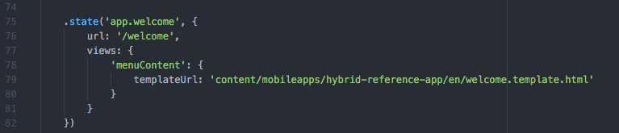

# 하이브리드 앱이 Adobe Experience Manager Mobile에 대해 준비되었습니까?{#is-your-hybrid-app-ready-for-aem-mobile}

>[!NOTE]
>
>Adobe 단일 페이지 애플리케이션 프레임워크 기반 클라이언트측 렌더링(예: React)이 필요한 프로젝트에는 SPA Editor를 사용하는 것이 좋습니다. [자세히 알아보기](/help/sites-developing/spa-overview.md).

하이브리드 PhoneGap 또는 Cordova 앱을 AEM으로 가져왔습니다. 이제 어떻게 하시겠습니까? 작성 가능한 콘텐츠를 앱에 추가할 수 있습니다. 이 작업을 수행하려면 AEM 앱의 구조에 대한 일반적인 이해가 필요합니다. AEM의 앱은 일반적으로 두 부분으로 나뉩니다. 쉘 및 콘텐츠 &#39;셸&#39;은 PhoneGap 구성 파일, 앱 프레임워크 및 탐색 컨트롤과 같은 앱의 정적 부분으로 구성됩니다. 가져온 아카이브의 콘텐츠는 셸의 일부로 저장됩니다. 이 문서의 컨텍스트에서 셸은 앱 개발자가 빌드한 하이브리드 PhoneGap 앱의 모든 비 AEM 작성 콘텐츠입니다.

콘텐츠는 AEM Developer가 작성한 AEM에서 작성된 구성 요소, 템플릿 및 작성된 페이지를 나타냅니다. 콘텐츠는 개발자 콘텐츠 또는 작성된 콘텐츠로 분류됩니다. 구성 요소, 디자인 및 페이지 템플릿은 개발자가 빌드하므로 개발 콘텐츠로 간주됩니다. 작성자-콘텐츠는 구성 요소 및 템플릿을 사용하여 작성된 페이지입니다. 이러한 페이지는 일반적으로 디자이너 또는 마케터가 수행합니다.

작성된 AEM 페이지를 하이브리드 앱에 추가하려면 앱 개발자와 AEM 개발자 간의 조정이 필요합니다. 작성된 콘텐츠를 추가하려는 앱의 모든 위치에서 앱 개발자는 이러한 페이지를 Experience Manager에 오버레이할 수 있는 구조로 구성해야 합니다. 앱 개발자는 Experience Manager 작성 콘텐츠가 추가되는 경로를 Experience Manager 개발자에게 제공할 수 있어야 합니다. 그런 다음 Experience Manager 개발자가 페이지 콘텐츠를 작성한 후 대체되는 하이브리드 앱의 자리 표시자 페이지를 제공합니다.

설명을 더 쉽게 따라할 수 있도록 AEM Experience Cloud: AEM Mobile 하이브리드 참조 를 사용하여 개념을 설명하고 있습니다. 하이브리드 참조 앱은 사이드 메뉴가 있는 시작 페이지로 구성됩니다.

이 예에서는 애플리케이션의 시작 페이지가 작성됩니다. 소스 보기 [https://github.com/Adobe-Marketing-Cloud-Apps/aem-mobile-hybrid-reference/blob/master/hybrid-app/www/js/app.js#L75](https://github.com/Adobe-Marketing-Cloud-Apps/aem-mobile-hybrid-reference/blob/master/hybrid-app/www/js/app.js#L75). 앱 개발자가 시작 페이지를 정의하고 앱에서 렌더링하는 페이지에 대한 템플릿을 제공했습니다. 이 페이지에서 앱 개발자와 AEM 개발자가 조정해야 합니다. 하이브리드 참조 앱의 시작 페이지 템플릿 경로는 &quot;content/mobileapps/hybrid-reference-app/en/welcome.template.html&quot;로 정의됩니다. AEM 개발자는 동일한 경로를 사용하여 AEM 저장소에서 시작 페이지를 작성하므로 이 경로가 중요합니다.

Content Sync를 사용하여 콘텐츠를 오버레이하여 새 페이지를 Hybrid 앱에 추가하는 기능에 의존하므로 하이브리드 앱과 AEM에서 작성한 콘텐츠는 동일한 경로를 사용하는 것이 중요합니다. 하이브리드 앱을 AEM으로 가져오면 가져오기 프로세스의 일부로 Content Sync 구성이 설정됩니다.

앱 대시보드에서 &#39;소스 다운로드&#39;를 수행하면 이러한 ContentSync 스크립트가 실행되어 하이브리드 앱의 아카이브를 어셈블합니다.

ContentSync는 먼저 하이브리드 앱의 모든 앱 개발 콘텐츠가 저장된 앱의 &#39;쉘&#39;을 가져옵니다. 그런 다음 앱의 &#39;콘텐츠&#39;를 가져옵니다. 이제 &#39;shell&#39;에 &#39;content&#39;와 동일한 경로를 가진 페이지가 있으면 &#39;shell&#39;의 페이지는 &#39;content&#39;의 페이지로 대체(대체)됩니다. 따라서 하이브리드 참조 앱 샘플에서는 AEM에서 &quot;&#39;content/mobileapps/hybrid-reference-app/en/welcome.template.html&#39;&quot;과 동일한 경로를 가진 페이지가 만들어지는 경우 ContentSync가 실행되면 하이브리드 참조 앱의 일부인 페이지가 오버레이됩니다. 해당 위치에서 AEM에 있는 모든 항목으로 오버레이합니다. 오버레이는 ContentSync에서 처리되므로 앱을 사용하는 사용자의 경우 AEM 작성 콘텐츠가 있는 앱의 업데이트가 원활하게 보이므로 앱을 다시 빌드할 필요가 없습니다. 따라서 앱을 실행하면 다음과 같이 시작 페이지가 표시됩니다.

