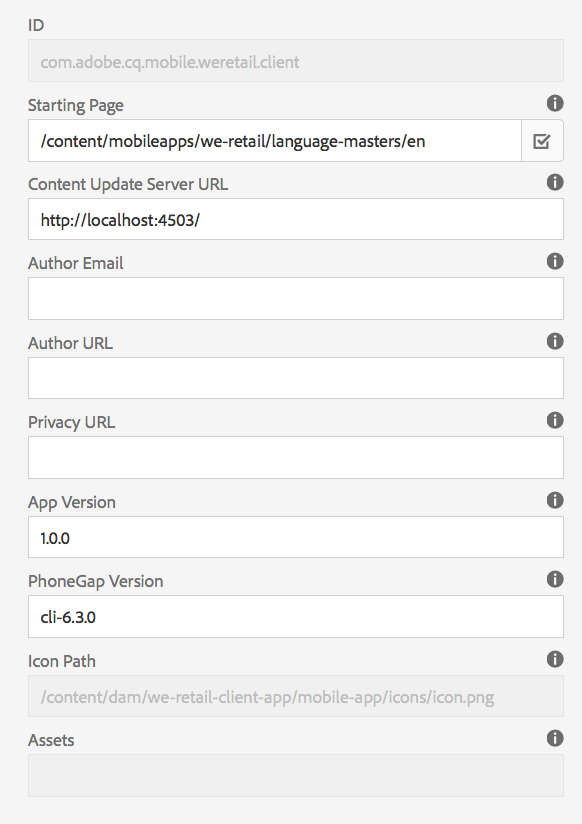

# 앱 타일 관리{#manage-app-tile}

>[!NOTE]
>
>단일 페이지 애플리케이션 프레임워크 기반 클라이언트측 렌더링(예: 응답)이 필요한 프로젝트에는 SPA 편집기를 사용하는 것이 좋습니다. [추가 정보](/help/sites-developing/spa-overview.md).

앱 대시보드의 **앱 관리** 타일은 애플리케이션에 대한 세부 정보를 수정하는 기능을 제공합니다. 세부 사항 페이지를 열려면 앱 타일의 세부 사항 관리 링크를 클릭합니다. 앱 관리 페이지에서 PhoneGap 애플리케이션 구성(config.xml) 설정을 편집하고 다양한 애플리케이션 스토어에 제출할 애플리케이션을 준비할 수 있습니다.


## 앱 타일 관리 타일 이해 {#understanding-the-manage-app-tile}

**앱 관리** 타일의 각 타일로 드릴다운하여 &#39;...&#39;을 클릭하여 세부 사항을 보거나 편집할 수 있습니다. 오른쪽 하단에 있습니다.

### 기본 탭 {#the-basic-tab}

이 탭에서 앱에 대한 **이름**, **작성자**, **간략한 설명** 및 **설명**&#x200B;을 편집할 수 있습니다.


### 고급 탭 {#the-advanced-tab}

각 모바일 애플리케이션 플랫폼은 각 애플리케이션 스토어를 대상으로 수집되는 데이터를 설명합니다.

표시되는 플랫폼은 PhoneGap config.xml 컨텐츠에 의해 파생됩니다.

```xml
<widget>
<gap:platform name="ios"/>
<gap:platform name="android"/>
</widget>
```

예를 들어 Apple App Store 또는 Google Play Store와 같은 각 벤더 응용 프로그램 스토어에는 응용 프로그램 세부 정보를 고객에게 표시하려면 모바일 응용 프로그램의 스크린샷이 하나 이상 필요합니다. 이러한 스크린샷은 크기와 컨텐츠에 대해 엄격한 요구 사항을 가질 수 있습니다(기본적으로 이 스크린샷은 애플리케이션을 나타내야 함). AEM Apps는 지원되는 플랫폼에 대해 이러한 스크린샷을 선택 및 관리하고 각 공급업체의 애플리케이션 스토어에서 요구하는 포트 크기를 볼 수 있도록 지원합니다.

>[!NOTE]
>
>AEM Verify 앱은 AEM에서 앱 세부 정보로 바로 스크린샷을 전송할 수 있는 기능을 제공합니다.
>
>자세한 내용은 [AEM용 모바일 빠른 시작 확인](/help/mobile/phonegap-mobile-quickstart.md)을 참조하십시오.


### 메타데이터 {#metadata}

>[!NOTE]
>
>**앱 관리** 타일에 익숙해지면 [앱 메타데이터 편집](/help/mobile/phonegap-editmetadata.md)을 참조하여 메타데이터를 보고 편집합니다.

#### 공통 메타데이터 {#common-metadata}

모든 응용 프로그램에는 응용 프로그램의 다양한 측면을 구성하는 데 도움이 되는 관련 메타데이터가 있어야 합니다. 앱 관리 페이지는 메타데이터 수집과 관련된 두 개의 서로 다른 영역으로 구분됩니다. 플랫폼별 메타데이터 및 공통 메타데이터

모든 플랫폼에는 공통 구성 및 메타데이터가 있습니다.

이 섹션에서 Content Update Server URL, 모바일 응용 프로그램의 랜딩 페이지, 컴파일할 PhoneGap 버전, 응용 프로그램 버전, 이름, 설명 등을 정의합니다.

**App** Version은 응용 프로그램의 작업 버전입니다. 일반적인 우수 사례는 3진수 표기법을 사용하고 첫 번째 릴리스 전에 1.0.0 아래로 시작하는 것입니다.

**PhoneGap** 버전은 PhoneGap을 사용하여 응용 프로그램을 컴파일할 버전입니다. 최신 기능과 버그 수정을 확실히 활용하기 위해 최신 버전을 사용하는 것이 좋습니다.

**Content Update Server** URL은 응용 프로그램에서 ContentSync 업데이트를 호출하는 데 사용할 URL입니다. 디스패처 URL로 설정하거나, 디스패처를 사용하지 않는 경우 애플리케이션에 ContentSync 업데이트를 제공하는 데 사용할 게시 인스턴스 중 하나로 설정해야 합니다.



>[!NOTE]
>
>필드를 채우는 데이터가 없으면 이 섹션이 비어 있을 수 있습니다.
>
>세부 사항 보기 상단에 애플리케이션 버전, PhoneGap 버전 및 업데이트 URL이 표시됩니다. 이러한 각 값은 공통 메타데이터 섹션 내에서 설정할 수 있습니다. 그러나 응용 프로그램 ID는 편집할 수 없습니다.

#### 플랫폼 메타데이터 {#platform-metadata}

PhoneGap config.xml에 정의된 모든 플랫폼에는 사용자 지정 플랫폼 속성이 포함될 수 있습니다. AEM 개발자는 이러한 속성을 캡처하기 위해 컨텐츠 구조를 증여해야 합니다. 제공된 플랫폼 특정 속성 예는 iOS에서 찾을 수 있습니다.

이제 구성된 모든 플랫폼의 메타데이터가 앱 관리 타일의 고급 탭에서 동시에 표시됩니다.

>[!NOTE]
>
>플랫폼 메타데이터 섹션은 CLI 또는 Remote PhoneGap 빌드 중에 PhoneGap에서 사용되지 않지만 AEM은 타깃팅된 공급업체의 애플리케이션 스토어에 제출할 때 나중에 사용할 수 있도록 플랫폼에 대한 메타데이터를 캡처하려고 합니다.

AEM에서 인식하지 못하는 플랫폼의 경우 AEM 개발자가 나중에 애플리케이션 제출 과정에서 내보내고 사용할 수 있는 이 메타데이터를 캡처하기 위해 UI를 확장할 수 있습니다.

#### iOS 메타데이터 {#ios-metadata}

배포할 애플리케이션을 제출하려면 Apple AppStore에 추가 메타데이터가 필요합니다. iOS 메타데이터 섹션은 Apple의 iTMSTransporter 툴에서 관련 Apple 개발자 계정에 메타데이터를 게시하는 데 사용할 수 있는 필수 정보를 수집하려고 합니다.

Apple 관련 메타데이터를 얻으려면 먼저 [https://itunesconnect.apple.com](https://itunesconnect.apple.com/)에서 응용 프로그램을 만들어야 합니다. 응용 프로그램을 만들면 Apple iTMSTransporter 도구를 사용하여 메타데이터를 확인하고 itunesconnect.apple.com에 업로드하려는 경우 iOS 메타데이터 섹션에서 필요한 메타데이터를 생성합니다. 수집하기 위해 메타데이터를 얻으려면 iOS 특정 메타데이터를 반드시 채우지 않아도 됩니다. iOS 및 일반 메타데이터를 병합할 메타데이터를 계속 내보낼 수 있고 모든 스크린샷을 zip 파일로 취합할 수 있습니다. 이 경우 언제든지 다운로드할 수 있습니다.

다운로드한 zip 파일에는 metadata.xml에 대해 검사할 수 있는 항목 파일이 포함되어 있습니다. 항목 파일에는 연결된 모든 스크린샷과 함께 내보낸 메타데이터(metadata.xml 파일 내)가 포함되어 있습니다.

내보내기 기능은 공급업체 특정 애플리케이션 스토어에 입력하기 위해 애플리케이션 게시자에게 전달할 수 있는 스크린샷과 메타데이터를 간편하게 수집하는 데 사용됩니다.


#### Android 메타데이터 {#android-metadata}

Android 플랫폼을 선택하면 설정할 수 있는 사용자 지정 메타데이터가 없습니다. zip 파일로 다운로드 단추를 클릭하면 모든 메타데이터 및 관련 스크린샷이 포함된 속성 파일과 함께 생성됩니다.

내보내기 기능은 공급업체 특정 애플리케이션 스토어에 입력하기 위해 애플리케이션 게시자에게 전달할 수 있는 스크린샷과 메타데이터를 간편하게 수집하는 데 사용됩니다.


### 컨텐츠 업데이트 서버 URL {#content-update-server-url}

AEM Apps의 주요 기능 중 하나는 모바일 애플리케이션이 ContentSync를 통해 새로운 콘텐츠를 요청할 수 있는 기능으로, 여기서 컨텐츠는 html 리소스, 페이지, 비디오, 이미지, 텍스트 등이 될 수 있습니다. 컨텐츠 작성자가 컨텐츠를 업데이트한 다음 해당 컨텐츠를 게시하면 서버가 모바일 응용 프로그램에서 다운로드할 수 있도록 컨텐츠 업데이트를 사용할 수 있게 됩니다.

Content Update Server URL 속성은 게시 인스턴스를 가리켜야 하는 URL입니다.직접 또는 디스패처 또는 CDN을 통해. URL의 형식은 다음과 같습니다.

`https://[hostname]:[port]`

>[!NOTE]
>
>작성자 서버 인스턴스가 여러 게시 서버 인스턴스(AEM의 공통 아키텍처)에 복제되는 경우 해당 업데이트는 작성자를 기반으로 구축되어 모든 게시 인스턴스에 복제되므로 각 게시 서버에 동일한 업데이트 컨텐츠가 표시됩니다. 기본적으로 로드 밸런싱 및 페일오버 기능이 완벽하게 지원됩니다.

### 플러그인 탭 {#the-plugins-tab}

**Plugins** 탭에서는 앱과 연결된 플러그인을 설명합니다. 이 정보는 빌드 중에 적절한 플러그인을 검색하는 데 사용됩니다.


### 스크린샷 탭 {#the-screenshots-tab}

**스크린샷** 탭에는 다른 플랫폼에서 지원되는 스크린샷 해상도가 표시됩니다.


>[!NOTE]
>
>스크린샷을 추가하고 제거하려면 [앱 메타데이터 편집](/help/mobile/phonegap-editmetadata.md)을 참조하십시오.

### 인증 탭 {#the-authentication-tab}

**인증** 탭에서는 응용 프로그램과 연결할 OAuth 클라이언트를 선택할 수 있으며, 개발자는 Adobe Experience Manager의 OAuth 인증을 활용할 수 있습니다.


### 다음 단계 {#the-next-steps}

응용 프로그램 대시보드에서 앱 타일 관리에 대해 알게 되면 다른 제작 역할에 대한 다음 리소스를 참조하십시오.

* [앱 메타데이터 편집](/help/mobile/phonegap-editmetadata.md)
* [앱 정의](/help/mobile/phonegap-app-definitions.md)
* [앱 만들기 마법사를 사용하여 새 앱 만들기](/help/mobile/phonegap-create-new-app.md)
* [기존 하이브리드 앱 가져오기](/help/mobile/phonegap-adding-content-to-imported-app.md)
* [컨텐츠 서비스](/help/mobile/develop-content-as-a-service.md)

### 추가 리소스 {#additional-resources}

관리자 및 개발자의 역할 및 책임을 살펴보려면 아래 리소스를 참조하십시오.

* [AEM을 사용하여 Adobe PhoneGap Enterprise를 위한 개발](/help/mobile/developing-in-phonegap.md)
* [AEM에서 Adobe PhoneGap Enterprise용 컨텐츠 관리](/help/mobile/administer-phonegap.md)

