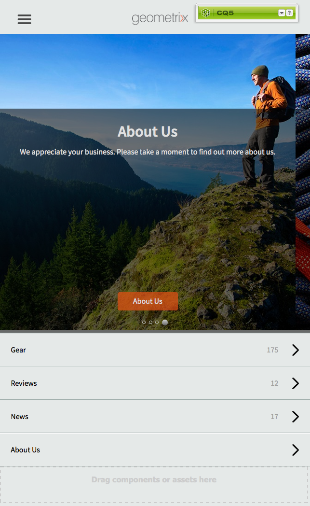
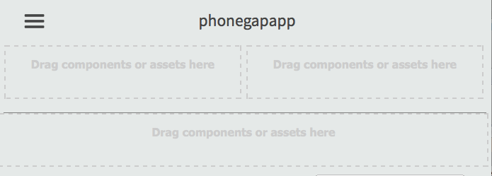

# 앱 콘솔을 사용하여 앱 만들기 및 편집{#creating-and-editing-apps-using-the-apps-console}

>[!NOTE]
>
>단일 페이지 애플리케이션 프레임워크 기반 클라이언트측 렌더링(예: 응답)이 필요한 프로젝트에는 SPA 편집기를 사용하는 것이 좋습니다. [추가 정보](/help/sites-developing/spa-overview.md).

AEM 모바일 애플리케이션 개발 프로세스는 서로 다른 전문 지식을 가진 사용자가 모바일 애플리케이션 개발에 기여하고 있음을 인식합니다. 다음 프로세스 맵은 컨텐츠 작성자 및 애플리케이션 개발자가 작업을 수행하는 일반적인 순서를 보여줍니다.

마케터 작업을 수행하는 방법에 대한 정보가 이 페이지에 표시됩니다. 개발자 작업에 대한 자세한 내용은 PhoneGap 애플리케이션 빌드를 참조하십시오.

## 모바일 응용 프로그램 구조 {#the-structure-of-mobile-applications}

AEM Mobile은 모바일 애플리케이션을 제작하기 위한 Phonegap 앱 블루프린트를 제공합니다. 블루프린트는 사용자가 만드는 응용 프로그램의 구조를 정의합니다. 애플리케이션은 다음 항목으로 구성됩니다.

* 루트 페이지입니다.
* 응용 프로그램의 언어 변수입니다.
* 언어 변형의 홈 페이지입니다.

### Phonegap 앱의 루트 {#the-root-of-a-phonegap-app}

AEM에서 만든 모바일 응용 프로그램의 루트 페이지가 Apps 콘솔에 표시됩니다.

루트 페이지는 응용 프로그램을 만들 때 지정한 응용 프로그램의 대상 경로 속성 아래에 저장됩니다(기본 경로는 /content/phonegap/apps). 페이지 이름은 애플리케이션의 이름 속성입니다. 예를 들어 `myphonegapapp` 사이트의 루트 페이지의 기본 URL은 `http://localhost:4502/content/phonegap/apps/myphonegapapp.html`입니다.

### PhoneGap 앱의 언어 변형 {#the-language-variation-of-a-phonegap-app}

루트 페이지의 첫 번째 하위 페이지는 애플리케이션의 언어 변형입니다. 각 페이지의 이름은 애플리케이션을 만들 언어입니다. 예를 들어, 영어는 응용 프로그램의 영어 변형의 이름입니다.

**참고:** 기본 PhoneGap 블루프린트는 영어 응용 프로그램만 만듭니다. 개발자는 더 많은 언어 변형을 만들 수 있도록 블루프린트를 수정할 수 있습니다.

언어 페이지는 다음 두 가지 용도로 사용됩니다.

* 페이지 컨텐츠는 애플리케이션의 언어 변형을 위한 페이지 페이지입니다.
* 페이지 속성은 컨텐츠 업데이트를 요청하는 데 사용할 URL, 클라우드 빌드 및 Adobe Analytics 서비스 통합에 연결하는 방법에 대한 정보 등 애플리케이션의 여러 디자인 측면을 제어합니다.

### 홈 페이지 {#the-home-page}

응용 프로그램을 열 때 응용 프로그램의 언어 변형에 대한 홈 페이지 또는 index.html 페이지가 나타납니다.홈 페이지는 응용 프로그램의 다양한 페이지로 연결되는 링크 메뉴를 사용자에게 제공합니다. 단락 시스템을 사용하면 컨텐츠를 만들기 위해 페이지에 구성 요소를 추가할 수 있습니다.

## 모바일 응용 프로그램 만들기 {#creating-a-mobile-application}

모바일 애플리케이션은 페이지 구조와 속성을 정의하는 청사진을 기반으로 합니다. 다음 응용 프로그램 속성을 구성할 수 있습니다.

* **제목:** 응용 프로그램 제목입니다.
* **대상 경로:** 응용 프로그램이 저장되는 저장소의 위치입니다. 앱 이름을 기반으로 경로를 만들려면 기본값을 그대로 두십시오.

* **이름:** 기본값은 공백 문자를 제거한 제목 속성 값입니다. 이 이름은 CQ 내에서 애플리케이션을 참조하는 데 사용됩니다. 예를 들어 애플리케이션을 나타내는 리포지토리 노드에 대해 사용됩니다.
* **설명:** 응용 프로그램에 대한 설명입니다.
* **서버 URL:** OTA(Over-the-Air) 컨텐츠 업데이트를 제공하는 URL입니다. 기본값은 externalizer 서비스에서 가져온 응용 프로그램을 만드는 데 사용되는 인스턴스의 게시 서버 URL입니다. 이 인스턴스는 인증이 필요한 작성자가 아니라 게시 서버 인스턴스여야 합니다.

애플리케이션 축소판으로 사용할 이미지 파일을 제공하고 사용할 PhoneGap Build 구성을 선택하고 사용할 모바일 앱 분석 구성을 선택할 수도 있습니다. 이 이미지는 Experience Manager의 모바일 앱 콘솔 내에서 모바일 애플리케이션을 나타내는 축소판으로만 사용됩니다.

빌드 클라우드 서비스와 Adobe Mobile Services SDK 플러그인을 앱에 통합하는 추가(및 선택 사항) 탭이 있습니다.

* 빌드:구성 관리를 클릭하고 여기에서 build.phonegap.com build 서비스를 설정합니다. 그런 다음 드롭다운에서 새로 만든 PhoneGap 빌드 클라우드 서비스를 선택할 수 있습니다.
* 분석:구성 관리를 클릭하고 [Adobe Mobile Services SDK](https://docs.adobe.com/content/help/en/mobile-services/using/home.html) 클라우드 서비스를 설정합니다. 그런 다음 드롭다운에서 새로 만든 Mobile Service를 선택하여 모바일 앱에 통합할 수 있습니다.

>[!NOTE]
>
>개발자는 AEM PhoneGap Starter Kit를 사용하여 앱을 제작하고 이를 콘솔에 추가할 수 있습니다.

다음 절차에서는 터치 UI를 사용하여 모바일 응용 프로그램을 만듭니다.

1. 레일에서 앱을 클릭합니다.
1. 만들기 아이콘을 클릭하거나 탭합니다.

   

1. (선택 사항) [고급] 탭에서 응용 프로그램에 대한 설명을 제공하고 필요한 경우 서버 URL을 변경합니다.
1. (선택 사항) PhoneGap Build을 사용하여 응용 프로그램을 컴파일하는 경우 [작성] 탭에서 사용할 구성을 선택합니다.

   PhoneGap 빌드 구성을 만들려면 [구성 관리]를 클릭합니다.

1. (선택 사항) SiteCatalyst을 사용하여 애플리케이션 활동을 추적하는 경우 Analytics 탭에서 사용할 구성을 선택합니다.

   모바일 앱 구성을 만들려면 구성 관리를 클릭합니다.

1. (선택 사항) 응용 프로그램 아이콘을 제공하려면 [찾아보기] 단추를 클릭하고 파일 시스템에서 이미지 파일을 선택한 다음 [열기]를 클릭합니다.
1. 만들기를 클릭합니다.

### 모바일 응용 프로그램 {#changing-the-properties-of-a-mobile-application} 속성 변경

모바일 애플리케이션을 만든 후 속성을 변경할 수 있습니다.

#### 제목, 설명 및 아이콘 {#change-the-title-description-and-icon} 변경

1. 레일에서 앱을 클릭하거나 탭합니다.
1. 구성할 애플리케이션을 선택하고 페이지 속성 보기 아이콘을 클릭합니다.

   

1. 속성 값을 변경하려면 편집 아이콘을 클릭하거나 탭합니다.

   

1. 기본 및 고급 속성을 구성한 다음 완료 아이콘을 클릭하거나 탭합니다.

   

#### 응용 프로그램 {#configure-a-language-variation-of-the-application} 언어 변형 구성

1. 레일에서 앱을 클릭하거나 탭합니다.
1. 앱 관리 콘솔 내에서 편집할 모바일 애플리케이션을 드릴다운하려면 을 클릭합니다. 구성할 응용 프로그램의 언어 버전을 선택하고 [응용 프로그램 속성 보기] 아이콘을 클릭합니다.

   

1. 속성 값을 변경하려면 편집 아이콘을 클릭하거나 탭합니다.

   

1. 기본, 고급, 빌드 및 분석 탭에서 속성을 구성한 다음 완료 아이콘을 클릭하거나 탭합니다.

   

### 모바일 응용 프로그램 내용 작성 {#authoring-the-content-of-a-mobile-application}

모바일 애플리케이션을 만든 후 애플리케이션 UI로 사용되는 컨텐츠를 추가합니다.

1. 레일에서 앱을 클릭하거나 탭합니다.
1. 애플리케이션을 클릭하거나 탭한 다음, 영어를 클릭하거나 탭합니다.
1. 홈 페이지를 편집하거나 필요에 따라 하위 페이지를 추가합니다.

### 모바일 응용 프로그램으로 내용 이동 {#moving-content-to-mobile-applications}

AEM 게시 인스턴스의 컨텐츠 동기화 캐시는 모바일 응용 프로그램용 컨텐츠 저장소로 사용됩니다.

* 개발자가 응용 프로그램을 컴파일할 때 Content Sync 캐시의 내용이 응용 프로그램에 포함됩니다.
* 캐시에 있는 컨텐츠는 설치된 모바일 애플리케이션에서 애플리케이션 컨텐츠를 업데이트할 수 있습니다.

모바일 응용 프로그램에는 업데이트된 응용 프로그램 내용을 다운로드하고 설치하는 업데이트 명령이 포함되어 있습니다. 응용 프로그램 인스턴스가 업데이트 요청을 보내면 컨텐츠 동기화는 응용 프로그램을 마지막으로 업데이트하거나 설치한 이후 변경된 내용을 확인하고 새 내용을 제공합니다.

업데이트된 콘텐츠를 응용 프로그램에서 사용할 수 있도록 하려면 콘텐츠 동기화 캐시를 업데이트합니다. 처음 캐시를 업데이트하면 게시된 모든 콘텐츠가 추가됩니다. 후속 업데이트는 이전 업데이트 이후 변경된 게시된 컨텐츠만 추가합니다.

또한 컨텐츠 동기화는 업데이트가 발생하는 시기를 추적합니다. 이러한 정보를 통해 콘텐츠 동기화는 모바일 응용 프로그램으로 보낼 캐시 업데이트를 결정할 수 있습니다.

캐시를 업데이트하려는 인스턴스에서 다음 절차를 수행합니다. 예를 들어 응용 프로그램이 게시 인스턴스에서 업데이트를 요청하는 경우 게시 인스턴스에서 절차를 수행합니다.

1. 레일에서 앱을 클릭하거나 탭한 다음 애플리케이션을 클릭하거나 탭합니다.
1. 시작 페이지를 선택한 다음 캐시 업데이트 아이콘을 클릭하거나 탭합니다.

   

### 앱 템플릿 사용 {#using-app-templates}

이 기능은 Apps 6.1 Feature Pack 2에서 사용할 수 있으며 AEM 내에서 새 앱을 만들 때 기존 앱 템플릿을 손쉽게 이용할 수 있는 기능입니다.

앱 템플릿이란 무엇입니까? 앱의 기준선 또는 기반을 나타내는 페이지 템플릿 및 구성 요소 컬렉션으로 간주합니다.
다른 앱의 템플릿을 기반으로 새 앱을 제작할 때 앱을 만든 앱의 시작점 담당자가 있는 앱이 표시됩니다.

이 기능을 사용하려면 기존의 모바일 앱 템플릿(또는 앱 템플릿이 있는 앱이 설치되어 있어야 합니다.)

최신 AEM Apps 6.1 샘플 패키지에는 앱 템플릿이 있는 업데이트된 버전의 Geometrixx 앱이 포함되어 있습니다. 또는 템플릿을 제공하는 StarterKit를 설치할 수도 있습니다.

앱 템플릿을 기반으로 새 앱을 만드는 단계:

1. 최신 AEM Apps 6.1 기능 팩과 참조 샘플 패키지가 설치되어 있는지 확인합니다.
1. 왼쪽 레일에서 Apps를 클릭합니다.

1. 맨 위에 있는 + 만들기 단추를 클릭하고 앱 만들기를 선택합니다.
1. 앱 템플릿 목록이 표시되면 다음 중 하나를 선택합니다.

1. 다음을 클릭합니다.
1. 앱 ID와 제목을 제공하지만 이름과 설명을 포함할 수도 있습니다.

   1. 또한 AEM 자산을 탐색하여 PNG(지원되는 PhoneGap 아이콘 형식)를 아이콘으로 제공할 수 있습니다.
   1. 앱이 앱 관리 타일에서 만들어진 후에 이러한 모든 필드를 편집할 수 있음을 기억하십시오. 앱 ID를 제외하고 앱 ID가 설정되면 변경할 수 없습니다.

1. 만들기 버튼을 클릭하면 완료(앱 카탈로그 보기로 돌아가기) 또는 앱 관리(앱 대시보드를 열기)라는 2개의 옵션이 표시됩니다.
1. 만든 후에는 앱 카탈로그에 새 앱이 나열되는 것이 표시됩니다.

1. 앱을 클릭하여 엽니다. 기존 앱의 템플릿을 기반으로 새 앱을 만들었습니다.

>[!NOTE]
>
>AEM에서 Geometrixx Outdoors 참조 앱 패키지를 제거하고 해당 템플릿을 기반으로 만든 앱이 있으면 해당 앱이 더 이상 작동하지 않습니다. Geometrixx Outdoors 앱을 제거할 수 있지만 다른 모바일 응용 프로그램에서 앱 템플릿을 사용하는 경우에는 앱 템플릿을 그대로 두어야 합니다.

## 샘플 Geometrixx Outdoors 앱 살펴보기 {#exploring-the-sample-geometrixx-outdoors-app}

Geometrixx Outdoors 응용 프로그램은 기본 PhoneGap 응용 프로그램 블루프린트와 샘플 모바일 구성 요소의 기능을 보여 주는 샘플 PhoneGap 응용 프로그램입니다.

애플리케이션을 열려면 레일에서 모바일 애플리케이션을 클릭한 다음 Geometrixx Outdoors 앱을 선택합니다.

### 일반 페이지 기능 - Geometrixx 모바일 앱 {#common-page-features-geometrixx-mobile-app}

모바일 앱의 각 페이지에는 다음 기능이 포함되어 있습니다.

* 상위 페이지로 돌아가는 데 사용하는 뒤로 단추. [홈] 페이지에는 [뒤로] 단추가 표시되지 않습니다.
* 명령 및 링크 메뉴를 제공하는 확장 가능한 레일:

   * 위치 페이지를 엽니다.
   * 장바구니를 엽니다.
   * 로그인합니다.
   * 응용 프로그램을 업데이트합니다.

* 구성 요소를 추가하고 컨텐츠를 만들기 위한 단락 시스템입니다.

### 홈 페이지 - Geometrixx 모바일 앱 {#the-home-page-geometrixx-mobile-app}

홈 페이지의 컨텐츠는 다음과 같은 탐색 도구로 구성됩니다.

* 기어, 검토, 뉴스 및 미국 정보 하위 페이지에 대한 링크를 제공하는 메뉴 목록 구성 요소입니다.
* 하위 페이지를 표시하는 밀기 회전판 구성 요소입니다.

### 기어 페이지 - Geometrixx 모바일 앱 {#the-gear-page-geometrixx-mobile-app}

기어 페이지에서는 제품 페이지에 대한 액세스 권한을 제공합니다. 메뉴 목록 구성 요소는 기어 페이지의 하위 페이지에 대한 액세스를 제공합니다. 하위 페이지는 웹 사이트에서 제공하는 제품의 카테고리입니다.

* 시즌
* 의류
* 성별
* 활동

각 카테고리 페이지는 톱니바퀴 페이지와 동일한 컨텐츠 구조를 사용합니다. Carousel은 제품의 하위 카테고리인 하위 페이지에 대한 액세스를 제공합니다. 하위 카테고리 페이지에는 제품 페이지에 대한 링크를 제공하는 제품 목록이 들어 있습니다.

### 제품 페이지 - Geometrixx 모바일 앱 {#the-products-page-geometrixx-mobile-app}

제품 페이지 및 하위 페이지의 계층 구조는 제품 페이지에 대한 분류 시스템을 구현합니다. 계층의 각 분기에서 가장 낮은 페이지는 ng 제품 구성 요소를 포함하는 제품 페이지입니다.

애플리케이션 사용자는 제품 페이지를 사용할 수 없습니다. 기어 페이지에서는 각 제품 페이지에 대한 액세스 권한을 제공합니다.

### 검토 페이지 - Geometrixx 모바일 앱 {#the-reviews-page-geometrixx-mobile-app}

뒤로 단추를 포함합니다. 단락 시스템에서 구성 요소를 추가할 수 있습니다.

애플리케이션을 사용할 때 [검토] 페이지는 영어 페이지의 Carousel에서 사용할 수 있습니다.

### 뉴스 페이지 - Geometrixx 모바일 앱 {#the-news-page-geometrixx-mobile-app}

뒤로 단추를 포함합니다. 단락 시스템에서 구성 요소를 추가할 수 있습니다.

애플리케이션을 사용할 때 뉴스 페이지는 영어 페이지의 Carousel에서 사용할 수 있습니다.

### 정보 페이지 - Geometrixx 모바일 앱 {#the-about-us-page-geometrixx-mobile-app}

정보 페이지에는 2열 행 구성 요소가 있습니다. 각 열에는 이미지 또는 텍스트 구성 요소가 있습니다. 구성 요소는 편집할 수 있으며 단락 시스템에서 구성 요소를 추가할 수 있습니다.

애플리케이션을 사용할 때 영어 페이지의 회전판에서 미국 정보 페이지를 사용할 수 있습니다.

### 위치 페이지 - Geometrixx 모바일 앱 {#the-locations-page-geometrixx-mobile-app}

위치 페이지에는 위치 구성 요소가 포함되어 있습니다.

애플리케이션을 사용할 때 [위치] 페이지는 [영어] 페이지의 메뉴 목록에서 사용할 수 있습니다.

## 샘플 모바일 구성 요소 {#sample-mobile-components}

모바일 응용 프로그램의 페이지를 작성할 때 사이드 킥에서 바로 여러 구성 요소를 사용할 수 있습니다. 구성 요소는 PhoneGap 구성 요소 그룹에 속합니다.

### 회전판 밀기 {#swipe-carousel}

스와이프 회전판 구성 요소는 사이트 페이지를 표시하고 탐색하는 도구입니다. 구성 요소에는 페이지 링크 목록 위의 페이지에 대한 이미지를 순환하는 회전판이 포함됩니다. 구성 요소를 편집하여 노출할 페이지와 회전판 동작을 지정합니다.

이미지는 특정 방식으로 이미지와 연결된 페이지의 회전판에 표시됩니다. 페이지가 이미지와 연결되지 않으면 링크 목록만 나타납니다.

**회전판 속성 탭**

회전판의 동작을 구성합니다.

* 재생 속도:다음 이미지를 표시하기 전에 각 이미지가 표시되는 시간(밀리초)입니다.
* 전환 시간:이미지 전환을 위한 애니메이션의 지속 시간(밀리초)입니다.
* 컨트롤 스타일:이미지 사이를 이동할 때 제공되는 컨트롤 유형입니다.

**목록 속성 탭**

페이지 목록이 생성되는 방식을 지정합니다.

* 목록 작성 방법:회전판에 포함할 페이지를 지정하는 데 사용하는 방법입니다. 페이지 목록 작성을 참조하십시오.
* 정렬 기준:페이지 목록을 정렬하는 데 사용할 페이지 속성을 선택합니다. 예를 들어 제목별로 페이지를 사전순으로 정렬하려면 jcr:title을 선택합니다.
* 제한:포함할 최대 페이지 수입니다. 이 속성은 페이지 목록을 작성하는 검색 기반 메서드에 적합합니다.

#### 페이지 목록 만들기 {#building-the-page-list}

스와이프 회전판 구성 요소는 [목록 작성 사용] 속성에 대해 다음 값을 제공합니다. 편집 대화 상자는 선택한 값에 따라 변경됩니다.

**하위 페이지**

구성 요소는 특정 페이지의 모든 하위 페이지를 나열합니다. 이 값을 선택한 후 [하위 페이지] 탭에서 페이지를 선택하거나 현재 페이지의 하위 페이지를 나열할 값을 지정하지 않습니다.

**고정 목록**

포함 페이지 목록을 지정합니다. 이 값을 선택한 후 고정 목록을 선택할 때 나타나는 고정 목록 탭에서 목록을 구성합니다.

* 페이지를 추가하려면 항목 추가를 클릭한 다음 페이지를 찾습니다.
* 위쪽 및 아래쪽 화살표 아이콘을 사용하여 목록 내에서 페이지를 이동할 수 있습니다.
* 목록에서 페이지를 제거하려면 제거 단추를 클릭합니다.

정렬 기준 속성은 고정 목록의 순서에 영향을 주지 않습니다.

**검색**

키워드 검색 결과를 사용하여 목록을 채웁니다. 검색은 지정하는 페이지의 자식에서 수행됩니다.

1. 검색의 루트 페이지를 지정하려면 시작 위치 속성을 사용하여 페이지 경로를 선택합니다. 현재 페이지 아래에서 검색할 경로를 지정하지 않습니다.
1. 검색 쿼리 속성에 검색 키워드를 입력합니다.

**고급 검색**

[Querybuilder](/help/sites-developing/querybuilder-api.md) 쿼리를 사용하여 목록을 채웁니다.

### 이미지 {#image}

애플리케이션 컨텐츠에 이미지를 추가합니다.

### 텍스트 {#text}

애플리케이션 컨텐츠에 리치 텍스트를 추가합니다.

### 저장소 위치 {#store-locations}

스토어 위치 구성 요소는 사용자에게 다음과 같은 비즈니스 지점을 찾는 도구를 제공합니다.

* 검색
* 장치의 GPS 좌표에 가깝거나 먼 위치 목록.

구성 요소를 사용하려면 저장소에 각 스토어에 대한 위치 정보가 있어야 합니다. 샘플 위치는 /etc/commerce/locations/adobe 노드에 설치됩니다. 

### 2열 행 {#two-column-row}

페이지에 구성 요소를 나란히 추가할 수 있습니다.

