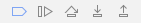

# PhoneGap CLI{#developing-apps-with-phonegap-cli}로 앱 개발

>[!NOTE]
>
>단일 페이지 애플리케이션 프레임워크 기반 클라이언트측 렌더링(예: 응답)이 필요한 프로젝트에는 SPA 편집기를 사용하는 것이 좋습니다. [추가 정보](/help/sites-developing/spa-overview.md).

개발 환경을 구성한 경우 개발자는 언제든지 디바이스 또는 에뮬레이터 내에서 앱을 실행할 수 있습니다.

다음 예제를 실행하려면 Xcode를 사용하여 OSx(Mac) 또는 Android SDK가 설치된 Mac/Win/Linux 시스템을 실행하는 시스템이 필요합니다.

## 개발 환경 Bootstrap {#bootstrap-your-development-environment}

[PhoneGap CLI 설정](https://docs.phonegap.com/en/4.0.0/guide_cli_index.md.html#The%20Command-Line%20Interface)

iOS의 경우:iPhone 및 iPad용으로 개발하려면 Apple의 Xcode IDE가 필요합니다.

* 무료로 [여기](https://developer.apple.com/xcode/downloads/)에 다운로드하십시오.
* [PhoneGap iOS 플랫폼 가이드](https://docs.phonegap.com/en/4.0.0/guide_platforms_ios_index.md.html#iOS%20Platform%20Guide)

Android의 경우:iPhone 및 iPad용으로 개발하려면 Google의 Android Studio IDE가 필요합니다.

* 무료로 [여기](https://developer.android.com/sdk/index.html)에 다운로드하십시오.
* [PhoneGap Android 플랫폼 가이드](https://docs.phonegap.com/en/4.0.0/guide_platforms_android_index.md.html#Android%20Platform%20Guide)

## 소스 {#download-the-source} 다운로드

개발 환경을 성공적으로 보완했으면 AEM App Build Tile에서 소스를 다운로드합니다.

* PhoneGap Build 타일 드롭다운 화살표를 클릭합니다.


* 소스 다운로드를 클릭합니다.
* 소스 다운로드 모달에서 원하는 소스를 선택합니다.


>[!NOTE]
>
>개발 소스에는 스테이징되지 않은 변경 사항을 포함한 최신 앱 상태가 포함되어 있습니다. App Store 업체에 제출하기 위해 릴리스 후보자를 빌드하려면 스테이징 소스를 사용하십시오.
>
>앱을 스테이징하지 않는 경우 스테이징을 선택하면 스테이징 워크플로가 트리거됩니다(힌트:이 경우 AppStore 및 Google PlayStore에서 사용할 수 있는 PhoneGap Enterprise Viewer 응용 프로그램에서 단계 앱으로 표시됩니다.)

* 다운로드를 클릭하고 컴퓨터에 ZIP을 저장합니다.
* 다운로드한 zip 파일을 작업 영역에 추출합니다.

## 앱 빌드 및 로드(출처) {#build-and-load-the-app-from-source}

PhoneGap CLI는 플랫폼 프로젝트를 만들고 소스를 컴파일하고 단일 명령으로 앱을 배포할 수 있습니다.

>[!NOTE]
>
>이러한 모든 단계를 별도로 수행할 수 있습니다. [PhoneGap CLI 문서](https://phonegap.com/blog/2014/11/13/phonegap-cli-3-6-3/)를 참조하십시오.

1. PhoneGap CLI를 설치했는지 확인하십시오. 위의 참조
1. 콘솔(또는 터미널) 창에서 추출된 소스의 루트 디렉토리를 찾습니다.
1. 다음 명령을 입력합니다.

```xml
phonegap run android

// -- or -- //

phonegap run ios
```

>[!NOTE]
>
>현재 문제가 있는 경우 기본 사항으로 돌아가 문제 해결 -
>
>1. 새 폴더 만들기(mkdir 테스트)
>1. 이 새 폴더로 이동(cd 테스트)
>1. &#39;phonegap create helloWorld&#39;를 실행합니다.
>1. helloWorld로 이동(cd helloWorld)
>1. &#39;phonegap run android(또는 android를 위와 같이 ios로 교체)를 실행합니다.
>1. JavaScript Bridge가 기본적으로 작동되는 경우 &#39;Device Ready&#39;라고 말하면서 새로 만든 PhoneGap 앱을 실행 중인 에뮬레이터가 열립니다.

>
>
PhoneGap CLI 개발 환경이 제대로 실행되고 있는지 확인합니다.

## Safari 및 IOS 디버그 {#debug-javascripts-with-safari-and-ios-debug}를 사용하여 Javascript 디버깅

웹 응용 프로그램과 같은 방법으로 Safari 개발자 도구를 사용하여 응용 프로그램의 JavaScripts를 디버깅할 수 있습니다.

## Safari 개발자 도구 활성화 {#enable-safari-developer-tools}

개발자 도구를 활성화하려면:

* Safari 환경 설정 열기

   * 메뉴 모음에서 Safari 클릭
   * 환경 설정을 클릭합니다.

* 기본 설정 창에서 고급을 클릭합니다.


* &quot;메뉴 모음에 현상 메뉴 표시&quot;를 선택합니다.
* 기본 설정 창 닫기

## iOS {#connect-safari-to-ios}에 Safari 연결

Safari를 iOS 장치 또는 에뮬레이터에 연결할 수 있습니다.

* 콘솔 창에서 추출된 소스의 루트 디렉토리를 찾습니다.
* 장치 또는 에뮬레이터에서 앱을 실행하려면 다음 명령을 입력합니다.

```xml
phonegap run <platform> --device

// -- or -- //

phonegap run <platform> --emulator
```

* Safari 열기
* 메뉴 모음에서 현상 클릭
* iOS 시뮬레이터 하위 메뉴 선택
* home.html을 클릭합니다.


## Safari의 웹 관리자 {#debug-javascript-with-safari-s-web-inspector}에서 JavaScript 디버깅

소스의 모든 위치에서 중단점을 설정할 수 있습니다. 에뮬레이터 또는 장치와 상호 작용하는 경우 해당 중단점에서 앱 실행이 중지됩니다. 실행을 단계별로 수행하고 변수의 값을 검사할 수 있습니다.

* 웹 관리자 창에서 리소스 클릭
* 소스 트리를 탐색하고 원하는 소스 파일을 클릭합니다.
* 중단점을 추가하려면 인접한 줄 번호를 클릭합니다.
* 디바이스 또는 에뮬레이터와 인터랙션


* 제어 단추를 사용하여 계속 실행, 단계 이동, 단계 시작 및 단계 종료:



>[!NOTE]
>
>변수의 값을 보려면 현재 메서드에서 마우스를 가져갑니다.

## 다음 단계 {#the-next-steps}

PhoneGap CLI를 사용하여 앱 개발에 대해 알려면 [장치 기능 액세스](/help/mobile/phonegap-access-device-features.md)를 참조하십시오.
