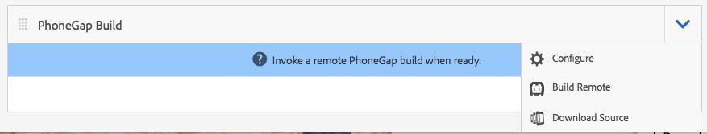

# PhoneGap CLI를 사용한 앱 개발{#developing-apps-with-phonegap-cli}

{{ue-over-mobile}}

개발 환경을 구성한 경우 개발자는 언제든지 디바이스 또는 에뮬레이터 내에서 앱을 실행할 수 있습니다.

다음 예를 실행하려면 Xcode로 macOS X를 실행하는 시스템이나 Android™ SDK이 설치된 Mac/Win/Linux 시스템이 필요합니다.

## 개발 환경 Bootstrap {#bootstrap-your-development-environment}

PhoneGap CLI 설정(`https://docs.phonegap.com/en/4.0.0/guide_cli_index.md.html#The%20Command-Line%20Interface`)

iOS의 경우: iPhone 및 iPad용으로 개발하려면 Apple의 Xcode IDE가 필요합니다.

* [여기](https://idmsa.apple.com/IDMSWebAuth/signin?appIdKey=891bd3417a7776362562d2197f89480a8547b108fd934911bcbea0110d07f757&path=%2Fdownload%2F&rv=1)에서 무료로 다운로드하세요.
* PhoneGap iOS 플랫폼 안내서(`https://docs.phonegap.com/en/4.0.0/guide_platforms_ios_index.md.html#iOS%20Platform%20Guide`)

Android™의 경우: iPhone 및 iPad용으로 개발하려면 Google의 Android™ Stuido IDE가 필요합니다.

* [여기](https://developer.android.com/studio)에서 무료로 다운로드하세요.
* PhoneGap Android™ 플랫폼 안내서(`https://docs.phonegap.com/en/4.0.0/guide_platforms_android_index.md.html#Android%20Platform%20Guide`)

## Source 다운로드 {#download-the-source}

개발 환경을 성공적으로 부트스트랩하면 AEM 앱 빌드 타일에서 소스를 다운로드합니다.

* PhoneGap Build 타일 드롭다운 V자형 화살표를 클릭합니다.



* Source 다운로드를 클릭합니다.
* Source 다운로드 모달에서 원하는 소스를 선택합니다.


>[!NOTE]
>
>개발 소스에는 스테이징되지 않은 변경 사항을 포함하여 앱의 최신 상태가 포함되어 있습니다. 앱스토어 공급업체에 제출할 릴리스 후보를 작성하려면 스테이징 소스를 사용하십시오.
>
>앱을 스테이징하지 않는 경우 스테이징을 선택하면 스테이징 워크플로우가 트리거됩니다(힌트: AppStore 및 Google PlayStore에서 사용할 수 있는 PhoneGap Enterprise Viewer 앱에 스테이징된 앱으로 표시됨).

* 다운로드 를 클릭하고 컴퓨터에 ZIP을 저장합니다.
* 다운로드한 zip 파일을 작업 공간에 추출합니다.

## 앱 빌드 및 로드(소스) {#build-and-load-the-app-from-source}

PhoneGap CLI는 단일 명령으로 플랫폼 프로젝트를 만들고, 소스를 컴파일하고, 앱을 배포할 수 있습니다.

>[!NOTE]
>
>이러한 모든 단계를 별도로 수행할 수 있습니다. PhoneGap CLI 문서(`https://phonegap.com/blog/2014/11/13/phonegap-cli-3-6-3/`)를 참조하십시오.

1. PhoneGap CLI를 설치했는지 확인하십시오. 위의 내용을 참조하십시오.
1. 콘솔(또는 터미널) 창에서 추출한 소스의 루트 디렉토리로 이동합니다.
1. 다음 명령을 입력합니다.

```xml
phonegap run android

// -- or -- //

phonegap run ios
```

>[!NOTE]
>
>이 시점에서 문제가 있는 경우 기본 사항으로 돌아가 문제를 해결하십시오.
>
>1. 폴더 만들기(mkdir 테스트)
>1. 이 새 폴더로 이동(cd 테스트)
>1. `phonegap create helloWorld` 실행
>1. helloWorld(cd helloWorld)로 이동
>1. `phonegap run android`을(를) 실행합니다(또는 위와 같이 Android™을 iOS으로 바꾸기).
>1. JavaScript Bridge이 기본 모드로 작동 중인 경우 에뮬레이터가 &#39;장치 준비&#39;라고 말하며 새로 만든 PhoneGap 앱을 실행하도록 열립니다.
>
>이 문제 해결은 PhoneGap CLI 개발 환경이 올바르게 실행되고 있는지 확인합니다.

## Safari 및 IOS 디버그로 JavaScript 디버그 {#debug-javascripts-with-safari-and-ios-debug}

웹 애플리케이션의 경우처럼 Safari의 개발자 도구를 사용하여 앱의 JavaScript을 디버깅할 수 있습니다.

## Safari 개발자 도구 활성화 {#enable-safari-developer-tools}

개발자 도구를 활성화하려면:

* Safari 환경 설정 열기

   * 메뉴 막대에서 Safari 를 클릭합니다.
   * Preferences 클릭

* 기본 설정 창에서 고급 을 클릭합니다.


* &quot;메뉴 막대에 개발 메뉴 표시&quot; 선택
* 기본 설정 창을 닫습니다.

## Safari를 iOS에 연결 {#connect-safari-to-ios}

Safari를 iOS 장치 또는 에뮬레이터에 연결할 수 있습니다.

* 콘솔 창에서 추출한 소스의 루트 디렉토리로 이동합니다.
* 장치 또는 에뮬레이터에서 앱을 시작할 수 있도록 다음 명령을 입력합니다.

```xml
phonegap run <platform> --device

// -- or -- //

phonegap run <platform> --emulator
```

* Safari 열기
* 메뉴 모음에서 개발 을 클릭합니다
* iOS Simulator 하위 메뉴 선택
* home.html을 클릭합니다.


## Safari의 Web Inspector로 JavaScript 디버그 {#debug-javascript-with-safari-s-web-inspector}

중단점은 소스의 어디에나 설정할 수 있습니다. 에뮬레이터나 디바이스와 상호 작용할 때 앱의 실행이 중단점에서 중지됩니다. 실행 단계를 진행하고 변수의 값을 검사할 수 있습니다.

* Web Inspector 창에서 Resources 를 클릭합니다.
* 소스 트리를 탐색하고 원하는 소스 파일을 클릭합니다
* 중단점을 추가하려면 옆에 있는 줄 번호를 클릭하십시오.
* 장치 또는 에뮬레이터와 상호 작용


* 제어 단추를 사용하여 메서드 실행, 스텝 오버, 스텝 인 및 스텝 아웃을 계속합니다.


>[!NOTE]
>
>현재 메서드의 변수 값을 보려면 마우스를 가리킵니다.

## 다음 단계 {#the-next-steps}

PhoneGap CLI를 사용한 앱 개발에 대해 알아본 후 [장치 기능 액세스](/help/mobile/phonegap-access-device-features.md)를 참조하십시오.
