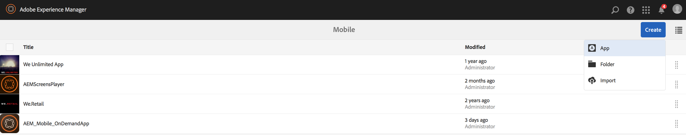

# 만들기 마법사를 사용하여 새 AEM Mobile 앱 만들기{#creating-a-new-aem-mobile-app-using-create-wizard}

>[!NOTE]
>
>단일 페이지 애플리케이션 프레임워크 기반 클라이언트측 렌더링(예: 응답)이 필요한 프로젝트에는 SPA 편집기를 사용하는 것이 좋습니다. [추가 정보](/help/sites-developing/spa-overview.md).

AEM Mobile 앱은 페이지 구조와 속성을 정의하는 청사진을 기반으로 합니다. 다음 응용 프로그램 속성을 구성할 수 있습니다.

* **제목:** 응용 프로그램 제목입니다.
* **대상 경로:** 응용 프로그램이 저장되는 저장소의 위치입니다. 앱 이름을 기반으로 경로를 만들려면 기본값을 그대로 두십시오.

* **이름:** 기본값은 공백 문자를 제거한 제목 속성 값입니다. 이 이름은 AEM 내에서 응용 프로그램을 참조하는 데 사용됩니다. 예를 들어 응용 프로그램을 나타내는 저장소 노드에 사용됩니다.
* **설명:** 응용 프로그램에 대한 설명입니다.
* **서버 URL:** OTA(Over-the-Air) 컨텐츠 업데이트를 제공하는 URL입니다. 기본값은 externalizer 서비스에서 가져온 응용 프로그램을 만드는 데 사용되는 인스턴스의 게시 서버 URL입니다. 이 인스턴스는 인증이 필요한 작성자가 아니라 게시 서버 인스턴스여야 합니다.

애플리케이션 축소판으로 사용할 이미지 파일을 제공하고 사용할 PhoneGap Build 구성을 선택하고 사용할 모바일 앱 분석 구성을 선택할 수도 있습니다. 이 이미지는 Experience Manager의 모바일 앱 콘솔 내에서 모바일 애플리케이션을 나타내는 축소판으로만 사용됩니다.

빌드 클라우드 서비스와 Adobe Mobile Services SDK 플러그인을 앱에 통합하는 추가(및 선택 사항) 탭이 있습니다.

* 빌드:구성 관리를 클릭하고 여기에서 build.phonegap.com build 서비스를 설정합니다. 그런 다음 드롭다운에서 새로 만든 PhoneGap 빌드 클라우드 서비스를 선택할 수 있습니다.
* 분석:구성 관리를 클릭하고 [Adobe Mobile Services SDK](https://docs.adobe.com/content/help/en/mobile-services/using/home.html) 클라우드 서비스를 설정합니다. 그런 다음 드롭다운에서 새로 만든 Mobile Service를 선택하여 모바일 앱에 통합할 수 있습니다.

## 앱 템플릿 사용 {#using-app-templates}

앱 템플릿을 사용하면 AEM 내에서 새로운 앱을 제작하는 데 사용되는 개발자가 만든 기존 디자인을 손쉽게 활용할 수 있습니다.

앱 템플릿이란 무엇입니까? 앱의 기준선 또는 기반을 나타내는 페이지 템플릿 및 구성 요소 컬렉션으로 간주합니다.
다른 앱의 템플릿을 기반으로 새 앱을 제작할 때 앱을 만든 앱의 시작점 담당자가 있는 앱이 표시됩니다.

이 기능을 사용하려면 기존의 모바일 앱 템플릿(또는 앱 템플릿이 있는 앱이 설치되어 있어야 합니다.)

최신 AEM Apps 샘플 패키지에는 앱 템플릿이 있는 업데이트된 버전의 Geometrixx 앱이 포함되어 있습니다. 또는 템플릿을 제공하는 [StarterKit](https://github.com/Adobe-Marketing-Cloud-Apps/aem-phonegap-starter-kit)을 설치할 수 있습니다.

앱 템플릿을 기반으로 새 앱을 만드는 단계:

1. AEM Mobile 앱 카탈로그로 이동합니다.&lt;*server-url*>aem/apps.html/content/mobileapps
1. **만들기**&#x200B;를 선택한 다음 아래 표시된 대로 **앱**&#x200B;을 선택합니다.

AEM 개발자가 제공하는 앱 템플릿을 선택합니다. 개발자 지원을 받으려면 [AEM Mobile 앱 구조](/help/mobile/phonegap-structure-an-app.md)를 참조하십시오.

필요에 따라 축소판 이미지를 변경하는 등 필요한 경우 새 앱의 세부 정보를 입력합니다. 이러한 값은 나중에 **앱 관리** 타일에서 편집할 수 있습니다.

## 다음 단계 {#the-next-steps}

다른 작성 역할에 대한 자세한 내용은 다음 리소스를 참조하십시오.

* [앱 관리 타일](/help/mobile/phonegap-app-details-tile.md)
* [앱 메타데이터 편집](/help/mobile/phonegap-editmetadata.md)
* [앱 정의](/help/mobile/phonegap-app-definitions.md)
* [기존 하이브리드 앱 가져오기](/help/mobile/phonegap-adding-content-to-imported-app.md)
* [컨텐츠 서비스](/help/mobile/develop-content-as-a-service.md)

## 추가 리소스 {#additional-resources}

관리자 및 개발자의 역할 및 책임을 살펴보려면 아래 리소스를 참조하십시오.

* [AEM을 사용하여 Adobe PhoneGap Enterprise를 위한 개발](/help/mobile/developing-in-phonegap.md)
* [AEM에서 Adobe PhoneGap Enterprise용 컨텐츠 관리](/help/mobile/administer-phonegap.md)
