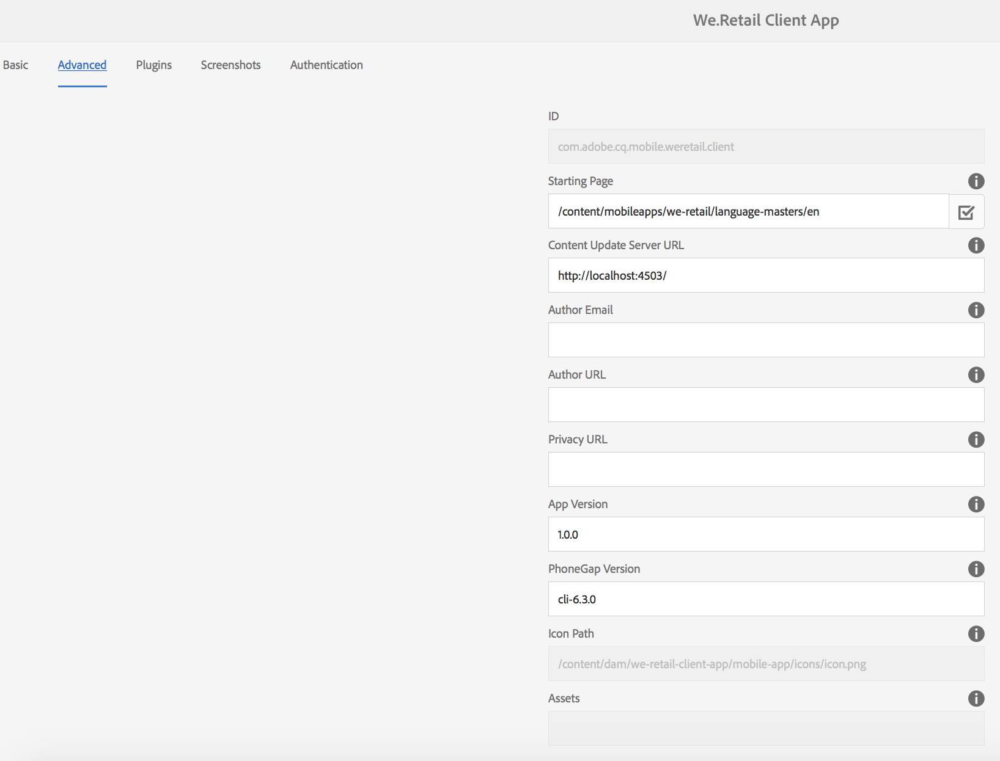

# 앱 메타데이터 편집 {#editing-app-metadata}

>[!NOTE]
>
>단일 페이지 애플리케이션 프레임워크 기반 클라이언트측 렌더링(예: React)이 필요한 프로젝트에 SPA 편집기를 사용하는 것이 좋습니다. [추가 정보](/help/sites-developing/spa-overview.md).

**앱 관리** 타일 및 &quot;앱 관리&quot; 페이지는 애플리케이션 메타데이터를 보고 편집하는 방법을 제공합니다. 앱 메타데이터는 애플리케이션을 공급업체 스토어에 릴리스하기 위해 필요한 세부 정보입니다. 여기에는 일반적인 메타데이터, iOS 메타데이터 및 스크린샷이 포함될 수 있습니다. 공통 및 iOS 메타데이터에 대한 자세한 내용은 [앱 타일 관리](/help/mobile/phonegap-app-details-tile.md)를 참조하십시오.

## 앱 데이터 편집 {#editing-the-app-data}

앱의 메타데이터를 편집하려면:

1. 앱의 대시보드 페이지로 이동합니다.

   

1. &#39;..&#39;을 클릭하여 세부 정보를 보거나 편집하려면 **앱 관리** 타일의 오른쪽 아래 모서리에 있습니다.

1. 아래 그림과 같이 사용 가능한 5개의 탭 중 하나에 세부 정보를 입력하거나 확인합니다.

   

## 공통 및 IOS 메타데이터 편집 {#editing-common-and-ios-metadata}

공통 및 IOS 메타데이터를 편집할 수 있습니다.

* 앱 설명 페이지에서 **고급** 탭을 선택합니다.
* 공통 및 IOS 메타데이터를 편집하거나 볼 수 있습니다. 자세한 내용은 아래 수치를 참조하십시오.

 

## 스크린샷 추가 및 제거 {#add-and-remove-screenshots}

메타데이터 롤업에 앱 스크린샷을 포함할 수 있습니다. 일부 공급업체에서는 앱을 앱스토어에 제출할 때 정확한 스크린샷이 필요합니다. 이러한 이미지는 Assets에 이미 있어야 합니다. 스크린샷을 업로드하려면 [자산 선택기](../assets/search-assets.md#assetpicker)을 참조하십시오.

### 스크린샷 추가 {#add-screenshots}

자산을 스크린샷으로 추가하려면:

1. **앱 관리** 페이지의 편집 모드에서 추가(더하기 아이콘)를 클릭합니다.
1. 자산을 선택하고 **선택**&#x200B;을 클릭하여 자산을 추가합니다.

   

1. 자산을 선택하고 **선택**&#x200B;을 클릭하여 자산을 추가합니다.

>[!NOTE]
>
>스크린샷은 대상 장치의 화면 해상도와 일치해야 합니다.

### 스크린샷 삭제 {#delete-screenshots}

스크린샷을 제거하려면

자산에서 삭제를 클릭합니다.

## 다음 단계 {#the-next-steps}

다른 작성 역할에 대한 자세한 내용은 다음 리소스를 참조하십시오.

* [앱 관리 타일](/help/mobile/phonegap-app-details-tile.md)
* [앱 정의](/help/mobile/phonegap-app-definitions.md)
* [앱 만들기 마법사를 사용하여 새 앱 만들기](/help/mobile/phonegap-create-new-app.md)
* [기존 하이브리드 앱 가져오기](/help/mobile/phonegap-adding-content-to-imported-app.md)
* [컨텐츠 서비스](/help/mobile/develop-content-as-a-service.md)

### 추가 리소스 {#additional-resources}

관리자 및 개발자의 역할과 책임에 대해 알아보려면 아래 리소스를 참조하십시오.

* [AEM을 사용한 Adobe PhoneGap Enterprise 개발](/help/mobile/developing-in-phonegap.md)
* [AEM을 통해 Adobe PhoneGap Enterprise에 대한 컨텐츠 관리](/help/mobile/administer-phonegap.md)
