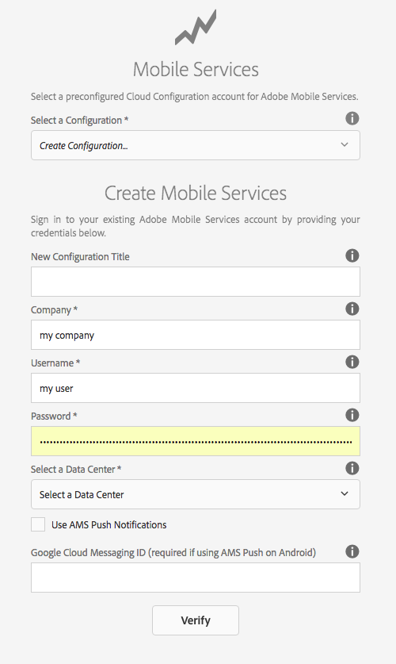

# Adobe Mobile Analytics를 사용하여 앱 성능 추적{#track-app-performance-with-adobe-mobile-analytics}

>[!NOTE]
>
>단일 페이지 애플리케이션 프레임워크 기반 클라이언트측 렌더링(예: 응답)이 필요한 프로젝트에 SPA 편집기를 사용하는 것이 좋습니다. [추가 정보](/help/sites-developing/spa-overview.md).

고객 전환율과 충성도를 높이려면

고객의 기대에 부응하는 매력적인 경험을 제공해야 합니다.

AEM Mobile 앱은 마케팅 캠페인에 어떤 역할을 합니까?

모바일 애플리케이션을 세밀하게 조정하여 사용자에게 최상의 경험을 제공하려면 어떻게 해야 합니까?

Adobe Mobile Services를 사용하면 모바일 앱의 사용 현황, 앱 충돌, 디바이스 세부 사항 및 기타 다양한 중요 지표를 추적하여 모바일 앱 사용 현황을 파악할 수 있습니다.

Adobe Experience Manager Mobile은 AEM Mobile Application Dashboard에서 바로 모바일 분석에 대한 세부 사항을 살펴볼 수 있습니다. 대시보드의 **모바일** 지표 타일은 모바일 애플리케이션에 대한 실시간 분석을 제공하므로 개발자, 작성자 및 관리자는 모바일 앱의 상태를 신속하게 파악할 수 있습니다. 분석을 구현하는 표지 아래에 Adobe Mobile [Analytics SDK가](https://www.adobe.com/ca/solutions/digital-analytics/mobile-web-apps-analytics.html) 있습니다. Adobe Mobile Analytics SDK 파섹 지표가 수집되어 장치가 연결될 때까지 장치에 캐시되며, 데이터가 보고 및 분석을 위해 Adobe Mobile Services Cloud로 푸시됩니다.

Adobe Mobile Analytics SDK는 다음을 제공합니다.

1. **모바일 채널을** 위한 데이터 수집 - 모든 주요 운영 체제에서 모바일 웹 사이트 및 앱에 대한 포괄적인 데이터를 수집할 수 있습니다.
1. **모바일 참여 분석** - 모바일 앱, 웹 사이트 또는 비디오에서 소비자의 참여 여부, 고객이 채널을 실행하는 빈도, 채널을 통한 구매 여부 등을 파악할 수 있습니다.
1. **모바일 앱 대시보드 및 보고서** - 앱 및 앱스토어 지표에 대한 라이프사이클 지표가 포함된 사용량 보고서를 가져올 수 있습니다. — 사용자 트렌드, 시작 횟수, 평균 세션 길이, 유지 길이 및 충돌 횟수를 참조하십시오.
1. **모바일 캠페인 분석** - SMS, 모바일 검색 광고, 모바일 디스플레이 광고 및 QR 코드와 같은 모바일 특정 캠페인의 효과를 수량화할 수 있습니다.
1. **지리적 위치 분석** - 앱 사용자가 GPS 위치 또는 관심 위치를 기반으로 모바일 경험을 실행하고 인터랙션하는 위치를 찾을 수 있습니다.
1. **경로 지정 분석** - 사용자가 앱을 탐색하여 사용자의 참여를 유도하는 화면 및 UI 요소와 사용자의 이탈률을 확인하는 방법을 확인할 수 있습니다.

이 섹션에서는 AEM [개발자가](#developers) 분석 추적을 사용하여 AEM Mobile 앱을 계측하는 방법에 대해 설명합니다.

마지막으로 AEM [관리자는](#administrators) 다음 작업을 배웁니다.

* adobe Mobile Services 클라우드 서비스 만들기
* 모바일 서비스 구성 만들기 및 보고서 세트 연결
* 모바일 서비스 구성을 모바일 앱에 연결
* aem Apps 명령 센터를 통해 지표 보기
* ams SDK 구성을 모바일 앱에 할당

## 개발자의 경우 - Analytics를 앱에 통합 {#for-developers-integrate-analytics-into-your-app}

**** 사전 요구 사항:AEM 관리자는 아래 [설명된](#amscloudserviceconfig)대로 Adobe Mobile Services 클라우드 구성을 구성해야 합니다.

개발자는 모바일 앱 컨텐츠를 추적, 보고 및 이해하는 데 필요한 AEM Mobile 앱에 [분석을](/help/mobile/phonegap-add-analytics-to-apps.md) 추가하고, 사용자가 앱 시작, 앱 내 시간 및 충돌률과 같은 주요 라이프사이클 지표를 측정하는 데 필요한 책임을 집니다.

## 관리자 - Adobe Mobile Services 클라우드 서비스 구성 {#for-administrators-configure-the-adobe-mobile-services-cloud-service}

Adobe Mobile Services를 활용하려면 Adobe Analytics 계정 정보로 AEM Adobe Mobile Services Cloud Service를 구성해야 합니다. Apps 명령 센터는 클라우드 서비스를 **만들고 모바일** 앱과 연결할 수 있는 지표 분석 타일을 제공합니다.

지표 분석 타일에 있는 톱니바퀴 아이콘을 클릭하여 모바일 앱에 대한 클라우드 서비스를 구성합니다.

지표 분석 타일에서 톱니바퀴 아이콘을 클릭하면 &#39;Mobile Services 분석 구성&#39; 모달 대화 상자가 열립니다. &#39;Mobile Service 구성 선택&#39; 드롭다운에서 구성을 선택합니다. 새 구성을 생성해야 하는 경우 공구 모양 버튼을 클릭합니다.

Adobe Mobile Service 클라우드 서비스를 만들려면 서비스 연결 및 구성에 할당할 보고 세트를 선택하는 두 가지 단계가 포함됩니다.

시작하려면 대시보드의 클라우드 서비스 관리 타일에서 &#39;+&#39; 버튼을 클릭합니다.

&#39;**+**&#39; 버튼을 클릭하면 클라우드 서비스 **추가** 마법사가 표시됩니다.

아래 표시된 대로 필수 필드를 채워 새 모바일 서비스 구성을 선택하거나 만듭니다. AEM 관리자는 Adobe Mobile Services에 대한 연결을 성공적으로 만들려면 이 정보를 필요로 합니다.

Mobile Services 계정 설정을 완료하면 앱을 선택하라는 메시지가 표시됩니다. 이렇게 하면 Adobe Mobile Service 분석 보고가 해당 애플리케이션에 연결됩니다.

원하는 모바일 서비스를 선택하고 &#39;업데이트&#39;를 클릭하여 모바일 서비스 구성을 할당하고 대화 상자를 닫습니다.

이제 모바일 서비스 구성을 AEM Mobile 앱에 연결했으므로 타일은 지표 데이터를 가져와 보고를 시작합니다.

### Adobe Mobile Services SDK 구성 파일 {#adobe-mobile-services-sdk-config-file}

이때 모바일 애플리케이션은 클라우드 서비스와 연관되어 있지만 모바일 애플리케이션은 수집된 모바일 지표를 다시 Adobe Analytics에 전달하는 방법을 아직 알지 못합니다. 모바일 앱을 Adobe Analytics에 연결하려면 Adobe Mobile Services SDK 구성 파일을 Adobe Experience Manager에 추가해야 합니다.

지표 분석 타일에서 화살표 아이콘을 클릭하여 AMS 다운로드/업로드 SDK 구성 메뉴 항목을 표시합니다.

첫 번째 단계는 Adobe Mobile Services에서 SDK 구성을 가져오는 것입니다. &#39;AMS SDK 구성 다운로드&#39;를 클릭하면 구성 파일을 다운로드할 수 있는 Adobe Mobile Services 웹 사이트로 리디렉션됩니다. ADBMobileConfig.json 파일을 입수했으면 &quot;AMS SDK 구성 업로드&quot;를 클릭하여 구성 파일을 AEM에 업로드합니다.

&#39;Adobe Mobile Services 응용 프로그램 구성 업로드&#39; 단추를 클릭하고 ADBMobileConfig.json 파일을 찾은 다음 &#39;업로드&#39;를 클릭합니다.

모바일 앱은 ADBMobileConfig.json 파일에 액세스할 수 있으므로 Adobe Analytics로 다시 커뮤니케이션하고 앱 성공에 도움이 되는 중요한 지표 값에 대한 보고를 시작하는 방법에 대한 지식을 보유하고 있습니다.

## 다음 기능 {#what-s-next}

1. [AEM Mobile 앱 경험 시작](/help/mobile/starting-aem-phonegap-app.md)
1. [앱 콘텐츠 관리](/help/mobile/phonegap-manage-app-content.md)
1. [내 애플리케이션 빌드](/help/mobile/building-app-mobile-phonegap.md)
1. [Adobe Mobile Analytics를 사용하여 앱의 성능 추적](/help/mobile/phonegap-intro-to-app-analytics.md)
1. [Adobe Target을 통해 개인화된 앱 경험 제공](/help/mobile/phonegap-aem-mobile-content-personalization.md)
1. [사용자에게 중요 메시지 보내기](/help/mobile/phonegap-push-notifications.md)