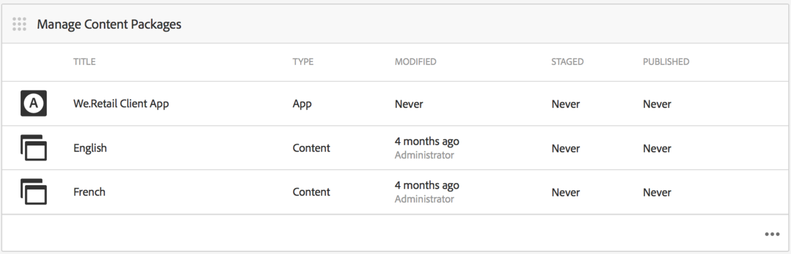
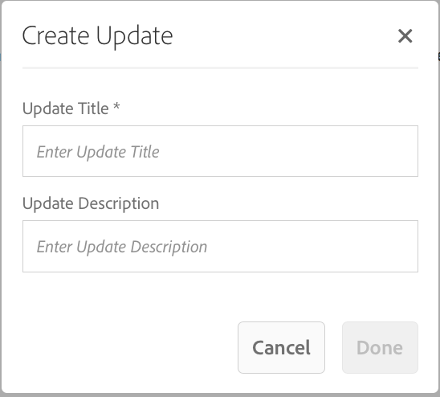
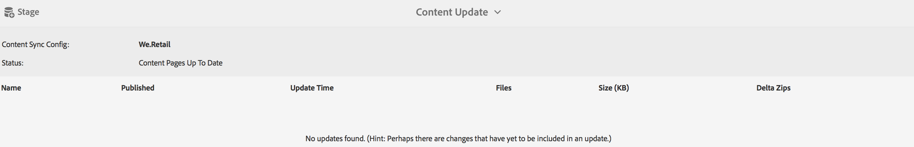

# 앱 컨텐츠 만들기 및 관리{#creating-and-managing-app-content}

>[!NOTE]
>
>Adobe 단일 페이지 애플리케이션 프레임워크 기반 클라이언트측 렌더링(예: React)이 필요한 프로젝트에는 SPA Editor를 사용하는 것이 좋습니다. [자세히 알아보기](/help/sites-developing/spa-overview.md).

앱 콘텐츠를 관리하려면 [개발자](#developer), 콘텐츠 [작성자](#author) 및 [관리자](#administrator)의 공동 노력이 필요합니다. 작성자는 앱 개발자가 생성한 템플릿과 구성 요소를 기반으로 하는 페이지를 조작합니다.

마지막으로 관리자는 업데이트된 앱 컨텐츠를 전략적으로 게시합니다.

>[!NOTE]
>
>**필수 구성 요소**:
>
>[배포 및 유지 관리](/help/sites-deploying/deploy.md)에서 개발자는 AEM(Adobe Experience Manager)의 시스템 구성 요소와 템플릿에 익숙해졌습니다.

## 페이지 콘텐츠 관리 타일 {#the-manage-page-content-tile}

>[!CAUTION]
>
>기본 제공 앱 템플릿을 사용하지 않는 경우 새 앱 컨텐츠를 OTA에 게시할 수 있도록 하려면 컨텐츠 동기화 핸들러를 구성해야 합니다.
>
>자세한 내용은 개발자 섹션의 [콘텐츠 동기화가 있는 모바일](/help/mobile/phonegap-contentsync.md)을 참조하십시오.

여기에서는 AEM Sites 내에서 할 수 있는 것과 거의 동일한 방식으로 AEM Mobile에서 컨텐츠를 만들고, 편집하고, 삭제할 수 있습니다.

**페이지 콘텐츠 관리 타일**&#x200B;은 관리되는 콘텐츠의 페이지 수와 특정 페이로드에 대해 마지막으로 수정된 페이지 수를 표시합니다. 타일에서 각 레코드를 클릭하여 페이지를 만들고, 복사하고, 이동하고, 삭제하고, 업데이트하기 위해 콘텐츠를 드릴인할 수 있습니다.

콘텐츠가 업데이트되면 관리자는 **콘텐츠 패키지 관리 타일을 통해 OTA(콘텐츠 업데이트 페이로드 Over-the-Air)를 고객에게 게시할 수 있습니다.**

나열된 콘텐츠 패키지 중 하나를 선택하여 페이지 작성, 편집 또는 제거, 탐색 및 페이지 순서 변경, 복사(텍스트) 및 미디어와 같은 콘텐츠를 작성하거나 업데이트하는 등의 콘텐츠를 작성하거나 편집합니다.

참고 *모든 콘텐츠는 콘텐츠입니다*. 즉, 앱 스토어에 방문하지 않고도 애플리케이션 스타일, 복사(텍스트), 미디어, 페이지, 탐색 및 콘텐츠 타겟팅을 모두 편집하고 OTA를 업데이트할 수 있습니다.

AEM Mobile 콘텐츠를 편집하려면 *AEM 작성자 *AEM의 콘텐츠 편집 인터페이스를 잘 이해해야 합니다. [AEM에서 페이지 작성](/help/sites-authoring/qg-page-authoring.md)

## 콘텐츠 패키지 관리 타일 {#the-manage-content-packages-tile}

여기에서 *AEM 관리자*&#x200B;는 개발자나 앱스토어를 다시 제출하지 않고도 흥미로운 경험과 최신 콘텐츠를 제공하도록 앱을 빠르고 쉽게 업데이트하여 브랜드 참여를 유도하고 비즈니스 목표를 달성할 수 있습니다.

*AEM 작성자*&#x200B;가 콘텐츠 관리 타일을 통해 콘텐츠를 추가하거나 수정하면 *AEM 관리자*&#x200B;가 콘텐츠 패키지를 업데이트하여 이러한 변경 사항을 고객에게 푸시할 수 있습니다.

콘텐츠 패키지 작업을 사용하면 개발 팀이 탐색, 스타일, 서버측 논리, 템플릿 및 구성 요소를 포함한 호스트 응용 프로그램 디자인 및 구현을 변경한 다음 배포를 위해 여러 저장소에 다시 제출하지 않고도 고객에게 해당 변경 사항을 푸시하는 동안 *AEM 작성자*&#x200B;가 페이지 콘텐츠를 만들고 편집할 수 있습니다.

**새 콘텐츠 또는 업데이트된 콘텐츠를 게시하려면**

타일에서 컨텐츠 패키지를 선택합니다. 이 예제에서는 영어 패키지를 선택합니다. 콘텐츠 업데이트 대화 상자에 관련 *콘텐츠 동기화* 구성이 나열됩니다. 이전 업데이트 이후 앱 콘텐츠가 수정된 경우 아래와 같이 *보류 중* 상태가 표시됩니다.

그런 다음 오른쪽 상단에서 **단계** 작업을 선택하여 콘텐츠 업데이트를 만듭니다. 적절한 업데이트 정보를 추가하고 완료 를 누릅니다.

그런 다음 *Content Sync* 처리기는 델타(변경된 *only* 패키지만)를 형성하여 필요한 패키지를 만듭니다. 완료되면 이 업데이트 콘텐츠 패키지가 아래와 같이 준비됩니다.

콘텐츠에 대한 업데이트를 스테이징하면 모바일 장치에 게시하기 전에 여러 업데이트를 수행할 수 있습니다.

>[!NOTE]
>
>게시 전에 AEM Verify 앱을 사용하여 스테이징된 콘텐츠를 확인할 수 있습니다.
>
>AEM 확인 앱에 대한 자세한 내용은 [AEM 확인을 위한 모바일 빠른 시작](/help/mobile/phonegap-mobile-quickstart.md)을 참조하십시오.

Content Sync OTA를 사용하여 앱 사용자에게 새 콘텐츠를 전달할 준비가 되면 아래와 같이 **Publish**&#x200B;을(를) 선택합니다.

### 다음 단계 {#the-next-steps}

응용 프로그램 대시보드에서 앱 컨텐츠를 만들고 관리하는 방법에 대해 알아본 후에는 다른 작성 역할에 대해 다음 리소스를 참조하십시오.

* [앱 관리 타일](/help/mobile/phonegap-app-details-tile.md)
* [앱 메타데이터 편집](/help/mobile/phonegap-editmetadata.md)
* [앱 정의](/help/mobile/phonegap-app-definitions.md)
* [앱 만들기 마법사를 사용하여 새 앱 만들기](/help/mobile/phonegap-create-new-app.md)
* [기존 하이브리드 앱 가져오기](/help/mobile/phonegap-adding-content-to-imported-app.md)

### 추가 리소스 {#additional-resources}

관리자 및 개발자의 역할과 책임에 대해 알아보려면 아래 리소스를 참조하십시오.

* [AEM을 사용하여 Adobe PhoneGap Enterprise용 개발](/help/mobile/developing-in-phonegap.md)
* [AEM을 사용하여 Adobe PhoneGap Enterprise용 컨텐츠 관리](/help/mobile/administer-phonegap.md)
