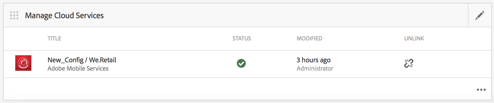

# 알림 푸시{#push-notifications}

>[!NOTE]
>
>단일 페이지 애플리케이션 프레임워크 기반 클라이언트측 렌더링(예: 응답)이 필요한 프로젝트에는 SPA 편집기를 사용하는 것이 좋습니다. [추가 정보](/help/sites-developing/spa-overview.md).

중요한 알림을 통해 AEM Mobile 앱 사용자에게 즉시 알릴 수 있는 것은 모바일 앱과 마케팅 캠페인의 가치에 중요합니다. 여기에서 앱이 푸시 알림을 받을 수 있도록 허용하기 위해 수행해야 하는 단계와 AEM Mobile에서 휴대폰에 설치된 앱으로 푸시를 구성 및 전송하는 방법에 대해 설명합니다. 또한 이 섹션에서는 푸시 알림에 [딥 링크](#deeplinking) 기능을 구성하는 방법에 대해 설명합니다.

>[!NOTE]
>
>*푸시 알림은 배달이 보장되지 않습니다.그들은 발표 같은 것이다. 모든 사람이 받을 수 있도록 최선을 다하되 보장된 배달 메커니즘이 아닙니다. 또한 푸시 전달 시간은 1초 미만에서 최대 30분까지 달라질 수 있습니다.*

AEM에서 푸시 알림을 사용하려면 몇 가지 다른 기술이 필요합니다. 먼저 푸시 알림 서비스 공급자를 사용하여 사전 설정과 장치를 관리해야 합니다(AEM에서는 아직 이렇게 하지 않음). 2개의 공급자가 AEM과 함께 즉시 구성됩니다.[Amazon Simple Notification Service](https://aws.amazon.com/sns/)(또는 SNS) 및 [Pushwoosh](https://www.pushwoosh.com/). 둘째, 해당 모바일 OS에 대한 푸시 기술은 iOS 장치에 적합한 서비스(Apple의 푸시 알림 서비스 또는 APNS)를 통해야 합니다.및 Android 장치용 Google 클라우드 메시지 기능(또는 GCM). AEM은 이러한 플랫폼 특정 서비스와 직접 통신하지 않지만, 이러한 서비스가 푸시를 실행하려면 알림과 함께 일부 관련 구성 정보를 AEM에서 제공해야 합니다.

설치 및 구성되면(아래에 설명됨) 다음과 같이 작동합니다.

1. 푸시 알림은 AEM에서 생성되어 서비스 공급자(Amazon SNS 또는 Pushwoosh)로 전송됩니다.
1. 서비스 제공자가 수신하여 핵심 공급자(APNS 또는 GCM)에 전송합니다.
1. 핵심 공급자가 해당 푸시에 대해 등록된 모든 장치에 알림을 푸시합니다. 각 장치에 대해 현재 장치에서 사용 가능한 셀룰러 데이터 네트워크 또는 WiFi를 사용합니다.
1. 등록된 앱이 실행되고 있지 않은 경우 장치에 알림이 표시됩니다. 알림을 탭하면 앱이 시작되고 앱 내에 알림이 표시됩니다. 응용 프로그램이 이미 실행 중인 경우 인앱 알림만 표시됩니다.

이번 AEM 릴리스는 iOS 및 Android 모바일 장치를 지원합니다.

## 개요 및 절차 {#overview-and-procedure}

AEM Mobile 앱에서 푸시 알림을 사용하려면 다음 고급 단계를 수행해야 합니다.

일반적으로 AEM 개발자는 다음을 수행합니다.

1. Apple 및 Google 메시징 서비스에 등록
1. 푸시 메시지 서비스에 등록하고 구성합니다.
1. 앱에 푸시 지원 추가
1. 테스트 전화 준비

AEM 관리자가 다음을 수행하는 동안:

1. AEM 앱에서 푸시 구성
1. 앱 빌드 및 배포
1. 푸시 알림 보내기
1. 딥 링크 구성 *(선택 사항)*

### 1단계:Apple 및 Google 메시징 서비스에 등록 {#step-register-with-apple-and-google-messaging-services}

#### APNS(Apple Push Notification 서비스) {#using-the-apple-push-notification-service-apns} 사용

Apple 푸시 알림 서비스에 익숙해지려면 Apple 페이지 [여기](https://developer.apple.com/library/ios/documentation/NetworkingInternet/Conceptual/RemoteNotificationsPG/Chapters/ApplePushService.html)로 이동하십시오.

APNS를 사용하려면 Apple의 **인증서** 파일(.cer 파일), 푸시 **개인 키**(.p12 파일) 및 **개인 키 암호**&#x200B;가 필요합니다. 방법 지침은 [여기](https://developer.apple.com/library/ios/documentation/NetworkingInternet/Conceptual/RemoteNotificationsPG/Chapters/ProvisioningDevelopment.html)에 있습니다.

#### Google 클라우드 메시지 기능(GCM) 서비스 {#using-the-google-cloud-messaging-gcm-service} 사용

>[!NOTE]
>
>Google에서 GCM을 FCM(Firebase Cloud Messaging)이라는 유사한 서비스로 대체하고 있습니다. FCM에 대한 자세한 내용을 보려면 [여기](https://developers.google.com/cloud-messaging/faq)를 클릭하십시오.

Android용 Google 클라우드 메시지 기능에 익숙해지려면 Google 페이지 [여기](https://developer.android.com/google/gcm/index.html)로 이동합니다.

[여기](https://developer.android.com/google/gcm/gs.html)Google API 프로젝트 만들기&#x200B;**,** GCM 서비스 활성화&#x200B;**및** API 키 얻기&#x200B;**에 대한 단계를 따라야 합니다.** Android 장치에 푸시 알림을 전송하려면 **API 키**&#x200B;가 필요합니다. 또한 **프로젝트 번호**&#x200B;를 기록하십시오. 이 이름은 **GCM 보낸 사람 ID**&#x200B;라고도 합니다.

다음 단계는 GCM API 키를 만드는 다른 방법을 보여줍니다.

1. google에 로그인하고 [Google의 개발자 페이지](https://developers.google.com/mobile/add?platform=android&amp;cntapi=gcm)로 이동합니다.
1. 목록에서 앱을 선택하거나 새 앱을 만듭니다.
1. Android 패키지 이름에서 앱 ID(예:`com.adobe.cq.mobile.weretail.outdoorsapp`. (제대로 작동하지 않는 경우 &quot;test.test&quot;로 다시 시도하십시오.)
1. **서비스 선택 및 구성 계속 클릭**
1. 클라우드 메시지 기능을 선택한 다음 **Google 클라우드 메시지 활성화**&#x200B;를 클릭합니다.
1. 새 서버 API 키와 (신규 또는 기존) 보낸 사람 ID가 표시됩니다.

>[!NOTE]
>
>서버 API 키를 기록합니다. 이 값은 푸시 공급자의 사이트에 입력됩니다.

### 2단계:푸시 메시지 서비스 {#step-register-and-configure-a-push-messaging-service} 등록 및 구성

AEM은 푸시 알림에 대해 다음 3개 서비스 중 하나를 사용하도록 구성되어 있습니다.

* Amazon SNS
* Pushwoosh
* Adobe Mobile Services

*Amazon* SNS 및  ** Pushwoshconfiguration을 사용하면 AEM 스크린에서 푸시된 푸시된 푸시된 푸시할 수 있습니다.

*Adobe Mobile* Services 구성을 사용하면 Adobe Analytics 계정을 사용하여 Adobe Mobile Services 내에서 푸시 알림을 구성하고 전송할 수 있습니다(그러나 AMS 푸시 알림을 활성화하려면 이 구성 세트로 앱을 빌드해야 함).

#### Amazon SNS 메시징 서비스 {#using-the-amazon-sns-messaging-service} 사용

>[!NOTE]
>
>*Amazon SNS에 대한 정보와 새 AWS 계정을 만드는 링크가 여기에  [있습니다](https://aws.amazon.com/sns/). 1년 동안 무료 계정을 얻을 수 있습니다.*

Amazon SNS를 사용하지 않으려면 이 단계를 건너뛸 수 있습니다.

푸시 알림을 위해 Amazon SNS를 설정하려면 다음 단계를 따르십시오.

1. **Amazon SNS에 등록**

   1. 계정 ID를 기록합니다. 형식은 공백 또는 대시 없이 12자리여야 합니다(예:&quot;123456789012&quot;.
   1. &quot;미국-동&quot; 또는 &quot;eu&quot; 영역에 있는지 확인합니다. 이후 단계(ID 풀 생성)에는 이 중 하나가 필요합니다.
   1. 등록 후 관리 콘솔에 로그인하고 [SNS](https://console.aws.amazon.com/sns/) (푸시 알림 서비스)를 선택합니다. &quot;시작하기&quot;가 나타나면 클릭합니다.

1. **액세스 키 및 ID 만들기**

   1. 화면 오른쪽 상단에 있는 로그인 이름을 클릭하고 메뉴에서 [보안 자격 증명]을 선택합니다.
   1. 액세스 키를 클릭하고 아래 스페이스에서 **새 액세스 키 만들기**&#x200B;를 클릭합니다.
   1. **액세스 키 표시**&#x200B;를 클릭하고 표시된 액세스 키 ID 및 비밀 액세스 키를 복사하여 저장합니다. 키를 다운로드하는 옵션을 선택하면 동일한 값이 포함된 csv 파일이 표시됩니다.
   1. 다른 보안 관련 인증서 및 기타 다른 인증서는 이 페이지에서 관리할 수 있습니다.

   >[!NOTE]
   >
   >액세스 키는 여러 앱에 사용할 수 있습니다.

   &quot;AWS Sandbox&quot; 계정을 사용하는 조직의 경우, 단계는 매우 유사하며 여기에 요약되어 있습니다.

   1. 화면 오른쪽 상단에 있는 로그인 이름을 클릭하고 메뉴에서 [내 보안 자격 증명]을 선택합니다.
   1. 작업 왼쪽 목록에서 사용자를 클릭하고 사용자 이름을 선택합니다.
   1. 보안 자격 증명 탭을 클릭합니다.
   1. 여기에서 키를 보고 새 키를 만듭니다. 나중에 사용할 수 있도록 키를 저장합니다.

1. **주제 만들기**

   1. **주제 만들기**&#x200B;를 클릭하고 주제 이름을 선택합니다. 주제 ARN, 주제 소유자, 영역, 표시 이름과 같은 모든 필드를 기록합니다.
   1. **기타 주제 작업** > **주제 정책 편집**&#x200B;을 클릭합니다. **이러한 사용자가 이 항목에 가입하도록 허용**&#x200B;에서 **모든 사용자**&#x200B;를 선택합니다.
   1. **정책 업데이트**&#x200B;를 클릭합니다.

   >[!NOTE]
   >
   >개발, 테스트, 데모 등과 같은 다양한 시나리오에 대해 여러 항목을 만들 수 있습니다. 나머지 SNS 구성은 동일하게 유지될 수 있습니다. 다른 주제를 사용하여 앱을 빌드합니다.해당 항목으로 전송된 푸시 알림은 해당 주제와 함께 빌드된 앱에서만 수신됩니다.

1. **플랫폼 애플리케이션 만들기**

   1. 애플리케이션, 플랫폼 애플리케이션 만들기를 차례로 클릭합니다. 이름을 선택하고 플랫폼(iOS의 경우 APNS, Android의 경우 GCM)을 선택합니다. 플랫폼에 따라 다른 필드를 입력해야 합니다.

      1. APNS의 경우 P12 파일, 암호, 인증서 및 개인 키를 모두 입력해야 합니다. 위의 *APNS(Apple Push Notification 서비스)* 단계에서 이러한 정보를 받았어야 합니다.
      1. GCM의 경우 API 키를 입력해야 합니다. 이 값은 위의 *GCM(Google Cloud Messaging) 서비스 사용*&#x200B;단계에서 얻어야 합니다.
   1. 지원할 각 플랫폼에 대해 위 단계를 한 번 반복합니다. iOS와 Android 모두에 푸시할 수 있으려면 두 개의 플랫폼 애플리케이션을 만들어야 합니다.

1. **ID 풀 만들기**

   1. 인증되지 않은 사용자의 기본 데이터를 저장할 자격 증명 풀을 만들려면 [Cognito](https://console.aws.amazon.com/cognito)를 사용합니다. 현재 &quot;미국-동부&quot; 및 &quot;eu&quot; 리전만 Amazon Cognito에서 지원됩니다.
   1. 이름을 지정하고 &quot;인증되지 않은 ID에 액세스 활성화&quot;에 대한 상자를 선택합니다.
   1. 다음 페이지(&quot;*Cognito ID는 사용자 리소스에 대한 액세스 필요*&quot;)에서 허용을 클릭합니다.
   1. 페이지의 오른쪽 상단에서 &quot;*ID 풀 편집&quot;* 링크를 클릭합니다. ID 풀 ID가 표시됩니다. 나중에 이 텍스트를 저장합니다.
   1. 동일한 페이지에서 &quot;인증되지 않은 역할&quot; 옆의 드롭다운을 선택하고 Cognito_&lt;pool name>UnauthRole 역할이 선택되어 있는지 확인합니다. 변경 내용을 저장합니다.

1. **액세스 구성**

   1. [Identity and Access Management](https://console.aws.amazon.com/iam/home)(IAM)에 로그인합니다.
   1. 역할 선택
   1. 이전 단계에서 만든 역할(Cognito_&lt;yourIdentityPoolName>Unauth_Role)을 클릭합니다. 표시된 &quot;역할 ARN&quot;을 기록합니다.
   1. 아직 열지 않은 경우 &quot;인라인 정책&quot;을 엽니다. 여기에는 oneClick_Cognito_&lt;yourIdentityPoolName>Unauth_Role_1234567890123과 같은 이름의 정책이 표시됩니다.
   1. &quot;정책 편집&quot;을 클릭합니다. 정책 문서의 내용을 다음 JSON 코드 조각으로 바꿉니다.

   <table>
    <tbody>
     <tr>
     <td>
 
 
{
 
 "버전":"2012-10-17",
 
 "구문": [
 
 {
 
 "작업": [
 
 "mobileanalytics:PutEvents",
 
 "cognito-sync:*",
 
 "SNS:CreatePlatformEndpoint",
 
 "SNS:구독"
 
 ],
 
 "효과":"허용",
 
 "리소스": [
 
 "*"
 
 ]
 
 }
 
 ]
 
}
 
 
 </td>
     </tr>
    </tbody>
    </table>

   1. **정책 적용**&#x200B;을 클릭합니다.

#### Pushwoosh 메시징 서비스 {#using-the-pushwoosh-messaging-service} 사용

Pushwoosh를 사용하지 않으려면 이 단계를 건너뛸 수 있습니다.

Pushwoosh를 사용하려면:

1. **Pushwoosh에 등록**

   1. pushwoosh.com으로 이동하여 새 계정을 만듭니다.

1. **API 액세스 토큰 만들기**

   1. Pushwoosh 사이트에서 API 액세스 메뉴 항목으로 이동하여 API 액세스 토큰을 생성합니다. 이것을 안전하게 녹음해야 합니다.

1. **새 앱 만들기**

   1. Android 지원의 경우 GCM API 키를 제공해야 합니다.
   1. 앱을 구성할 때 프레임워크로 Cordova를 선택합니다.
   1. iOS 지원의 경우 인증서 파일(.cer), 푸시 인증서(.p12) 및 개인 키 암호를 제공해야 합니다.이는 애플의 APNS 사이트에서 얻었을 것이다. 프레임워크에서 Cordova를 선택합니다.
   1. Pushwoosh는 &quot;XXXXX-XXXXX&quot; 형식으로 해당 앱의 앱 ID를 생성하며, 여기서 각 X는 16진수 값(0~F)입니다.

>[!NOTE]
>
>*두 번째 앱이 동일한 앱 ID(및 기타 관련 값)로 AEM에 구성된 경우:API 액세스 토큰 및 GCM ID), AEM의 두 번째 앱을 통해 전송되는 모든 푸시 알림은 해당 앱 ID가 있는 다른 앱으로 이동합니다.*

### 3단계:푸시 지원을 앱 {#step-add-push-support-to-the-app} 추가

#### ContentSync 구성 추가 {#add-contentsync-configuration}

notificationsConfig라는 두 개의 컨텐트 노드(app-config에 하나, app-config-dev에 하나)를 만듭니다.

* /content/`<your app>`/shell/jcr:content/page-app/app-config-dev/notifications구성
* /content/`<your app>`/shell/jcr:content/page-app/app-config/notifications구성

다음 속성(.content.xml 파일) 사용:
&lt;jcr:root xmlns:jcr=&quot; [https://www.jcp.org/jcr/1.0](https://www.jcp.org/jcr/1.0)&quot; xmlns:nt=&quot; [https://www.jcp.org/jcr/nt/1.0](https://www.jcp.org/jcr/nt/1.0)&quot;
jcr:primaryType=&quot;nt:unstructured&quot;
excludeProperties=&quot;[appAPIAaccessToken]&quot;
path=&quot;../././../.&quot;
targetRootDirectory=&quot;www&quot;
type=&quot;notificationsconfig&quot;/>

>[!NOTE]
>
>콘텐츠 동기화 핸들러는 해당 노드를 찾고, 노드가 없으면 page-notifications-config.json 파일을 쓰지 않습니다.

#### 클라이언트 라이브러리 추가 {#add-client-libraries}

다음 단계에 따라 푸시 알림 클라이언트 라이브러리를 앱에 추가해야 합니다.

CRXDE Lite:

1. */etc/designs/phonegap/&lt;app name>/clientlibsall로 이동합니다.*
1. 속성 창에서 포함 섹션을 두 번 클릭합니다.
1. 나타나는 대화 상자에서 + 단추를 클릭하여 새 클라이언트 라이브러리를 추가합니다.
1. 새 텍스트 필드에 &quot;cq.mobile.push&quot;를 추가하고 확인을 클릭합니다.
1. cq.mobile.push.amazon이라는 이름을 한 개 더 추가하고 확인을 클릭합니다.
1. 변경 사항을 저장합니다.

>[!NOTE]
>
>푸시 알림이 앱의 공간 고려 사항에 대해 제거되거나 사용되지 않는 경우, 그리고 콘솔 오류 메시지를 피하려면 앱에서 이러한 clientlibs를 제거합니다.

### 4단계:테스트 전화 준비 {#step-prepare-a-phone-for-testing}

>[!NOTE]
>
>*에뮬레이터가 푸시 알림을 받을 수 없으므로 푸시 알림의 경우 실제 장치에서 테스트해야 합니다.*

#### IOS {#ios}

iOS의 경우 Mac OS 컴퓨터를 사용해야 하며 [iOS 개발자 프로그램](https://developer.apple.com/programs/ios/)에 참여해야 합니다. 일부 기업은 모든 개발자가 사용할 수 있는 기업 라이선스를 보유하고 있습니다.

XCode 8.1에서는 푸시 알림을 사용하기 전에 프로젝트의 [기능] 탭으로 이동하여 푸시 알림 켜기/끄기를 전환해야 합니다.

#### Android {#android}

CLI를 사용하여 Android 폰에 앱을 설치하려면 (아래 참조:)**6단계 - 앱**)을 빌드하고 배포하려면 먼저 휴대폰을 &quot;개발자 모드&quot;로 설정해야 합니다. 이 작업에 대한 자세한 내용은 [장치에서 개발자 옵션 활성화](https://developer.android.com/tools/device.html#developer-device-options)를 참조하십시오.

### 5단계:AEM 앱 {#step-configure-push-on-aem-apps} 푸시 구성

구성된 모바일 장치에 빌드하고 배포하기 전에 사용하려는 메시징 서비스에 대한 알림 설정을 구성해야 합니다.

1. 푸시 알림에 적합한 권한 부여 그룹을 만듭니다.
1. AEM에 해당 사용자로 로그인하고 앱 탭을 클릭합니다.
1. 앱을 클릭합니다.
1. 클라우드 구성을 수정하려면 Cloud Services 관리 타일을 찾고 연필을 클릭합니다.
1. 알림 구성으로 Amazon SNS 연결, Pushwoosh 연결 또는 Adobe Mobile Services를 선택합니다.
1. 공급자 속성을 입력하고 [제출]을 클릭하여 저장하고 [완료]를 클릭합니다. AMS의 경우를 제외하고는 이 단계에서 원격으로 확인되지 않습니다.
1. 이제 Cloud Services 관리 타일에 방금 입력한 구성이 표시됩니다.

### 6단계:앱 {#step-build-and-deploy-the-app} 빌드 및 배포

**참고:** PhoneGap 애플리케이션   구축에 대한 지침을 참조하십시오.

PhoneGap을 사용하여 앱을 빌드하고 배포하는 방법에는 두 가지가 있습니다.

**참고: 푸시** 알림 테스트의 경우 푸시 알림은 푸시 공급자(Apple 또는 Google)와 장치 간에 별도의 프로토콜을 사용하기 때문에 에뮬레이터가 충분하지 않습니다. 현재 Mac/PC 하드웨어 및 에뮬레이터는 이를 지원하지 않습니다.

1. *PhoneGap* Builder는 PhoneGap에서 제공하는 서비스로, PhoneGap을 통해 자체 서버에서 앱을 빌드하여 장치에 직접 다운로드할 수 있습니다. PhoneGap Build 설정 및 사용 방법에 대해 알아보려면 [PhoneGap Build 설명서](https://build.phonegap.com/)를 참조하십시오.

1. *CLI(PhoneGap Command Line Interface* )를 사용하면 명령줄에서 다양한 PhoneGap 명령 세트를 사용하여 앱을 빌드, 디버그 및 배포할 수 있습니다. PhoneGap CLI를 설정 및 사용하는 방법에 대한 자세한 내용은 [PhoneGap 개발자 설명서](https://docs.phonegap.com/en/edge/guide_cli_index.md.html#The%20Command-Line%20Interface)를 참조하십시오.

### 7단계:푸시 알림 전송 {#step-send-a-push-notification}

새 알림을 만들고 보내려면 다음 단계를 수행합니다.

1. 새 알림 만들기

   * AEM Mobile 앱의 대시보드에서 푸시 알림 타일을 찾습니다.
   * 오른쪽 상단의 메뉴에서 &quot;만들기&quot;를 선택합니다. 클라우드 구성이 처음 설정될 때까지 이 단추를 사용할 수 없습니다.
   * 알림 만들기 마법사에서 제목과 메시지를 입력한 다음 &quot;만들기&quot; 단추를 클릭합니다. 이제 알림 메시지를 즉시 또는 나중에 전송할 수 있습니다. 편집하고 메시지 및/또는 제목을 변경하고 저장할 수 있습니다.

1. 알림 보내기

   * Apps 대시보드에서 푸시 알림 타일을 찾습니다.
   * 알림을 선택하거나 오른쪽 하단에 있는 세부 사항 단추(.)를 클릭합니다...)을 클릭하여 알림 목록을 표시합니다. 이 목록은 알림을 보낼 준비가 되었는지, 이미 전송되었는지 또는 보내는 동안 오류가 발생했는지 여부도 나타냅니다.
   * 하나의 알림(전용)에 대한 확인란을 선택하고 목록 위의 &quot;알림 보내기&quot; 단추를 클릭합니다. 나타나는 대화 상자에 대한 알림을 &quot;취소&quot; 또는 &quot;보내기&quot;할 수 있습니다.

1. 결과 처리

   * 푸시 알림 서비스(Amazon SNS 또는 Pushwoosh)가 보내기 요청을 받고, 이것을 유효하게 확인하고, 이를 기본 공급자(APNS 및 GCM)에 성공적으로 보내면 보내기 대화 상자가 아무런 메시지도 없이 닫힙니다. 알림 목록에서 해당 알림의 상태가 전송됨으로 표시됩니다.
   * 푸시 전송이 실패하면 대화 상자에 문제를 나타내는 메시지가 표시됩니다. 알림 목록에서 해당 알림의 상태는 오류로 표시되지만 문제가 수정되면 알림을 다시 보낼 수 있습니다. 오류가 발생하면 서버 오류 로그에 추가 오류 정보가 표시됩니다.
   * iOS와 Android 푸시 알림은 플랫폼에 따라 다릅니다. 그들 중:

      * CLI를 사용하여 구축하면 Android에 애플리케이션을 배포한 후 앱이 시작됩니다. iOS에서는 수동으로 시작해야 합니다. 푸시 등록 단계는 시작 시 발생하므로 Android 앱은 iOS 앱이 시작되지 않는 상태에서 바로 푸시 알림을 받을 수 있습니다(시작 및 등록됨).
      * Android의 경우 [확인] 단추 텍스트는 모든 대문자로 표시되지만 iOS에서는 그렇지 않습니다(인앱 알림에 추가된 다른 단추도 포함).

AMS 푸시 알림의 경우 알림을 작성하고 AMS 서버에서 전송해야 합니다. AMS는 AEM 알림에서 AWS 및 Pushwoosh로 제공하는 것 외에도 푸시 알림 기능을 추가로 제공합니다.

>[!NOTE]
>
>*푸시 알림은 배달이 보장되지 않습니다.그들은 발표 같은 것이다. 모든 사람이 그 소리를 듣도록 하는 최선의 노력은 하되, 그것이 보장된 전달 메커니즘이 아니라는 것을 확실히 하기 위한 것이다. 또한 푸시 전달 시간은 1초 미만에서 최대 30분까지 달라질 수 있습니다.*

### 푸시 알림을 사용하여 딥 링크 구성 {#configuring-deep-linking-with-push-notifications}

딥 링크 소개 푸시 알림의 컨텍스트에서 앱을 열거나 앱 내의 지정된 위치로 이동(열려 있는 경우)할 수 있도록 하는 방법입니다.

어떻게 작동합니까? 푸시 알림 작성자는 선택적으로 단추 레이블(예:&quot;Show me!&quot;) 알림에 연결하여 시각적 경로 브라우저를 통해 알림에 연결할 페이지를 선택합니다. 전송된 경우, 인앱 메시지에서 [확인] 단추가 &quot;해제&quot; 단추로 바뀌고 지정된 새 단추(&quot;표시!&quot;)가 된다는 점을 제외하고 푸시가 정상적으로 발생합니다. 가 나타납니다. 새 단추를 클릭하면 앱이 앱 내의 지정된 페이지로 이동합니다. 취소를 클릭하면 메시지가 사라집니다.

앱이 열려 있지 않으면 음영이 정상적으로 표시됩니다. 음영의 알림에 대해 조치를 취하면 앱이 열린 다음 푸시 알림에 구성된 내용에 따라 딥 링크 단추를 사용자에게 표시합니다.

알림을 만들고, 선택적 딥 링크에 대한 단추 텍스트 및 링크 경로를 추가합니다.

>[!CAUTION]
>
>대시보드의 푸시 알림 타일에 액세스하려면 아래 단계를 따르십시오.

1. **Cloud Services 관리** 타일의 오른쪽 위 모서리에서 편집을 클릭합니다.

   

1. **푸쉬우쉬 연결**&#x200B;을 선택합니다. **다음**&#x200B;을 클릭합니다.

   

1. 속성의 세부 정보를 입력하고 **제출**&#x200B;을 클릭합니다.

   

   구성을 제출하면 **푸시 알림** 타일이 대시보드에 표시됩니다.

   

### 알림 만들기 마법사 {#create-notification-wizard}

대시보드에 **푸시 알림** 타일이 표시되면 알림 만들기 마법사를 사용하여 컨텐츠를 추가합니다.

1. **푸시 알림** 타일의 오른쪽 상단에 있는 추가 기호를 클릭하여 **알림 만들기 마법사**&#x200B;를 엽니다.

   

1. 링크 경로에서 검색 아이콘을 클릭하면 앱의 콘텐츠 구조가 표시됩니다.

   경로를 선택하고 확인 아이콘을 클릭합니다.

   

   >[!NOTE]
   >
   >링크 단추 텍스트는 20자로 제한됩니다.
   >
   >최종 사용자에게 최신 버전의 응용 프로그램이 없고 연결된 경로를 사용할 수 없는 경우, 딥 링크의 작업을 확인하면 사용자가 앱의 기본 페이지로 이동합니다.

1. **알림 만들기 마법사**&#x200B;에 **텍스트 세부 사항**&#x200B;을 입력하고 **만들기**&#x200B;를 클릭합니다.

   

   **푸시 알림** 타일에서 만든 푸시 알림을 클릭하여 세부 정보를 엽니다.

   속성을 편집하거나 알림을 전송하거나 삭제할 수 있습니다.

   

>[!NOTE]
>
>**추가 정보**:
>
>6.4 릴리스 이후에는 Pushwoosh 및 Amazon SNS가 지원되지 않으며 패키지 공유에서 추가 기능으로 사용할 수 있습니다.

### 다음 단계 {#the-next-steps}

앱에 대한 푸시 알림에 대한 세부 사항을 이해하면 [AEM Mobile 콘텐츠 개인화](/help/mobile/phonegap-aem-mobile-content-personalization.md)를 참조하십시오.

