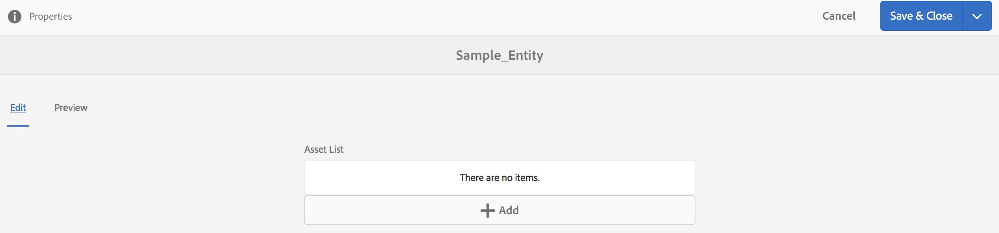

# 공간 및 엔티티{#spaces-and-entities}

{{ue-over-mobile}}

스페이스는 Content Services REST API를 통해 노출되는 엔터티를 저장하기 편리한 위치입니다. 이 기능은 앱(또는 모든 채널)이 많은 엔티티와 연결될 수 있으므로 특히 유용합니다. 엔티티를 공간 내에 강제 포함하면 앱 요구 사항을 그룹화하는 모범 사례가 강제 적용됩니다. 선택적으로 AEM의 앱을 적은 수의 공백과 연결할 수 있습니다.

>[!NOTE]
>
>Content Services의 모든 채널에서 사용할 수 있도록 하려면 공간 아래에 있어야 합니다.

## 공간 만들기 {#creating-a-space}

사용자가 모바일 앱에 다양한 컨텐츠 및 자산을 노출하려는 경우 AEM Mobile 대시보드를 사용하여 공간을 만듭니다.

스페이스에서 작동하도록 콘텐츠 서비스를 구성하지 않은 사용자가 처음으로 **콘텐츠 서비스**&#x200B;를 선택하면 AEM Mobile 대시보드에 앱만 표시됩니다.

>[!CAUTION]
>
>**공간을 추가하기 위한 필수 구성 요소**
>
>공백으로 작업하고 AEM Mobile 응용 프로그램 대시보드에서 사용하려면 **AEM Content Services 사용**&#x200B;을 확인하세요.
>
>자세한 내용은 [콘텐츠 서비스 관리](/help/mobile/developing-content-services.md)를 참조하십시오.

대시보드에서 공간을 구성하고 나면 다음 단계에 따라 공간을 만듭니다.

1. Content Services에서 **스페이스**&#x200B;을(를) 선택하십시오.

   

1. **만들기**&#x200B;를 선택하여 스페이스를 만드십시오. 스페이스에 **제목**, **이름** 및 **설명**&#x200B;을 입력하십시오.

   **만들기**&#x200B;를 클릭합니다.

   

## 공간 관리 {#managing-a-space}

공간을 만든 후 왼쪽을 클릭하여 목록의 공간을 관리합니다.

스페이스의 속성을 보거나, 스페이스를 삭제하거나, 스페이스 및 스페이스의 컨텐츠를 AEM 게시 인스턴스에 게시할 수 있습니다.

**스페이스의 속성 보기 및 편집**

1. 목록에서 공백 선택
1. 도구 모음에서 **속성** 선택
1. 완료되면 **닫기** 클릭

**스페이스 게시** 스페이스가 게시되면 해당 스페이스의 모든 폴더와 엔터티도 게시됩니다.

1. 스페이스 콘솔 목록에서 해당 아이콘을 클릭하여 스페이스를 선택합니다
1. **Publish 트리** 선택

>[!NOTE]
>
>게시 인스턴스에서 공간을 제거하는 공간을 **게시 취소**&#x200B;할 수 있습니다.
>
>다음 이미지는 공간을 게시한 후 수행할 수 있는 작업을 보여 줍니다.

## 스페이스에서 폴더 작업 {#working-with-folders-in-a-space}

스페이스에는 스페이스의 컨텐츠와 에셋을 구성하는 데 도움이 되는 폴더가 포함될 수 있습니다. 사용자는 스페이스에 고유한 계층 구조를 만들 수 있습니다.

### 폴더 만들기 {#creating-a-folder}

1. 스페이스 콘솔의 목록에서 스페이스를 클릭하고 **폴더 만들기**&#x200B;를 클릭합니다.

   

1. 폴더의 **제목**, **이름,** 및 **설명** 입력

   

1. 스페이스에 폴더를 만들려면 **만들기**&#x200B;를 클릭하세요.

## 언어 복사 {#language-copy}

>[!CAUTION]
>
>언어 사본은 이 릴리스에서 완전히 작동하지 않습니다. 구조만 설정해 줍니다.

**언어 사본** 기능을 사용하면 작성자가 마스터 언어 사본을 복사한 다음 프로젝트 및 워크플로를 만들어 콘텐츠를 자동으로 번역할 수 있습니다. 언어 사본은 올바른 구조를 만듭니다. 스페이스에 폴더를 추가하면 스페이스에 언어 사본을 추가할 수 있습니다.

>[!NOTE]
>
>번역할 수 있는 모든 콘텐츠는 언어 복사 노드 아래에 배치하는 것이 좋습니다.

### 언어 사본 추가 {#adding-language-copy}

1. 공간을 만든 후 해당 공간을 클릭하여 언어 사본을 만듭니다.

   **만들기**&#x200B;를 클릭하고 **언어 사본**&#x200B;을 선택하세요.

   

   >[!NOTE]
   >
   >언어 복사 노드는 Space의 직접 하위로만 존재할 수 있습니다.

1. **콘텐츠 패키지 언어&ast;**&#x200B;를 선택하고 **언어 사본 만들기** 대화 상자에서 **제목&ast;**&#x200B;을(를) 입력합니다.

   **만들기**&#x200B;를 클릭합니다.

   

1. 언어 사본을 만들면 **언어 마스터**&#x200B;의 스페이스에 표시됩니다.

   

   >[!NOTE]
   >
   >언어 복사 폴더를 보려면 **언어 마스터**&#x200B;를 선택하십시오.

### 스페이스에서 폴더 제거 {#removing-a-folder-from-the-space}

1. 스페이스 컨텐트 목록에서 폴더 선택
1. 도구 모음에서 **삭제**&#x200B;를 클릭합니다

   >[!NOTE]
   >
   >폴더로 이동하여 해당 콘텐츠를 보거나 하위 폴더 또는 엔티티를 추가하려면 스페이스의 콘텐츠 목록에서 폴더 제목을 클릭합니다.

## 스페이스에서 엔티티 작업 {#working-with-entities-in-a-space}

엔티티는 웹 서비스 끝점을 통해 노출되는 콘텐츠를 나타냅니다. 엔티티는 공간에 저장되므로 을 쉽게 찾을 수 있으며 관련 컨텐츠를 보관하는 AEM 저장소 구조와는 독립적으로 유지됩니다.

일부 논리 수집에서 엔티티를 함께 그룹화할 수 있습니다. 원하는 수만큼 폴더를 만들 수 있습니다.

다른 엔티티인 엔티티 하위가 데이터 모델링을 위해 수집되는 경우 개발자 사용자는 즉시 사용할 수 있도록 제공되는 &quot;엔티티 그룹&quot; 모델 유형에서 특정 &quot;그룹 모델&quot;을 생성할 수 있습니다.

>[!NOTE]
>
>엔티티는 항상 스페이스와 연관되어 있으므로 대부분의 엔티티 사용자 인터페이스는 스페이스 콘솔을 통해 액세스됩니다.

### 엔티티 만들기 {#creating-an-entity}

1. 스페이스 콘솔을 열고 스페이스 제목을 클릭합니다.

   필요한 경우 목록에서 폴더 제목을 클릭하여 폴더로 이동할 수 있습니다.

   

1. 엔티티의 모델을 선택합니다. 만들려는 엔티티 유형입니다. 다음 을 클릭합니다.

   

   >[!NOTE]
   >
   >**Assets 모델**, **페이지 모델** 또는 이전에 만든 엔터티 형식의 모델을 선택할 수 있습니다.
   >
   >사용자 지정 엔터티를 만들려면 [모델 만들기](/help/mobile/administer-mobile-apps.md)를 참조하십시오.

1. 엔터티의 **제목**, **이름**, **설명** 및 **태그**&#x200B;를 입력하십시오. **만들기**&#x200B;를 클릭합니다.

   

   작업이 완료되면 엔티티가 스페이스의 하위 항목에 나타납니다.

### 엔티티 편집 {#editing-an-entity}

1. 엔티티를 만든 후 폴더 또는 스페이스로 이동하고 스페이스 콘솔에서 편집할 엔티티를 선택합니다.

   

1. 편집할 엔터티를 선택하고 **편집**&#x200B;을 클릭합니다.

   

   >[!CAUTION]
   >
   >엔티티를 만들도록 선택한 템플릿에 따라 엔티티의 속성을 편집하고 보기 위한 UI가 달라집니다. 자세한 내용은 아래 단계를 참조하십시오.

   ***엔터티를 Assets 모델로 만들기 위한 템플릿을 선택한 경우***, **편집**&#x200B;을 클릭하면 아래 그림과 같이 에셋을 추가할 수 있습니다.

   

   또는 **미리 보기**&#x200B;를 클릭하여 json 링크를 볼 수 있습니다.

   

   ***엔터티를 페이지 모델로 만들기 위한 템플릿을 선택하는 경우***, **편집**&#x200B;을 클릭하면 아래 그림과 같이 에셋을 추가할 수 있습니다.

   

   자산을 추가하려면 **경로**&#x200B;에서 아이콘을 클릭하십시오.

   

   >[!NOTE]
   >
   >엔티티를 추가한 후 미리보기 링크가 작동하려면 엔티티를 저장해야 합니다. 미리 보기를 보려면 **저장**&#x200B;을 클릭하세요. **미리 보기**&#x200B;를 클릭하면 아래 그림과 같이 추가된 에셋의 JSON이 표시됩니다.

   

   >[!NOTE]
   >
   >엔터티에 에셋을 추가한 후에는 **저장**&#x200B;을 선택하여 변경 내용을 저장하거나 **저장 및 닫기**&#x200B;를 선택하여 엔터티가 정의된 스페이스 콘솔 목록으로 리디렉션합니다.

   또한 스페이스 콘솔 목록에서 엔터티를 선택하고 **속성**&#x200B;을 클릭하여 정의된 엔터티의 속성을 보고 편집합니다.

   

   제목, 설명, 태그를 편집하고 엔티티에 에셋을 추가할 수 있습니다.

   

### 엔티티 제거 {#removing-an-entity}

1. 스페이스 컨텐트 목록에서 엔티티 선택

   

1. 도구 모음에서 **삭제**&#x200B;를 클릭하여 스페이스에서 특정 엔터티를 제거합니다.

### 엔티티 게시 {#publishing-an-entity}

엔터티를 게시하려면 **Publish 트리** 또는 **빠른 Publish**&#x200B;을 선택할 수 있습니다.

1. 스페이스 콘솔 목록에서 엔티티를 선택하고 **Publish 트리**&#x200B;를 클릭하여 해당 엔티티와 그 하위를 게시합니다.

   

   **또는**,

   해당 특정 엔터티를 게시하려면 **빠른 Publish**&#x200B;을 클릭하세요.
