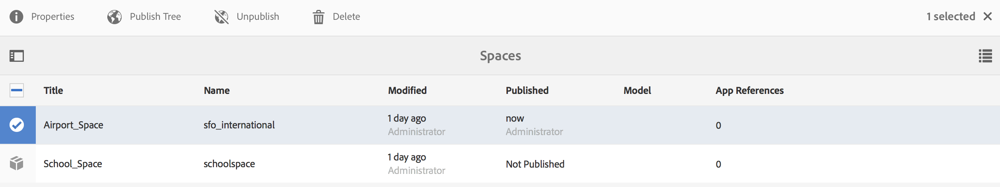

# 공간 및 엔티티{#spaces-and-entities}

>[!NOTE]
>
>Adobe 단일 페이지 애플리케이션 프레임워크 기반 클라이언트측 렌더링(예: React)이 필요한 프로젝트에는 SPA Editor를 사용하는 것이 좋습니다. [자세히 알아보기](/help/sites-developing/spa-overview.md).

스페이스는 Content Services REST API를 통해 노출되는 엔터티를 저장하기 편리한 위치입니다. 이 기능은 앱(또는 모든 채널)이 많은 엔티티와 연결될 수 있으므로 특히 유용합니다. 엔티티를 공간 내에 강제 포함하면 앱 요구 사항을 그룹화하는 모범 사례가 강제 적용됩니다. 선택적으로 AEM의 앱을 적은 수의 공백과 연결할 수 있습니다.

>[!NOTE]
>
>Content Services의 모든 채널에서 사용할 수 있도록 하려면 공간 아래에 있어야 합니다.

## 공간 만들기 {#creating-a-space}

사용자가 모바일 앱에 다양한 컨텐츠 및 자산을 노출하려는 경우 AEM Mobile 대시보드를 사용하여 공간을 만듭니다.

스페이스에서 작동하도록 콘텐츠 서비스를 구성하지 않은 사용자가 처음으로 AEM Mobile 대시보드에서 을 선택하면 앱만 표시됩니다 **컨텐츠 서비스**.

>[!CAUTION]
>
>**공간을 추가하기 위한 사전 요구 사항**
>
>다음 확인: **AEM Content Services 활성화** 스페이스를 사용하여 작업하고 AEM Mobile 애플리케이션 대시보드에서 활성화할 수 있습니다.
>
>다음을 참조하십시오 [Content Services 관리](/help/mobile/developing-content-services.md) 을 참조하십시오.

대시보드에서 공간을 구성하고 나면 다음 단계에 따라 공간을 만듭니다.

1. 선택 **Spaces** 콘텐츠 서비스에서.

   

1. 선택 **만들기** 을 클릭하여 공간을 만듭니다. 입력 **제목**, **이름**, 및 **설명** 공간을 위한.

   **만들기**&#x200B;를 클릭합니다.

   

## 공간 관리 {#managing-a-space}

스페이스를 만든 후 왼쪽을 클릭하여 목록의 스페이스를 관리합니다.

스페이스의 속성을 보거나, 스페이스를 삭제하거나, 스페이스 및 스페이스의 컨텐츠를 AEM 게시 인스턴스에 게시할 수 있습니다.

**스페이스의 등록 정보 보기 및 편집**

1. 목록에서 공백 선택
1. 선택 **속성** 도구 모음에서
1. 클릭 **닫기** 완료 시

**스페이스 게시** 스페이스가 게시되면 해당 스페이스의 모든 폴더와 엔티티도 게시됩니다.

1. 스페이스 콘솔 목록에서 해당 아이콘을 클릭하여 스페이스를 선택합니다
1. 선택 **트리 게시**

>[!NOTE]
>
>다음을 수행할 수 있습니다. **게시 취소** 게시 인스턴스에서 공간을 제거하는 공간.
>
>다음 이미지는 공간을 게시한 후 수행할 수 있는 작업을 보여 줍니다.

## 스페이스에서 폴더 작업 {#working-with-folders-in-a-space}

스페이스에는 스페이스의 컨텐츠와 에셋을 구성하는 데 도움이 되는 폴더가 포함될 수 있습니다. 사용자는 스페이스에 고유한 계층 구조를 만들 수 있습니다.

### 폴더 만들기 {#creating-a-folder}

1. 공간 콘솔에서 목록의 공간을 클릭하고 **폴더 만들기**

   

1. 다음을 입력합니다. **제목**, **이름,** 및 **설명** 폴더용

   

1. 클릭 **만들기** 스페이스에 폴더를 만들려면

## 언어 복사 {#language-copy}

>[!CAUTION]
>
>언어 사본은 이 릴리스에서 완전히 작동하지 않습니다. 구조만 설정해 줍니다.

다음 **언어 복사** 이 기능을 사용하면 작성자가 마스터 언어 사본을 복사한 다음 프로젝트 및 워크플로를 만들어 콘텐츠를 자동으로 번역할 수 있습니다. 언어 사본은 올바른 구조를 만듭니다. 스페이스에 폴더를 추가하면 스페이스에 언어 사본을 추가할 수 있습니다.

>[!NOTE]
>
>번역할 수 있는 모든 콘텐츠는 언어 복사 노드 아래에 배치하는 것이 좋습니다.

### 언어 사본 추가 {#adding-language-copy}

1. 공간을 만들면 해당 공간을 클릭하여 언어 사본을 만듭니다.

   클릭 **만들기** 및 선택 **언어 복사**.

   

   >[!NOTE]
   >
   >언어 복사 노드는 Space의 직접 하위로만 존재할 수 있습니다.

1. 선택 **컨텐츠 패키지 언어(&amp;A);** 을(를) 입력한 후 **제목&amp;ast;** 위치: **언어 사본 만들기** 대화 상자.

   **만들기**&#x200B;를 클릭합니다.

   

1. 언어 사본을 만들면 **언어 마스터**.

   

   >[!NOTE]
   >
   >선택 **언어 마스터** 를 클릭하여 언어 복사 폴더를 봅니다.

### 스페이스에서 폴더 제거 {#removing-a-folder-from-the-space}

1. 스페이스 컨텐트 목록에서 폴더 선택
1. 클릭 **삭제** 도구 모음에서

   >[!NOTE]
   >
   >폴더로 이동하여 해당 콘텐츠를 보거나 하위 폴더 또는 엔티티를 추가하려면 스페이스의 콘텐츠 목록에서 폴더 제목을 클릭합니다.

## 스페이스에서 엔티티 작업 {#working-with-entities-in-a-space}

엔티티는 웹 서비스 끝점을 통해 노출되는 콘텐츠를 나타냅니다. 엔티티는 공간에 저장되므로 을 쉽게 찾을 수 있으며 관련 컨텐츠를 보관하는 AEM 저장소 구조와는 독립적으로 유지됩니다.

일부 논리 수집에서 엔티티를 함께 그룹화할 수 있습니다. 원하는 수만큼 폴더를 만들 수 있습니다.

다른 엔티티인 엔티티 하위가 데이터 모델링을 위해 수집되는 경우 개발자 사용자는 즉시 사용할 수 있도록 제공되는 &quot;엔티티 그룹&quot; 모델 유형에서 특정 &quot;그룹 모델&quot;을 생성할 수 있습니다.

>[!NOTE]
>
>엔티티는 항상 스페이스와 연관되어 있으므로 대부분의 엔티티 사용자 인터페이스는 스페이스 콘솔을 통해 액세스됩니다.

### 엔티티 만들기 {#creating-an-entity}

1. 스페이스 콘솔을 열고 스페이스 제목을 클릭합니다.

   필요한 경우 목록에서 폴더 제목을 클릭하여 폴더로 이동할 수 있습니다.

   

1. 엔티티의 모델을 선택합니다. 만들려는 엔티티 유형입니다. 다음을 클릭합니다.

   

   >[!NOTE]
   >
   >다음을 선택할 수 있습니다. **자산 모델**, **페이지 모델**&#x200B;또는 이전에 만든 엔티티 유형의 모델입니다.
   >
   >다음을 참조하십시오 [모델 만들기](/help/mobile/administer-mobile-apps.md)를 클릭하여 사용자 지정 엔티티를 만듭니다.

1. 입력 **제목**, **이름**, **설명**, 및 **태그** 엔티티용 **만들기**&#x200B;를 클릭합니다.

   

   작업이 완료되면 엔티티가 스페이스의 하위 항목에 나타납니다.

### 엔티티 편집 {#editing-an-entity}

1. 엔티티를 만든 후 폴더 또는 스페이스로 이동하고 스페이스 콘솔에서 편집할 엔티티를 선택합니다.

   

1. 편집할 엔티티를 선택하고 **편집**.

   

   >[!CAUTION]
   >
   >엔티티를 만들도록 선택한 템플릿에 따라 엔티티의 속성을 편집하고 보기 위한 UI가 달라집니다. 자세한 내용은 아래 단계를 참조하십시오.

   ***엔티티를 자산 모델로 생성하기 위한 템플릿을 선택하는 경우***, 클릭 **편집** 아래 그림과 같이 에셋을 추가할 수 있습니다.

   

   또는 을 클릭할 수 있습니다. **미리 보기** json 링크를 봅니다.

   

   ***페이지 모델로 엔티티를 생성할 템플릿을 선택하는 경우***, 클릭 **편집** 아래 그림과 같이 에셋을 추가할 수 있습니다.

   

   에서 아이콘을 클릭합니다. **경로** 에셋을 추가하려면

   

   >[!NOTE]
   >
   >엔티티를 추가한 후 미리보기 링크가 작동하려면 엔티티를 저장해야 합니다. 미리보기를 보려면 **저장**. 클릭 **미리 보기** 아래 그림과 같이 추가된 에셋의 json을 표시합니다.

   

   >[!NOTE]
   >
   >엔티티에 에셋을 추가한 후 다음 중 하나를 선택할 수 있습니다. **저장** 변경 내용을 저장하거나 **저장 및 닫기** 을 클릭하여 저장하고 엔티티가 정의된 스페이스 콘솔 목록으로 리디렉션합니다.

   또한 공간 콘솔 목록에서 엔티티를 선택하고 을(를) 클릭합니다. **속성** 을 눌러 정의된 엔티티의 등록 정보를 보고 편집합니다.

   

   제목, 설명, 태그를 편집하고 엔티티에 에셋을 추가할 수 있습니다.

   

### 엔티티 제거 {#removing-an-entity}

1. 스페이스 컨텐트 목록에서 엔티티 선택

   

1. 클릭 **삭제** 을 눌러 스페이스에서 특정 엔티티를 제거합니다.

### 엔티티 게시 {#publishing-an-entity}

다음을 선택할 수 있습니다. **트리 게시** 또는 **빠른 게시** 엔티티를 게시합니다.

1. 스페이스 콘솔 목록에서 엔티티를 선택하고 **트리 게시**를 클릭하여 해당 엔티티와 그 하위 항목을 게시합니다.

   

   **또는**,

   클릭 **빠른 게시** 특정 엔티티를 게시합니다.
