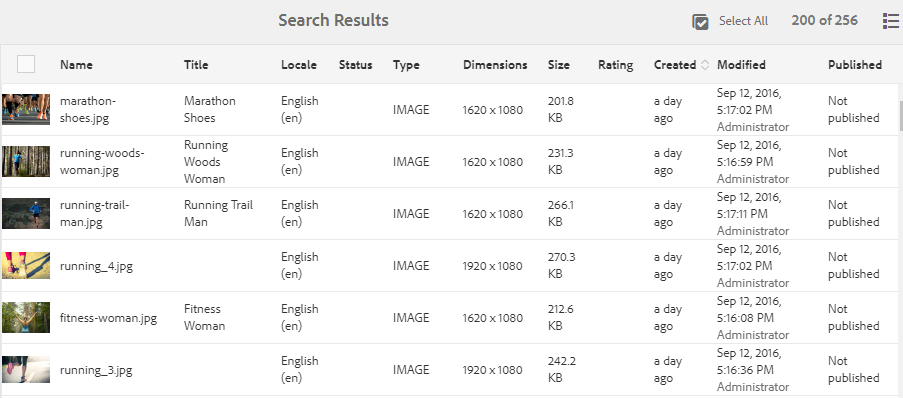

# Adobe Experience Manager 6.5 서비스 팩 7의 새로운 기능 {#aem-whats-new-service-pack}

[!DNL Adobe Experience Manager] 6.5 서비스 팩은 분기별로 새로운 기능, 고객의 요청에 따라 향상된 기능, 성능, 안정성 및 보안 개선 사항을 제공합니다. 분기별 출시되어 새로운 기능과 혁신적인 기능에 쉽게 액세스하고 그러한 기능을 채택할 수 있습니다.

이 문서에서는 최신 6.5 서비스 팩, 이전 6.5 서비스 팩](#key-features-previous-service-packs)에 포함된 [주요 기능 및 마지막 서비스 팩](#key-releases-since-last-sp) 릴리스 이후 [주요 AEM 릴리스에 포함된 기능에 대해 다룹니다.

## Adobe [!DNL Experience Manager Sites] {#aem-sites}

### 페이지 이동 가능 여부 및 비동기 작업 {#page-moves-msm-asynchronous}(으)로 MSM 롤아웃

이제 페이지 이동 및 MSM 롤아웃을 비동기 작업으로 수행하여 런타임 성능에 대한 영향을 줄일 수 있습니다. 즉시 또는 나중에 실행할 작업을 예약할 수 있습니다. 연결된 작업 및 프로세스 단계의 상태가 콘솔에 표시되어 대규모 MSM 롤아웃을 모니터링하는 데 유용합니다.

## [!DNL Adobe Experience Manager Assets] {#aem-assets}

* [!DNL Assets] 다양한 액세서빌러티 향상 기능을  [!DNL Dynamic Media] 제공합니다. 향상된 기능은 키보드 탐색, 화면 판독기 사용, 보조 기술(AT)을 사용할 수 있도록 해주는 유사한 개선 사항과 관련이 있습니다. [[!DNL Assets] 개선 사항](/help/release-notes/sp-release-notes.md#assets-6570) 및 [[!DNL Dynamic Media] 개선 사항](/help/release-notes/sp-release-notes.md#dynamic-media-6570)을 참조하십시오.

* 사용자는 카드 및 열 보기에서 디지털 자산을 정렬할 수 있습니다.

## [!DNL Adobe Experience Manager Forms] {#aem-forms}

>[!NOTE]
>
>[!DNL Experience Manager Forms] 추가 패키지는 예약된  [!DNL Experience Manager] 서비스 팩 릴리스 후 일주일 후에 사용할 수 있습니다.

### 성능 개선 사항 {#performance-improvements-forms}

[!DNL Experience Manager] 6.5 서비스 팩 7 Forms은 다음 제품의 성능을 향상시킵니다.

* 적응형 양식을 제출할 때 서버에서 필드 값의 유효성을 검사합니다.

* [!DNL Automated Forms Conversion service]을(를) 사용하여 PDF 양식을 적응형 양식으로 변환

### 성능 최적화를 위한 양식 데이터 모델 HTTP 클라이언트 구성 {#fdm-http-client-config}

[!DNL Experience Manager Forms] 데이터 소스로 RESTful 웹 서비스와 통합할 때 양식 데이터 모델에 성능 최적화를 위한 HTTP 클라이언트 구성이 포함됩니다. [데이터 소스 구성](../../help/forms/using/configure-data-sources.md#fdm-http-client-configuration)을 참조하십시오.

### 레이아웃 모드 {#reset-option-layout-mode}의 각 구성 요소에 대한 재설정 옵션 사용 가능

이제 적응형 양식의 레이아웃 모드에서 각 구성 요소에 대해 재설정 옵션을 사용할 수 있습니다. 패널의 여러 열로 구성된 레이아웃을 정의할 때 이 기능을 사용하여 패널 내의 개별 구성 요소를 재설정할 수 있습니다. 구성 요소](../../help/forms/using/resize-using-layout-mode.md#resize-components)의 크기를 조정하려면 [레이아웃 모드 사용을 참조하십시오.

### Microsoft SQL Server 2019 지원

[!DNL Experience Manager Forms] 이제 Microsoft SQL Server 2019를 지원합니다.

## 이전 [!DNL Experience Manager] 6.5 서비스 팩 {#key-features-previous-service-packs}의 주요 기능

### [!DNL Experience Manager Sites] {#aem-sites-previous-service-packs}

#### 비동기 모드에서 페이지 이동 작업 사용 가능(6.5.6.0) {#page-move-asynchronous}

이제 페이지 이동 작업을 비동기 모드에서 사용할 수 있습니다. 즉각적인 실행 외에도 페이지 이동 작업을 예약하여 나중에 실행할 수도 있습니다.

#### 액세서빌러티 개선 (6.5.5.0) {#accessibility-sites}

* 텍스트 정보를 추가하여 오류 보고 개선.

* 키보드 탐색 중 유저 인터페이스 포커스가 개선되었습니다.

* 다양한 사용자 인터페이스 요소의 대비 비율이 개선되었습니다.

* 페이지 이미지에 대한 대체 속성의 일관성 개선.

* ARIA(Accessible Rich Internet Applications) 레이블의 일관성 향상.

* NVDA(Non-Visual Desktop Access) 기능 개선.

* 향상된 화면 판독기 지원.

#### 기타 주요 개선 사항 (6.5.5.0) {#other-enhancements-sites}

* CRXDE Lite에 대한 익명의 액세스는 보안을 강화하도록 허용되지 않습니다. 대신 사용자에게 로그인 화면이 표시됩니다. [CRXDE Lite](/help/sites-developing/developing-with-crxde-lite.md)으로 개발을 참조하십시오.

* 페이지 트리를 복사하거나 붙여넣을 때 이제 루트 페이지를 붙여넣거나 루트 페이지를 트리의 하위 페이지와 함께 붙여넣을 수 있습니다.

* [!DNL Adobe Target] 작업 공간으로 내보낸 [!DNL Adobe Experience Manager Experience Fragments]는 이제 [!DNL Target]에서 고유한 오퍼 유형 및 오퍼 소스로 표시됩니다.

* 다중 사이트 관리자 - 이제 구성 요소가 소스 페이지에서 삭제되는 경우 게시 트리거가 게시된 페이지에서 구성 요소를 삭제합니다.

* 다중 사이트 관리자 - [!UICONTROL Live Copy]의 로컬 구성 요소의 이름이 블루프린트에서 구성 요소의 이름과 동일하고 이 구성 요소가 블루프린트에서 롤아웃되면, 이제 `_msm_moved` 용어가 로컬 구성 요소의 이름에 성공적으로 추가됩니다.

#### 스타일 시스템 향상(6.5.4.0) {#style-system-enhancements}

이제 향상된 스타일 시스템을 사용하여 구성 요소 대화 상자 내에서 스타일을 선택할 수 있습니다.

#### 다양한 영역의 성능 개선(6.5.4.0) {#performance-improvements}

* 사이트(`contexthub.kernel.js`) 내에서 ContextHub를 로드하고 초기화하는 데 걸리는 시간이 단축되었습니다. 따라서 사이트 방문 중에 페이지 로드 속도가 빨라졌습니다.

* [!DNL Experience Fragments]를 [!DNL Sites] 페이지 편집기로 드래그한 후 페이지를 새로 고치는 시간이 단축되었습니다.

* **[!UICONTROL Live Copy 개요]**&#x200B;에서 Live Copy가 200개 이상인 [!DNL Sites] 페이지의 항목 로드 시간이 줄었습니다.

* 불완전하거나 잘못된 URL의 처리가 개선되었습니다. 그러한 URL을 사용하면 템플릿 편집기의 속도가 느려질 수 있습니다.

### [!DNL Adobe Experience Manager Assets] {#aem-assets-previous-service-packs}

#### 액세스 가능성 개선(6.5.6.0) {#accessibility-assets-6560}

* **키보드 탐색** 중 사용자 인터페이스가 강조됩니다. 예를 들어

   * `x` 아이콘을  [!UICONTROL 클릭합니다]   .

   * 실행 가능한 사용자 인터페이스 옵션.

   * [!UICONTROL 링크 공유] 대화 상자의 전자 메일 필드 및 [!UICONTROL 속성] 폴더의 [!UICONTROL 권한] 탭에서 닫힌 사용자 그룹을 추가할 필드입니다.

* **키보드 키를 사용한 향상된 기능**

   사용자는 키보드 키를 사용하여 화면 판독기의 검색 모드에서 메타데이터 스키마 양식 편집기의 컨트롤을 드래그할 수 있습니다.

* **다음과 같은 이유로 화면 판독기** 사용자에 대한 향상된 유용성:

   * 화면 판독기는 비디오 및 오디오 플레이어의 용도를 발표합니다.

   * 화면 판독기는 자산 [!UICONTROL 속성]에서 [!UICONTROL 태그 선택 대화 상자]를 사용하여 선택한 태그를 제거하기 위한 사용자 인터페이스 옵션의 목적을 알려줍니다.

   * 화면 판독기는 표의 행 머리글과 행 항목을 발표하므로 사용자가 같은 행에 속하는 항목을 알 수 있습니다.

   * 검색 페이지의 설명적이고 의미 있는 페이지 제목입니다.

   * 화면 판독기는 검색 필터 패널의 옵션을 확장 가능한 아코더로 표시합니다.

#### [!DNL Assets](6.5.6.0) {#other-enhancements-assets-6560}의 기타 개선 사항

* 이제 폴더(비공개 및 비공개 아님)와 연결된 사용자 그룹이 [해당 폴더 삭제](/help/assets/private-folder.md#delete-private-folder)에 있는 저장소에서 제거됩니다. 그러나 JMX를 사용하여 저장소에서 기존의 중복, 고아, 사용하지 않음 및 자동 생성된 사용자 그룹을 제거할 수 있습니다.

#### [!DNL Assets](6.5.5.0) {#assets-accessibility}의 액세서빌러티 향상

이제 WCAG(Web Content Accessibility Guidelines)를 준수하여 [!DNL Experience Manager Assets]에 더 쉽게 액세스할 수 있습니다. 다음이 개선되어 액세스 가능성이 향상되었습니다.

* 다양한 사용자 인터페이스 요소, 컨트롤, 페이지 및 대화 상자가 화면 판독기에 친숙한 형식으로 제공됩니다.

* 다양한 인터페이스 요소, 컨트롤 및 입력 양식 필드에 키보드를 사용하여 액세스할 수 있습니다.

* 일부 사용자 인터페이스 요소의 색상 및 대비가 업데이트되어 시력이 제한된 사용자 또는 색상을 인식하지 못하는 사용자가 이러한 사용자 인터페이스 요소를 구분할 수 있습니다. 예를 들어 별 등급 아이콘 색상(예: 자산 [!UICONTROL 속성] 또는 카드 보기에서 [!UICONTROL 고급] 탭 의 [!UICONTROL 등급] 섹션)이 적절한 대비를 위해 변경되었습니다.

   

#### 향상된 예외 처리(6.5.5.0) {#exception-handling}

[!DNL Assets] 사용자 인터페이스 흐름의 예외 처리가 향상되었습니다. 자산에 차원에 대한 유형이 없는 경우, 관찰된 예외가 로그 파일에 기록됩니다.

#### [!DNL Dynamic Media](6.5.5.0) {#support-for-3d}에서 3D 자산 지원

[!DNL Dynamic Media]의 3D 이미지 지원을 통해 고객은 웹 페이지 및 애플리케이션에 3D 컨텐츠를 게시하고 추가할 수 있습니다. 지원에는 다음이 포함됩니다.

* 일반적인 3D 자산 형식을 게시하고 웹 페이지 및 기타 애플리케이션에서 사용할 수 있는 자산 URL을 생성합니다.

* 게시된 3D 자산을 대화식으로 볼 수 있도록 해주는 [!DNL Adobe Dimension] 제공 3D Web Viewer,

* [!DNL Sites] WCM 구성 요소를 사용하여 [!DNL Experience Manager Sites] 페이지에서 일반적인 3D 자산을 게시하고 볼 수 있습니다.

#### [!DNL Brand Portal](6.5.4.0){#configure-assets-bp}을 사용한 [!DNL Experience Manager Assets] 구성

[!DNL Experience Manager Assets]과 [!DNL Brand Portal] 사이의 인증 채널이 변경되었습니다. 이전에는 [!DNL Brand Portal]이 기존 OAuth 게이트웨이를 통해 클래식 UI에 구성되었으며, 이 게이트웨이는 인증을 위해 IMS 액세스 토큰을 가져오는 데 JWT 토큰 교환을 사용합니다. [!DNL Experience Manager Assets] 는 이제  [!DNL Brand Portal] through [!DNL Adobe I/O]로 구성되며, IMS 토큰을 조달하여  [!DNL Brand Portal] 임차인 인증을 받습니다.

[!DNL Brand Portal]에서 [!DNL Experience Manager Assets]을 구성하는 단계는 [!DNL Experience Manager] 버전과 처음 구성하는 것인지 아니면 기존 구성을 업그레이드하는 것인지에 따라 다릅니다. 자세한 내용은 [Brand Portal에서 Experience Manager Assets 구성](https://docs.adobe.com/content/help/ko-KR/experience-manager-brand-portal/using/publish/configure-aem-assets-with-brand-portal.html)을 참조하십시오.

#### 액세스 가능성 개선(6.5.4.0) {#accessibility-enhancements}

[!DNL Experience Manager Assets]에서는 다음과 같은 액세스 가능성이 개선되었습니다.

* 키보드의 화살표 키를 사용하여 확대/축소된 이미지 내에서 영역을 이동할 수 있습니다. 자세한 내용은 [키보드 키만 사용하여 자산 미리 보기](../assets/manage-assets.md#previewing-assets)를 참조하십시오.

* 필터 패널의 혼합 상태 확인란(중첩된 모든 확인란을 선택하지 않은 경우 첫 번째 수준의 확인란을 선택하지 않으면 나머지도 선택되지 않음)은 화면 판독기에서 읽을 수 있습니다.

* 날짜 및 시간 형식 제약 조건은 사용자가 키보드를 사용하여 날짜를 올바른 형식으로 입력할 수 있도록 날짜 필드의 필드 레이블에 제공됩니다.
예, `On Time (MM-DD-YYYY HH:mm)`. 여기서 MM은 두 자리 형식의 월, YYYY는 연도, DD는 두 자리 형식의 날짜, HH는 24시간 군대 형식의 시간, mm은 분입니다.

* 화면 판독기는 선택한 태그(`X` 기호)를 제거하는 옵션과 선택한 태그의 수를 발표합니다.

#### 목록 보기에서 자산의 만든 날짜에 대한 정렬 가능한 열(6.5.3.0) {#sortable-date-created-column}

자산의 만든 날짜에 대한 정렬 가능한 새 열이 목록 보기의 DAM 목록 보기 및 자산 검색 결과에 추가됩니다.

#### [!DNL Adobe Experience Manager Assets](6.5.2.0) {#visual-search} 시각적 검색

[!DNL Assets] 사용자는 시각적으로 유사한 이미지를 검색할 수 있습니다. Experience Manager는 사용자가 선택한 이미지와 유사한 DAM 저장소에서 스마트 태그가 지정된 이미지를 표시합니다. [시각적 검색](../assets/search-assets.md)을 참조하십시오.

### Dynamic Media {#dynamic-media-previous-service-packs}

#### CDN 캐시된 컨텐츠 무효화(6.5.6.0) {#invalidate-cdn-cached-content}

이제 [!DNL Dynamic Media] 사용자 인터페이스를 사용하여 CDN(Content Delivery Network) 캐시된 컨텐츠를 무효화할 수 있습니다. 따라서 업데이트된 에셋은 캐시가 만료될 때까지 기다리지 않고 즉시 사용할 수 있습니다. 다음 기준으로 CDN을 무효화할 수 있습니다.

* CDN 무효화 템플릿 만들기:자산 및 양식 관련 템플릿 기반 URL 선택

* 자산 선택기를 통해 자산 및 관련 사전 설정 선택

* 전체 자산 URL 추가

#### 선택적으로 [!DNL Experience Manager] 및 [!DNL Dynamic Media](6.5.6.0) {#selective-publishing}에 자산 게시

이제 [!UICONTROL 빠른 게시] 또는 [!UICONTROL 게시 관리] 마법사를 사용하여 자산을 선택적으로 [!DNL Experience Manager] 또는 [!DNL Dynamic Media]에 게시 또는 게시 취소하도록 선택할 수 있습니다. 폴더 수준에서 `Publish` 또는 `Unpublish` 모드를 설정할 수도 있습니다.

#### Dynamic Media용 스마트 이미징 {#smart-imaging}

스마트 이미징은 각 사용자의 고유한 보기 특성을 사용하여 환경에 맞게 최적화된 적합한 이미지를 자동으로 제공하므로 향상된 성능과 참여를 제공합니다. 스마트 이미징은 기존 이미지 사전 설정에서 작동하며 마지막 전달 순간에 인텔리전스를 사용하여 브라우저 또는 네트워크 연결 속도에 따라 이미지 파일 크기를 더 줄입니다. [스마트 이미징](../assets/imaging-faq.md)을 참조하십시오.

#### Dynamic Media용 비디오 프로필에서 스마트 자르기(6.5.3.0) {#smart-crop-video}

비디오 프로필에서 사용할 수 있는 선택적 기능인 비디오 스마트 자르기는 Adobe Sensei의 인공 지능 기능을 사용하여 크기와 상관없이 업로드한 모든 적응형 비디오 또는 점진적 비디오에서 초점을 자동으로 감지하고 자르는 도구입니다. [비디오 프로필에서 스마트 자르기 사용 정보](../assets/video-profiles.md)를 참조하십시오.

### Experience Manager Forms {#aem-forms-previous-service-packs}

#### 클라이언트에서 응용 양식을 미리 채우기(6.5.6.0) {#prefill-merge-data-at-client}

적응형 양식을 미리 작성할 때 [!DNL Experience Manager Forms] 서버는 데이터를 적응형 양식으로 병합하고 채워진 양식을 사용자에게 전달합니다. 기본적으로 데이터 병합 작업은 서버에서 수행됩니다.
이제 서버 대신 클라이언트](../../help/forms/using/prepopulate-adaptive-form-fields.md)에서 데이터 병합 작업을 수행하도록 [!DNL Experience Manager Forms] 서버를 구성할 수 있습니다. [ 적응형 양식을 미리 채우고 렌더링하는 데 필요한 시간을 크게 단축시켜줍니다.

#### 양방향 SSL 구현(6.5.6.0) {#fdm-integration-rest-apis-two-way-ssl}을 사용하는 서버의 RESTful API와 양식 데이터 모델 통합

[!DNL Experience Manager Forms] 양식 데이터 모델은 이제 양방향 SSL이 구현된 서버의 RESTful API와  [통합할 수 있습니다](../../help/forms/using/configure-data-sources.md).

#### automated forms conversion 서비스(6.5.6.0) {#sign-integration-acroform-afcs}에서 [!DNL Adobe Sign] 텍스트 태그에 대한 지원을 추가했습니다.

AcroForm에 [!DNL Adobe Sign] 텍스트 태그가 포함되어 있는 경우, 이러한 필드는 이제 인식되고 [!DNL Automated Forms Conversion service]를 사용하여 변환된 적응형 양식의 [!DNL Adobe Sign] 필드로 표시됩니다. 서명자는 적응형 양식에 서명하는 동안 이러한 필드를 채울 수 있습니다.

#### 컬러 PDF forms을 적응형 양식으로 변환하는 지원(6.5.6.0) {#colored-PDF-forms}

[!DNL Automated Forms Conversion service]을(를) 사용하여 컬러 PDF forms을 적응형 양식으로 변환할 수 있습니다.

#### SMB 2 및 SMB 3 프로토콜 지원(6.5.6.0) {#smb-support}

[!DNL Experience Manager Forms] 이제 SMB 2 및 SMB 3 프로토콜을 지원합니다.

#### 번역된 적응형 양식 페이지에 대한 캐싱 개선 (6.5.6.0) {#enhanced-caching-translated-adaptive-forms}

이제 적응형 양식 URL](../../help/forms/using/supporting-new-language-localization.md)의 인수 대신 응용 양식 URL에서 선택기로 [로케일을 지정할 수 있습니다. 이것은 [!DNL Experience Manager Dispatcher]에 번역된 적응형 양식을 캐시하는 데 도움이 됩니다. 이전 버전에서는 번역된 응용 양식을 캐싱할 수 없었습니다. 적응형 양식 URL에서 선택기로 로캘을 사용하기 위해 캐싱을 구성하는 방법에 대한 자세한 내용은 [디스패처](../../help/forms/using/configure-adaptive-forms-cache.md)에서 적응형 양식 캐시 구성을 참조하십시오.

#### 양식 데이터 모델 서비스의 출력을 변수(6.5.6.0) {#save-fdm-service-to-variable}에 저장

양식 데이터 모델을 사용하면 양식 데이터 모델 서비스의 출력을 변수에 저장할 수 있습니다. [!DNL Experience Manager Forms] 이제 양식 데이터 모델 서비스 유형을 변수 유형에 자동으로 매핑합니다.

#### 첨부 파일 구성 요소에 여러 파일 첨부(6.5.6.0) {#attach-multiple-files}

이제 응용 양식의 [!UICONTROL 첨부 파일] 구성 요소에 여러 파일](../../help/forms/using/introduction-forms-authoring.md)을 첨부할 수 있습니다.[

#### Adobe Experience Manager 받은 편지함 열 사용자 지정(6.5.5.0) {#customize-aem-inbox-columns}

[!DNL Experience Manager] 받은 편지함을 사용자 지정하여 열의 기본 제목을 변경하고, 열의 위치를 다시 정렬하며, 워크플로우의 데이터를 기반으로 추가 열을 표시할 수 있습니다. 또는 `administrators` 또는 `workflow-administrators` 그룹의 구성원은 열을 사용자 지정할 수 있습니다. 자세한 내용은 [관리 컨트롤](../sites-authoring/inbox.md#inbox-admin-control)을 참조하십시오.

#### 대화형 통신을 초안으로 저장(6.5.5.0) {#save-as-draft}

에이전트 UI를 사용하여 각 대화형 커뮤니케이션에 대해 하나 이상의 초안을 저장하고 나중에 초안을 검색하여 계속 작업할 수 있습니다. 각 초안의 다른 이름을 지정하여 해당 초안을 식별할 수 있습니다. 자세한 내용은 [대화형 통신을 초안](../forms/using/prepare-send-interactive-communication.md#save-as-draft)으로 저장을 참조하십시오.

#### [!DNL Oracle WebLogic] 응용 프로그램 서버 지원(6.5.5.0)  {#weblogic-support}

Adobe Experience Manager Forms에 JEE에서 Adobe Experience Manager Forms에 대한 [!DNL Oracle WebLogic 12] 지원이 추가되었습니다. 이전 버전에서 업그레이드하거나 [!DNL Oracle WebLogic] 12.2.1.4 이상의 JEE 서버에서 새 Experience Manager 6.5 Forms를 설정할 수 있습니다. 이후에 버전이 약간 변경되었으며, 여기서 12.2.1.x의 x는 버전 번호로 대체됩니다.

#### 액세서빌러티 개선 (6.5.5.0) {#accessibility-improvements}

Adobe Experience Manager Forms는 다음과 같은 액세스 가능성이 개선되었습니다.

* 사용자가 적응형 양식을 HTML 양식으로 미리 보면 [!UICONTROL 스크리블 서명] 필드에 탭 포커스가 유지됩니다.

* 이제 적응형 양식 제출 시 표시되는 오류 메시지에 `aria-describedBy` 속성이 포함됩니다. 이 속성은 오류 메시지에서 참조되는 필드에 첨부됩니다. `aria-describedby` 속성은 개체를 설명하는 요소의 ID를 나타냅니다. 위젯 또는 그룹과 이를 설명하는 텍스트 간의 관계를 설정하는 데 도움이 됩니다.

* 적응형 양식에 필수 필드가 있으면 ARIA 액세스 가능성 스키마의 해당 필드에 대해 필수 속성이 `True`로 설정됩니다.

#### 양식 데이터 모델(6.5.5.0) {#x509-based-authentication-soap}의 SOAP 기반 웹 서비스에 대한 X-509 인증서 기반 인증

이제 양식 데이터 모델은 SOAP 웹 서비스를 데이터 소스로 사용하면서 X-509 인증서 기반 인증을 지원합니다. 자세한 내용은 [SOAP 웹 서비스 구성](../forms/using/configure-data-sources.md#configure-soap-web-services)을 참조하십시오.

#### 기타 주요 개선 사항 (6.5.5.0) {#other-improvements}

* JEE Document Security의 Experience Manager 6.5 Forms는 이제 [!DNL Apache Struts 2]를 기반으로 합니다.

* [!DNL Oracle Real Applications Cluster (RAC) 19c]에 대한 지원이 추가되었습니다.

#### Experience Manager Forms 워크플로우에서 인쇄 가능한 출력 생성(6.5.4.0) {#generate-printable-output}

인쇄 가능한 출력 생성 워크플로우 단계를 통해 소스 템플릿 파일을 데이터 파일과 통합할 수 있습니다. 이 통합을 통해 템플릿 파일의 다른 복사본을 인쇄하거나 저장할 수 있습니다. 이 단계에서는 PCL, PostScript, ZPL, IPL, TPCL 또는 DPL 출력을 생성합니다. 이 기능에 대한 자세한 내용은 [OSGi의 양식 중심의 워크플로우 - 단계 참조](../forms/using/aem-forms-workflow-step-reference.md)를 참조하십시오.

#### 레이아웃 모드에서 적응형 양식 및 대화형 커뮤니케이션에 대한 다중 열 지원(6.5.4.0) {#multi-column-adaptive-forms}

이제 적용형 양식 및 대화형 커뮤니케이션에서 패널의 열 수를 정의할 수 있습니다. 레이아웃 모드로 전환하여 새로운 다중 열 옵션을 사용합니다. 자세한 내용은 [레이아웃 모드를 사용하여 구성 요소의크기 조정](../forms/using/resize-using-layout-mode.md)을 참조하십시오.

#### Experience Manager 받은 편지함 사용자 지정(6.5.4.0) {#aem-inbox}

관리자는 새로운 관리자 컨트롤 옵션을 사용하여 다음을 수행할 수 있습니다.

* 머리글 텍스트 및 로고 사용자 지정.

* 헤더에서 사용할 수 있는 탐색 링크 표시 제어.

관리자 컨트롤 옵션은 `administrators` 또는 `workflow-administrators` 그룹의 구성원에게만 표시됩니다. 이 기능에 대한 자세한 내용은 [받은 편지함](../sites-authoring/inbox.md)을 참조하십시오.

#### HTML5 양식에서 리치 텍스트 지원(6.5.4.0) {#rich-text-support}

XFA 양식의 텍스트 필드를 HTML5 양식의 리치 텍스트 필드로 변환합니다. 자세한 내용은 [HTML5 양식의 양식 템플릿 디자인](../forms/using/designing-form-template.md)을 참조하십시오.

#### 액세스 가능성 개선(6.5.4.0) {#forms-accessibility-enhancements-6540}

Experience Manager Forms는 다음과 같은 액세스 가능성이 개선되었습니다.

* 화면 판독기는 적용형 양식의 확인란, 링크, 날짜 선택기 및 날짜 입력 필드가 올바른지 알려줍니다.

* 적용형 양식의 각 페이지에는 이제 제목과 기본 랜드마크 레이블이 각각 하나씩 포함되어 있습니다.

#### Experience Manager Forms 사용자의 받은 편지함 항목 공유 및 액세스 요청(6.5.3.0) {#share-request-access}

받은 편지함 항목을 다른 사용자와 공유할 수 있습니다. 다른 사용자가 받은 편지함 항목에 액세스할 수 있게 되면 해당 사용자는 소유권을 주장하고 공유 항목에 적절한 작업을 수행할 수 있습니다. 마찬가지로 다른 사용자의 받은 편지함 항목에 대한 액세스를 요청할 수 있습니다. [사용자의 받은 편지함 항목 공유 및 액세스 요청](../forms/using/configure-shared-queues-osgi.md)을 참조하십시오.

#### Experience Manager Forms 사용자의 받은 편지함 항목에 대한 부재 중 설정 구성(6.5.3.0) {#configure-out-of-office}

부재 예정인 경우 해당 기간 동안 자신에게 할당된 항목에 대한 처리 방법을 지정할 수 있습니다.
부재 설정을 적용할 시작 날짜 및 시간, 종료 날짜 및 시간을 지정할 수 있습니다. 모든 항목을 받을 기본 사람을 설정할 수 있습니다. [부재 설정 구성](../forms/using/configure-out-of-office-settings.md)을 참조하십시오.

#### Experience Manager Forms(6.5.3.0) {#generate-multiple-ic}용 일괄 처리 API를 사용하여 여러 인터랙티브한 커뮤니케이션을 생성할 수 있습니다.

배치 API를 사용하여 템플릿에서 여러 대화형 커뮤니케이션을 생성할 수 있습니다. 템플릿은 데이터가 없는 대화형 커뮤니케이션입니다. 배치 API는 데이터를 템플릿과 결합하여 대화형 커뮤니케이션을 생성합니다. API는 대량의 대화형 커뮤니케이션 제작 시 유용합니다. 예를 들면 여러 고객을 위한 전화 요금 청구서, 신용 카드 명세서 등이 있습니다. [AEM Forms용 배치 API를 사용하여 여러 대화형 커뮤니케이션 생성](../forms/using/generate-multiple-interactive-communication-using-batch-api.md)을 참조하십시오.

## Adobe Experience Manager 6.5 SP6 이후 주요 릴리스 {#key-releases-since-last-sp}

2020년 9월 03일부터 2020년 11월 26일까지 Adobe은 서비스 팩 및 누적 수정 팩과 함께 다음 내용을 발표했습니다.

* [!DNL Adobe Experience Manager] (Cloud Service  [2020.9.0](https://experienceleague.adobe.com/docs/experience-manager-cloud-service/release-notes/release-notes/release-notes-2020-9-0.html?lang=en#release-notes)  및  [2020.10.0](https://experienceleague.adobe.com/docs/experience-manager-cloud-service/release-notes/release-notes/release-notes-2020-10-0.html?lang=en#release-notes)).

* [[!DNL Experience Manager] 데스크탑 앱 2.0(2.0.3.2)](https://experienceleague.adobe.com/docs/experience-manager-desktop-app/using/release-notes.html).

* [WKND 참조 사이트 - 0.0.6](https://github.com/adobe/aem-guides-wknd/releases/tag/aem-guides-wknd-0.0.6)

* [Experience Manager Screens: 기능 팩 202011](https://experienceleague.adobe.com/docs/experience-manager-screens/user-guide/release-notes/release-notes-fp-202011.html)

* [Adobe 자산 링크 v2.2](https://helpx.adobe.com/enterprise/admin-guide.html/enterprise/using/adobe-asset-link.ug.html)

>[!MORELIKETHIS]
>
>* [[!DNL Adobe Experience Manager] 6.5 설명서](../user-guide/home.md)
>* [6.5에 대한 [!DNL Adobe Experience Manager]  일반 릴리스 노트](release-notes.md)
>* [ [!DNL Adobe Experience Manager] 6.5용 서비스 팩 릴리스 노트](sp-release-notes.md)

