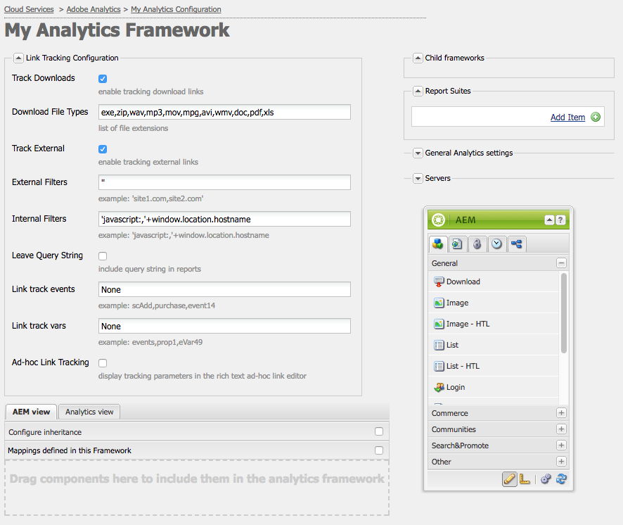

# Adobe Analytics를 위한 링크 추적 구성{#configuring-link-tracking-for-adobe-analytics}

사용자가 웹 사이트의 페이지에서 링크를 클릭하면 Adobe Analytics에서 관련 정보를 캡처할 수 있습니다. 예를 들어, 링크 추적을 사용하여 사용자가 사이트와 상호 작용하는 방법, 파일 다운로드를 추적하고 종료 링크를 추적하는 방법을 살펴볼 수 있습니다.

## Adobe Analytics 프레임워크에 대한 링크 추적 구성 {#configuring-link-tracking-for-an-adobe-analytics-framework}

1. 사용 **탐색**&#x200B;를 통해 **배포**, **Cloud Services** 변환 후 **Adobe Analytics** 섹션을 참조하십시오.

1. 사용 **구성 표시**&#x200B;필요한 Adobe Analytics 프레임워크을 엽니다.
1. 를 확장합니다. **링크 추적 구성** 섹션을 수정하고 필요에 따라 구성합니다(이 페이지에서는 추가 세부 정보를 제공합니다.).

   

## 파일 다운로드 추적 {#tracking-file-downloads}

연결된 페이지에서 다운로드한 파일이 Adobe Analytics에서 다운로드로 자동으로 추적되도록 Adobe Analytics 프레임워크을 구성합니다. 다운로드 추적을 활성화하면 지정하는 파일 유형만 추적됩니다.

기본적으로 다음 파일 유형의 다운로드가 추적됩니다.

* exe
* zip
* wav
* mp3
* mov
* 갤런당
* avi
* wmv
* doc
* pdf
* xls

따라서 PDF 파일에 대해 다운로드 추적 기능이 활성화된 경우 사용자가 PDF 파일에 대한 링크를 클릭할 때마다 PDF 다운로드이 추적됩니다.

프레임워크의 다운로드 추적 속성은 `analytics.sitecatalyst.js` 페이지에 대해 생성된 파일입니다. 다음 코드 샘플은 기본 다운로드 추적 구성을 나타냅니다.

```
s.trackDownloadLinks= true;
s.linkDownloadFileTypes= 'exe,zip,wav,mp3,mov,mpg,avi,wmv,doc,pdf,xls';
```

Adobe Analytics 프레임워크에 대한 다운로드 추적을 활성화하려면

1. [Adobe Analytics 프레임워크을 열고 링크 추적 구성 섹션을 확장합니다](#configuring-link-tracking-for-an-adobe-analytics-framework).
1. 활성화 **다운로드 추적**.
1. 에서 **파일 형식 다운로드** 상자에서 추적할 파일 형식의 파일 이름 확장자를 입력합니다.

## 외부 링크 추적 {#tracking-external-links}

페이지에서 외부 링크(종료 링크)의 클릭을 추적할 수 있습니다.

Adobe Analytics 프레임워크에 대한 외부 링크를 추적하려면

1. [Adobe Analytics 프레임워크을 열고 을(를) 확장합니다. **링크 추적 구성** 섹션](#configuring-link-tracking-for-an-adobe-analytics-framework).
1. 요구 사항에 따라 다음 속성을 구성합니다.

외부 링크를 클릭할 때 추적을 위한 속성:

* **외부 추적**
외부 링크 추적을 활성화합니다.

* **외부 필터**
(선택 사항) 링크 대상의 외부 URL과 일치하는 필터를 정의합니다. 링크 대상이 필터와 일치하면 링크가 추적됩니다. 외부 필터는 페이지에서 일부 외부 링크만 추적하는 데 유용합니다.

   추적할 외부 링크를 지정하려면 링크 대상의 URL의 전체 또는 일부를 입력합니다. 여러 필터는 쉼표로 구분하십시오. 작은따옴표에 문자열 리터럴을 묶습니다. 값 없음(기본값: `''`로 설정되면, 작은 따옴표 두 개가 모두 추적됩니다.

* **내부 필터**
내부 링크의 URL과 일치하는 필터를 정의합니다. 링크가 이 필터와 일치하는 URL을 타겟팅하면 링크가 추적되지 않습니다. 기본값은 현재 창 주소에 대한 URL의 호스트 이름을 반환하는 javascript 명령입니다.

   추적되지 않은 내부 링크를 지정하려면 링크 대상의 내부 URL의 전체 또는 일부를 입력합니다. 여러 필터는 쉼표로 구분하십시오. 작은따옴표에 문자열 리터럴을 묶습니다.

   기본값은 입니다.`'javascript:,'+window.location.hostname`

* **쿼리 문자열 남기기**
내부 및 외부 필터로 일치 항목을 평가할 때 URL 매개 변수를 포함합니다.

   외부 및 내부 필터에 대해 링크 대상 URL을 평가할 때 URL 매개 변수를 포함하도록 활성화합니다.

외부 링크 추적 속성은 `analytics.sitecatalyst.js` 페이지에 대해 생성된 파일입니다. 다음 예제 코드는 다음 구성으로 외부 링크 추적을 활성화한 프레임워크와 연결된 페이지에 대해 생성됩니다.

* 외부 필터: `'google.com'`
* 내부 필터는 기본값입니다. `'javascript:,'+window.location.hostname`
* 필터에 대한 링크 대상을 평가할 때 쿼리 문자열은 포함되지 않습니다.

```
s.trackExternalLinks= false;
s.linkExternalFilters= 'google.com';
s.linkInternalFilters= 'javascript:,'+window.location.hostname;
s.linkLeaveQueryString= false;
```

## 링크 클릭으로 변수 데이터 보내기 {#sending-variable-data-with-link-clicks}

사용자가 링크를 클릭할 때 이벤트 및 변수 데이터를 Adobe Analytics에 보내도록 AEM을 구성할 수 있습니다. 다음 **링크 추적 구성** 속성을 사용하면 링크 클릭 수가 발생할 때 추적할 Adobe Analytics 이벤트 및 변수를 지정할 수 있습니다.

프레임워크 매핑이 이벤트 및 변수 값을 결정합니다. Adobe Analytics 변수를 링크를 클릭할 때 추적하려는 데이터를 저장하는 컨텐츠 구성 요소의 변수에 매핑할 수 있습니다.

링크 클릭으로 변수 데이터를 전송하려면 다음을 수행하십시오.

1. [Adobe Analytics 프레임워크을 열고 링크 추적 구성 섹션을 확장합니다](#configuring-link-tracking-for-an-adobe-analytics-framework).
1. 요구 사항에 따라 다음 속성을 구성합니다.

링크 클릭으로 변수 데이터를 전송하는 속성:

* **링크 추적 이벤트**
링크 클릭 수를 카운트하는 데 사용할 Adobe Analytics 이벤트 변수를 입력합니다.

   여러 변수 이름은 쉼표로 구분하십시오.

   기본값은 입니다. `None` 은 이벤트 추적을 유발하지 않습니다.

* **링크 추적 변수**
링크를 클릭할 때 Adobe Analytics에 전송할 Adobe Analytics 변수를 입력합니다. 여러 변수 이름은 쉼표로 구분하십시오.

   기본값은 입니다. `None` 으로 인해 변수 데이터가 전송되지 않습니다.

전송할 이벤트와 변수를 지정하면 구성이 의 코드로 구현됩니다. `analytics.sitecatalyst.js` 페이지에 대해 생성된 파일입니다. 다음 예제 코드는 프레임워크가 `event10` 이벤트 및 `prop4` 속성:

```
s.linkTrackEvents= 'event10';
s.linkTrackVars= 'prop4';
```

## 링크 추적 구성 예 {#example-link-tracking-configuration}

다음 절차를 수행하여 Adobe Analytics 통합의 링크 추적 동작을 탐색합니다. 프로시저에는 [Adobe Marketing Cloud Debugger](https://experienceleague.adobe.com/docs/debugger/using/experience-cloud-debugger.html).

### 일반 구성 {#general-configuration}

이 예에서는 추적 및 디버거 컨텍스트에서 매핑이 작동하는 방식을 보여줍니다.

1. 웹 페이지와 연결된 프레임워크를 엽니다.
1. 을(를) 드래그합니다. **페이지** 구성 요소를 프레임워크의 매핑 영역에 추가합니다. 다음 **페이지** 구성 요소는 **일반** 구성 요소 그룹을 사이드킥에 추가합니다.

   >[!NOTE]
   >
   >실생활 시나리오에서 사용해야 하는 구성 요소는 에서 상속된 구성 요소에 따라 다릅니다(있는 경우).
   >
   >그렇지 않은 경우 자체 구성 요소를 거기에 노출해야 합니다(페이지 구성 요소에서 analytics 하위 노드를 정의함으로써).

   왼쪽 패널에서 Analytics(SiteCatalyst) 변수를 끌어 다음 표에 따라 매핑을 구성합니다.

<table>
 <tbody>
  <tr>
   <th>CQ 변수<br /> </th>
   <th>변수 브라우저의 항목<br /> </th>
   <th>Adobe Analytics 변수</th>
  </tr>
  <tr>
   <td>pagedata.title</td>
   <td>사용자 지정 eVar 1(eVar1)</td>
   <td>eVar1</td>
  </tr>
  <tr>
   <td>eventdata.events.pageView</td>
   <td>사용자 지정 1(event1)</td>
   <td>event1</td>
  </tr>
 </tbody>
</table>

1. 검색 구성 요소를 프레임워크의 매핑 영역으로 드래그합니다. 검색 구성 요소는 사이드 킥의 일반 구성 요소 그룹에 속합니다. 왼쪽 패널에서 Analytics(SiteCatalyst) 변수를 끌어 다음 표에 따라 매핑을 구성합니다.

<table>
 <tbody>
  <tr>
   <th>CQ 변수<br /> </th>
   <th>변수 브라우저의 항목</th>
   <th>Adobe Analytics 변수</th>
  </tr>
  <tr>
   <td>eventdata.keyword</td>
   <td>사용자 지정 eVar 2(eVar2)</td>
   <td>eVar2</td>
  </tr>
  <tr>
   <td>eventdata.results</td>
   <td>사용자 지정 eVar 3(eVar3)</td>
   <td>eVar3</td>
  </tr>
  <tr>
   <td>eventdata.events.search</td>
   <td>사용자 지정 2(event2)</td>
   <td>event2</td>
  </tr>
 </tbody>
</table>

### 외부 링크 추적 구성 {#configure-external-link-tracking}

1. 프레임워크에서 을 확장합니다. **링크 추적 구성** 영역.
1. 선택 취소 **다운로드 추적**.

1. 선택 **외부 추적**.
1. 선택 취소 **쿼리 문자열 남기기**.
1. 다음 값을 **외부 필터** 외부 URL로 식별할 수 있는 목록:

   `‘yahoo.com’`

1. 다음 값을 **링크 추적 이벤트** 필드:

   ```
       event1,event2
   ```

1. 다음 값을 **링크 추적 변수** 필드:

   ```
       eVar1,eVar2
   ```

1. 프레임워크와 연결된 페이지에서 **텍스트** 구성 요소. 내부 **텍스트** 구성 요소에서 다음 주소를 가리키는 하이퍼링크를 추가하십시오.

   `https://search.yahoo.com/?p=this`

1. 다음으로 전환 **미리 보기 모드** 링크를 클릭합니다.

수행된 호출은 Adobe Marketing Cloud Debugger를 사용하여 볼 때 다음과 같이 표시됩니다.


>[!NOTE]
>
>URL에 쿼리 문자열이 포함되어 있지 않습니다. `?p=this`

### URL 매개 변수 포함 {#include-the-url-parameter}

1. 프레임워크에서 **링크 추적 구성** 영역.
1. 활성화 **쿼리 문자열 남기기**.
1. 페이지 미리 보기를 다시 로드하고 링크를 클릭합니다.

Adobe Marketing Cloud Debugger에 표시되는 호출 세부 사항은 다음 예와 유사합니다.


>[!NOTE]
>
>이번에는 URL에 쿼리 문자열이 들어 있습니다. `?p=this`

## 임시 링크 추적 {#ad-hoc-link-tracking}

임시 링크 추적을 사용하면 컨텐츠 작성자가 구성 요소에 대한 링크 추적을 구성할 수 있습니다. 구성 요소의 구성은 **링크 추적 구성** 프레임워크와 연결된 페이지에서 **텍스트** URL의 링크 추적에 대한 구성 요소를 구성할 수 있습니다.

애드혹 링크 추적을 사용하면 이벤트 및 변수 데이터와 함께 다운로드 링크, 외부 링크를 추적할 수 있습니다.

임시 링크 추적을 활성화하려면 다음을 수행해야 합니다.

* [가 포함된 페이지를 연결합니다 **텍스트** 프레임워크를 사용하는 구성 요소](/help/sites-administering/adobeanalytics-connect.md#associating-a-page-with-a-adobe-analytics-framework).
* [임시 링크 추적을 사용하도록 Adobe Analytics 프레임워크을 구성합니다](#enabling-ad-hoc-link-tracking).
* [텍스트 구성 요소에 대한 링크 추적 구성](#configuring-link-tracking-for-a-text-component).

### 임시 링크 추적 활성화 {#enabling-ad-hoc-link-tracking}

임시 링크 추적을 사용하도록 Adobe Analytics 프레임워크을 구성합니다.

1. Adobe Analytics 프레임워크을 열고 을(를) 확장합니다. **링크 추적 구성** 섹션을 참조하십시오.

1. 활성화 **임시 링크 추적**.

   >[!NOTE]
   >
   >모든 사용자 유형에서 이 확인란에 액세스할 수 있는 것은 아닙니다. 액세스 권한이 필요한 경우 사이트 관리자에게 문의하십시오.

>[!NOTE]
>
>XSS Antisamy 구성이 이제 경로 아래의 SLING에 있습니다 **/libs/sling/xss.config.xml** 및 임시 링크가 작동하려면 다음 규칙을 추가해야 합니다.

#### 앵커 태그 규칙 확장 {#anchor-tag-rule-extension}

```xml
<attribute name="onclick">
    <literal-list>
        <literal value="CQ_Analytics.Sitecatalyst.customTrack(this)"/>
    </literal-list>
</attribute>
<attribute name="adhocenable">
    <literal-list>
        <literal value="true"/>
        <literal value="false"/>
    </literal-list>
</attribute>
<attribute name="adhocevents">
    <regexp-list>
        <regexp name="anything"/>
    </regexp-list>
</attribute>
<attribute name="adhocevars">
    <regexp-list>
        <regexp name="anything"/>
    </regexp-list>
</attribute>
```

### 텍스트 구성 요소에 대한 링크 추적 구성 {#configuring-link-tracking-for-a-text-component}

에 대한 임시 링크 추적을 구성하기 전에 **텍스트** 구성 요소 자체인 경우 다음 구성이 이미 구현되어 있어야 합니다.

* 다음 [Adobe Analytics 프레임워크이 임시 링크 추적을 활성화하도록 구성되었습니다](#enabling-ad-hoc-link-tracking).
* 다음 [가 들어 있는 페이지 **텍스트** 구성 요소는 프레임워크와 연결됩니다](/help/sites-administering/adobeanalytics-connect.md#associating-a-page-with-a-adobe-analytics-framework).

다음 절차를 사용하여 **텍스트** 구성 요소:

1. 페이지를 편집 모드로 열고 **텍스트** 구성 요소.

1. 하이퍼텍스트로 사용할 텍스트를 선택하고 하이퍼링크 단추를 클릭합니다.

   

1. 링크 대상 상자에 대상 URL을 추가한 다음 링크 추적 영역을 확장합니다.

   >[!NOTE]
   >
   >사용자 지정 링크 추적은 링크/연결 해제 작업(Analytics 아이콘) 옆에 별도의 작업으로 표시됩니다.
   >
   >RTE에서 유효한 링크를 선택한 경우에만 활성화됩니다.

   

1. 활성화 **사용자 지정 링크 추적** Adobe Analytics 프레임워크의 링크 추적 구성을 재정의하고 현재 링크에 대한 링크 추적을 활성화하려면 .

1. (선택 사항) 링크를 클릭하여 이벤트를 추적하려면 **Adobe Analytics 변수 포함** 필드. 여러 이벤트 이름을 쉼표로 구분합니다(예: )

   `event1, event22`.

1. (선택 사항) 링크를 클릭하여 변수 데이터를 추적하려면 **Adobe Analytics 변수 포함** 필드. 다음 형식 중 하나를 사용합니다.

   * *`<Variable-name>`*: *`<Dynamic Value>`*
   * *`<Variable-name>`*: *`‘CONSTANT'`*

   다음 예제는 각 형식을 보여 줍니다.

   * `eVar10:pagedata.title`
   * `prop1: ‘Aubergine'`

   여러 값은 쉼표로 구분합니다.

1. 선택 **확인**.
