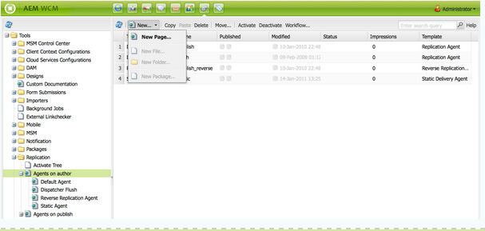
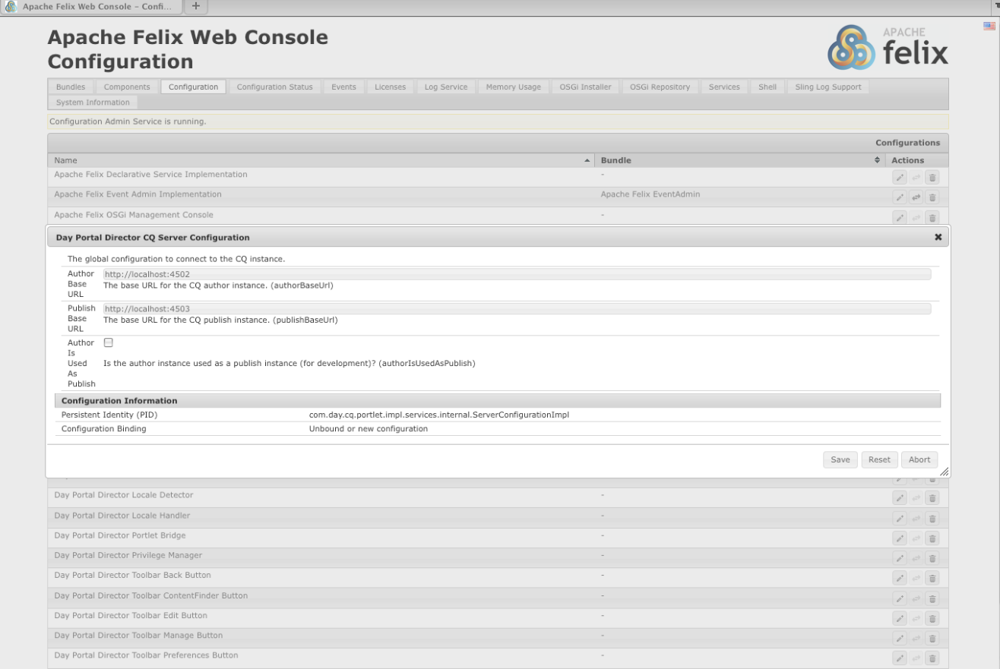

# AEM 포털 및 포틀릿{#aem-portals-and-portlets}

이 문서에서는 다음 사항에 대해 설명합니다.

* AEM 포털 아키텍처
* AEM을 포털로 관리 및 구성
* 포털로 AEM 사용
* 포틀릿에 AEM 컨텐츠 설치, 구성 및 표시(예: 웹 서버)

## AEM 포털 아키텍처 {#aem-portal-architecture}

AEM 포털 아키텍처에는 포털 및 포틀릿 정의가 포함됩니다.

### 포털이란 무엇입니까?{#what-is-a-portal}

포털은 개인화, Single Sign On, 다양한 소스의 컨텐츠 통합, 정보 시스템의 프레젠테이션 레이어를 호스팅하는 웹 애플리케이션입니다.

AEM에서 JSR 286 호환 포틀릿을 실행할 수 있습니다. 포틀릿 구성 요소를 사용하여 페이지에 포틀릿을 포함할 수 있습니다. [AEM Content Portlet](#administeringthecqcontentportlet) 관리를 참조하십시오.

### 포틀릿이란 무엇입니까?{#what-is-a-portlet}

포틀릿은 동적 컨텐츠를 생성하는 컨테이너 내부에 배포되는 웹 구성 요소입니다. 포틀릿 인터페이스는 포틀릿 컨테이너 내에 .war 파일로 패키지되고 배포됩니다. 포털로 AEM을 실행하는 경우 포틀릿의 .war 파일이 있어야 포틀릿을 실행할 수 있습니다.

포털에 나타나도록 AEM 컨텐츠를 구성하려면 포틀릿[에서 AEM 설치, 구성 및 사용을 참조하십시오.](#installingconfiguringandusingcqinaportlet)

### AEM 포털 Director {#aem-portal-director}

>[!CAUTION]
>
>AEM Portal Director은 AEM 6.4부터 더 이상 사용되지 않습니다. [사용되지 않음 및 제거된 기능](https://helpx.adobe.com/experience-manager/6-4/release-notes/deprecated-removed-features.html)을 참조하십시오.

## AEM 컨텐츠 포틀릿 관리 {#administering-the-aem-content-portlet}

AEM 컨텐츠 포틀릿을 사용하면 포털에 AEM 컨텐츠를 표시할 수 있습니다. 포틀릿은 `/crx-quickstart/opt/portal`에서 사용할 수 있으며 다양한 방식으로 사용자 정의할 수 있습니다. 예를 들어 AEM에 필요한 인증 정보를 생성하여 SSO/인증 처리를 배포하여 기본 동작을 덮어쓸 수 있도록 SSO/인증 처리를 사용자 정의할 수 있습니다. 플러그인은 API에 대해 플러그인을 빌드하여 고유한 기능을 추가할 수 있는 정의된 API를 사용합니다. 이 플러그인을 실행 중인 포틀릿에 배포할 수 있습니다. 제대로 작동하려면 시작할 때 표시할 컨텐츠 경로와 함께 AEM 작성자 및 게시 인스턴스의 구성이 필요합니다.

일부 구성은 포틀릿 기본 설정을 통해 변경할 수 있고 다른 구성은 OSGi 서비스 구성을 통해 변경할 수 있습니다. **config** 파일 또는 OSGi 웹 콘솔을 사용하여 이러한 구성을 변경합니다.

### 포틀릿 환경 설정 {#portlet-preferences}

포털 서버에서 배포 시 또는 포틀릿 웹 애플리케이션을 배포하기 전에 **WEB-INF/portlet.xml** 파일을 편집하여 포틀릿 환경 설정을 구성할 수 있습니다. portlet.xml 파일은 기본적으로 다음과 같이 표시됩니다.

```xml
<?xml version="1.0" encoding="UTF-8"?>
<portlet-app xmlns="https://java.sun.com/xml/ns/portlet/portlet-app_1_0.xsd"
             xmlns:xsi="https://www.w3.org/2001/XMLSchema-instance"
             xsi:schemaLocation="https://java.sun.com/xml/ns/portlet/portlet-app_1_0.xsd /opt/SUNWps/dtd/portlet.xsd"
             version="1.0">
   <portlet>
      <portlet-name>RSSWeatherPortlet</portlet-name>
      <portlet-class>org.jboss.portlet.weather.WeatherPortlet</portlet-class>
      <init-param>
         <name>default_zipcode</name>
         <value>05673</value>
      </init-param>
      <init-param>
         <name>RSS_XSL</name>
         <value>/WEB-INF/Rss.xsl</value>
      </init-param>
      <init-param>
         <name>base_url</name>
         <value>https://xml.weather.yahoo.com/forecastrss?p=</value>
      </init-param>
      <expiration-cache>180</expiration-cache>
      <supports>
         <mime-type>text/html</mime-type>
         <portlet-mode>VIEW</portlet-mode>
         <portlet-mode>EDIT</portlet-mode>
      </supports>
      <portlet-info>
         <title>Weather Portlet</title>
      </portlet-info>
      <portlet-preferences>
         <preference>
            <name>expires</name>
            <value>180</value>
         </preference>
         <preference>
            <name>RssXml</name>
            <value>https://xml.weather.yahoo.com/forecastrss?p=33145</value>
            <read-only>false</read-only>
         </preference>
      </portlet-preferences>
   </portlet>
</portlet-app>
```

포틀릿은 다음 기본 설정으로 구성할 수 있습니다.

<table>
 <tbody>
  <tr>
   <td>startPath</td>
   <td><p>포틀릿의 시작 경로입니다.처음에 표시되는 컨텐츠를 정의합니다.</p> <p><strong>중요</strong>:포틀릿이 AEM 작성자 및 게시 인스턴스와 다른<strong>  컨텍스트 경로에서 실행되는 인스턴스를 연결하도록 구성된 경우, 이러한 AEM 인스턴스의 HTML 라이브러리 관리자 구성(예: Felix Webconsole을 통해)</strong>  <strong></strong> 에 강제 CQUrlInfoin을 활성화해야 하거나 편집이 작동하지 않으며 환경 설정 대화 상자가 나타나지 않습니다.</p> </td>
  </tr>
  <tr>
   <td>htmlSelector</td>
   <td>각 URL에 추가되는 선택기입니다. 기본적으로 이것은 <strong>포틀릿</strong>이므로 html 페이지에 대한 모든 요청은 <strong>.portlet.html로 끝나는 url을 사용합니다.</strong> 그러면 포틀릿 렌더링에 AEM 내에서 사용자 정의 스크립트를 사용할 수 있습니다.</td>
  </tr>
  <tr>
   <td>addCssToPortalHeader</td>
   <td><p>기본적으로 AEM의 HTML 페이지에 포함된 css 파일은 포틀릿에 포함됩니다. 이 옵션을 비활성화하면 기본 css 파일이 제외됩니다.</p> <p>이 옵션을 활성화하면 CSS 파일이 html 페이지의 헤드에 추가되거나 포털의 비헤이비어에 따라 html 페이지에 포함됩니다.</p> </td>
  </tr>
  <tr>
   <td>includeToolbar</td>
   <td>기본적으로 도구 모음은 관리 기능을 위해 컨텐트 포틀릿 내에서 렌더링됩니다. 이 옵션을 비활성화하면 도구 모음이 렌더링되지 않습니다.</td>
  </tr>
  <tr>
   <td>urlParameterNames</td>
   <td><p>포틀릿에 표시할 새 컨텐츠 URL이 포함될 수 있는 대체 URL 매개 변수 이름 목록입니다. 목록이 위쪽에서 아래쪽으로 처리되고 값이 포함된 첫 번째 매개 변수가 사용됩니다. URL을 찾을 수 없으면 기본 URL 매개 변수가 사용됩니다. 제공된 URL은 현재 그대로 사용되고 있으며 더 이상 수정하지 않습니다.</p> <p>이 설정은 배포된 포틀릿별로 설정되며 "Day Portal Director 포틀릿 브리지"에 대한 OSGi 구성에서 일부 URL 매개 변수를 전체적으로 구성할 수도 있습니다.</p> </td>
  </tr>
  <tr>
   <td>preferenceDialog</td>
   <td>AEM의 환경 설정 대화 상자 경로 - 비어 있는 경우 내장된 환경 설정 대화 상자가 사용됩니다. 기본값은 /libs/portal/content/prefs.html입니다.</td>
  </tr>
  <tr>
   <td>initialRedirect</td>
   <td>기본적으로 포틀릿은 첫 번째 호출에서 전체 포털 페이지에 대한 javascript 리디렉션을 수행합니다. 이는 최신 포털 서버의 드래그 앤 드롭 시나리오를 지원하기 위한 것입니다. 프로덕션에서 이 리디렉션은 거의 필요하지 않으므로 이 환경 설정이 <em>false</em>로 설정되어 있으면 해제할 수 있습니다.</td>
  </tr>
 </tbody>
</table>

#### OSGi 웹 콘솔 {#osgi-web-console}

포털 서버가 호스트 localhost에서 실행되고 포트 8080 및 AEM 포틀릿 웹 응용 프로그램이 웹 응용 프로그램 컨텍스트 *cqportlet*&#x200B;에 마운트되었다고 가정할 경우 웹 콘솔에 대한 url은 `https://localhost:8080/cqportlet/cqbridge/system/console`입니다. 기본 사용자 및 암호는 **admin**&#x200B;입니다.

**구성** 탭을 열고 **포털 디렉토리 CQ 서버 구성**&#x200B;을 선택합니다. 여기서는 작성자와 게시 인스턴스에 대한 기본 URL을 지정합니다. 이 절차는 [포틀릿](#configuring-the-portlet) 구성에 설명되어 있습니다.

>[!NOTE]
>
>OSGi 웹 콘솔은 개발(또는 테스트) 중에 구성을 변경하기 위한 용도로만 사용됩니다. 프로덕션 시스템의 콘솔에 대한 요청을 차단해야 합니다.

### 구성 제공 중 {#providing-configurations}

자동 배포 및 구성 제공을 지원하기 위해 AEM 컨텐츠 포틀릿은 포틀릿 애플리케이션에 제공된 클래스 경로에서 구성을 읽으려고 하는 내장 구성 지원을 제공합니다.

시작할 때 시스템 속성 **com.day.cq.portext.config**&#x200B;이(가) 현재 환경을 감지하기 위해 읽습니다. 일반적으로 이 속성의 값은 **dev**, **prod**, **test** 등과 같습니다. 설정된 환경이 없으면 구성이 읽히지 않습니다.

환경이 설정된 경우 구성 파일은 다음 위치의 클래스 경로에서 검색됩니다.***com/day/cq/portlet/{env}.config** 여기서 **env**&#x200B;은(는) 환경의 실제 값으로 대체됩니다. 이 파일은 이 환경에 대한 모든 구성 파일을 나열해야 합니다. 이러한 파일은 구성 파일의 위치를 기준으로 검색됩니다. 예를 들어 파일에 행 `my.service.xml,`이 있는 경우 이 파일은 `com/day/cq/portlet/my.service.config.`의 클래스 경로에서 읽습니다. 파일의 이름은 서비스의 지속성 ID로 구성되며 그 뒤에 **.config**&#x200B;이 옵니다. 이전 예에서 지속성 ID는 **my.service**&#x200B;입니다. 구성 파일의 형식은 Apache Sling OSGi 설치 프로그램에서 사용하는 형식입니다.

즉, 각 환경에 해당하는 구성 파일을 추가해야 합니다. 모든 환경에 적용해야 하는 구성을 이 모든 파일에 입력해야 합니다. 단일 환경용인 경우 해당 파일에 방금 입력됩니다. 이 메커니즘을 통해 어떤 구성을 어떤 환경에서 읽을지 완벽하게 제어할 수 있습니다.

다른 시스템 속성을 사용하여 환경을 감지할 수 있습니다. **com.day.cq.portext.config** 대신 사용할 시스템 속성의 이름이 포함된 시스템 속성 **com.day.cq.portest.configproperty**&#x200B;을 지정합니다.

#### 캐싱 및 캐싱 무효화 {#caching-and-caching-invalidation}

기본 구성의 포틀릿은 사용자별 캐시에서 AEM WCM에서 받은 응답을 캐시합니다. 게시 인스턴스의 컨텐츠에서 변경 사항이 발생하는 경우 캐시가 무효화되어야 합니다. 이를 위해 AEM WCM에서 복제 에이전트를 작성자 인스턴스에 구성해야 합니다. 캐시를 수동으로 플러시할 수도 있습니다. 이 섹션에서는 이러한 절차 모두에 대해 설명합니다.

포틀릿은 자체 캐시로 구성할 수 있으므로 포틀릿의 컨텐츠가 AEM에 액세스할 필요 없이 표시되도록 할 수 있습니다. 포털은 /libs/portal/director에서 콘텐츠로 사용할 수 있습니다. 내용에 액세스하려면 CRXDE Lite 또는 Webdav를 사용하여 AEM 인스턴스를 시작하고 해당 위치의 파일을 다운로드합니다.

런타임 시 이 번들을 배포하거나 배포 전에 포틀릿 웹 응용 프로그램( `WEB-INF/lib/resources/bundles`)에 추가할 수 있습니다.

캐시가 배포되면 포틀릿은 게시 인스턴스의 컨텐츠를 캐시합니다. 포틀릿 캐시는 AEM에서 발송된 디스패처 플러쉬를 사용하여 무효화할 수 있습니다. 포틀릿에서 자체 캐시를 사용하도록 구성하려면 다음을 수행하십시오.

1. 포털 서버를 대상으로 하는 작성자의 복제 에이전트를 구성합니다.
1. 포털 서버가 호스트 **localhost**, **port 8080 **에서 실행되고 AEM 포틀릿 웹 응용 프로그램이 **cqportlet** 컨텍스트에 마운트되었다고 가정할 경우 캐시를 플러시할 URL은 `https://localhost:8080/cqportlet/cqbridge/cqpcache?Path=$(path)`입니다. GET을 메서드로 사용합니다.
   **참고:** 요청 매개 변수를 사용하는 대신 Path라는 http 헤더를 보낼 수  **있습니다**.

#### 복제 에이전트 {#flushing-the-cache-via-replication-agent}을(를) 통해 캐시 플러싱

일반적인 디스패처 무효화처럼 포털의 AEM 포틀릿 캐시를 대상으로 복제 에이전트를 구성할 수 있습니다. 복제 에이전트를 구성한 후 모든 일반 페이지 활성화는 포털 캐시를 플러시합니다.

AEM 포틀릿을 실행하는 여러 포털 노드를 운영하는 경우 이 절차에 설명된 대로 각 노드에 대한 에이전트를 만들어야 합니다.

포털용 복제 에이전트를 구성하려면:

1. 작성자 인스턴스에 로그인합니다.
1. 웹 사이트 탭에서 *도구* 탭을 클릭합니다.
1. **새 페이지...를 클릭합니다.복제 에이전트**&#x200B;새로 만들기...**메뉴.**

   

1. *템플릿*&#x200B;에서 *복제 에이전트*&#x200B;를 선택하고 에이전트 이름을 입력합니다. *만들기*&#x200B;를 클릭합니다.

   

1. 방금 만든 복제 에이전트를 두 번 클릭합니다. 아직 구성되지 않았기 때문에 잘못된 것으로 표시됩니다.

   

1. **편집**&#x200B;을 클릭합니다.
1. **설정** 탭에서 **활성화됨** 확인란을 선택하고 일련화 유형으로 **발송자 플러시**&#x200B;를 선택하고 다시 시도 시간 제한(예: 6000)을 입력합니다.

   

1. **전송** 탭을 클릭합니다.
1. **URI** 필드에 포틀릿의 플러시 URI(URL)를 입력합니다. URI 형식은 다음과 같습니다.

   ```xml
   https://<wps-host>:<port>/<wps-context>/<cq5-portlet-context>/cqbridge/cqpcache
   ```

   

1. **확장** 탭을 클릭합니다.

   

1. **HTTP 메서드** 필드에 **GET**&#x200B;을 입력합니다.
1. **HTTP 헤더** 필드에서 **+**&#x200B;을 클릭하여 새 항목을 추가하고 **Path:{path}**.
1. 필요한 경우 **프록시** 탭을 클릭하고 에이전트에 프록시 정보를 입력합니다.
1. **확인**&#x200B;을 클릭하여 변경 내용을 저장합니다.
1. 연결을 테스트하려면 **연결 테스트** 링크를 클릭합니다. 복제 테스트에 성공했는지 여부를 나타내는 로그 메시지가 나타납니다. 예:

   

#### 포틀릿 캐시 {#manually-flushing-the-portlet-cache} 수동 플러싱

복제 에이전트에 대해 구성된 동일한 URL에 액세스하여 포틀릿 캐시를 수동으로 플러시할 수 있습니다. URL 형식에 대해서는 [캐시 플러싱](#flushing-the-cache-via-replication-agent)을 참조하십시오. 또한 플러시할 항목을 나타내려면 URL 매개 변수 경로=&lt;경로>로 URL을 확장해야 합니다.

예:

`https://10.0.20.99:10040/wps/PA_CQ5_Portlet/cqbridge/cqpcache?Path=*` 전체 캐시를 플러시합니다. `https://10.0.20.99:10040/wps/PA_CQ5_Portlet/cqbridge/cqpcache?Path=/content/mypage/xyz` 캐시 `/content/mypage/xyz` 에서 플러시합니다.

### 포털 보안 {#portal-security}

포털은 인증 메커니즘의 주요 역할을 합니다. 기술 사용자, 포털 사용자, 그룹 등을 통해 AEM에 로그인할 수 있습니다. 포틀릿은 포털에서 사용자의 암호를 액세스할 수 없으므로 포틀릿에서 사용자 로그인에 필요한 자격 증명을 모두 모를 경우 SSO 솔루션을 사용해야 합니다. 이 경우 AEM 포틀릿은 모든 필수 정보를 AEM에 전달하여 이 정보를 기본 AEM 저장소로 전달합니다. 이 동작은 플러그형이며 사용자 정의할 수 있습니다.

### 게시 시 인증 {#authentication-on-publish}

이 섹션에서는 포틀릿이 기본 AEM WCM 인스턴스와 통신하는 데 사용할 수 있는 인증 모드를 설명합니다.

기본적으로 AEM의 게시 인스턴스로 사용자 정보가 전송되지 않습니다.컨텐츠는 항상 익명 사용자로 표시됩니다. AEM에서 사용자 특정 정보를 전달하거나 게시를 위한 사용자 인증이 필요한 경우 이 정보를 설정해야 합니다.

#### 포틀릿의 인증 구성 {#accessing-the-portlet-s-authentication-configuration} 액세스

포틀릿이 AEM WCM 인스턴스에서 사용하는 인증 구성 옵션은 웹 콘솔(OSGi 구성)에서 사용할 수 있습니다.

>[!NOTE]
>
>AEM으로 작업할 때는 OSGi 서비스(콘솔 또는 저장소 노드)에 대한 구성 설정을 관리하는 방법이 여러 개 있습니다.
>
>자세한 내용은 [OSGi](/help/sites-deploying/configuring-osgi.md) 구성을 참조하십시오.

포틀릿의 인증 구성에 액세스하려면

1. 다음 URL에서 웹 콘솔에 액세스합니다.

   `https://localhost:8080/cqportlet/cqbridge/system/console`

   예를 들어 기본 구성에서:

   `https://wps-host:10040/wps/PA_CQ5_Portlet/cqbridge/system/console`

1. 웹 콘솔에 로그인합니다. 기본 자격 증명은 `admin/admin`입니다.
1. 콘솔에서 **구성**&#x200B;을 선택합니다.
1. **구성** 메뉴에서 구성할 특정 서비스를 선택합니다. 서비스는 OSGi 프레임워크에서 포틀릿에서 제공합니다.

   | 서비스 이름 | 설명 |
   |---|---|
   | 데이 포털 Director 인증기 | AEM WCM 인스턴스에 사용되는 인증 모드를 구성합니다. 선택한 모드에 따라 기술 사용자 또는 SSO 쿠키의 이름을 지정할 수 있습니다. 또한 AEM WCM 게시 인스턴스에 대한 인증을 활성화할 수 있습니다. |
   | Day Portal Director 파일 캐시 | 포틀릿이 AEM WCM 인스턴스에서 수신한 응답을 캐시하는 방식의 매개 변수를 구성합니다. |
   | Day Portal Director HTTP 클라이언트 서비스 | 포틀릿이 HTTP를 통해 기본 AEM WCM 인스턴스에 연결하는 방법을 구성합니다. 예를 들어 프록시 서버를 지정할 수 있습니다. |
   | Day Portal Director 로케일 처리기 | 포틀릿에서 지원하는 로케일을 구성합니다. AEM WCM 인스턴스에 대한 요청은 사용자 로케일을 기반으로 합니다.예를 들어 사용자 언어 *독일어 *는 `/content/geometrixx/de/`을(를) 요청합니다.... |
   | Day Portal Director 권한 관리자 | 포틀릿은 현재 로그인한 사용자를 기반으로 웹 사이트 탭을 테스트할지 여부를 구성합니다. |
   | Day Portal Director 도구 모음 렌더러 | 포틀릿 도구 모음 렌더링을 사용자 정의합니다. |

1. 또한 웹 콘솔 및 로깅 서비스를 구성할 수 있습니다. 예를 들어 Apache Felix OSGi Management Console 링크를 클릭하여 웹 콘솔에 대한 관리 자격 증명을 변경할 수 있습니다.

#### 기술 사용자 모드 {#technical-user-mode}

기본 모드에서는 AEM WCM 작성자 인스턴스에 대해 포틀릿에서 발행한 모든 요청이 현재 포털 사용자와 상관없이 동일한 기술 사용자를 사용하여 인증됩니다. 기술 사용자 모드는 기본적으로 활성화되어 있습니다. OSGi 관리 콘솔의 각 구성 화면에서 이 모드를 활성화/비활성화합니다.

**게시에서 인증**&#x200B;이(가) 활성화된 경우 지정된 기술 사용자가 AEM WCM 작성자 인스턴스와 게시 인스턴스에 있어야 합니다. 작성을 위해 충분한 액세스 권한을 사용자에게 제공해야 합니다.

#### SSO {#sso}

포틀릿은 SSO를 기본적으로 지원합니다. 인증자 서비스는 SSO를 사용하도록 구성하고 형식이 **Basic**&#x200B;인 현재 포털 사용자를 `cqpsso` 쿠키로 AEM에 전송할 수 있습니다. AEM은 경로 /에 SSO 인증 핸들러를 사용하도록 구성해야 합니다. 여기에 쿠키 이름도 구성해야 합니다.

AEM 저장소의 `crx-quickstart/repository/repository.xml`을(를) 적절히 구성해야 합니다.

```xml
<LoginModule class="com.day.crx.security.authentication.CRXLoginModule">
  ...
  <param name="trust_credentials_attribute" value="TrustedInfo"/>
  <param name="anonymous_principal" value="anonymous"/>
</LoginModule>
```

#### SSO 인증 모드 {#sso-authentication-mode}

포틀릿은 SSO(Single Sign On) 스키마를 사용하여 AEM WCM에 대해 인증할 수 있습니다. 이 모드에서는 현재 포털에 로그인한 사용자가 SSO 쿠키 형태로 AEM WCM으로 전달됩니다. SSO 모드를 사용하는 경우 AEM 포틀릿에 액세스할 수 있는 모든 포털 사용자는 기본 AEM WCM 인스턴스에 대해 알고 있어야 하며, 가장 일반적으로 LDAP에 연결되는 AEM WCM 형식으로 알려지거나 사용자를 미리 수동으로 생성하여 알려주어야 합니다. 또한 포틀릿에서 SSO를 활성화하기 전에 SSO 기반 요청을 수락하도록 기본 AEM WCM 작성자 인스턴스(**게시에서 인증&lt;a1/>이 활성화되어 있으면 게시 인스턴스)를 구성해야 합니다.**

SSO 인증 모드를 사용하도록 포틀릿을 구성하려면 다음 단계를 완료하십시오(다음 섹션에 자세히 설명되어 있음).

* AEM WCM의 리포지토리에서 신뢰할 수 있는 자격 증명을 수락하도록 설정합니다.
* AEM WCM에서 SSO 인증을 활성화합니다.
* AEM 포틀릿에서 SSO 인증을 활성화합니다.

#### AEM WCM의 리포지토리에서 트러스트된 자격 증명 {#enabling-aem-wcm-s-repository-to-accept-trusted-credentials}을(를) 수락하도록 설정

AEM WCM에 대해 SSO를 활성화하려면 먼저 AEM WCM에서 제공하는 신뢰할 수 있는 자격 증명을 수락하도록 기본 저장소를 구성해야 합니다. 이렇게 하려면 AEM repository.xml을 구성합니다.

1. AEM WCM이 설치된 파일 시스템에서 다음 파일을 엽니다.

   `//crx-quickstart/repository/repository.xml`

1. XML 파일에서 **LoginModule**&#x200B;의 항목을 찾고 해당 구성에 trust_credentials_attribute를 추가합니다.

   ```xml
   <LoginModule class="com.day.crx.security.authentication.CRXLoginModule">
     ...
     <param name="trust_credentials_attribute" value="TrustedInfo"/>
     <param name="anonymous_principal" value="anonymous"/>
   </LoginModule>
   ```

1. AEM WCM을 다시 시작하여 변경 사항을 적용합니다.

#### AEM WCM {#enabling-sso-authentication-in-the-aem-wcm}에서 SSO 인증 활성화

AEM WCM에서 SSO를 활성화하려면 AEM WCM의 Apache Felix Web Management Console(OSGi)에서 관련 구성 항목에 액세스합니다.

1. https://&lt;AEM-host>:&lt;port>/system/console에서 URI를 통해 콘솔에 액세스합니다.
1. 구성 메뉴에서 SSO 인증 핸들러를 선택합니다. 이 예에서 SSO 처리기는 AEM 포틀릿에서 제공하는 쿠키를 기반으로 모든 경로에 대한 SSO 요청을 허용합니다. 구성은 다를 수 있습니다.

   | 경로 | / | 모든 요청에 대해 SSO 핸들러를 활성화합니다. |
   |---|---|---|
   | 쿠키 이름 | cqpsso | 포틀릿의 OSGi 콘솔에 구성된 대로 포틀릿에서 제공하는 쿠키의 이름입니다. |

1. **저장**&#x200B;을 클릭하여 SSO를 활성화합니다. 이제 SSO가 기본 인증 체계입니다.

AEM WCM이 수신되는 모든 요청에 대해 먼저 SSO 기반 인증을 시도합니다. 오류가 발생하면 일반적인 기본 인증 체계를 폴백합니다. 따라서 SSO 없이 AEM WCM에 대한 정상적인 연결은 가능합니다.

#### AEM 포틀릿 {#enabling-sso-authentication-in-a-aem-portlet}에서 SSO 인증 활성화

기본 AEM WCM 인스턴스에서 SSO 요청을 승인하려면 포틀릿의 인증 모드를 **Technical**&#x200B;에서 **SSO**&#x200B;로 전환해야 합니다.

AEM 포틀릿에서 SSO 인증을 활성화하려면:

1. https://&lt;aem-host>:&lt;port>/system/console의 URI를 통해 콘솔에 액세스합니다.
1. 구성 메뉴의 사용 가능한 구성 목록에서 데이 포털 Director 인증기를 선택합니다.
1. 모드에서 SSO를 선택합니다. 다른 매개 변수와 기본값을 그대로 둡니다.

   

1. 저장을 클릭하여 포틀릿에 대해 SSO를 활성화합니다.

   AEM WCM에서 관리자 권한으로 동일한 사용자를 만든 후 테스트용으로 포털의 관리 사용자로 포틀릿에 액세스합니다.

이 절차를 수행한 후 요청은 SSO를 사용하여 인증됩니다. HTTP 커뮤니케이션의 일반적인 코드 조각은 다음과 같은 SSO 및 포틀릿별 헤더가 있음을 보여줍니다.

```xml
C-12-#001898 -> [GET /mynet/en/_jcr_content/par/textimage/image.img.png HTTP/1.1 ]
C-12-#001963 -> [cq5:locale: en ]
C-12-#001979 -> [cq5:used-locale: en ]
C-12-#002000 -> [cq5:locales: en,en_US ]
C-12-#002023 -> [cqp:user: wpadmin ]
C-12-#002042 -> [cqp:portal: IBM WebSphere Portal/6.1 ]
C-12-#002080 -> [cqp:windowid: 7_CGAH47L000CE302V2KFNOG0084 ]
C-12-#002124 -> [cqp:windowstate: normal ]
C-12-#002149 -> [cqp:portletmode: view ]
C-12-#002172 -> [User-Agent: Jakarta Commons-HttpClient/3.1 ]
C-12-#002216 -> [Host: 10.0.0.68:4502 ]
C-12-#002238 -> [Cookie: $Version=0; cqpsso=Basic+d3BhZG1pbg%3D%3D ]
C-12-#002289 -> [ ]
```

### PIN 인증 사용 {#enabling-pin-authentication}

AEM 컨텐츠 포틀릿의 기본 인라인 편집 기능을 사용하고 있지 않지만 포틀릿의 작성 및 관리 부분을 AEM 작성자 인스턴스에서 직접 포털 외부에 두려면 PIN 인증을 활성화해야 합니다. 관리 단추의 구성을 변경해야 합니다.

웹 사이트 관리 페이지를 열거나 포틀릿에서 페이지를 편집하려면 AEM 컨텐츠 포틀릿은 새 핀 인증을 사용합니다. 기본적으로 핀 인증은 비활성화되므로 AEM에서 다음 구성을 변경해야 합니다.

1. repository.xml 파일에 신뢰할 수 있는 정보를 추가하여 AEM에서 신뢰할 수 있는 인증을 활성화합니다.

   ```xml
   <LoginModule class="com.day.crx.security.authentication.CRXLoginModule">
     ...
     <param name="trust_credentials_attribute" value="TrustedInfo"/>
   </LoginModule>
   ```

1. OSGi 구성 콘솔의 기본 위치 https://localhost:4502/system/console/configMgr의 드롭다운 메뉴에서 **CQ PIN 인증 처리기**&#x200B;를 선택합니다.
1. 단일 값 **/**&#x200B;만 포함하도록 **URL 루트 경로** 매개 변수를 편집합니다.

### 권한 {#privileges}

포틀릿의 일부 기능은 권한으로 보호됩니다. 이 기능에 액세스하려면 현재 사용자에게 이 권한이 있어야 합니다. 다음 권한이 미리 정의되어 있습니다.

* &quot;toolbar&quot; :포틀릿에서 도구 모음을 보거나 사용할 수 있는 일반 권한입니다.
* &quot;prefs&quot; :사용자에게 이 권한이 있으면 포틀릿의 환경 설정을 보거나 변경할 수 있습니다.
* &quot;cq-author:edit&quot; :이 권한을 통해 사용자는 컨텐츠의 편집 보기를 호출할 수 있습니다.
* &quot;cq-author:preview&quot; :이 권한을 통해 사용자는 미리 보기를 볼 수 있습니다.
* &quot;cq-author:siteadmin&quot; :이 권한을 통해 사용자는 AEM 내에서 siteadmin을 열 수 있습니다.

권한을 관리하기 위한 가장 좋은 방법은 포털 역할을 사용하고 이러한 권한에 역할을 할당하는 것입니다. 이 작업은 OSGi 구성을 통해 수행할 수 있습니다. &quot;Day Portal Director 권한 관리자&quot;는 각 권한에 대한 역할 세트로 구성할 수 있습니다. 사용자에게 역할 중 하나가 있는 경우 사용자에게 해당 권한이 있습니다.

또한 포틀릿 인스턴스 기반당 액세스를 기반으로 이 역할을 정의할 수도 있습니다. 포틀릿의 환경 설정 대화 상자에는 위의 각 권한에 대한 입력 필드가 포함되어 있습니다. 각 권한에 대해 포틀릿 역할의 쉼표로 구분된 목록을 구성할 수 있습니다. 값이 구성된 경우 이 값은 &quot;Day Portal Director 권한 관리자&quot; 서비스의 전역 구성을 재정의하며 역할이 병합되지 않으므로 이 전역 설정에서 동일한 역할을 추가해야 할 수 있습니다. 값을 지정하지 않으면 전역 구성이 사용됩니다.

### AEM 포틀릿 응용 프로그램 {#customizing-the-aem-portlet-application} 사용자 정의

제공된 AEM 포틀릿 애플리케이션은 AEM에서와 마찬가지로 웹 애플리케이션 내에서 OSGi 컨테이너를 시작합니다. 이 아키텍처에서는 OSGi의 모든 이점을 활용할 수 있습니다.

* 간편한 업데이트 및 확장
* 포털 서버의 상호 작용 없이 포틀릿의 핫업데이트를 제공합니다.
* 포틀릿 사용자 정의

### 도구 모음 단추 {#toolbar-buttons}

도구 모음 및 해당 단추를 구성할 수 있으며 사용자 정의할 수 있습니다. 도구 모음에 단추를 추가하거나 어느 모드에 표시되는지 정의할 수 있습니다. 각 버튼은 OSGi 구성을 통해 구성할 수 있는 OSGi 서비스입니다.

OSGi 웹 콘솔은 **구성** 탭에 모든 단추 구성을 나열합니다. 각 단추에 대해 이 단추가 표시되는 모드를 정의할 수 있습니다. 예를 들어 모든 모드를 제거하여 단추를 비활성화할 수 있습니다.

기본적으로 AEM 컨텐츠 포틀릿은 인라인 편집 기능을 사용합니다. 그러나 편집을 위해 AEM 작성자 인스턴스로 전환하려면 **SiteAdmin 단추** 및 **ContentFinder 단추**&#x200B;를 활성화하되 **편집 단추**&#x200B;를 비활성화하십시오. 이 경우 AEM에서 PIN 인증을 올바르게 구성해야 합니다.

사전 정의된 위치에 사용자 지정 CSS/HTML이 포함되어 있는 포틀릿의 Felix 웹 콘솔을 통해 번들을 설치하여 포틀릿의 도구 모음 레이아웃을 사용자 정의할 수 있습니다.

#### 번들 구조 {#bundle-structure}

다음은 번들 구조의 예입니다.

```xml
$ jar tvf target/toolbarlayout-0.0.1-SNAPSHOT.jar | awk '{print $8}'
META-INF/
META-INF/MANIFEST.MF
/com/day/cq/portlet/toolbar/layout/
/com/day/cq/portlet/toolbar/layout/author.gif
/com/day/cq/portlet/toolbar/layout/back.gif
/com/day/cq/portlet/toolbar/layout/button.html
/com/day/cq/portlet/toolbar/layout/edit.gif
/com/day/cq/portlet/toolbar/layout/manage.html
/com/day/cq/portlet/toolbar/layout/publish.html
/com/day/cq/portlet/toolbar/layout/refresh.gif
/com/day/cq/portlet/toolbar/layout/siteadmin.gif
/com/day/cq/portlet/toolbar/layout/toolbar.css
```

META-INF 폴더에는 OSGi에서 번들로 식별하기 위해 필요한 MANIFEST.MF 파일이 포함되어 있습니다. 다음과 같이 표시됩니다.

```xml
Manifest-Version: 1.0
Built-By: djaeggi
Created-By: Apache Maven Bundle Plugin
Import-Package: com.day.cq.portlet.toolbar.layout
Bnd-LastModified: 1234178347159
Export-Package: com.day.cq.portlet.toolbar.layout
Bundle-Version: 0.0.1.SNAPSHOT
Bundle-Name: Company CQ5 Portal Director Portlet Toolbar Layout
Bundle-Description: This bundle provides a custom layout for the CQ5 P
 ortal Director Portlet Toolbar.
Build-Jdk: 1.5.0_16
Bundle-ManifestVersion: 2
Bundle-SymbolicName: com.day.cq.portlet.company.toolbarlayout
Tool: Bnd-0.0.255
```

HTML/CSS/이미지가 /com/day/cq/portlet/toolbar/layout 폴더 내에 있다는 사실은 포틀릿에 의해 지정되며 변경할 수 없습니다. 동일한 행에서 MANIFEST.MF의 Import-Package 및 Export-Package 헤더도 /com/day/cq/portlet/toolbar/layout이라고 해야 합니다. Bundle-SymbolicName은 고유해야 하고 정규화된 패키지 이름이어야 합니다.

이 섹션에 표시된 대로 마펜과 같은 도구를 사용하여 만들거나 관련 헤더가 설정된 jar 파일을 수동으로 만들 수 있습니다.

#### 포틀릿 도구 모음 보기 횟수 {#portlet-toolbar-views}

포틀릿의 도구 모음에는 기본적으로 두 개의 보기 상태가 있습니다. 각 보기 및 관련 단추는 각각의 HTML 파일로 사용자 정의할 수 있습니다.

#### 게시 보기 {#publish-view}

게시 보기에는 도구 모음을 관리 보기로 전환하는 단추가 하나만 있습니다. 게시 보기는 [이전 번들](/help/sites-deploying/configuring-osgi.md#bundles)에서 publish.html 파일로 표현됩니다. HTML에서는 렌더링할 때 포틀릿으로 대체되는 다음 자리 표시자를 사용할 수 있습니다.

#### 게시 보기 자리 표시자 {#publish-view-placeholders}

| 자리 표시자 문자열 | 설명 |
|---|---|
| {buttonManage} | 자리 표시자는 **관리** 버튼으로 대체되며 포틀릿 상태를 관리 상태로 전환합니다. |

#### 보기 관리 {#manage-view}

관리 보기에는 다음 4개의 단추가 있습니다.편집, 웹 사이트 탭, 새로 고침 및 뒤로 관리 보기는 [이전 번들](/help/sites-deploying/configuring-osgi.md#bundles)에서 manage.html 파일로 표현됩니다. HTML에서는 렌더링할 때 포틀릿으로 대체되는 다음 자리 표시자를 사용할 수 있습니다.

#### 보기 자리 표시자 관리 {#manage-view-placeholders}

| 자리 표시자 문자열 | 설명 |
|---|---|
| {buttonEdit} | 자리 표시자는 AEM 편집 모드에서 현재 페이지가 있는 새 창을 여는 **편집** 단추로 대체됩니다. |
| {button웹 사이트 탭} | AEM WCM의 웹 사이트 탭을 여는 단추로 대체된 자리 표시자 |
| {buttonRefresh} | 현재 보기를 새로 고칩니다. |
| {buttonBack} | 포틀릿을 다시 게시 보기로 전환합니다. |

#### 단추 {#buttons}

버튼은 표시되는 보기에서 button.html에 정의된 것과 동일한 공통 HTML을 사용합니다.

HTML에서는 렌더링할 때 포틀릿으로 대체되는 다음 자리 표시자를 사용할 수 있습니다.

#### 보기 단추 관리 및 게시 {#manage-and-publish-view-buttons}

| 자리 표시자 문자열 | 설명 |
|---|---|
| {이름} | 버튼의 이름(예: ** author, back, refresh** 등)입니다. |
| {id} | 단추의 CSS ID입니다. |
| {url} | 단추 대상의 URL입니다. |
| {text} | 단추의 레이블입니다. |
| {onclick} | Javascript **onclick** 함수({url}이(가) 포함)입니다. |

button.html 파일의 예:

```xml
<div class="cqp_button">

 <a href="#" onclick="{onclick}">

 

 </a>
</div>
```

#### 사용자 지정 레이아웃 설치 {#installing-a-custom-layout}

사용자 정의 레이아웃을 설치하려면 포틀릿의 OSGI 웹 콘솔 **Bundles ** 섹션에 액세스하고 번들을 업로드합니다.

#### 패키지 {#packages}

설치 패키지를 업로드하거나 만들어야 하는 경우 AEM 설명서의 패키지 관리자를 참조하여 자세한 지침을 확인하십시오.

### 링크 처리 {#link-handling}

모든 링크는 포털 컨텍스트 내에서 작동하도록 다시 작성됩니다. 기본적으로 렌더링 매개 변수가 있는 링크가 사용됩니다. 대신 작업 링크를 사용하도록 포털 Director HTML 리라이터를 구성할 수 있습니다.

컨텐츠 경로가 표시될 때까지 쿼리할 추가 요청 매개 변수를 정의할 수도 있습니다. 예를 들어 외부에서 특정 컨텐츠로 연결되는 링크가 있는 경우 유용합니다.

또한 포털 Director HTML 리라이터는 링크 재작성을 위해 정의된 일반 표현식 목록으로 구성할 수 있습니다. 예를 들어 외부 시스템에 대한 상대 링크가 있는 경우 이 제외 목록에 추가해야 합니다.

### 로컬라이제이션 {#localization}

AEM 컨텐츠 포틀릿에는 AEM의 컨텐츠가 올바른 언어로 되어 있는지 확인하는 현지화 기능이 내장되어 있습니다.

이 작업은 다음 두 단계로 이루어집니다.

1. 포털 디렉토리 로케일 탐지기는 포털에서 로케일 설정을 가져와 포털 사용자의 로케일을 감지합니다. 이 서비스는 AEM에서 사용 가능한 언어 목록으로 구성되어야 합니다.
1. 포털 Director 로케일 처리기는 현재 요청의 현지화를 처리합니다. 요청된 컨텐츠의 경로를 사용합니다(예: `/content/geometrixx/en/company.html`). 구성에 따라 사용자의 실제 로케일이 있는 **en**&#x200B;이(가) 다시 작성됩니다.

포털 Director 로케일 핸들러는 로케일 정보를 확인하는 경로로 구성할 수 있습니다. 일반적으로 이 핸들러는 `/content` 아래의 모든 것 및 경로의 로케일 정보 위치를 포함합니다. 기본적으로 로케일 핸들러는 AEM 내의 다중 언어 사이트 구조화를 다시 안내합니다.

사이트에 경로 내의 로케일 정보를 처리하기 위한 엄격한 규칙이 없는 경우 로케일 핸들러를 사용자 자신의 구현으로 바꿀 수 있습니다.

### 선택적 OSGi 서비스 {#optional-osgi-services}

선택적 OSGi 서비스를 구현하여 포틀릿의 다양한 부분을 사용자 정의할 수 있습니다. 각 서비스는 Java 인터페이스에 해당합니다. 이 인터페이스는 번들을 통해 포틀릿에 구현되고 배포할 수 있습니다.

<table>
 <tbody>
  <tr>
   <td>RequestTracker</td>
   <td>요청 추적기는 포틀릿에서 컨텐츠가 표시될 때마다 알림을 받습니다. 포틀릿의 투자를 추적할 수 있습니다.</td>
  </tr>
  <tr>
   <td>InvocationContextListener</td>
   <td>포틀릿에 대한 각 요청의 시작과 끝에 호출되는 리스너입니다. 리스너를 사용하여 현재 요청에 대한 정보를 변경하거나 추가할 수 있습니다.<br /> </td>
  </tr>
  <tr>
   <td>ErrorHandler</td>
   <td>렌더링 단계 중 오류에 대한 사용자 지정 오류 핸들러.</td>
  </tr>
  <tr>
   <td>HttpProcessor</td>
   <td>이 서비스를 사용하여 AEM에 각 http 호출에 정보를 추가할 수 있습니다.</td>
  </tr>
  <tr>
   <td>PortletAction</td>
   <td>포틀릿에 고유한 작업 추가 - 이 작업은 포틀릿 작업 링크를 통해 호출할 수 있습니다.</td>
  </tr>
  <tr>
   <td>PortletDecoratorService</td>
   <td>이 서비스는 포틀릿의 컨텐츠를 장식하는 데 사용할 수 있습니다.</td>
  </tr>
  <tr>
   <td>ResourceProvider</td>
   <td>클라이언트에 포틀릿 리소스 링크를 통해 특정 리소스를 제공하려면 자체 리소스 공급자를 추가합니다.</td>
  </tr>
  <tr>
   <td>TextMapper</td>
   <td>프로세스 HTML, CSS 및 Javascript 파일을 게시할 수 있습니다.</td>
  </tr>
  <tr>
   <td>ToolbarButton</td>
   <td>도구 모음에 단추를 추가합니다.</td>
  </tr>
  <tr>
   <td>UrlMapper</td>
   <td>서비스를 추가하여 사용자 지정 URL 매핑 또는 다시 작성을 적용합니다.</td>
  </tr>
  <tr>
   <td>UserInfoProvider</td>
   <td>사용자에 대한 고유한 정보를 추가합니다. 이 서비스는 포털에서 포틀릿으로 정보를 가져오는 데 사용할 수 있습니다.</td>
  </tr>
 </tbody>
</table>

#### 기본 서비스 {#replacing-default-services} 교체

다음 서비스는 컨텐츠 포틀릿에서 해당 Java 인터페이스를 사용하여 기본 구현을 제공합니다. 사용자 정의하려면 새 서비스 구현을 포함하는 번들을 포틀릿 애플리케이션에 배포해야 합니다.

이러한 서비스를 구현할 때는 서비스의 **service.ranking** 속성을 양의 값으로 설정해야 합니다. 기본 구현은 순위** 0**을 사용하고 포틀릿은 순위가 가장 높은 서비스를 사용합니다.

| **이름** | **설명** | **기본 동작** |
|---|---|---|
| 인증기 | AEM에 인증 정보를 제공합니다. | 작성자 및 게시 모두에 대해 구성 가능한 기술 사용자를 사용합니다. 또는 SSO를 사용할 수 있습니다. |
| HTMLRewriter | 링크, 이미지 등을 다시 작성합니다. | AEM 링크를 포털 링크에 다시 쓰는 작업은 UrlMapper 및 TextMapper를 통해 확장할 수 있습니다. |
| HttpClientService | 모든 http 연결 처리 | 표준 구현 |
| LocaleHandler | 로케일 정보를 처리합니다. | 로케일과 관련하여 컨텐츠에 대한 링크를 다시 작성합니다. |
| LocaleDetector | 사용자의 로케일을 감지합니다. | 포털에서 제공하는 로케일을 사용합니다. |
| 권한 관리자 | 사용자 권한 확인 | 사용자가 컨텐츠를 편집할 수 있는 경우 작성자 인스턴스에 대한 액세스 권한을 확인합니다. |
| ToolbarRenderer | 도구 모음을 렌더링합니다. | 도구 모음 기능 추가 |

### 포틀릿 이벤트 {#portlet-events}

포틀릿 API(JSR-286)는 포틀릿 이벤트를 지정합니다. AEM 컨텐츠 포틀릿에는 통합 브리지가 있으며 AEM 포틀릿에 대한 포틀릿 이벤트를 OSGi 이벤트로 배포합니다. 이렇게 하면 포틀릿 이벤트를 플러그형으로 처리할 수 있습니다.

특정 이벤트를 처리하려는 경우 배포 설명자에서 수신 이벤트로 선언하거나(또는 포털 서버를 통해 구성) EventHandler 인터페이스를 선언하는 OSGi 서비스를 구현합니다(OSGi EventAdmin 사양 참조).

포틀릿 이벤트가 발생할 때마다 핸들러를 호출하는 특정 OSGi 이벤트가 전송됩니다. 핸들러는 모든 컨텍스트 정보를 가져오고 그에 따라 포틀릿 상태를 업데이트하거나 새 이벤트를 전송할 수 있습니다. 기본적으로 핸들 메서드 내에서 포틀릿 이벤트 단계의 모든 기능을 사용할 수 있습니다.

## AEM을 포털 {#using-aem-as-a-portal}으로 사용

포틀릿 구성 요소를 사용하여 포틀릿 창을 AEM 페이지에 추가합니다. 애플리케이션 서버에 설치하는 공유 라이브러리를 통해 포틀릿 구성 요소를 사용하여 배포된 포틀릿 애플리케이션을 감지할 수 있습니다.

포털로 AEM을 사용하려면 다음 작업을 수행하십시오.

1. 포틀릿 구성 요소 및 공유 라이브러리를 설치합니다.
1. 사이드 킥에 포틀릿 구성 요소를 추가합니다.
1. 포털 구성 요소에 표시할 포틀릿이 포함된 웹 애플리케이션을 구성하고 배포합니다.
1. 페이지에 포틀릿 구성 요소를 추가하고 표시할 포틀릿을 선택합니다.

>[!NOTE]
>
>AEM을 웹 애플리케이션으로 배포하는 경우에만 포틀릿 구성 요소를 사용할 수 있습니다. ([응용 프로그램 서버와 함께 AEM 설치](/help/sites-deploying/application-server-install.md) 참조).

### 포틀릿 구성 요소 {#installing-the-portlet-component} 설치

AEM Quickstart JAR 파일에는 포틀릿 구성 요소 파일이 포함되어 있습니다. 파일(cq-portlet-components.zip)을 얻으려면 Quickstart를 실행하거나 컨텐츠를 추출할 수 있습니다.

1. Quickstart JAR 파일의 컨텐츠를 실행 또는 추출하고 그에 따라 cq-portlet-components.zip 파일을 찾습니다.

   * 빠른 시작 실행:crx-quickstart/opt/portal
   * 빠른 시작 내용 추출:static/opt/portal

1. 응용 프로그램 서버에 배포된 CQ5 작성자 인스턴스의 패키지 관리자를 엽니다. (https://*appserverhost*:*포트*/cq5author/crx/packmgr)

1. 패키지 관리자를 사용하여 [cq-portlets-components.zip 패키지를 업로드 및 설치합니다.](/help/sites-administering/package-manager.md#uploading-packages-from-your-file-system)

   이 패키지는 저장소의 /libs/portal/director 폴더에 cq-portlet-director-sharedlibs-x.x.jar를 설치합니다.

1. cq-portlet-director-sharedlibs-x.x.jar를 하드 드라이브에 복사합니다. FileVault 또는 WebDAV 클라이언트와 같은 파일 가져오기 방법을 사용합니다.
1. 배포된 포틀릿 애플리케이션에서 클래스를 사용할 수 있도록 cq-portlet-director-sharedlibs.x.x.x.jar 파일을 애플리케이션 서버의 공유 라이브러리 폴더로 이동합니다.

### 포틀릿 구성 요소를 사이드 킥에 {#adding-the-portlet-component-to-sidekick} 추가

작성자가 사용할 수 있도록 포틀릿 구성 요소를 단락 시스템에 추가합니다.

1. 사이드 킥에서 눈금자 아이콘을 클릭하여 디자인 모드로 전환합니다.
1. 첫 번째 단락 위의 `Design of par` 머리글 옆에 있는 **편집**&#x200B;을 클릭합니다.

1. **일반** 구성 요소 범주에서 포틀릿 구성 요소 옆의 확인란을 선택하고 확인을 클릭합니다.


### 포틀릿 응용 프로그램 구성 및 배포 {#configuring-and-deploying-your-portlet-applications}

포털 구성 요소에 사용할 수 있도록 포틀릿을 애플리케이션 서버 웹 컨테이너에 배포합니다. 포틀릿 애플리케이션을 배포하기 전에 AEM 포털 컨테이너 서블릿을 로드하도록 애플리케이션을 구성해야 합니다. 이 구성을 통해 포틀릿 구성 요소가 포틀릿에 액세스할 수 있습니다.

1. 포틀릿 애플리케이션 WAR 파일의 컨텐츠를 추출합니다.

   **팁:** jar xf name *ofapp*.war 명령이 파일을 추출합니다.

1. 텍스트 편집기에서 web.xml 파일을 엽니다.
1. 웹 앱 요소 내에 다음 서블릿 구성을 추가합니다.

   ```xml
   <servlet>
           <servlet-name>slingportal</servlet-name>
           <servlet-class>org.apache.sling.portal.container.api.ContainerServlet</servlet-class>
           <load-on-startup>1</load-on-startup>
   </servlet>
   <servlet-mapping>
           <servlet-name>slingportal</servlet-name>
           <url-pattern>/SlingPortletInvoker</url-pattern>
   </servlet-mapping>
   ```

1. web.xml 파일을 저장하고 WAR 파일을 다시 패키지합니다.

   **팁:** 이  `jar cvf nameofapp.war *` 명령은 현재 디렉토리의 내용을 name.ofapp.war 파일에 추가합니다.

1. 포틀릿 애플리케이션을 애플리케이션 서버에 배포합니다. 자세한 내용은 응용 프로그램 서버의 설명서를 참조하십시오.

### AEM 페이지에 포틀릿 추가 {#adding-portlets-to-your-aem-page}

포털 구성 요소를 사용하여 포틀릿 창을 웹 페이지에 추가합니다. 구성 요소 속성을 사용하여 표시할 포틀릿을 지정합니다.

1. 웹 페이지에서 사이드 킥의 일반 그룹에서 **포틀릿** 구성 요소를 페이지로 드래그합니다.

   >[!NOTE]
   >
   >구성 요소를 페이지로 드래그한 후 페이지를 다시 로드하여 제대로 작동하는지 확인합니다.

1. 구성 요소를 두 번 클릭하여 포틀릿 속성을 엽니다.
1. **포틀릿 엔티티** 드롭다운 메뉴의 목록에서 포틀릿을 선택합니다.
1. 포틀릿의 제목 표시줄을 표시할지 여부에 따라 **제목 표시줄 ** 숨기기 확인란을 선택하거나 취소합니다.
1. 원하는 경우 **포틀릿 창** 필드에 고유한 포틀릿 창 ID를 입력합니다.

   >[!NOTE]
   >
   >동일한 페이지에서 동일한 포틀릿을 두 번 이상 사용하려는 경우 각 포틀릿에 다른 창 ID를 지정합니다.

1. **확인**&#x200B;을 클릭합니다. 포틀릿은 AEM 페이지에 표시됩니다.

   

## 포틀릿 {#installing-configuring-and-using-aem-in-a-portlet}에서 AEM 설치, 구성 및 사용

AEM WCM에서 제공하는 컨텐츠에 액세스하려면 포털 서버에 AEM Portal Director 포틀릿을 설치해야 합니다. 이 섹션에 설명된 단계를 사용하여 포틀릿을 설치, 구성 및 포털 페이지에 추가하여 이 작업을 수행합니다.

기본적으로 포틀릿은 localhost:4503의 게시 인스턴스와 localhost:4502의 작성자 인스턴스에 연결합니다. 포틀릿을 배포하는 동안 이러한 값을 변경할 수 있습니다. 포털 디렉터는 /libs/portal/directory 아래의 저장소에서 콘텐츠로 사용할 수 있습니다. 응용 프로그램 전쟁 파일을 사용하기 전에 다운로드해야 합니다.

### {#downloading-the-war-file} 전쟁 파일 다운로드

1. Webdav 또는 CRXDE Lite을 사용하여 /libs/portal/director로 이동합니다.

1. *cq-portlet-webapp.war*&#x200B;을(를) 다운로드합니다.

>[!NOTE]
>
>이러한 절차는 가능한 일반적이지만 Websphere 포털을 예로 사용합니다.절차는 다른 웹 포털에 따라 다릅니다. 이 단계는 모든 웹 포털에 대해 본질적으로 동일하지만 특정 웹 포털에 대한 단계를 재이용해야 합니다.

#### 포틀릿 {#installing-the-portlet} 설치

포틀릿을 설치하려면:

1. 관리자 권한으로 포털에 로그인합니다.
1. 웹 포털의 포틀릿 관리 부분으로 이동합니다.
1. 설치를 클릭하고 다운로드한 AEM 포틀릿 애플리케이션(cq-portlet-webapp.war)으로 이동하여 포틀릿에 대한 기타 중요 정보를 입력합니다.

   다른 필수 포틀릿 정보의 경우 기본값을 허용하거나 값을 변경할 수 있습니다. 기본값을 허용하는 포틀릿은 https://&lt;wps-host>:&lt;port>/wps/PA_CQ5_Portlet에서 사용할 수 있습니다. 포틀릿에서 제공하는 OSGi 관리 콘솔은 https://&lt;wps-host>:&lt;port>/wps/ PA_CQ5_Portlet/cqbridge/system/console(기본 사용자 이름/암호는 admin/admin)에서 사용할 수 있습니다.

1. 해당 옵션 또는 확인란을 선택하여 포틀릿 애플리케이션이 자동으로 시작되도록 하고 변경 내용을 저장합니다. 설치에 성공했다는 메시지가 표시됩니다.

#### 포틀릿 {#configuring-the-portlet} 구성

포틀릿을 설치한 후 기본 AEM 인스턴스의 URL(작성자 및 게시)을 알 수 있도록 포틀릿을 구성해야 합니다. 다른 옵션을 구성할 수도 있습니다.

포틀릿을 구성하려면:

1. 앱 서버의 포털 관리 창에서 포틀릿 관리로 이동하여 모든 포틀릿이 나열되는 AEM Portal Director 포틀릿을 선택합니다.
1. 필요에 따라 포틀릿을 구성합니다. 예를 들어 작성자 및 게시 인스턴스의 URL과 시작 경로의 URL을 변경해야 할 수 있습니다. 기본 구성은 [포틀릿 기본 설정](/help/sites-administering/aem-as-portal.md#portlet-preferences)에 설명되어 있습니다.

   >[!NOTE]
   >
   >포틀릿이 AEM 작성자 및 게시 인스턴스에 연결되도록 구성되어 있을 경우, 이러한 AEM 인스턴스의 Html 라이브러리 관리자 구성(예: Felix Webconsole을 통한)에서 강제 **CQUrlInfo**&#x200B;를 사용하도록 설정해야 합니다. 그렇지 않으면 기본 설정 대화 상자가 나타나지 않습니다.

1. 앱 서버에 구성 변경 사항을 저장합니다.

1. 포틀릿의 OSGI 관리 콘솔로 이동합니다. 기본 위치는 `https://<wps-host>:<port>/wps/PA_CQ5_Portlet/cqbridge/system/console/configMgr`입니다. 기본 사용자 이름/암호는 **admin/admin**&#x200B;입니다.

1. **Day Portal Director CQ 서버 구성** 구성을 선택하고 다음 값을 편집합니다.

   * **작성자 기본 URL**:AEM 작성자 인스턴스의 기본 URL.
   * **게시 기준 URL**:AEM 게시 인스턴스의 기본 URL.
   * **작성자가 게시로 사용됩니다**.작성 인스턴스가 게시 인스턴스(개발용)로 사용됩니까?

   

1. **저장**&#x200B;을 클릭합니다. 이제 포틀릿을 포털 페이지에 추가하고 포털을 사용할 수 있습니다.

### 콘텐트 URL {#content-urls}

AEM에서 컨텐츠가 요청되면 포틀릿은 현재 표시 모드(게시 또는 작성자)와 현재 경로를 사용하여 전체 URL을 어셈블합니다. 기본값이 있는 첫 번째 url은 `https://localhost:4503/content/geometrixx/en.portlet.html`입니다. `htmlSelector` 값은 확장 전에 URL에 자동으로 추가됩니다.

포틀릿이 도움말 모드로 전환되고 `appendHelpViewModeAsSelector`이 선택된 경우 `help` 선택기도 추가됩니다(예: `https://localhost:4503/content/geometrixx/en.portlet.html.help`). 포틀릿 창이 최대화되고 `appendMaxWindowStateAsSelector`이 선택된 경우 선택기도 추가됩니다(예: `https://localhost:4503/content/geometrixx/en.portlet.max.help`).

선택기는 AEM에서 평가할 수 있고 다른 선택기에 다른 템플릿을 사용할 수 있습니다.

### AEM {#using-a-content-url-map-in-aem}에서 콘텐츠 URL 맵 사용

일반적으로 시작 경로는 AEM의 컨텐츠를 직접 가리킵니다. 그러나 포틀릿 환경 설정이 아닌 AEM에서 시작 경로를 유지하려는 경우 시작 경로를 AEM의 컨텐츠 맵에 가리키도록 지정할 수 있습니다(예: `/var/portlets`). 이 경우 AEM에서 실행되는 스크립트는 포틀릿에서 제출된 정보를 사용하여 시작 URL을 결정하는 데 사용할 수 있습니다. 올바른 URL로 리디렉션해야 합니다.

#### 포털 페이지 {#adding-the-portlet-to-the-portal-page}에 포틀릿 추가

포틀릿을 포털 페이지에 추가하려면:

1. 앱 서버의 관리 창에 있어야 하며 페이지를 관리하는 위치로 이동합니다. (예: WebSphere 6.1에서 **페이지 관리**)를 클릭합니다.
1. 포틀릿의 이름을 선택한 다음 기존 페이지를 선택하거나 새 페이지를 만듭니다.
1. 페이지 레이아웃을 편집합니다.
1. 포틀릿을 선택하고 컨테이너에 추가합니다.
1. 변경 내용을 저장합니다.

#### 포틀릿 {#using-the-portlet} 사용

포틀릿에 추가한 페이지에 액세스하려면:

1. 포틀릿의 개인화 메뉴에서 포털에서 구성한 대로 포틀릿을 구성합니다.
1. 구성을 열고(포틀릿은 포틀릿 구성에 구성된 게시 시작 URL을 표시합니다.) 필요에 따라 편집한 다음 저장합니다.

