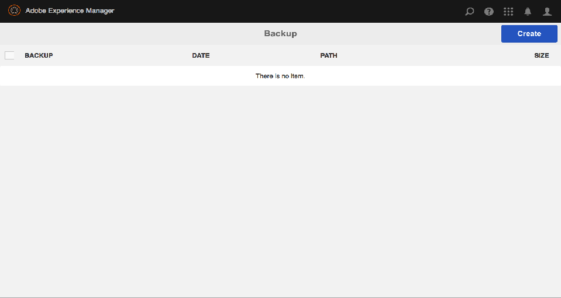

# 백업 및 복원{#backup-and-restore}

AEM에서 저장소 콘텐츠를 백업하고 복원하는 방법에는 두 가지가 있습니다.

* 저장소의 외부 백업을 만들어 안전한 위치에 저장할 수 있습니다. 저장소가 고장나면 이전 상태로 복원할 수 있습니다.
* 저장소 컨텐츠의 내부 버전을 만들 수 있습니다. 이러한 버전은 콘텐츠와 함께 저장소에 저장되므로 변경 또는 삭제한 노드 및 트리를 빠르게 복원할 수 있습니다.

## 일반 {#general}

여기에 설명된 접근 방식은 시스템 백업 및 복구에 적용됩니다.

손실된 소량의 컨텐츠를 백업 및/또는 복구해야 하는 경우 반드시 시스템 복구가 필요한 것은 아닙니다.

* 패키지를 통해 다른 시스템에서 데이터를 가져올 수 있습니다
* 또는 임시 시스템에서 백업을 복원하고 콘텐츠 패키지를 만들어 이 콘텐츠가 누락된 시스템에 배포합니다.

자세한 내용은 [패키지 백업](/help/sites-administering/backup-and-restore.md#package-backup) 아래요.

## 시간 {#timing}

데이터 저장소 가비지 수집과 동시에 백업을 실행하지 마십시오. 두 프로세스의 결과를 손상시킬 수 있습니다.

## 오프라인 백업 {#offline-backup}

언제든지 오프라인 백업을 수행할 수 있습니다. 이렇게 하려면 AEM의 다운타임이 필요하지만 온라인 백업과 비교하여 필요한 시간 측면에서 상당히 효율적일 수 있습니다.

대부분의 경우 파일 시스템 스냅샷을 사용하여 해당 시점에 스토리지의 읽기 전용 복제본을 생성합니다. 오프라인 백업을 만들려면 다음 단계를 수행합니다.

* 애플리케이션 중지
* 스냅샷 백업 만들기
* 응용 프로그램 시작

스냅샷 백업은 일반적으로 몇 초 밖에 걸리지 않으므로 전체 다운타임은 몇 분 미만입니다.

## 온라인 백업 {#online-backup}

이 백업 방법은 AEM과 같이 아래에 배포된 모든 응용 프로그램을 포함하여 전체 저장소에 대한 백업을 만듭니다. 백업에는 콘텐츠, 버전 기록, 구성, 소프트웨어, 핫픽스, 사용자 정의 애플리케이션, 로그 파일, 검색 인덱스 등이 포함됩니다. 클러스터링을 사용 중이고 공유 폴더가 의 하위 디렉토리인 경우 `crx-quickstart` 공유 디렉토리도 실제로 또는 소프트 링크를 사용하여 백업됩니다.

나중에 전체 저장소(및 모든 애플리케이션)를 복원할 수 있습니다.

이 방법은 저장소가 실행되는 동안 수행할 수 있도록 &quot;핫&quot; 또는 &quot;온라인&quot; 백업으로 작동합니다. 따라서 백업이 실행되는 동안 저장소를 사용할 수 있습니다. 이 방법은 기본, Tar 스토리지 기반, 저장소 인스턴스에 대해 작동합니다.

백업을 작성할 때 다음 옵션이 제공됩니다.

* AEM 통합 백업 도구를 사용하여 디렉터리로 백업
* 파일 시스템 스냅샷을 사용하여 디렉토리로 백업

어떤 경우든 백업은 저장소의 이미지(또는 스냅샷)를 작성합니다. 그런 다음 시스템 백업 에이전트는 실제로 이 이미지를 전용 백업 시스템(테이프 드라이브)에 전송하는 데 주의해야 합니다.

>[!NOTE]
>
>사용자 지정 Blobstore 구성이 있는 AEM 인스턴스에서 AEM Online Backup 기능을 사용하는 경우 데이터 저장소의 경로를 &quot; 외부에 있도록 구성하는 것이 좋습니다. `crx-quickstart`&quot; 데이터 저장소를 개별적으로 디렉토리와 백업합니다.

>[!CAUTION]
>
>온라인 백업은 파일 시스템만 백업합니다. 저장소 콘텐츠 및/또는 저장소 파일을 데이터베이스에 저장하는 경우 해당 데이터베이스를 별도로 백업해야 합니다. MongoDB와 함께 AEM을 사용하는 경우 사용 방법에 대한 설명서를 참조하십시오. [MongoDB 네이티브 백업 툴](https://docs.mongodb.org/manual/tutorial/backup-with-mongodump/).

### AEM 온라인 백업 {#aem-online-backup}

리포지토리의 온라인 백업을 사용하면 백업 파일을 작성, 다운로드 및 삭제할 수 있습니다. 이 기능은 &quot;핫&quot; 또는 &quot;온라인&quot; 백업 기능이므로 저장소가 읽기-쓰기 모드에서 정상적으로 사용되는 동안 실행할 수 있습니다.

>[!CAUTION]
>
>AEM Online Backup을 동시에 실행하지 마십시오 [데이터 저장소 가비지 수집](/help/sites-administering/data-store-garbage-collection.md) 또는 [개정 정리](/help/sites-deploying/revision-cleanup.md#how-to-run-offline-revision-cleanup). 시스템 성능에 부정적인 영향을 미칠 것입니다.

백업을 시작할 때 **대상 경로** 및/또는 a **지연**.

**대상 경로** 백업 파일은 일반적으로 quickstart jar 파일(.jar)을 포함하는 폴더의 상위 폴더에 저장됩니다. 예를 들어 /InstallationKits/AEM 아래에 AEM jar 파일이 있으면 /InstallationKits 아래에 백업이 생성됩니다. 원하는 위치에 대상을 지정할 수도 있습니다.

다음과 같은 경우 **대상 경로** 는 디렉토리이며 이 디렉토리에 저장소 이미지가 생성됩니다. 동일한 디렉토리가 여러 번(또는 항상) 백업을 저장하는 데 사용되는 경우

* 저장소의 수정된 파일은 TargetPath에서 그에 따라 수정됩니다
* 저장소에서 삭제된 파일은 TargetPath에서 삭제됩니다
* 저장소에 작성된 파일은 TargetPath에 작성됩니다

>[!NOTE]
>
>If **대상 경로** 확장자가 인 filename으로 설정됩니다. **.zip**: 저장소가 임시 디렉토리에 백업된 다음 이 임시 디렉토리의 컨텐트가 압축되어 ZIP 파일에 저장됩니다.
>
>이 방법은 권장되지 않습니다.
>
>* 백업 프로세스 중에 추가 디스크 스토리지 필요(임시 디렉토리 + zip 파일)
>* 압축 프로세스는 저장소에서 수행되며 성능에 영향을 줄 수 있습니다.
>* 백업 프로세스가 지연됩니다.
>* 최대 Java 1.6 Java는 최대 4GB의 ZIP 파일만 만들 수 있습니다.
>
>ZIP을 백업 형식으로 만들어야 하는 경우 디렉터리에 백업한 다음 압축 프로그램을 사용하여 zip 파일을 만들어야 합니다.

**지연** 저장소 성능에 영향을 주지 않도록 시간 지연(밀리초)을 나타냅니다. 기본적으로 저장소 백업은 최대 속도로 실행됩니다. 온라인 백업 생성 속도를 늦추어 다른 작업의 속도를 저하시키지 않도록 할 수 있습니다.

매우 큰 지연을 사용하는 경우 온라인 백업이 24시간 이상 걸리지 않는지 확인하십시오. 백업한 경우 모든 바이너리를 포함하지 않을 수 있으므로 이 백업을 취소하십시오.
1밀리초의 지연은 일반적으로 CPU 사용량의 10%를 초래하며, 10밀리초의 지연은 일반적으로 CPU 사용량의 3% 미만을 초래합니다. 총 지연 시간(초)은 다음과 같이 예측할 수 있습니다. 저장소 크기(MB), 지연 시간(밀리초)을 곱하고, 2로 나누거나(zip 옵션이 사용되는 경우), 4로 나누거나(디렉터리로 백업할 때). 즉, 200MB 저장소 디렉토리에 1ms의 지연 시간으로 백업하면 백업 시간이 50초 정도 늘어납니다.

>[!NOTE]
>
>다음을 참조하십시오 [AEM Online Backup 작동 방식](#how-aem-online-backup-works) 프로세스의 내부 세부 정보.

백업을 만들려면 다음 작업을 수행하십시오.

1. 관리자로 AEM에 로그인합니다.

1. 다음으로 이동 **도구 - 작업 - 백업.**
1. **만들기**&#x200B;를 클릭합니다. 백업 콘솔이 열립니다.

   

1. 백업 콘솔에서 다음을 지정합니다. **[대상 경로](#aem-online-backup)** 및 **[지연](#aem-online-backup)**.

   

   >[!NOTE]
   >
   >백업 콘솔은 다음을 사용하여 사용할 수도 있습니다.
   >
   >
   >` https://<*hostname*>:<*port-number*>/libs/granite/backup/content/admin.html`

1. 클릭 **저장**&#x200B;진행률 표시줄에 백업 진행률이 표시됩니다.

   >[!NOTE]
   >
   >다음을 수행할 수 있습니다. **취소** 언제든지 실행 중인 백업.

1. 백업이 완료되면 zip 파일이 백업 창에 나열됩니다.

   

   >[!NOTE]
   >
   >더 이상 필요하지 않은 백업 파일은 콘솔을 사용하여 제거할 수 있습니다. 왼쪽 창에서 백업 파일을 선택하고 **삭제**.

   >[!NOTE]
   >
   >디렉토리에 백업한 경우: 백업 프로세스가 완료되면 AEM이 대상 디렉토리에 쓰지 않습니다.

### AEM Online Backup 자동화 {#automating-aem-online-backup}

가능한 경우 온라인 백업은 시스템에 부하가 적은 경우(예: 아침에) 실행해야 합니다.

백업을 자동화할 수 있는 방법 `wget` 또는 `curl` HTTP 클라이언트 다음은 curl을 사용하여 백업을 자동화하는 방법의 예입니다.

#### 기본 대상 디렉토리로 백업 {#backing-up-to-the-default-target-directory}

>[!CAUTION]
>
>다음 예에서는 의 다양한 매개 변수가 `curl` 인스턴스에 대해 명령을 구성해야 할 수 있습니다. 예: 호스트 이름( `localhost`), 포트( `4502`), 관리자 암호( `xyz`) 및 파일 이름( `backup.zip`).

```shell
curl -u admin:admin -X POST http://localhost:4502/system/console/jmx/com.adobe.granite:type=Repository/op/startBackup/java.lang.String?target=backup.zip
```

백업 파일/디렉토리는 다음 항목이 들어 있는 폴더의 상위 폴더에 있는 서버에 작성됩니다. `crx-quickstart` 폴더(브라우저를 사용하여 백업을 작성하는 것과 동일) 예를 들어 디렉터리에 AEM을 설치한 경우 `/InstallationKits/crx-quickstart/`그런 다음 백업이 `/InstallationKits` 디렉토리.

curl 명령은 즉시 반환되므로 이 디렉터리를 모니터링하여 zip 파일이 준비되었는지 확인해야 합니다. 백업이 만들어지는 동안 임시 디렉터리(최종 zip 파일의 이름을 기반으로 하는 이름)를 볼 수 있으며 끝에 압축됩니다. 예:

* 결과 zip 파일의 이름: `backup.zip`
* 임시 디렉터리 이름: `backup.f4d5.temp`

#### 기본이 아닌 대상 디렉토리로 백업 {#backing-up-to-a-non-default-target-directory}

일반적으로 백업 파일/디렉토리는 다음 항목이 들어 있는 폴더의 상위 폴더에 있는 서버에 작성됩니다. `crx-quickstart` 폴더를 삭제합니다.

(두 정렬 중 하나의) 백업을 다른 위치에 저장하려면 절대 경로를 &quot;으로 설정합니다. `target` 의 매개 변수 `curl` 명령입니다.

예를 들어 을 생성하려면 다음을 수행합니다 `backupJune.zip` 디렉터리에서 `/Backups/2012`:

```shell
curl -u admin:admin -X POST http://localhost:4502/system/console/jmx/com.adobe.granite:type=Repository/op/startBackup/java.lang.String?target=/Backups/2012/backupJune.zip"
```

>[!CAUTION]
>
>다른 애플리케이션 서버(예: JBoss)를 사용하는 경우 대상 디렉토리가 쓰기 가능하지 않기 때문에 온라인 백업이 예상대로 작동하지 않을 수 있습니다. 이 경우 지원 센터에 문의하십시오.

>[!NOTE]
>
>백업을 트리거할 수도 있습니다 [AEM에서 제공한 MBean 사용](/help/sites-administering/jmx-console.md).

### 파일 시스템 스냅샷 백업 {#filesystem-snapshot-backup}

여기에 설명된 프로세스는 특히 대형 저장소에 적합합니다.

>[!NOTE]
>
>이 백업 방식을 사용하려면 시스템에서 파일 시스템 스냅샷을 지원해야 합니다. 예를 들어 Linux의 경우 파일 시스템을 논리 볼륨에 배치해야 합니다.

1. AEM이 배포된 파일 시스템의 스냅샷을 수행합니다.

1. 파일 시스템 스냅샷을 마운트합니다.
1. 백업을 수행하고 스냅샷을 마운트 해제합니다.

### AEM Online Backup 작동 방식 {#how-aem-online-backup-works}

AEM Online Backup은 백업 중인 데이터와 작성 중인 백업 파일의 무결성을 보장하기 위한 일련의 내부 작업으로 구성됩니다. 이러한 목록은 관심 있는 사용자를 위해 아래에 나열되어 있습니다.

온라인 백업에서는 다음 알고리즘을 사용합니다.

1. zip 파일을 만들 때 첫 번째 단계는 대상 디렉토리를 만들거나 찾는 것입니다.

   * zip 파일로 백업하는 경우 임시 디렉토리가 생성됩니다. 디렉터리 이름은 다음으로 시작합니다. `backup.` 다음으로 끝남 `.temp`; 예, `backup.f4d3.temp`.
   * 디렉터리에 백업하는 경우 대상 경로에 지정된 이름이 사용됩니다. 기존 디렉터리를 사용할 수 있습니다. 그렇지 않으면 새 디렉터리가 만들어집니다.

     이름이 인 빈 파일 `backupInProgress.txt` 는 백업이 시작될 때 대상 디렉터리에 작성됩니다. 이 파일은 백업이 완료되면 삭제됩니다.

1. 파일은 소스 디렉토리에서 대상 디렉토리(또는 zip 파일을 생성할 때 임시 디렉토리)로 복사됩니다. 저장소 손상을 방지하기 위해 세그먼트 저장소가 데이터 저장소 앞에 복사됩니다. 백업을 작성할 때 인덱스 및 캐시 데이터가 생략됩니다. 그 결과, 다음의 데이터 `crx-quickstart/repository/cache` 및 `crx-quickstart/repository/index` 가 백업에 포함되지 않습니다. 프로세스의 진행률 표시줄 표시기는 zip 파일을 만들 때 0% - 70%, zip 파일이 만들어지지 않은 경우 0% - 100% 사이입니다.

1. 기존 디렉토리에 백업하는 경우 대상 디렉토리의 &quot;이전&quot; 파일이 삭제됩니다. 이전 파일은 소스 디렉토리에 없는 파일입니다.

파일은 다음 네 단계로 대상 디렉토리에 복사됩니다.

1. 첫 번째 복사 단계(zip 파일을 만들 때 진행률 표시기 0% - 63% 또는 zip 파일이 만들어지지 않은 경우 0% - 90%)에서는 저장소가 정상적으로 실행되는 동안 모든 파일이 복사됩니다. 프로세스에는 다음 두 단계가 있습니다.

   * 단계 A - 데이터 저장소를 제외한 모든 항목이 복사됩니다(지연 포함).
   * 단계 B - 데이터 저장소만 복사됩니다(지연 포함).

1. 두 번째 복사 단계(zip 파일을 만들 때 63% - 65.8% 또는 zip 파일이 만들어지지 않은 경우 90% - 94%)에서는 첫 번째 복사 단계가 시작된 이후 소스 디렉토리에서 만들거나 수정한 파일만 복사됩니다. 저장소의 활동에 따라, 파일 없음에서 상당한 수의 파일까지 다양할 수 있습니다(첫 번째 파일 복사 단계는 일반적으로 많은 시간이 소요되기 때문). 복사 프로세스는 첫 번째 단계(지연 단계 A 및 단계 B)와 유사합니다.
1. 세 번째 복사 단계(zip 파일을 만들 때 65.8% - 68.6% 또는 zip 파일이 만들어지지 않은 경우 94% - 98%)에서는 두 번째 복사 단계가 시작된 이후 소스 디렉토리에서 만들거나 수정한 파일만 복사됩니다. 저장소의 활동에 따라 복사할 파일이 없거나 두 번째 파일 복사 단계가 일반적으로 빠르기 때문에 파일 수가 매우 적을 수 있습니다. 복제 프로세스는 2단계(단계 A 및 단계 B)와 유사하지만 지연은 없습니다.
1. 저장소가 실행되는 동안 파일 복사 단계 1~3이 모두 동시에 수행됩니다. 세 번째 복사 단계가 시작된 이후 소스 디렉토리에서 작성되거나 수정된 파일만 복사됩니다. 저장소의 활동에 따라 복사할 파일이 없거나 매우 적은 수의 파일이 있을 수 있습니다(두 번째 파일 복사 단계가 일반적으로 매우 빠르기 때문). 진행 표시기 zip 파일을 만들 때 68.6% - 70%, zip 파일이 만들어지지 않을 때 98% - 100%. 복사 프로세스는 세 번째 단계와 유사합니다.
1. 대상에 따라 다음 작업을 수행합니다.

   * zip 파일이 지정된 경우 임시 디렉토리에서 생성됩니다. 진행 표시기 70% - 100%. 그러면 임시 디렉터리가 삭제됩니다.
   * 대상이 디렉터리인 경우 이름이 인 빈 파일 `backupInProgress.txt` 가 삭제되어 백업이 완료되었음을 나타냅니다.

## 백업 복원 {#restoring-the-backup}

다음과 같이 백업을 복원할 수 있습니다.

* 파일 시스템 스냅샷 백업을 수행한 경우 시스템 이미지를 간단히 복원할 수 있습니다.
* 백업을 zip 파일로 작성한 경우 새 폴더의 콘텐츠를 압축 해제하고 해당 위치에서 AEM을 시작하십시오.

## 패키지 백업 {#package-backup}

콘텐츠를 백업 및 복원하려면 패키지 관리자 중 하나를 사용합니다. 이 관리자는 콘텐츠 패키지 형식을 사용하여 콘텐츠를 백업 및 복원할 수 있습니다. 패키지 관리자는 패키지를 보다 유연하게 정의하고 관리할 수 있습니다.

이러한 개별 콘텐츠 패키지 형식 각각의 기능 및 장단점에 대한 자세한 내용은 [패키지를 사용하여 작업하는 방법](/help/sites-administering/package-manager.md).

### 백업 범위 {#scope-of-backup}

패키지 관리자 또는 콘텐츠 지퍼 를 사용하여 노드를 백업하면 CRX에 다음 정보가 저장됩니다.

* 선택한 트리 아래의 저장소 컨텐츠입니다.
* 백업하는 콘텐츠에 사용되는 노드 유형 정의입니다.
* 백업하는 콘텐츠에 사용되는 네임스페이스 정의입니다.

백업할 때 AEM은 다음 정보를 손실합니다.

* 버전 기록.
