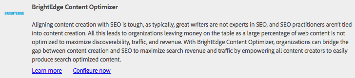

# BrightEdge Content Optimizer와 통합{#integrating-with-brightedge-content-optimizer}

AEM이 BrightEdge 계정의 자격 증명을 사용하여 연결할 수 있도록 BrightEdge 클라우드 구성을 만듭니다. 여러 계정을 사용하는 경우 여러 구성을 만들 수 있습니다.

구성을 만들 때 제목을 지정합니다. 사용자가 구성을 BrightEdge 계정과 상호 연관시킬 수 있도록 제목을 설명해야 합니다. 페이지 작성자 또는 관리자가 웹 페이지를 BrightEdge 계정과 연결하면 이 제목이 드롭다운 목록에 표시됩니다.

1. 레일에서 도구 > 작업 > 클라우드 > Cloud Services을 클릭합니다.
1. BrightEdge Content Optimizer 섹션에 표시되는 링크를 클릭합니다. BrightEdge 구성을 만들었는지 여부에 따라 링크 텍스트가 결정됩니다.

   * 지금 구성:이 링크는 구성이 만들어지지 않은 경우에 나타납니다.
   * 구성 표시:이 링크는 하나 이상의 구성이 생성되면 나타납니다.

   

1. 구성 표시를 클릭한 경우 사용 가능한 구성 옆에 있는 + 링크를 클릭합니다.
1. 구성의 제목을 입력합니다. 원할 경우, 저장소에 구성을 저장하는 데 사용되는 노드의 이름을 입력합니다. 만들기를 클릭합니다.
1. BrightEdge Content Optimizer 구성 대화 상자에서 BrightEdge 계정의 사용자 이름과 암호를 입력한 다음 확인을 클릭합니다.

## BrightEdge 구성 편집 {#editing-a-brightedge-configuration}

필요한 경우 BrightEdge 구성의 사용자 이름과 암호를 수정합니다. 수정은 구성을 사용하는 모든 페이지에 영향을 줍니다.

1. 레일에서 도구 > 작업 > 클라우드 > Cloud Services을 클릭합니다.
1. BrightEdge Content Optimizer 섹션에서 구성 표시를 클릭합니다.

   

1. 편집할 구성 이름을 클릭합니다.
1. 편집을 클릭하고 속성 값을 수정한 다음 확인을 클릭합니다.

## BrightEdge 구성 {#associating-pages-with-a-brightedge-configuration}에 페이지 연결

페이지를 BrightEdge 구성과 연결하여 분석을 위해 페이지 데이터를 BrightEdge 서비스로 보냅니다. 페이지를 구성과 연결하면 하위 페이지가 연결을 상속합니다. 일반적으로 모든 페이지의 데이터가 BrightEdge로 전송되도록 사이트의 홈 페이지를 연결합니다.

1. 클래식 웹 사이트 콘솔을 엽니다. ([http://localhost:4502/siteadmin#/content](http://localhost:4502/siteadmin#/content))
1. 웹 사이트 트리에서 BrightEdge 구성과 연결할 페이지가 포함된 폴더 또는 페이지를 선택합니다.
1. 페이지 목록에서 구성할 페이지를 마우스 오른쪽 단추로 클릭하고 속성을 클릭합니다.
1. [Cloud Services] 탭에서 [서비스 추가] 단추를 클릭하고 [Cloud Services] 대화 상자에서 [BrightEdge Content Optimizer]를 선택한 다음 [확인]을 클릭합니다.
1. BrightEdge Content Optimizer 목록에서 페이지에 연결할 BrightEdge 구성을 선택한 다음 확인을 클릭합니다.

   

## BrightEdge 구성 활성화 {#activating-a-brightedge-configuration}

BrightEdge 구성을 활성화하여 게시 인스턴스에서 복제하고 게시된 페이지가 BrightEdge 서비스와 상호 작용할 수 있도록 합니다.

1. 레일에서 사이트를 클릭한 다음 BrightEdge 구성과 연결된 페이지를 찾아 선택합니다.
1. 게시 아이콘을 클릭하거나 탭한 다음 게시를 클릭하거나 탭합니다.

   

1. 표시되는 구성 목록에서 BrightEdge 구성을 선택한 다음 게시를 클릭합니다.

   

