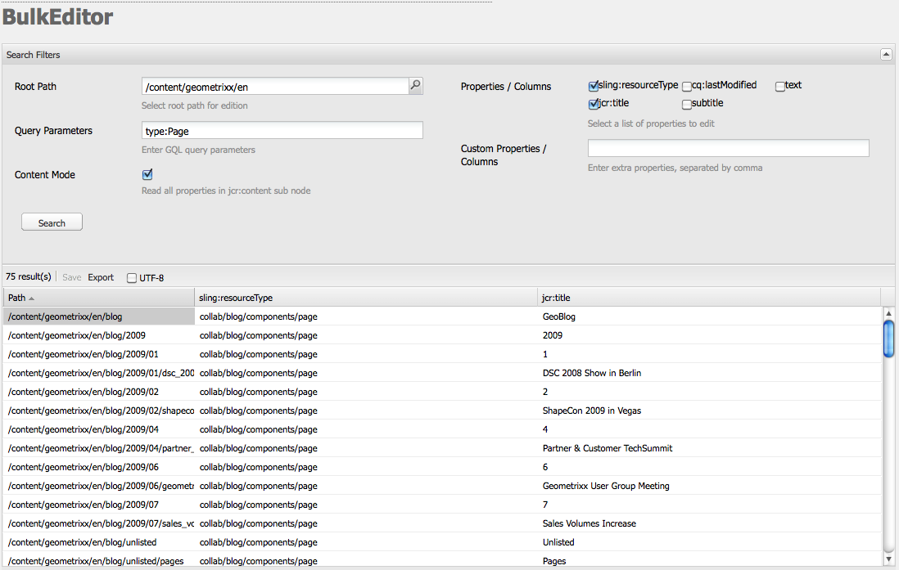

# 벌크 편집기{#the-bulk-editor}

벌크 편집기를 사용하면 시각적 페이지 컨텍스트가 필요하지 않은 경우 다음과 같은 작업을 수행할 수 있으므로 효율적으로 편집할 수 있습니다.

* 여러 페이지에서 콘텐츠를 검색(및 표시)합니다. 이 작업은 GQL(Google 쿼리 언어)을 사용하여 수행됩니다
* 벌크 편집기에서 직접 이 콘텐츠 편집
* 변경 사항 저장(원래 페이지에)
* 탭으로 구분된 (.tsv) 스프레드시트 파일로 이 컨텐츠 내보내기

>[!NOTE]
>
>콘텐츠를 리포지토리로 가져올 수도 있지만, 기본적으로 대량 편집기에는 **도구** 콘솔에서 사용할 수 없으므로 사용할 수 없습니다.

이 섹션에서는 **도구** 콘솔에서 벌크 편집기로 작업하는 방법을 설명합니다. 일반적으로 관리자는 벌크 편집기를 사용하여 여러 항목을 검색하고 편집합니다. 이 작업은 GQL 쿼리를 사용하여 테이블을 채운 다음 작업할 콘텐츠 항목을 선택하여 수행합니다. 작성자는 일반적으로 [제품 목록](/help/sites-authoring/default-components.md#productlist) 구성 요소를 통해 액세스할 수 있는 사용자 지정된 대량 편집기 응용 프로그램의 일부로 대량 편집기를 사용합니다.

>[!CAUTION]
>
>AEM 6.4에서 [클래식 UI의 사용 중단](/help/release-notes/deprecated-removed-features.md)을 사용하면 벌크 편집기도 더 이상 사용되지 않으므로 Adobe에서 벌크 편집기를 더 이상 향상시킬 계획이 없습니다.

## 벌크 편집기의 사용 사례 예 {#example-use-case-for-the-bulk-editor}

예를 들어 특정 설문 조사를 작성한 사용자의 이름과 이메일 주소가 모두 필요한 경우 벌크 편집기에서 해당 정보를 제공할 수 있으며 스프레드시트로 내보낼 수 있습니다.

이러한 사용 사례를 보여주는 예제가 Geometrixx 웹 사이트에 포함되어 있습니다.

1. **지원** 페이지로 이동한 다음 **고객 서비스 만족도** 설문 조사로 이동합니다.
1. **양식 시작** 단락을 **편집**. 대화 상자에서 **고급** 탭을 클릭하고 **작업 구성**&#x200B;을 확장한 다음 **데이터 보기...**&#x200B;를 클릭합니다.

   

1. 벌크 편집기는 사용자 정의가 가능하지만, 이 예에서 벌크 편집기는 사용자가 컨텐츠를 편집할 수 없고 정보를 스프레드시트로 내보낼 수만 있습니다.

   

## 벌크 편집기 사용 방법 {#how-to-use-the-bulk-editor}

벌크 편집기를 사용하여 다음 작업을 수행할 수 있습니다.

* [쿼리 매개 변수를 기반으로 컨텐츠를 검색하여 결과의 지정된 속성을 열에 표시하고 이 컨텐츠를 편집하며 변경 사항을 저장합니다.](#searching-and-editing-content)
* [탭으로 구분된 스프레드시트로 이 컨텐츠를 내보내려면](#exporting-content)

* [탭으로 구분된 스프레드시트에서 내용을 가져오려면](#importing-content)

### 컨텐츠 검색 및 편집 {#searching-and-editing-content}

벌크 편집기를 사용하여 여러 항목을 동시에 편집하려면 다음과 같이 하십시오.

1. **도구** 콘솔에서 **가져오기** 폴더를 클릭하여 확장하십시오.
1. **일괄 편집기**&#x200B;를 두 번 클릭합니다.
1. 선택 요구 사항을 입력합니다.

<table>
 <tbody>
  <tr>
   <td>필드</td>
   <td>속성</td>
  </tr>
  <tr>
   <td>루트 경로</td>
   <td>벌크 편집기가 검색하는 루트 경로를 나타냅니다.  예: <code>/content/geometrixx/en</code>. 벌크 편집기는 모든 하위 노드를 검색합니다.</td>
  </tr>
  <tr>
   <td>쿼리 매개변수</td>
   <td>GQL 매개변수를 사용하여 벌크 편집기가 저장소에서 검색할 검색 문자열을 입력합니다. 예를 들어 <code>type:Page</code>은(는) 루트 경로에서 모든 페이지를 찾고, <code>text:professional</code>은(는) "professional"이라는 단어가 포함된 모든 페이지를 찾고, <code>"jcr:title":English</code>은(는) 제목이 "English"인 모든 페이지를 찾습니다. 문자열만 검색할 수 있습니다.</td>
  </tr>
  <tr>
   <td>콘텐츠 모드 확인란</td>
   <td>검색 결과의 <code>jcr:content</code> 하위 노드(있는 경우) 내에서 속성을 읽을 수 있도록 이 확인란을 선택하십시오. 페이지에만 사용합니다. 속성 이름 앞에 가 붙습니다. <code>"jcr:content/"</code></td>
  </tr>
  <tr>
   <td>속성/열</td>
   <td>벌크 편집기(Bulk Editor)에서 반환할 속성의 확인란을 선택합니다. 선택하는 속성은 결과 창의 열 머리글입니다. 기본적으로 노드 경로가 결과에 표시됩니다.</td>
  </tr>
  <tr>
   <td>사용자 정의 속성/열</td>
   <td><strong>속성/열</strong> 필드에 나열되지 않은 다른 속성을 입력하십시오. 이러한 사용자 지정 속성은 결과 창에 나타납니다. 속성을 구분하기 위해 쉼표를 사용하여 여러 속성을 추가할 수 있습니다. <i>참고:</i> 아직 존재하지 않는 사용자 지정 속성을 추가하면 AEM WCM에 빈 셀이 표시됩니다. 빈 셀을 수정하고 저장하면 속성이 노드에 추가됩니다. 새로 만든 속성은 노드 형식 제약 조건 및 속성 네임스페이스를 준수해야 합니다.</td>
  </tr>
 </tbody>
</table>

예:

1. **검색**을 클릭합니다. 벌크 편집기(Bulk Editor)에 결과가 표시됩니다.
위의 예에서 검색 기준을 충족하는 모든 페이지가 반환되고 요청된 열과 함께 표시됩니다.

   

1. 변경할 수 있도록 셀을 두 번 클릭합니다.

   

1. 변경 내용을 저장하려면 **저장**&#x200B;을 클릭합니다(셀을 편집한 후 **저장** 단추가 활성화됨).

   >[!CAUTION]
   >
   >여기서 변경한 내용은 저장소 콘텐츠(예: **경로**&#x200B;에서 참조된 페이지)에 기록됩니다.

#### 추가 GQL 쿼리 매개 변수 {#additional-gql-query-parameters}

* **경로:** 이 경로 아래의 노드만 검색합니다. 경로 접두사가 있는 용어를 두 개 이상 지정하는 경우 마지막 용어만 고려됩니다.
* **type:**&#x200B;은(는) 지정된 노드 유형의 노드만 반환합니다. 여기에는 기본 및 mixin 유형이 포함됩니다. 여러 개의 쉼표로 구분된 노드 유형을 지정할 수 있습니다. GQL은 지정된 유형 중 하나의 노드를 반환합니다.
* **순서:** 지정한 속성으로 결과를 정렬합니다. 쉼표로 구분된 속성 이름을 여러 개 지정할 수 있습니다. 결과를 내림차순으로 정렬하려면 속성 이름 앞에 빼기를 붙이면 됩니다. 예를 들어 order:-name입니다. 더하기 기호를 사용하면 결과가 오름차순으로 반환되는데, 이 역시 기본값입니다.
* **limit:**&#x200B;은(는) 간격을 사용하여 결과 수를 제한합니다. 예를 들어 limit:10..20 간격은 0을 기준으로 하고, start는 포괄적이며, end는 배타적입니다. 열려 있는 `interval:limit:10..` 또는 `limit:..20`을(를) 지정할 수도 있습니다
점을 생략하고 하나의 값만 지정하면 GQL은 최대 이 수의 결과를 반환합니다. 예를 들어 `limit:10`은(는) 처음 10개의 결과를 반환합니다.

### 컨텐츠 내보내기 {#exporting-content}

필요한 경우 콘텐츠를 Excel 스프레드시트로 내보내 변경합니다. 예를 들어 Excel에서 직접 메일링 목록을 내보내고 나열된 모든 전화번호의 지역 번호를 변경하거나 다른 회선을 추가할 수 있습니다.

컨텐츠를 내보내려면:

1. [콘텐츠 검색 및 편집](#searching-and-editing-content)에 설명된 대로 콘텐츠를 검색합니다.
1. 변경 내용을 탭으로 구분된 Excel 스프레드시트로 내보내려면 **내보내기**&#x200B;를 클릭합니다. AEM WCM이 파일을 다운로드할 위치를 묻습니다.

   >[!NOTE]
   >
   >기본적으로 변경 내용은 [Windows-1252](https://en.wikipedia.org/wiki/Windows-1252)(CP-1252라고도 함)에 인코딩됩니다. UTF-8을 선택하여 변경 사항을 UTF-8로 내보낼 수 있습니다.

   

1. 위치를 선택하고 파일을 다운로드할 것인지 확인합니다.
1. 파일을 다운로드한 후 스프레드시트 프로그램(예: Microsoft® Excel)에서 파일을 열 수 있습니다. 스프레드시트 프로그램은 파일을 가져와 스프레드시트 형식으로 변환합니다.

   

### 콘텐트 가져오기 {#importing-content}

벌크 편집기를 열면 기본적으로 가져오기 기능이 숨겨집니다. URL에 매개 변수 `hib=false`을(를) 추가하면 벌크 편집기 페이지에 **가져오기** 단추가 표시됩니다. 탭으로 구분된 파일(`.tsv`)에서 콘텐츠를 가져올 수 있습니다. 가져오기가 제대로 작동하려면 열 머리글(셀의 첫 번째 행)이 가져오려는 테이블의 열 머리글과 일치해야 합니다.

>[!NOTE]
>
>콘텐츠를 다시 가져오면 해당 노드에 대한 이전 콘텐츠가 모두 지워집니다. 중요한 정보를 덮어쓰지 않도록 주의하십시오.

컨텐츠를 가져오려면 다음을 수행하십시오.

1. 벌크 편집기를 엽니다.
1. URL에 `?hib=false`을(를) 추가합니다. 예:
   `https://localhost:4502/etc/importers/bulkeditor.html?hib=false`
1. **가져오기**&#x200B;를 클릭합니다.
1. `.tsv` 파일을 선택하십시오. 데이터를 저장소로 가져옵니다.
