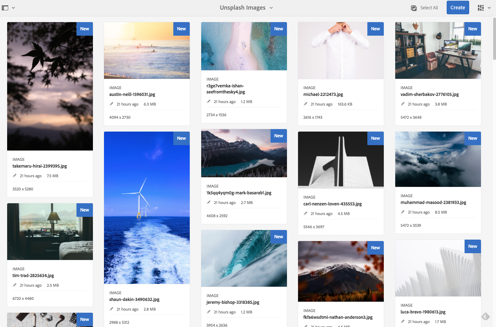
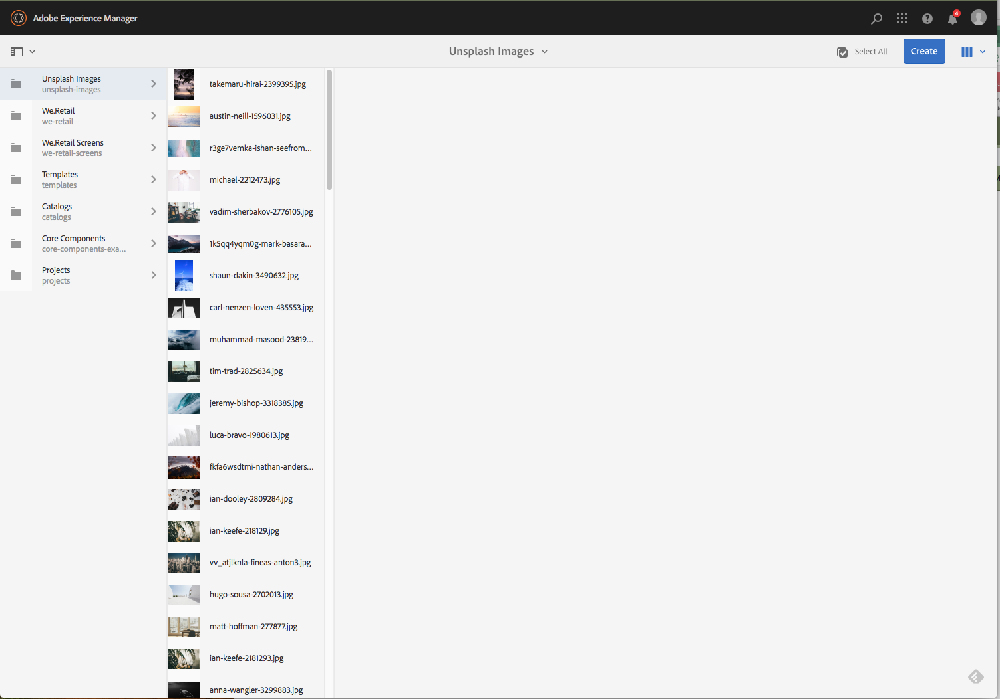

# 일괄 처리 작업 {#bulk-processing-operations}

## 소개 {#introduction}

최신 버전의 AEM에서는 모두 선택 단추가 모든 보기로 확장되었습니다.목록, 열 및 카드 보기. 이제 [모두 선택] 단추를 선택하면 클라이언트 브라우저에서 로드되고 표시되는 에셋 및 페이지만 아니라 지정된 폴더 또는 컬렉션의 모든 콘텐츠가 선택됩니다.

벌크 작업에 대해 주요 작업이 활성화되었습니다.**이동**, **삭제** 및 **복사**. 새로운 대화 상자를 통해 벌크 처리를 사용할 수 없는 작업을 고객에게 알릴 수 있습니다.

## {#how-to-use} 사용 방법

**모두 선택**&#x200B;이라는 새 단추가 카드, 목록 또는 열 보기에 추가되었습니다. 이 단추는 모든 보기에서 사용하여 데이터 세트의 모든 요소를 선택할 수 있습니다.

이전 버전의 AEM에서는 클라이언트 브라우저에서 로드한 내용이 선택 내용에 제한되었습니다. 벌크 작업이 수행되는 요소의 수에 대한 혼동을 방지하기 위해 이 새로운 변경 사항이 도입되었습니다.

현재 3개의 작업이 일괄 처리에 추가되었습니다.

* 이동
* 복사
* 삭제

향후 추가 작업에 대한 지원이 추가될 예정입니다.
이 기능을 사용하려면 페이지 또는 자산에서 벌크 작업을 수행할 폴더 또는 컬렉션으로 이동해야 합니다.

그런 다음 아래 표시된 대로 보기 중 하나를 선택합니다.

### 카드 보기 {#card-view}

### 카드 보기의 벌크 선택 {#bulk-selection-in-card-view}

오른쪽 상단의 **모두 선택** 단추를 사용하여 자산 또는 페이지를 일괄 선택할 수 있습니다.

 

### 목록 보기 {#list-view}

목록 보기도 마찬가지입니다.

### 목록 보기 {#bulk-selection-in-list-view}의 벌크 선택

목록 보기에서 **모두 선택** 단추를 사용하거나 벌크 선택을 위해 왼쪽의 확인란을 사용합니다.

 

### 열 보기 {#column-view}

### 열 보기 {#bulk-selection-in-column-view}의 벌크 선택

## 일괄 사용 작업 {#bulk-enabled-operations}

선택 후 3개의 벌크 사용 작업 중 하나를 수행할 수 있습니다.**이동**, **복사** 또는 **삭제**.

여기서 **이동** 작업은 위에서 선택한 자산에 대해 수행됩니다. 모든 보기에서 이렇게 하면 모든 자산이 선택된 위치로 이동되고 화면에 로드되는 자산뿐 아니라 선택된 위치로 이동됩니다.

벌크가 활성화되지 않은 다른 작업의 경우 **다운로드,** 브라우저에 로드된 요소만 작업에 포함된다는 경고만 표시됩니다.

