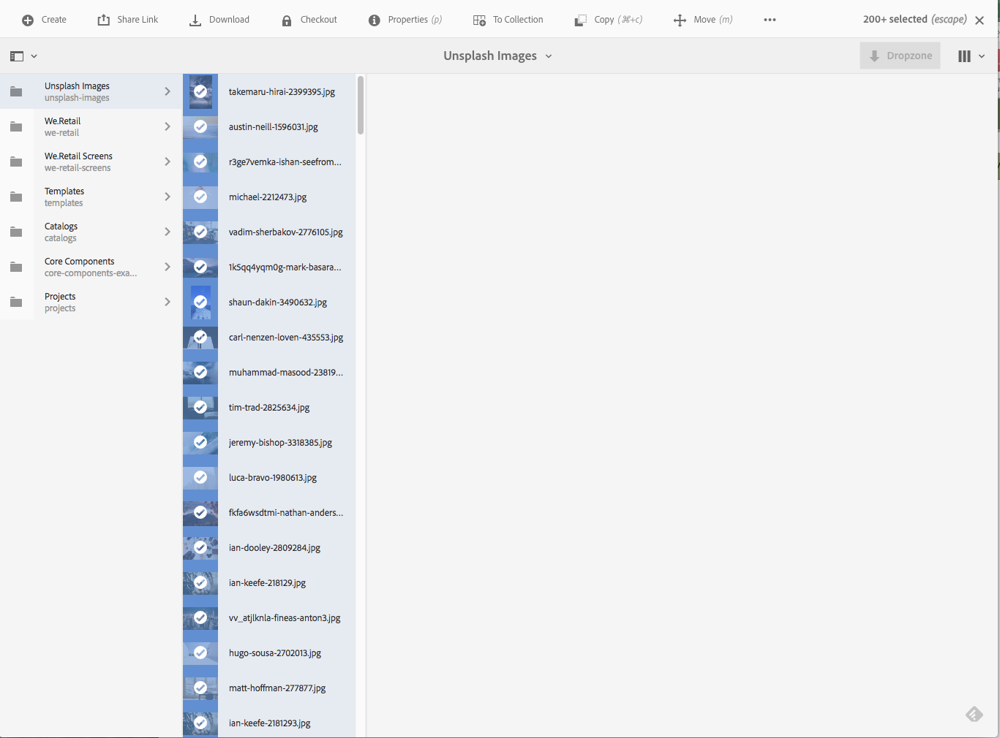

# 일괄 처리 작업 {#bulk-processing-operations}

## 소개 {#introduction}

최신 버전의 AEM을 사용하면 모두 선택 단추가 모든 보기로 확장되었습니다. 목록, 열 및 카드 보기. 이제 모두 선택 단추가 클라이언트 브라우저에서 로드되고 표시되는 자산 및 페이지뿐만 아니라 지정된 폴더 또는 컬렉션의 모든 콘텐츠를 선택합니다.

대량 작업에 대한 주요 작업이 활성화되었습니다. **이동**, **삭제** 및 **복사**. 새 대화 상자를 통해 고객은 벌크 처리를 사용할 수 없는 작업이 무엇인지 알 수 있습니다.

## 사용 방법 {#how-to-use}

새 단추 **모두 선택** 가 카드, 목록 또는 열 보기에 추가되었습니다. 이 단추는 모든 보기에서 사용하여 데이터 세트의 모든 요소를 선택할 수 있습니다.

이전 버전의 AEM에서는 선택 사항이 클라이언트 브라우저에서 로드되는 내용이 제한되었습니다. 대량 작업이 수행 중인 요소 수에 대한 혼동을 방지하기 위해 이 새로운 변경 사항이 도입되었습니다.

현재 3개의 작업이 일괄 처리에 추가되었습니다.

* 이동
* 복사
* 삭제

향후 더 많은 작업에 대한 지원이 추가될 예정입니다.
이 기능을 사용하려면 페이지 또는 자산에서 벌크 작업을 수행할 폴더 또는 컬렉션으로 이동해야 합니다.

그런 다음 아래 표시된 대로 보기 중 하나를 선택합니다.

### 카드 보기 {#card-view}

### 카드 보기의 벌크 선택 {#bulk-selection-in-card-view}

자산 또는 페이지를 **모두 선택** 오른쪽 상단의 단추:

 

### 목록 보기 {#list-view}

목록 보기에도 마찬가지입니다.

### 목록 보기의 벌크 선택 {#bulk-selection-in-list-view}

목록 보기에서 **모두 선택** 단추를 클릭하거나 왼쪽의 확인란을 사용하여 벌크 선택을 수행합니다.

 

### 열 보기 {#column-view}

### 열 보기의 벌크 선택 {#bulk-selection-in-column-view}

## 대량 사용 작업 {#bulk-enabled-operations}

선택 후 세 가지 벌크 사용 작업 중 하나를 수행할 수 있습니다. **이동**, **복사** 또는 **삭제**.

여기, **이동** 작업은 위에서 선택한 자산에 대해 수행됩니다. 모든 보기에서 선택한 위치로 모든 자산이 이동되고 화면에 로드되는 자산뿐만 아니라 선택한 위치로 이동됩니다.

벌크 사용이 설정되지 않은 다른 작업(예: ) **다운로드,** 브라우저에 로드된 요소만 작업에 포함된다는 경고만 표시됩니다.

