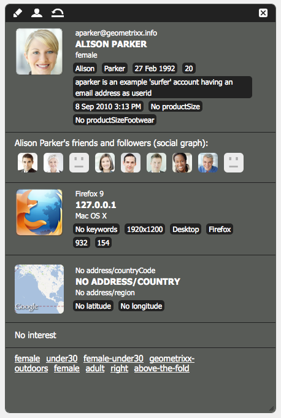

# 세그먼테이션 구성 {#configuring-segmentation}

>[!NOTE]
>
>이 문서에서는 Client Context와 함께 사용되는 세그먼테이션의 구성을 다룹니다. Touch UI를 사용하여 ContextHub로 세그먼트를 구성하려면 [ContextHub로 세그먼테이션 구성](/help/sites-administering/segmentation.md)을 참조하십시오.

세그먼테이션은 캠페인을 만들 때 중요하게 고려해야 하는 사항입니다. 세그먼테이션의 작동 방식 및 주요 용어에 대한 자세한 내용은 [세그먼테이션 용어집](/help/sites-authoring/segmentation-overview.md)을 참조하세요.

사이트 방문자 및 달성하고자 하는 목표에 대해 이미 수집한 정보에 따라 타겟팅된 콘텐츠에 필요한 세그먼트 및 전략을 정의해야 합니다.

그런 다음 이러한 세그먼트를 사용하여 방문자에게 특별히 타겟팅된 콘텐츠를 제공할 수 있습니다. 이 콘텐츠는 웹 사이트의 [캠페인](/help/sites-classic-ui-authoring/classic-personalization-campaigns.md) 섹션에서 유지 관리됩니다. 여기서 정의된 티저 페이지는 모든 페이지에서 티저 단락으로 포함될 수 있으며 특정 콘텐츠가 적용될 수 있는 방문자 세그먼트를 정의할 수 있습니다.

AEM을 사용하면 세그먼트, 티저 및 캠페인을 쉽게 만들고 업데이트할 수 있습니다. 또한 정의 결과를 확인할 수도 있습니다.

**세그먼트 편집기**&#x200B;를 사용하여 세그먼트를 쉽게 정의할 수 있습니다.

각 세그먼트를 **편집**&#x200B;하여 **제목**, **설명** 및 **증폭** 요소를 지정할 수 있습니다. 사이드 킥을 사용하여 **AND** 및 **OR** 컨테이너를 추가하여 **세그먼트 논리**&#x200B;를 정의한 다음 필수 **세그먼트 트레이트**&#x200B;를 추가하여 선택 기준을 정의할 수 있습니다.

## 부스트 요소 {#boost-factor}

각 세그먼트에는 가중치 요소로 사용되는 **Boost** 매개 변수가 있습니다. 숫자가 높을수록 숫자가 낮은 세그먼트보다 우선적으로 세그먼트를 선택할 수 있습니다.

* 최솟값: `0`
* 최댓값: `1000000`

## 세그먼트 논리 {#segment-logic}

다음 논리 컨테이너는 즉시 사용할 수 있으며 이를 통해 세그먼트 선택 논리를 구성할 수 있습니다. 사이드 킥에서 편집기로 드래그할 수 있습니다.

<table>
 <tbody>
  <tr>
   <td> AND 컨테이너  </td>
   <td> 부울 AND 연산자입니다.  </td>
  </tr>
  <tr>
   <td> OR 컨테이너  </td>
   <td> 부울 OR 연산자.</td>
  </tr>
 </tbody>
</table>

## 세그먼트 트레이트 {#segment-traits}

다음 세그먼트 트레이트는 즉시 사용할 수 있으며, 사이드 킥에서 편집기로 드래그할 수 있습니다.

<table>
 <tbody>
  <tr>
   <td> IP 범위  </td>
   <td>방문자가 가질 수 있는 IP 주소 범위를 정의합니다.  </td>
  </tr>
  <tr>
   <td> 페이지 조회수  </td>
   <td>페이지를 요청한 빈도.   </td>
  </tr>
  <tr>
   <td> 페이지 속성  </td>
   <td>방문한 페이지의 모든 속성입니다.  </td>
  </tr>
  <tr>
   <td> 참조 키워드  </td>
   <td>참조 웹 사이트의 정보와 일치하는 키워드.   </td>
  </tr>
  <tr>
   <td> 스크립트</td>
   <td>계산할 JavaScript 식입니다.  </td>
  </tr>
  <tr>
   <td> 세그먼트 참조   </td>
   <td>다른 세그먼트 정의에 대한 참조입니다.  </td>
  </tr>
  <tr>
   <td> 태그 클라우드  </td>
   <td>방문한 페이지의 태그와 일치하는 태그입니다.  </td>
  </tr>
  <tr>
   <td> 사용자 나이  </td>
   <td>사용자 프로필에서 가져온 대로.  </td>
  </tr>
  <tr>
   <td> 사용자 속성  </td>
   <td>사용자 프로필에서 사용할 수 있는 기타 모든 정보. </td>
  </tr>
 </tbody>
</table>

부울 연산자 OR 및 AND([새 세그먼트 만들기](#creating-a-new-segment) 참조)를 사용하여 이러한 트레이트를 결합하여 이 세그먼트를 선택하는 정확한 시나리오를 정의할 수 있습니다.

전체 명령문이 true로 평가되면 이 세그먼트가 해결됩니다. 적용 가능한 세그먼트가 여러 개 있는 경우 **[Boost](/help/sites-administering/campaign-segmentation.md#boost-factor)** 요소도 사용됩니다.

>[!CAUTION]
>
>세그먼트 편집기는 순환 참조를 확인하지 않습니다. 예를 들어 세그먼트 A는 다른 세그먼트 B를 참조하고, 이는 결국 세그먼트 A를 참조합니다. 세그먼트에 순환 참조가 없는지 확인하십시오.

>[!NOTE]
>
>**_i18n** 접미사가 있는 속성은 개인화의 UI clientlib의 일부인 스크립트에 의해 설정됩니다. 모든 UI 관련 clientlib은 게시에서 UI가 필요하지 않으므로 작성자에만 로드됩니다.
>
>따라서 이러한 속성을 사용하여 세그먼트를 만들 때는 일반적으로 **browserFamily_i18n** 대신 **browserFamily**&#x200B;을(를) 사용해야 합니다.

### 새 세그먼트 작성 {#creating-a-new-segment}

새 세그먼트를 정의하려면 다음 작업을 수행하십시오.

1. 레일에서 **도구 > 작업 > 구성**&#x200B;을 선택합니다.
1. 왼쪽 창에서 **세그먼테이션** 페이지를 클릭하고 필요한 위치로 이동합니다.
1. **세그먼트** 템플릿을 사용하여 [새 페이지](/help/sites-authoring/editing-content.md#creatinganewpage)을(를) 만듭니다.
1. 새 페이지를 열어 세그먼트 편집기를 확인합니다.

   

1. 사이드 킥이나 컨텍스트 메뉴를 사용하여 필요한 세그먼트 트레이트를 찾을 수 있습니다. (보통 마우스 오른쪽 단추를 클릭하고 **새로 만들기...**&#x200B;를 선택하여 새 구성 요소 삽입 창을 엽니다.) **세그먼트 편집기**(으)로 드래그하면 기본 **AND** 컨테이너에 표시됩니다.
1. 새 트레이트를 두 번 클릭하여 특정 매개 변수를 편집합니다(예: 마우스 위치).

   

1. 정의를 저장하려면 **확인**&#x200B;을 클릭하세요.
1. 세그먼트 정의를 **편집**&#x200B;하여 **제목**, **설명** 및 **[증폭](#boost-factor)** 계수를 제공할 수 있습니다.

   

1. 필요한 경우 트레이트를 더 추가합니다. **세그먼트 논리**&#x200B;에 있는 **AND 컨테이너** 및 **OR 컨테이너** 구성 요소를 사용하여 부울 식을 만들 수 있습니다. 세그먼트 편집기를 사용하여 더 이상 필요하지 않은 트레이트 또는 컨테이너를 삭제하거나 문 내의 새 위치로 드래그할 수 있습니다.

### AND 및 OR 컨테이너 사용 {#using-and-and-or-containers}

AEM에서 복잡한 세그먼트를 구성할 수 있습니다. 몇 가지 기본 사항을 알아두는 데 도움이 됩니다.

* 정의의 최상위 수준은 항상 처음에 생성되는 AND 컨테이너입니다. 이는 변경할 수 없지만 나머지 세그먼트 정의에는 영향을 주지 않습니다.
* 컨테이너의 중첩이 적절한지 확인하십시오. 컨테이너는 부울 표현식의 괄호로 확인할 수 있습니다.

다음 예제를 사용하여 다음 중 하나를 수행하는 방문자를 선택합니다.

16~65세 사이의 남성

또는

16~62세 여성

주 연산자는 OR이므로 **OR 컨테이너**(으)로 시작해야 합니다. 이 안에 2개의 AND 문이 있습니다. 각 AND 문에 대해 개별 특성을 추가할 수 있는 **AND 컨테이너**&#x200B;가 필요합니다.

## 세그먼트 애플리케이션 테스트 {#testing-the-application-of-a-segment}

세그먼트를 정의하고 나면 **[Client Context](/help/sites-administering/client-context.md)**&#x200B;을(를) 사용하여 잠재적인 결과를 테스트할 수 있습니다.

1. 테스트할 세그먼트를 선택합니다.
1. 수집된 데이터를 보여 주는 **[Client Context](/help/sites-administering/client-context.md)**&#x200B;을(를) 열려면 **[Ctrl-Alt-C](/help/sites-authoring/page-authoring.md#keyboardshortcuts)**&#x200B;을 누릅니다. 테스트 목적으로 특정 값을 **편집**&#x200B;하거나 다른 프로필을 **로드**&#x200B;하여 영향을 확인할 수 있습니다.

1. 정의된 트레이트에 따라 현재 페이지에 사용할 수 있는 데이터는 세그먼트 정의와 일치하거나 일치하지 않을 수 있습니다. 일치 상태가 정의 아래에 표시됩니다.

예를 들어 간단한 세그먼트 정의는 사용자의 연령 및 성별을 기반으로 할 수 있습니다. 특정 프로필을 로드하면 세그먼트가 정상적으로 해결되었음을 보여 줍니다.

또는 아님:

>[!NOTE]
>
>대부분의 경우 페이지를 다시 로드할 때만 변경되지만 모든 트레이트는 즉시 해결됩니다. 마우스 위치의 변경 사항은 즉시 표시되므로 테스트 목적으로 유용합니다.

이러한 테스트는 콘텐츠 페이지에서 **티저** 구성 요소와 함께 수행할 수도 있습니다.

티저 단락의 마우스오버에는 적용된 세그먼트가 현재 해결되었는지 여부와 상관없이 현재 티저 인스턴스가 선택된 이유가 표시됩니다.

### 세그먼트 사용 {#using-your-segment}

세그먼트는 현재 [캠페인](/help/sites-classic-ui-authoring/classic-personalization-campaigns.md) 내에서 사용됩니다. 특정 타겟 대상자에게 표시되는 실제 콘텐츠를 제어하는 데 사용됩니다. 자세한 내용은 [세그먼트 이해](/help/sites-authoring/segmentation-overview.md)를 참조하십시오.
