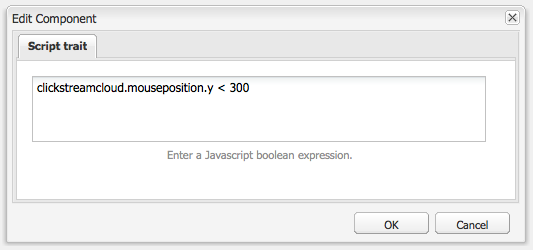

# 세그멘테이션 구성 {#configuring-segmentation}

>[!NOTE]
>
>이 문서에서는 클라이언트 컨텍스트에 사용된 세그먼테이션의 구성을 다룹니다. 터치 UI를 사용하여 ContextHub로 세그먼트를 구성하려면 [ContextHub](/help/sites-administering/segmentation.md)을(를) 사용하여 세그멘테이션 구성을 참조하십시오.

세그먼테이션은 캠페인을 만들 때 중요하게 고려해야 하는 사항입니다. 세그멘테이션의 작동 방식과 주요 용어에 대한 자세한 내용은 [세그멘테이션 용어집](/help/sites-authoring/segmentation-overview.md)을 참조하십시오.

사이트 방문자에 대해 이미 수집한 정보 및 달성하고자 하는 목표에 따라 타깃팅된 컨텐츠에 필요한 세그먼트와 전략을 정의해야 합니다.

그런 다음 이러한 세그먼트를 사용하여 방문자에게 특정 타깃팅된 컨텐츠를 제공합니다. 이 컨텐츠는 웹 사이트의 [캠페인](/help/sites-classic-ui-authoring/classic-personalization-campaigns.md) 섹션에서 유지 관리됩니다. 여기에 정의된 Teaser 페이지는 모든 페이지에서 Teaser 단락에 포함될 수 있으며 특수 컨텐트에 적용할 수 있는 방문자 세그먼트를 정의할 수 있습니다.

AEM을 사용하면 세그먼트, 티저 및 캠페인을 손쉽게 만들고 업데이트할 수 있습니다. 또한 정의 결과를 확인할 수 있습니다.

**세그먼트 편집기**&#x200B;를 사용하면 세그먼트를 쉽게 정의할 수 있습니다.

**각 세그먼트를 편집**&#x200B;하여 **제목**, **설명** 및 **증폭** 인수를 지정할 수 있습니다. 사이드킥을 사용하여 **AND** 및 **OR** 컨테이너를 추가하여 **세그먼트 논리**&#x200B;를 정의한 다음 필요한 **세그먼트 트레이트**&#x200B;을 추가하여 선택 기준을 정의할 수 있습니다.

## 증폭 인수 {#boost-factor}

각 세그먼트에는 가중치로 사용되는 **증폭** 매개 변수가 있습니다.숫자가 높을수록 숫자가 낮은 세그먼트에 대해 선분이 선택됨을 나타냅니다.

* 최소 값:`0`
* 최대 값:`1000000`

## 세그먼트 논리 {#segment-logic}

다음 논리 컨테이너를 즉시 사용할 수 있으며 세그먼트 선택 논리를 구성할 수 있습니다. 사이드 킥에서 편집기로 드래그할 수 있습니다.

<table>
 <tbody>
  <tr>
   <td> AND 컨테이너  </td>
   <td> 부울 AND 연산자입니다.  </td>
  </tr>
  <tr>
   <td> OR 컨테이너  </td>
   <td> 부울 OR 연산자입니다.</td>
  </tr>
 </tbody>
</table>

## 세그먼트 트레이트 {#segment-traits}

기본적으로 다음 세그먼트 트레이트를 사용할 수 있습니다.사이드 킥에서 편집기로 끌 수 있습니다.

<table>
 <tbody>
  <tr>
   <td> IP 범위  </td>
   <td>방문자가 가질 수 있는 IP 주소 범위를 정의합니다.  </td>
  </tr>
  <tr>
   <td> 페이지 조회수  </td>
   <td>페이지를 요청한 빈도.  </td>
  </tr>
  <tr>
   <td> 페이지 속성  </td>
   <td>방문한 페이지의 속성입니다.  </td>
  </tr>
  <tr>
   <td> 참조 키워드  </td>
   <td>참조 웹 사이트의 정보와 일치하는 키워드.  </td>
  </tr>
  <tr>
   <td> 스크립트</td>
   <td>평가할 Javascript 식입니다.  </td>
  </tr>
  <tr>
   <td> 세그먼트 참조   </td>
   <td>다른 세그먼트 정의를 참조합니다.  </td>
  </tr>
  <tr>
   <td> 태그 클라우드  </td>
   <td>방문한 페이지의 태그와 일치할 태그입니다.  </td>
  </tr>
  <tr>
   <td> 사용자 연령  </td>
   <td>사용자 프로필에서 가져온 것입니다.  </td>
  </tr>
  <tr>
   <td> 사용자 속성  </td>
   <td>사용자 프로필에 사용할 수 있는 기타 정보. </td>
  </tr>
 </tbody>
</table>

부울 연산자 OR 및 AND를 사용하여 이러한 트레이트를 결합할 수 있습니다([새 세그먼트 만들기](#creating-a-new-segment) 참조).

전체 문이 true로 평가되면 이 세그먼트가 해결됩니다. 여러 세그먼트를 적용할 수 있는 경우 **[증폭](/help/sites-administering/campaign-segmentation.md#boost-factor)** 요소도 사용됩니다.

>[!CAUTION]
>
>세그먼트 편집기는 순환 참조를 확인하지 않습니다. 예를 들어, 세그먼트 A는 다른 세그먼트 B를 참조하고, 이 세그먼트 A를 차례로 참조합니다. 세그먼트에 순환 참조가 들어 있지 않아야 합니다.

>[!NOTE]
>
>**_i18n** 접미어를 사용하는 속성은 개인화의 UI clientlib에 속하는 스크립트로 설정됩니다. UI가 게시 시 필요하지 않으므로 모든 UI 관련 클라이언트는 작성자에만 로드됩니다.
>
>따라서 이러한 속성을 갖는 세그먼트를 만들 때는 일반적으로 **browserFamily_i18n** 대신 **browserFamily**&#x200B;을 사용해야 합니다.

### 새 세그먼트 만들기 {#creating-a-new-segment}

새 세그먼트를 정의하려면:

1. 레일에서 **도구 > 작업 > 구성**&#x200B;을 선택합니다.
1. 왼쪽 창에서 **세그멘테이션** 페이지를 클릭하고 필요한 위치로 이동합니다.
1. **세그먼트** 템플릿을 사용하여 [새 페이지](/help/sites-authoring/editing-content.md#creatinganewpage)를 만듭니다.
1. 세그먼트 편집기를 보려면 새 페이지를 엽니다.

   

1. 사이드 킥이나 컨텍스트 메뉴(일반적으로 마우스 오른쪽 단추 클릭)를 사용한 다음 **새로 만들기...를 선택합니다.필요한 세그먼트 트레이트를 찾으려면** 새 구성 요소 삽입 창을 엽니다. 그런 다음 **세그먼트 편집기**&#x200B;로 드래그하면 기본 **AND** 컨테이너에 표시됩니다.
1. 새 트레이트를 두 번 클릭하여 특정 매개 변수를 편집합니다.예를 들어 마우스 위치:

   

1. **확인**&#x200B;을 클릭하여 정의를 저장합니다.
1. **세그먼트 정의를 편집하여**&#x200B;제목&#x200B;**,**&#x200B;설명&#x200B;**및**[&#x200B;증폭&#x200B;](#boost-factor)**인수를 제공할 수 있습니다.**

   

1. 필요한 경우 트레이트를 더 추가합니다. **세그먼트 논리**&#x200B;에 있는 **AND 컨테이너** 및 **OR 컨테이너** 구성 요소를 사용하여 부울 표현식을 만들 수 있습니다. 세그먼트 편집기를 사용하여 더 이상 필요하지 않은 트레이트 또는 컨테이너를 삭제하거나 명령문 내의 새 위치로 드래그할 수 있습니다.

### AND 및 OR 컨테이너 사용 {#using-and-and-or-containers}

AEM에서 복잡한 세그먼트를 구성할 수 있습니다. 몇 가지 기본 사항을 파악하는 데 도움이 됩니다.

* 정의의 최상위 수준은 항상 처음에 만들어진 AND 컨테이너입니다.이 값은 변경할 수 없지만 세그먼트 정의의 나머지 부분에 영향을 주지 않습니다.
* 컨테이너의 중첩이 적절한지 확인합니다. 컨테이너는 부울 표현식의 괄호로 볼 수 있습니다.

다음 예제는 다음 중 하나의 방문자를 선택하는 데 사용됩니다.

16세에서 65세 사이의 남자

또는

16세에서 62세 사이의 여성

주 연산자가 OR이므로 **OR 컨테이너**&#x200B;로 시작해야 합니다. 이 안에는 2개의 AND 문이 있으며, 이 각각에 대해 개별 트레이트를 추가할 수 있는 **AND 컨테이너**&#x200B;가 필요합니다.

## 세그먼트 응용 프로그램 테스트 {#testing-the-application-of-a-segment}

세그먼트가 정의되면, 잠재적인 결과를 **[Client Context](/help/sites-administering/client-context.md)**&#x200B;의 도움으로 테스트할 수 있습니다.

1. 테스트할 세그먼트를 선택합니다.
1. **[Ctrl-Alt-C](/help/sites-authoring/page-authoring.md#keyboardshortcuts)**&#x200B;을 눌러 수집된 데이터를 보여주는 **[Client Context](/help/sites-administering/client-context.md)**&#x200B;을 엽니다. 테스트용으로 **특정 값 편집** 또는 다른 프로파일을 로드하여 그 영향이 있는지 확인할 수 있습니다.****

1. 정의된 트레이트에 따라 현재 페이지에 사용할 수 있는 데이터가 세그먼트 정의와 일치하거나 일치하지 않을 수 있습니다. 일치 상태가 정의 아래에 표시됩니다.

예를 들어 간단한 세그먼트 정의는 사용자의 연령 및 성별을 기반으로 할 수 있습니다. 특정 프로필을 로드하면 세그먼트가 성공적으로 해결되었음을 알 수 있습니다.

아님:

>[!NOTE]
>
>모든 트레이트는 페이지 다시 로드에서만 변경되지만 즉시 해결됩니다. 마우스 위치에 대한 변경 사항이 즉시 표시되므로 테스트 목적으로 유용합니다.

이러한 테스트는 컨텐트 페이지에서 수행되며 **Teaser** 구성 요소와 함께 수행할 수도 있습니다.

티저 단락에 마우스를 올려 놓으면 적용된 세그먼트, 현재 해결되었는지 여부 및 현재 티저 인스턴스가 선택된 이유를 표시됩니다.

### 세그먼트 사용 {#using-your-segment}

세그먼트는 현재 [캠페인](/help/sites-classic-ui-authoring/classic-personalization-campaigns.md) 내에서 사용됩니다. 특정 대상 대상이 보는 실제 컨텐츠를 유도하는 데 사용됩니다. 자세한 내용은 [세그먼트 이해](/help/sites-authoring/segmentation-overview.md)를 참조하십시오.
