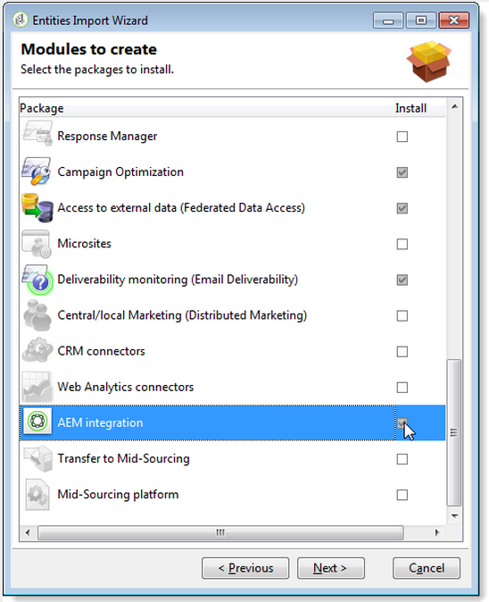
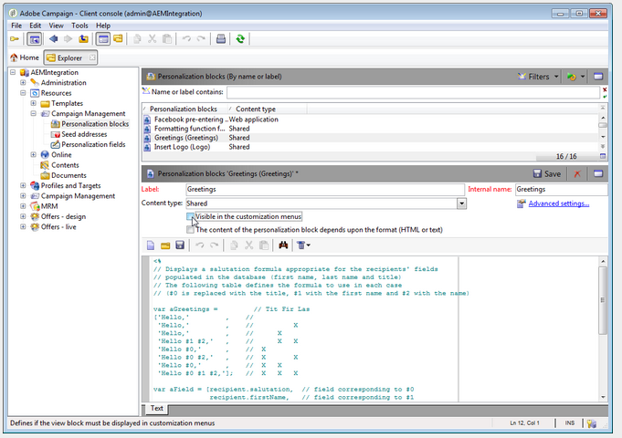
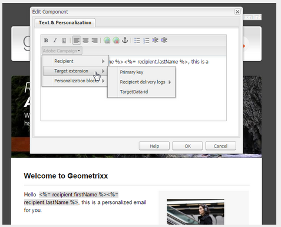

# Adobe Campaign Classic{#integrating-with-adobe-campaign-classic}과 통합

>[!NOTE]
>
>이 설명서는 온프레미스 솔루션인 Adobe Campaign Classic과 AEM을 통합하는 방법을 설명합니다. Adobe Campaign Standard을 사용하는 경우 이러한 지침은 [Adobe Campaign Standard](/help/sites-administering/campaignstandard.md)과 통합을 참조하십시오.

Adobe Campaign을 사용하면 Adobe Experience Manager에서 바로 이메일 전달 컨텐츠 및 양식을 관리할 수 있습니다.

두 솔루션을 동시에 사용하려면 먼저 두 솔루션을 서로 연결하도록 구성해야 합니다. 여기에는 Adobe Campaign 및 Adobe Experience Manager의 구성 단계가 포함됩니다. 이러한 단계는 이 문서에 자세히 설명되어 있습니다.

AEM에서 Adobe Campaign을 사용하여 작업하면 Adobe Campaign을 통해 이메일을 전송하는 기능이 포함되며 [Adobe Campaign 작업](/help/sites-authoring/campaign.md)에 설명되어 있습니다. AEM 페이지에서 양식을 사용하여 데이터를 조작할 수도 있습니다.

또한 AEM을 [Adobe Campaign](https://helpx.adobe.com/support/campaign/classic.html)과(와) 통합할 때 다음 항목에 관심이 있을 수 있습니다.

* [이메일 템플릿 우수 사례](/help/sites-administering/best-practices-for-email-templates.md)
* [Adobe Campaign 통합 문제 해결](/help/sites-administering/troubleshooting-campaignintegration.md)

Adobe Campaign와의 통합을 확장하려는 경우 다음 페이지를 볼 수 있습니다.

* [사용자 지정 확장 프로그램 만들기](/help/sites-developing/extending-campaign-extensions.md)
* [사용자 지정 양식 매핑 만들기](/help/sites-developing/extending-campaign-form-mapping.md)

## AEM 및 Adobe Campaign 통합 워크플로 {#aem-and-adobe-campaign-integration-workflow}

이 섹션에서는 캠페인을 만들고 컨텐츠를 제공할 때 AEM과 Adobe Campaign 간의 일반적인 워크플로우에 대해 설명합니다.

일반적인 워크플로우는 다음과 관련되어 있으며 자세히 설명합니다.

1. 캠페인 만들기를 시작합니다(Adobe Campaign 및 AEM 모두).
1. 컨텐츠 및 전달 내용을 연결하기 전에 AEM에서 컨텐츠를 개인화하고 Adobe Campaign에서 전달을 만듭니다.
1. Adobe Campaign에서 컨텐츠 및 전달 연결

### 캠페인 만들기 시작 {#start-building-your-campaign}

언제든지 캠페인을 만들기 시작합니다. 콘텐츠를 연결하기 전에 AEM과 AC는 독립적입니다. 즉, 마케터는 Adobe Campaign에서 캠페인을 만들고 타깃팅을 만들 수 있으며 컨텐츠 작성자는 AEM에서 디자인 작업을 진행할 수 있습니다.

### 콘텐트 및 배달 {#before-linking-content-and-delivery} 전에

컨텐츠를 연결하고 전달 메커니즘을 만들기 전에 다음을 수행해야 합니다.

**AEM에서**

* **텍스트 및 개인화** 구성 요소의 개인화 필드를 사용하여 개인화합니다.

**Adobe Campaign**

* **aemContent** 유형의 배달을 만듭니다.

### 콘텐트 연결 및 배달 {#linking-content-and-setting-delivery} 설정

링크 및 전달을 위한 컨텐츠를 준비한 후 컨텐츠를 연결하는 방법과 위치를 정확하게 결정합니다.

이러한 모든 단계는 Adobe Campaign에서 완료됩니다.

1. 사용할 AEM 인스턴스를 지정합니다.
1. 동기화 단추를 클릭하여 컨텐츠를 동기화합니다.
1. 컨텐츠 선택기를 열어 컨텐츠를 선택합니다.

### AEM {#if-you-are-new-to-aem}을(를) 처음 사용하는 경우

AEM을 처음 사용하는 경우 AEM을 이해하는 데 유용한 다음 링크를 찾을 수 있습니다.

* [AEM 시작](/help/sites-deploying/deploy.md)
* [복제 에이전트 이해](/help/sites-deploying/replication.md)
* [로그 파일 찾기 및 작업](/help/sites-deploying/monitoring-and-maintaining.md#working-with-audit-records-and-log-files)
* [AEM Platform 소개](/help/sites-deploying/platform.md)

## Adobe Campaign {#configuring-adobe-campaign} 구성

Adobe Campaign 구성에는 다음이 포함됩니다.

1. Adobe Campaign에 AEM 통합 패키지를 설치하는 중입니다.
1. 외부 계정 구성을 참조하십시오.
1. AEMResourceTypeFilter가 올바르게 구성되었는지 확인합니다.

또한 다음과 같은 고급 구성을 만들 수 있습니다.

* 콘텐츠 블록 관리
* 개인화 필드 관리

[고급 구성](#advanced-configurations)을 참조하십시오.

>[!NOTE]
>
>이러한 작업을 수행하려면 Adobe Campaign에 **관리** 역할이 있어야 합니다.

### 전제 조건 {#prerequisites}

다음 요소가 미리 있는지 확인합니다.

* [AEM 제작 인스턴스](/help/sites-deploying/deploy.md#getting-started)
* [AEM 게시 인스턴스](/help/sites-deploying/deploy.md#author-and-publish-installs)
* [클라이언트](https://helpx.adobe.com/support/campaign/classic.html)  및 서버를 포함한 Adobe Campaign Classic 인스턴스
* Internet Explorer 11

>[!NOTE]
>
>Adobe Campaign Classic 빌드 8640 이전 버전을 실행하는 경우 자세한 내용은 [업그레이드 설명서](https://docs.campaign.adobe.com/doc/AC6.1/en/PRO_Updating_Adobe_Campaign_Upgrading.html)를 참조하십시오. 클라이언트와 데이터베이스가 모두 동일한 빌드로 업그레이드되어야 합니다.

>[!CAUTION]
>
>AEM 및 Adobe Campaign 간의 통합 기능이 제대로 작동하려면 [Adobe Campaign](#configuring-adobe-campaign) 구성 및 [Adobe Experience Manager 구성](#configuring-adobe-experience-manager) 섹션에 자세히 설명된 작업이 필요합니다.

### AEM 통합 패키지 {#installing-the-aem-integration-package} 설치

Adobe Campaign에 **AEM 통합** 패키지를 설치해야 합니다. 이를 위해 진행되는 작업:

1. AEM에 연결할 Adobe Campaign 인스턴스로 이동합니다.
1. *도구* > *고급* > *패키지 가져오기...를 선택합니다.*.

   

1. **표준 패키지**&#x200B;를 클릭한 다음 **AEM 통합** 패키지를 선택합니다.

   

1. **다음**&#x200B;을 클릭한 다음 **시작**&#x200B;을 클릭합니다.

   이 패키지에는 AEM 서버를 Adobe Campaign에 연결하는 데 사용할 **aemserver** 연산자가 들어 있습니다.

   >[!CAUTION]
   >
   >기본적으로 이 연산자에 대해 구성된 보안 영역이 없습니다. AEM을 통해 Adobe Campaign에 연결하려면 하나를 선택해야 합니다.
   >
   >**serverConf.xml** 파일에서 선택한 보안 영역의 **allowUserPassword** 속성을 **true**&#x200B;로 설정하여 AEM이 로그인/암호를 통해 Adobe Campaign을 연결할 수 있도록 승인해야 합니다.
   >
   >보안 문제를 방지하기 위해 AEM 전용 보안 영역을 만드는 것이 좋습니다. 자세한 내용은 [설치 안내서](https://docs.campaign.adobe.com/doc/AC/en/INS_Additional_configurations_Configuring_Campaign_server.html)를 참조하십시오.

   

### AEM 외부 계정 {#configuring-an-aem-external-account} 구성

AEM 인스턴스에 Adobe Campaign을 연결할 수 있도록 해주는 외부 계정을 구성해야 합니다.

>[!NOTE]
>
>* **AEM Integration** 패키지를 설치할 때 외부 AEM 계정이 생성됩니다. AEM 인스턴스로 연결을 구성하거나 새 인스턴스를 만들 수 있습니다.
>* AEM에서 캠페인 원격 사용자의 암호를 설정해야 합니다. AEM과 Adobe Campaign을 연결하려면 이 암호를 설정해야 합니다. 관리자로 로그인하고 사용자 관리 콘솔에서 캠페인 원격 사용자를 검색하고 **암호 설정**&#x200B;을 클릭합니다.

>


외부 AEM 계정을 구성하려면:

1. **관리** > **플랫폼** > **외부 계정** 노드로 이동합니다.
1. 새 외부 계정을 만들고 **AEM** 유형을 선택합니다.
1. AEM 작성 인스턴스에 대한 액세스 매개 변수를 입력합니다.서버 주소와 이 인스턴스에 연결하는 데 사용되는 ID 및 암호입니다. campaign-api 사용자 계정 암호는 AEM에서 암호를 설정한 캠페인 원격 사용자와 동일합니다.

   >[!NOTE]
   >
   >서버 주소가 후행 슬래시에서 **이 끝나지 않은**&#x200B;인지 확인하십시오. 예를 들어 `https://yourserver:4502/` 대신 `https://yourserver:4502`을 입력합니다.

    

1. **Enabled** 확인란이 선택되어 있는지 확인합니다.

### AEMResourceTypeFilter 옵션 확인 중 {#verifying-the-aemresourcetypefilter-option}

**AEMResourceTypeFilter** 옵션은 Adobe Campaign에서 사용할 수 있는 AEM 리소스 유형을 필터링하는 데 사용됩니다. 이를 통해 Adobe Campaign은 Adobe Campaign에서만 사용하도록 특별히 설계된 AEM 컨텐츠를 검색할 수 있습니다.

이 옵션은 사전 구성되어 있어야 합니다.그러나 이 옵션을 변경하면 작동하지 않는 통합이 발생할 수 있습니다.

**AEMResourceTypeFilter** 옵션이 구성되어 있는지 확인하려면:

1. **플랫폼** >**옵션**&#x200B;으로 이동합니다.
1. **AEMResourceTypeFilter** 옵션에서 경로가 올바른지 확인합니다. 이 필드에는 다음 값이 포함되어야 합니다.

   **mcm/campaign/components/newsletter,mcm/campaign/components/campaign_newsletterpage,mcm/neolane/components/newsletter**

   또는 경우에 따라 값이 다음과 같습니다.

   **mcm/campaign/components/newsletter**

   

## Adobe Experience Manager {#configuring-adobe-experience-manager} 구성

AEM을 구성하려면 다음을 수행해야 합니다.

* 인스턴스 간 복제를 구성합니다.
* Cloud Services을 통해 AEM과 Adobe Campaign 연결
* 외부 도우미를 구성합니다.

### AEM 인스턴스 {#configuring-replication-between-aem-instances} 간 복제 구성

AEM 제작 인스턴스에서 만든 컨텐츠는 먼저 게시 인스턴스로 전송됩니다. 뉴스레터의 이미지를 게시 인스턴스와 뉴스레터 수신자에게 사용할 수 있도록 게시해야 합니다. 따라서 복제 에이전트를 AEM 제작 인스턴스에서 AEM 게시 인스턴스로 복제하도록 구성해야 합니다.

>[!NOTE]
>
>복제 URL을 사용하지 않고 대신 공개 URL을 사용하는 경우 OSGi(**AEM 로고** > **도구** 아이콘 > **작업** > &lt;a8>의 다음 구성 설정에서 **공개 URL**&#x200B;을 설정할 수 있습니다./>웹 콘솔&#x200B;**>** OSGi 구성&#x200B;**>** AEM 캠페인 통합 - 구성&#x200B;**):**
**공개 URL:** com.day.cq.mcm.campaign.impl.IntegrationConfigImpl#aem.mcm.campaign.publicUrl

이 단계는 특정 작성 인스턴스 구성을 게시 인스턴스에 복제하는 데도 필요합니다.

AEM 인스턴스 간 복제를 구성하려면:

1. 제작 인스턴스에서 **AEM 로고** **도구** 아이콘 > **배포** > **복제** > **작성자**&#x200B;의 에이전트를 선택한 다음 **기본 에이전트**&#x200B;를 클릭합니다.

   

   >[!NOTE]
   게시 및 작성자 인스턴스가 모두 동일한 컴퓨터에 있는 경우를 제외하고 Adobe Campaign과 통합을 구성할 때 AEM의 로컬 복사본인 localhost를 사용하지 마십시오.

1. **편집**&#x200B;을 탭하거나 클릭한 다음 **전송** 탭을 선택합니다.
1. **localhost**&#x200B;을 IP 주소 또는 AEM 게시 인스턴스의 주소로 대체하여 URI를 구성합니다.

   

### Adobe Campaign {#connecting-aem-to-adobe-campaign}에 AEM 연결

AEM과 Adobe Campaign을 함께 사용하려면 먼저 두 솔루션 간의 링크를 설정하여 두 솔루션이 통신할 수 있도록 해야 합니다.

1. AEM 제작 인스턴스에 연결합니다.
1. **AEM 로고** > **도구** 아이콘 > **배포** > **Cloud Services**&#x200B;을 선택한 다음 Adobe Campaign 섹션에서 **지금 구성**&#x200B;을 선택합니다.

   

1. **제목**&#x200B;을 입력하고 **만들기**&#x200B;를 클릭하거나 Adobe Campaign 인스턴스와 연결할 기존 구성을 선택합니다.
1. Adobe Campaign 인스턴스의 매개 변수와 일치하도록 구성을 편집합니다.

   * **사용자 이름**: **aemserver**, 두 솔루션 간의 링크를 설정하는 데 사용되는 Adobe Campaign AEM 통합 패키지 연산자입니다.
   * **암호**:Adobe Campaign aemserver 연산자 암호. Adobe Campaign에서 직접 이 연산자의 암호를 다시 지정해야 할 수도 있습니다.
   * **API 끝점**:Adobe Campaign 인스턴스 URL.

1. **Adobe Campaign 연결**&#x200B;을 선택하고 **확인**&#x200B;을 클릭합니다.

   

   >[!NOTE]
   [이메일을 만들어 게시](/help/sites-authoring/campaign.md)하면 게시 인스턴스에 구성을 다시 게시해야 합니다.

   

>[!NOTE]
연결에 실패하면 다음을 확인하십시오.
* Adobe Campaign 인스턴스(https)에 대한 보안 연결을 사용하는 경우 인증서 문제가 발생할 수 있습니다. AEM 인스턴스의 JDK에 있는 **캐시** 파일에 Adobe Campaign 인스턴스 인증서를 추가해야 합니다.
* Adobe Campaign의 [aemserver 연산자](#connecting-aem-to-adobe-campaign)에 대해 보안 영역을 구성해야 합니다. 또한 **serverConf.xml** 파일에서 보안 영역의 **allowUserPassword** 속성을 **true**&#x200B;로 설정하여 로그인/암호 모드를 사용하여 Adobe Campaign에 대한 AEM 연결을 인증해야 합니다.

또한 [AEM/Adobe Campaign 통합 문제 해결](/help/sites-administering/troubleshooting-campaignintegration.md)을 참조하십시오.

### externalizer {#configuring-the-externalizer} 구성

작성자 인스턴스에서 AEM에서 [externalizer](/help/sites-developing/externalizer.md)를 구성해야 합니다. Externalizer는 리소스 경로를 외부 및 절대 URL로 변환할 수 있는 OSGi 서비스입니다. 이 서비스는 이러한 외부 URL을 구성하고 작성할 수 있는 중앙 위치를 제공합니다.

일반 지침은 [외부라이저 구성](/help/sites-developing/externalizer.md)을 참조하십시오. Adobe Campaign 통합의 경우 `localhost:4503`을(를) 가리키는 것이 아니라 Adobe Campaign 콘솔에서 연결할 수 있는 서버에 대해 `https://<host>:<port>/system/console/configMgr/com.day.cq.commons.impl.ExternalizerImpl`에 게시 서버를 구성해야 합니다.

이 서버가 `localhost:4503` 또는 Adobe Campaign이 도달할 수 없는 다른 서버를 가리키면 이미지가 Adobe Campaign 콘솔에 나타나지 않습니다.


## 고급 구성 {#advanced-configurations}

다음과 같은 고급 구성을 수행할 수도 있습니다.

* 개인화 필드 및 블록 관리
* 개인화 블록을 비활성화합니다.
* 타겟 확장 데이터 관리

### 개인화 필드 및 블록 관리{#managing-personalization-fields-and-blocks}

AEM의 이메일 콘텐츠에 개인화를 추가하는 데 사용할 수 있는 필드 및 블록은 Adobe Campaign에서 관리합니다.

기본 목록이 제공되지만 수정할 수 있습니다. 개인화 필드 및 블록을 추가하거나 숨길 수도 있습니다.

#### 개인화 필드 {#adding-a-personalization-field} 추가

이미 사용 가능한 개인화 필드에 새 개인화 필드를 추가하려면 다음과 같이 Adobe Campaign **nms:seedMember** 스키마를 확장해야 합니다.

>[!CAUTION]
추가해야 하는 필드가 수신자 스키마 확장(**nms:recipient**)을 통해 이미 추가되어 있어야 합니다. 자세한 내용은 [구성](https://docs.campaign.adobe.com/doc/AC6.1/en/CFG_Editing_schemas_Editing_schemas.html) 안내서를 참조하십시오.

1. Adobe Campaign 탐색의 **관리** > **구성** > **데이터 스키마** 노드로 이동합니다.
1. **새로 만들기**&#x200B;를 선택합니다.

   

1. 팝업 창에서 **확장 스키마**&#x200B;를 사용하여 테이블의 데이터 확장을 선택하고 **다음**&#x200B;을 클릭합니다.

   

1. 확장 스키마의 다른 매개 변수를 입력합니다.

   * **스키마**:nms: **seedMemberschema를** 선택합니다. 창의 다른 필드는 자동으로 완료됩니다.
   * **네임스페이스**:확장 스키마의 네임스페이스를 개인화합니다.

1. 스키마의 XML 코드를 편집하여 추가할 필드를 지정합니다. Adobe Campaign의 스키마 확장에 대한 자세한 내용은 [구성 안내서](https://docs.campaign.adobe.com/doc/AC6.1/en/CFG_Editing_schemas_Extending_a_schema.html)를 참조하십시오.
1. 스키마를 저장한 다음 콘솔에서 **도구** > **고급** > **데이터베이스 구조 업데이트** 메뉴를 통해 Adobe Campaign 데이터베이스 구조를 업데이트합니다.
1. 연결을 해제한 다음 Adobe Campaign 콘솔에 다시 연결하여 변경 내용을 저장합니다. 이제 AEM에서 사용할 수 있는 개인화 필드 목록에 새 필드가 표시됩니다.

#### 예 {#example}

**등록 번호** 필드를 추가하려면 다음 요소가 있어야 합니다.

* **nms:recipient** 스키마 확장 이름 **cus:recipient**&#x200B;에는 다음이 포함됩니다.

```xml
<element desc="Recipient table (profiles)" img="nms:recipient.png" label="Recipients" labelSingular="Recipient" name="recipient">

  <attribute dataPolicy="smartCase" desc="Recipient registration number"
  label="Registration Number"
  length="50" name="registrationNumber" type="string"/>

</element>
```

**nms:seedMember** 스키마 확장명 **cus:seedMember**&#x200B;에는 다음이 포함됩니다.

```xml
<element desc="Seed to insert in the export files" img="nms:unknownad.png" label="Seed addresses" labelSingular="Seed" name="seedMember">

  <element name="custom_nms_recipient">
    <attribute name="registrationNumber"
    template="cus:recipient:recipient/@registrationNumber"/>
  </element>

</element>
```

이제 **등록 번호** 필드가 사용 가능한 개인화 필드의 일부입니다.


#### 개인화 필드 {#hiding-a-personalization-field} 숨기기

이미 사용 가능한 항목 중에서 개인화 필드를 숨기려면 [개인화 필드 추가](#adding-a-personalization-field) 섹션에 설명된 대로 Adobe Campaign **nms:seedMember** 스키마를 확장해야 합니다. 다음 단계를 적용합니다.

1. 확장 스키마(**cus:seedMember** 예)의 **nms:seedMember** 스키마에서 가져올 필드를 복사합니다.
1. **advanced=&quot;true&quot;** XML 특성을 필드에 추가합니다. AEM에서 사용할 수 있는 개인화 필드 목록에 더 이상 표시되지 않습니다.

   예를 들어 **중간 이름** 필드를 숨기려면 **cud:seedMember** 스키마에 다음 요소가 포함되어야 합니다.

   ```xml
   <element desc="Seed to insert in the export files" img="nms:unknownad.png" label="Seed addresses" labelSingular="Seed" name="seedMember">
   
     <element name="custom_nms_recipient">
       <attribute advanced="true" name="middleName"/>
     </element>
   
   </element>
   ```

### 개인화 블록 {#deactivating-a-personalization-block} 비활성화

사용 가능한 것들 중에서 개인화 블록을 비활성화하려면:

1. Adobe Campaign 탐색의 **리소스** > **캠페인 관리** > **개인화 블록** 노드로 이동합니다.
1. AEM에서 비활성화할 개인화 블록을 선택합니다.
1. **사용자 정의 메뉴** 확인란의 선택을 취소하고 변경 내용을 저장합니다. Adobe Campaign에서 사용할 수 있는 개인화 블록 목록에 해당 블록이 더 이상 표시되지 않습니다.

   

### 대상 확장 데이터 관리 {#managing-target-extension-data}

개인화를 위해 타겟 확장 데이터를 삽입할 수도 있습니다. 타겟 확장 데이터(&#39;Target 데이터&#39;라고도 함)는 캠페인 워크플로우에서 쿼리를 통해 데이터를 증가시키거나 추가함으로써 얻은 데이터입니다. 자세한 내용은 [쿼리 만들기](https://docs.campaign.adobe.com/doc/AC/en/PTF_Creating_queries_About_queries_in_Campaign.html) 및 [데이터 농축](https://docs.campaign.adobe.com/doc/AC/en/WKF_Use_cases_Enriching_data.html) 섹션을 참조하십시오.

>[!NOTE]
타겟의 데이터는 AEM 컨텐츠가 Adobe Campaign 게재과 동기화된 경우에만 사용할 수 있습니다. AEM에서 만든 컨텐츠를 Adobe Campaign](/help/sites-authoring/campaign.md#synchronizing-content-created-in-aem-with-a-delivery-from-adobe-campaign-classic)의 게재와 동기화 를 참조하십시오.[



