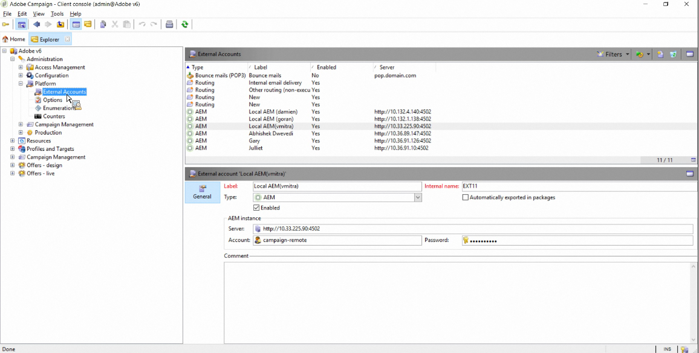

# Adobe Campaign Classic과 통합{#integrating-with-adobe-campaign-classic}

>[!NOTE]
>
>이 설명서는 AEM을 온-프레미스 솔루션인 Adobe Campaign Classic과 통합하는 방법을 설명합니다. Adobe Campaign Standard을 사용하는 경우 다음을 참조하십시오. [Adobe Campaign Standard과 통합](/help/sites-administering/campaignstandard.md) 자세한 내용은

Adobe Campaign을 사용하면 Adobe Experience Manager에서 직접 이메일 게재 콘텐츠 및 양식을 관리할 수 있습니다.

두 솔루션을 동시에 사용하려면 먼저 서로 연결하도록 구성해야 합니다. 여기에는 Adobe Campaign과 Adobe Experience Manager 모두의 구성 단계가 포함됩니다. 이러한 단계는 이 문서에 자세히 설명되어 있습니다.

AEM에서 Adobe Campaign을 사용하는 작업에는 Adobe Campaign을 통해 이메일을 전송하는 기능이 포함되어 있으며 [Adobe Campaign 작업](/help/sites-authoring/campaign.md). 또한 AEM 페이지에서 양식을 사용하여 데이터를 조작할 수도 있습니다.

또한, AEM을 통합할 때 다음 주제를 관심 사항으로 지정할 수 있습니다 [Adobe Campaign](https://helpx.adobe.com/support/campaign/classic.html):

* [이메일 템플릿 우수 사례](/help/sites-administering/best-practices-for-email-templates.md)
* [Adobe Campaign 통합 문제 해결](/help/sites-administering/troubleshooting-campaignintegration.md)

Adobe Campaign과의 통합을 확장하는 경우 다음 페이지를 볼 수 있습니다.

* [사용자 지정 확장 프로그램 만들기](/help/sites-developing/extending-campaign-extensions.md)
* [사용자 지정 양식 매핑 만들기](/help/sites-developing/extending-campaign-form-mapping.md)

## AEM 및 Adobe Campaign 통합 워크플로우 {#aem-and-adobe-campaign-integration-workflow}

이 섹션에서는 캠페인을 만들고 컨텐츠를 제공할 때 AEM과 Adobe Campaign 간의 일반적인 워크플로우에 대해 설명합니다.

일반적인 워크플로우에는 다음이 포함되며 자세히 설명되어 있습니다.

1. 캠페인 빌드를 시작합니다(Adobe Campaign과 AEM 모두).
1. 콘텐츠 및 게재를 연결하기 전에 AEM에서 콘텐츠를 개인화하고 Adobe Campaign에서 게재를 만듭니다.
1. Adobe Campaign에서 컨텐츠 및 게재를 연결합니다.

### 캠페인 만들기 시작 {#start-building-your-campaign}

언제든지 캠페인 만들기를 시작합니다. 컨텐츠를 연결하기 전에 AEM 및 AC는 독립적입니다. 즉, 마케터는 Adobe Campaign에서 캠페인 만들기 및 타깃팅을 시작할 수 있고 컨텐츠 작성자는 AEM에서 디자인을 작업하는 중입니다.

### 컨텐츠 및 게재를 연결하기 전 {#before-linking-content-and-delivery}

컨텐츠를 연결하고 게재 메커니즘을 만들기 전에 다음을 수행해야 합니다.

**AEM에서**

* 에서 개인화 필드를 사용하여 개인화합니다 **텍스트 및 개인화** 구성 요소

**Adobe Campaign**

* 유형의 게재 만들기 **aemContent**

### 컨텐츠 연결 및 게재 설정 {#linking-content-and-setting-delivery}

연결 및 전달을 위한 컨텐츠를 준비했으면 컨텐츠를 연결하는 방법과 위치를 정확하게 결정합니다.

이 모든 단계는 Adobe Campaign에서 완료됩니다.

1. 사용할 AEM 인스턴스를 지정합니다.
1. 동기화 단추를 클릭하여 컨텐츠를 동기화합니다.
1. 컨텐츠 선택기를 열어 컨텐츠를 선택합니다.

### AEM을 처음 사용하는 경우 {#if-you-are-new-to-aem}

AEM을 처음 사용하는 경우 AEM을 이해하는 데 도움이 되는 다음 링크를 찾을 수 있습니다.

* [AEM 시작](/help/sites-deploying/deploy.md)
* [복제 에이전트 이해](/help/sites-deploying/replication.md)
* [로그 파일 찾기 및 작업](/help/sites-deploying/monitoring-and-maintaining.md#working-with-audit-records-and-log-files)
* [AEM Platform 소개](/help/sites-deploying/platform.md)

## Adobe Campaign 구성 {#configuring-adobe-campaign}

Adobe Campaign 구성에 다음이 포함됩니다.

1. Adobe Campaign에 AEM 통합 패키지 설치.
1. 외부 계정 구성
1. AEMRessourceTypeFilter가 올바르게 구성되었는지 확인하는 중입니다.

또한 다음을 포함하여 수행할 수 있는 고급 구성이 있습니다.

* 콘텐츠 블록 관리
* 개인화 필드 관리

자세한 내용은 [고급 구성](#advanced-configurations).

>[!NOTE]
>
>이러한 작업을 수행하려면 **관리** Adobe Campaign의 역할.

### 사전 요구 사항 {#prerequisites}

미리 다음 요소가 있는지 확인합니다.

* [AEM 작성 인스턴스](/help/sites-deploying/deploy.md#getting-started)
* [AEM 게시 인스턴스](/help/sites-deploying/deploy.md#author-and-publish-installs)
* [Adobe Campaign Classic 인스턴스](https://helpx.adobe.com/support/campaign/classic.html) - 클라이언트 및 서버 포함
* Internet Explorer 11

>[!NOTE]
>
>Adobe Campaign Classic 빌드 8640 이전 버전을 실행 중인 경우 다음을 참조하십시오. [업그레이드 설명서](https://docs.campaign.adobe.com/doc/AC6.1/en/PRO_Updating_Adobe_Campaign_Upgrading.html) 추가 정보. 클라이언트와 데이터베이스를 모두 동일한 빌드로 업그레이드해야 합니다.

>[!CAUTION]
>
>에 자세히 설명된 작업 [Adobe Campaign 구성](#configuring-adobe-campaign) 및 [Adobe Experience Manager 구성](#configuring-adobe-experience-manager) AEM과 Adobe Campaign 간의 통합 기능이 제대로 작동하려면 섹션이 필요합니다.

### AEM 통합 패키지 설치 {#installing-the-aem-integration-package}

을(를) 설치해야 합니다. **AEM 통합** Adobe Campaign 패키지 이를 위해 진행되는 작업:

1. AEM에 연결할 Adobe Campaign 인스턴스로 이동합니다.
1. *도구* > *고급* > *패키지 가져오기...*&#x200B;를 선택합니다.

   

1. 클릭 **표준 패키지 설치**&#x200B;를 선택한 다음, **AEM 통합** 패키지.

   

1. 클릭 **다음**, 그런 다음 **시작**.

   이 패키지에는 **aemserver** AEM 서버를 Adobe Campaign에 연결하는 데 사용할 연산자입니다.

   >[!CAUTION]
   >
   >기본적으로 이 연산자에 대해 보안 영역이 구성되지 않습니다. AEM을 통해 Adobe Campaign에 연결하려면 하나를 선택해야 합니다.
   >
   >에서 **serverConf.xml** 파일, **allowUserPassword** 선택한 보안 영역의 특성을 **true** 로그인/암호를 통해 AEM에 Adobe Campaign을 연결하도록 승인하려면 다음을 수행하십시오.
   >
   >보안 문제를 방지하기 위해 AEM 전용 보안 영역을 만드는 것이 좋습니다. 자세한 내용은 [설치 안내서](https://docs.campaign.adobe.com/doc/AC/en/INS_Additional_configurations_Configuring_Campaign_server.html).

   

### AEM 외부 계정 구성 {#configuring-an-aem-external-account}

Adobe Campaign을 AEM 인스턴스에 연결할 수 있도록 외부 계정을 구성해야 합니다.

>[!NOTE]
>
>* 설치 시 **AEM 통합** 패키지로, 외부 AEM 계정이 만들어집니다. AEM 인스턴스에 대한 연결을 구성하거나 새 인스턴스를 만들 수 있습니다.
>* AEM에서 campaign-remote 사용자의 암호를 설정해야 합니다. Adobe Campaign과 AEM을 연결하려면 이 암호를 설정해야 합니다. 관리자로 로그인하고 사용자 관리 콘솔에서 campaign-remote 사용자를 검색한 다음 를 클릭합니다 **암호 설정**.
>


외부 AEM 계정을 구성하려면

1. 로 이동합니다. **관리** > **플랫폼** > **외부 계정** 노드 아래에 있어야 합니다.
1. 새 외부 계정을 만들고 **AEM** 유형.
1. AEM 작성 인스턴스에 대한 액세스 매개 변수를 입력합니다. 서버 주소와 이 인스턴스에 연결하는 데 사용되는 ID 및 암호입니다. campaign-api 사용자 계정 암호는 AEM에서 암호를 설정한 campaign-remote 사용자와 동일합니다.

   >[!NOTE]
   >
   >서버 주소가 **not** 후행 슬래시로 끝남. 예를 들어, 을 입력합니다. `https://yourserver:4502` 대신 `https://yourserver:4502/`

    

1. 다음을 확인합니다. **활성화됨** 확인란이 선택되어 있습니다.

### AEMRessourceTypeFilter 옵션 확인 {#verifying-the-aemresourcetypefilter-option}

다음 **AEMRessourceTypeFilter** Adobe Campaign에서 사용할 수 있는 AEM 리소스 유형을 필터링하는 데 옵션이 사용됩니다. 이렇게 하면 Adobe Campaign에서 Adobe Campaign에서만 사용하도록 특별히 설계된 AEM 컨텐츠를 검색할 수 있습니다.

이 옵션은 사전 구성되어 있어야 합니다. 그러나 이 옵션을 변경하면 작동하지 않는 통합이 발생할 수 있습니다.

를 확인하려면 **AEMRessourceTypeFilter** 옵션이 구성되었습니다.

1. 이동 **플랫폼** >**옵션**.
1. 에서 **AEMRessourceTypeFilter** 옵션을 선택하면 경로가 올바른지 확인합니다. 이 필드에는 값이 포함되어야 합니다.

   **mcm/campaign/components/newsletter,mcm/campaign/components/campaign_newsletterpage,mcm/neolane/components/newsletter**

   또는 경우에 따라 값이 다음과 같습니다.

   **mcm/campaign/components/newsletter**

   

## Adobe Experience Manager 구성 {#configuring-adobe-experience-manager}

AEM을 구성하려면 다음을 수행해야 합니다.

* 인스턴스 간 복제를 구성합니다.
* Cloud Services을 통해 AEM을 Adobe Campaign에 연결합니다.
* 외부 도우미를 구성합니다.

### AEM 인스턴스 간 복제 구성 {#configuring-replication-between-aem-instances}

AEM 작성 인스턴스에서 만든 컨텐츠가 먼저 게시 인스턴스로 전송됩니다. 뉴스레터의 이미지를 게시 인스턴스와 뉴스레터 수신자에게 사용할 수 있도록 게시해야 합니다. 따라서 AEM 작성 인스턴스에서 AEM 게시 인스턴스로 복제하도록 복제 에이전트를 구성해야 합니다.

>[!NOTE]
>
>복제 URL을 사용하지 않고 대신 공개 URL을 사용하는 경우, **공개 URL** OSGi(**AEM 로고** >  **도구** 아이콘 >  **작업** > **웹 콘솔** > **OSGi 구성** > **AEM Campaign 통합 - 구성**):
**공개 URL:** com.day.cq.mcm.campaign.impl.IntegrationConfigImpl#aem.mcm.campaign.publicUrl

이 단계는 특정 작성 인스턴스 구성을 게시 인스턴스에 복제하는 데도 필요합니다.

AEM 인스턴스 간 복제를 구성하려면:

1. 작성 인스턴스에서 를 선택합니다 **AEM 로고**> **도구** 아이콘 > **배포** > **복제** > **작성자의 에이전트**&#x200B;를 클릭한 다음 **기본 에이전트**.

   

   >[!NOTE]
   게시 및 작성자 인스턴스가 모두 동일한 컴퓨터에 있는 경우가 아니라면 Adobe Campaign과 통합을 구성할 때 localhost(AEM의 로컬 복사본)를 사용하지 마십시오.

1. 탭 또는 클릭 **편집** 그런 다음 **전송** 탭.
1. 를 수정하여 URI 구성 **localhost** IP 주소 또는 AEM 게시 인스턴스의 주소를 사용하는 경우입니다.

   

### Adobe Campaign에 AEM 연결 {#connecting-aem-to-adobe-campaign}

AEM과 Adobe Campaign을 함께 사용하려면 먼저 두 솔루션 간에 링크를 설정하여 통신할 수 있어야 합니다.

1. AEM 작성 인스턴스에 연결합니다.
1. 선택 **AEM 로고** > **도구** 아이콘 > **배포** > **Cloud Services**, 그런 다음 **지금 구성** ( Adobe Campaign 섹션)을 참조하십시오.

   

1. 을 입력하여 새 구성을 만듭니다. **제목** 을(를) 클릭합니다. **만들기**&#x200B;또는 Adobe Campaign 인스턴스에 연결할 기존 구성을 선택합니다.
1. Adobe Campaign 인스턴스의 매개 변수와 일치하도록 구성을 편집합니다.

   * **사용자 이름**: **aemserver**&#x200B;로 지정하는 경우 두 솔루션 간에 링크를 설정하는 데 사용되는 Adobe Campaign AEM 통합 패키지 연산자입니다.
   * **암호**: Adobe Campaign aemserver 운영자 암호. Adobe Campaign에서 직접 이 연산자의 암호를 다시 지정해야 할 수 있습니다.
   * **API 종료 지점**: Adobe Campaign 인스턴스 URL.

1. 선택 **Adobe Campaign에 연결** 을(를) 클릭합니다. **확인**.

   

   >[!NOTE]
   다음에 [이메일 만들기 및 게시](/help/sites-authoring/campaign.md)를 사용하려면 구성을 게시 인스턴스에 다시 게시해야 합니다.

   

>[!NOTE]
연결에 실패하면 다음을 확인하십시오.
* Adobe Campaign 인스턴스(https)에 대한 보안 연결을 사용할 때 인증서 문제가 발생할 수 있습니다. Adobe Campaign 인스턴스 인증서를 **캐시** AEM 인스턴스의 JDK 파일입니다.
* 에 대해 보안 영역을 구성해야 합니다. [aemserver 운영자](#connecting-aem-to-adobe-campaign) Adobe Campaign. 또한, **serverConf.xml** 파일, **allowUserPassword** 보안 영역의 특성을 **true** 로그인/암호 모드를 사용하여 Adobe Campaign에 대한 AEM 연결을 승인하려면 다음을 수행하십시오.
>
또한 다음을 참조하십시오 [AEM/Adobe Campaign 통합 문제 해결](/help/sites-administering/troubleshooting-campaignintegration.md).

### 외부 도우미 구성 {#configuring-the-externalizer}

다음을 수행해야 합니다. [externalizer 구성](/help/sites-developing/externalizer.md) 작성자 인스턴스의 AEM에서 을 참조하십시오. Externalizer는 리소스 경로를 외부 및 절대 URL로 변환할 수 있는 OSGi 서비스입니다. 이 서비스는 이러한 외부 URL을 구성하고 빌드할 수 있는 중앙 위치를 제공합니다.

자세한 내용은 [외부 도우미 구성](/help/sites-developing/externalizer.md) 추가 정보 Adobe Campaign 통합에서 게시 서버를 구성했는지 확인합니다. `https://<host>:<port>/system/console/configMgr/com.day.cq.commons.impl.ExternalizerImpl`가리키지 않음 `localhost:4503` 그러나 Adobe Campaign 콘솔에서 연결할 수 있는 서버에 연결할 수 있습니다.

이 URL이 `localhost:4503` 또는 Adobe Campaign이 연결할 수 없는 다른 서버는 Adobe Campaign 콘솔에 이미지가 표시되지 않습니다.


## 고급 구성 {#advanced-configurations}

몇 가지 고급 구성을 수행할 수도 있습니다. 즉, 다음과 같습니다.

* 개인화 필드 및 블록을 관리합니다.
* 개인화 블록을 비활성화합니다.
* Target 확장 데이터를 관리합니다.

### 개인화 필드 및 블록 관리 {#managing-personalization-fields-and-blocks}

AEM에서 전자 메일 콘텐츠에 개인화를 추가하는 데 사용할 수 있는 필드 및 블록은 Adobe Campaign에서 관리합니다.

기본 목록이 제공되지만 수정할 수 있습니다. 개인화 필드 및 블록을 추가하거나 숨길 수도 있습니다.

#### 개인화 필드 추가 {#adding-a-personalization-field}

이미 사용 가능한 필드에 새 개인화 필드를 추가하려면 Adobe Campaign을 확장해야 합니다 **nms:seedMember** 스키마는 다음과 같습니다.

>[!CAUTION]
추가해야 하는 필드가 수신자 스키마 확장(**nms:recipient**). 자세한 내용은 [구성](https://docs.campaign.adobe.com/doc/AC6.1/en/CFG_Editing_schemas_Editing_schemas.html) 안내서.

1. 로 이동합니다. **관리** > **구성** > **데이터 스키마** 노드 아래에 있어야 합니다.
1. 선택 **새로 만들기**.

   

1. 팝업 창에서 **확장 스키마를 사용하여 테이블의 데이터 확장** 을(를) 클릭합니다. **다음**.

   

1. 확장 스키마의 다른 매개 변수를 입력합니다.

   * **스키마**: 선택 **nms:seedMember** 스키마. 창의 다른 필드는 자동으로 완료됩니다.
   * **네임스페이스**: 확장 스키마의 네임스페이스를 개인화합니다.

1. 스키마의 XML 코드를 편집하여 추가할 필드를 지정합니다. Adobe Campaign에서 스키마 확장에 대한 자세한 내용은 [구성 안내서](https://docs.campaign.adobe.com/doc/AC6.1/en/CFG_Editing_schemas_Extending_a_schema.html).
1. 스키마를 저장한 다음, **도구** > **고급** > **데이터베이스 구조 업데이트** 메뉴 아래의 제품에서 사용할 수 있습니다.
1. 연결을 끊은 다음 Adobe Campaign 콘솔에 다시 연결하여 변경 내용을 저장합니다. 이제 AEM에서 사용할 수 있는 개인화 필드 목록에 새 필드가 나타납니다.

#### 예 {#example}

을(를) 추가하려면 **등록 번호** 필드에 다음 요소가 있어야 합니다.

* 다음 **nms:recipient** 라는 이름의 스키마 확장 **cus:recipient** 다음 포함:

```xml
<element desc="Recipient table (profiles)" img="nms:recipient.png" label="Recipients" labelSingular="Recipient" name="recipient">

  <attribute dataPolicy="smartCase" desc="Recipient registration number"
  label="Registration Number"
  length="50" name="registrationNumber" type="string"/>

</element>
```

다음 **nms:seedMember** 라는 이름의 스키마 확장 **cus:seedMember** 다음 포함:

```xml
<element desc="Seed to insert in the export files" img="nms:unknownad.png" label="Seed addresses" labelSingular="Seed" name="seedMember">

  <element name="custom_nms_recipient">
    <attribute name="registrationNumber"
    template="cus:recipient:recipient/@registrationNumber"/>
  </element>

</element>
```

다음 **등록 번호** 이제 필드가 사용 가능한 개인화 필드의 일부입니다.


#### 개인화 필드 숨기기 {#hiding-a-personalization-field}

이미 사용 가능한 필드 중에서 개인화 필드를 숨기려면 Adobe Campaign을 확장해야 합니다 **nms:seedMember** 에 자세히 설명되어 있는 스키마 [개인화 필드 추가](#adding-a-personalization-field) 섹션을 참조하십시오. 다음 단계를 적용합니다.

1. 에서 가져올 필드를 복사합니다. **nms:seedMember** 확장 스키마의 스키마(**cus:seedMember** 예).
1. 추가 **advanced=&quot;true&quot;** 필드에 XML 특성이 있습니다. AEM에서 사용할 수 있는 개인화 필드 목록에 더 이상 표시되지 않습니다.

   예를 들어 **중간 이름** 필드, **cud:seedMember** 스키마에는 다음 요소가 포함되어야 합니다.

   ```xml
   <element desc="Seed to insert in the export files" img="nms:unknownad.png" label="Seed addresses" labelSingular="Seed" name="seedMember">
   
     <element name="custom_nms_recipient">
       <attribute advanced="true" name="middleName"/>
     </element>
   
   </element>
   ```

### 개인화 블록 비활성화 {#deactivating-a-personalization-block}

사용 가능한 블록 중에서 개인화 블록을 비활성화하려면 다음을 수행하십시오.

1. 로 이동합니다. **리소스** > **Campaign Management** > **개인화 블록** 노드 아래에 있어야 합니다.
1. AEM에서 비활성화할 개인화 블록을 선택합니다.
1. 지우기 **사용자 지정 메뉴에 표시** 확인란을 선택하고 변경 사항을 저장합니다. 블록이 Adobe Campaign에서 사용할 수 있는 개인화 블록 목록에 더 이상 표시되지 않습니다.

   

### Target 확장 데이터 관리 {#managing-target-extension-data}

개인화를 위해 target 확장 데이터를 삽입할 수도 있습니다. Target 확장 데이터(&#39;Target 데이터&#39;라고도 함)는 예를 들어 캠페인 워크플로우의 쿼리에서 데이터를 보강하거나 추가함으로써 나옵니다. 자세한 내용은 [쿼리 만들기](https://docs.campaign.adobe.com/doc/AC/en/PTF_Creating_queries_About_queries_in_Campaign.html) 및 [데이터 강화](https://docs.campaign.adobe.com/doc/AC/en/WKF_Use_cases_Enriching_data.html) 섹션에 자세히 설명되어 있습니다.

>[!NOTE]
타겟의 데이터는 AEM 컨텐츠가 Adobe Campaign 게재과 동기화되는 경우에만 사용할 수 있습니다. 자세한 내용은 [AEM에서 만든 컨텐츠를 Adobe Campaign의 게재와 동기화](/help/sites-authoring/campaign.md#synchronizing-content-created-in-aem-with-a-delivery-from-adobe-campaign-classic).


