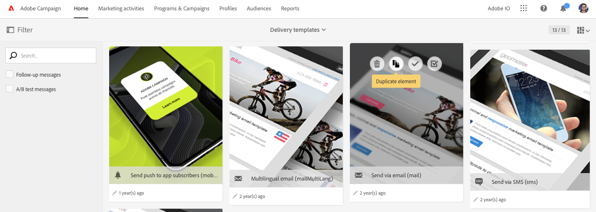

# AEM 6.5와 Adobe Campaign Standard 통합 {#integrating-with-adobe-campaign-standard}

AEM 6.5를 ACS(Adobe Campaign Standard)와 통합하여 AEM에서 이메일 게재, 콘텐츠 및 양식을 직접 관리할 수 있습니다. 솔루션 간 양방향 통신이 가능하려면 Adobe Campaign Standard과 AEM 모두에서 구성 단계를 수행해야 합니다.

이 통합을 통해 AEM 및 Adobe Campaign Standard을 독립적으로 사용할 수 있습니다. 마케터는 Adobe Campaign에서 캠페인을 만들고 타깃팅을 사용할 수 있으며, 동시에 콘텐츠 크리에이터는 AEM에서 콘텐츠 디자인 작업을 할 수 있습니다. 통합을 사용하여 AEM에서 만든 캠페인의 콘텐츠와 디자인을 Adobe Campaign에서 타겟팅하고 전달할 수 있습니다.

>[!INFO]
>
>이 문서에서는 Adobe Campaign Standard을 AEM 6.5와 통합하는 방법에 대해 자세히 설명합니다. 다른 Campaign 통합에 대해서는 [AEM 6.5와 Adobe Campaign 통합](campaign.md) 문서를 참조하십시오.

## 통합 단계 {#integration-steps}

AEM과 Adobe Campaign Standard 간의 통합을 구성하려면 두 솔루션에서 몇 가지 단계가 필요합니다.

1. [구성 ](#aemserver-user)
1. [확인 ](#resource-type-filter)
1. [Campaign에서 AEM 관련 이메일 게재 템플릿 만들기](#aem-email-delivery-template)
1. [AEM에서 Campaign 통합 구성](#campaign-integration)
1. [AEM Publish 인스턴스에 복제 구성](#replication)
1. [AEM 외부화 구성](#externalizer)
1. [구성 ](#campaign-remote-user)
1. [Campaign에서 AEM 외부 계정 구성](#acc-external-user)

이 문서는 이러한 각 단계를 자세히 안내합니다.

## 사전 요구 사항 {#prerequisites}

* Adobe Campaign Standard에 대한 관리자 액세스
   * Adobe Campaign Standard 설정 및 구성 방법에 대한 자세한 내용은 [Adobe Campaign Standard 설명서를 참조하십시오.](https://experienceleague.adobe.com/docs/campaign-standard/using/campaign-standard-home.html?lang=ko)
* AEM에 대한 관리자 액세스

## Campaign에서 aemserver 사용자 구성 {#aemserver-user}

기본적으로 Adobe Campaign Standard에는 AEM이 Adobe Campaign에 연결하는 데 사용하는 `aemserver` 사용자가 있습니다. 이 사용자에게 적절한 보안 그룹을 할당하고 암호를 설정합니다.

1. 관리자로 Adobe Campaign에 로그인합니다.

1. 메뉴 모음의 왼쪽 상단에 있는 Adobe Campaign 로고를 클릭하여 전역 탐색을 연 다음 탐색 메뉴에서 **관리** > **사용자 및 보안** > **사용자**&#x200B;를 선택합니다.

1. 사용자 콘솔에서 `aemserver` 사용자를 클릭합니다.

1. `aemserver` 사용자가 `deliveryPrepare` 역할이 할당된 보안 그룹에 최소한 할당되었는지 확인하십시오. 기본적으로 `Standard Users` 그룹에는 이 역할이 있습니다.

   Adobe Campaign의 

1. 변경 내용을 저장하려면 **저장**&#x200B;을 클릭하세요.

이제 AEM이 Adobe Campaign과 통신하는 데 사용할 수 있도록 `aemserver` 사용자에게 필요한 권한이 있습니다.

그러나 AEM에서 `aemserver` 사용자를 사용하려면 먼저 해당 암호를 설정해야 합니다. Adobe Campaign을 통해서는 이 작업을 수행할 수 없습니다. Adobe 지원 엔지니어가 수행해야 합니다. `aemserver` 암호 재설정을 요청하려면 [고객 지원 센터 Adobe으로 티켓을 제출](https://experienceleague.adobe.com/ko?support-tab=home#support)하십시오. Adobe 고객 지원 센터에서 받은 암호를 안전한 위치에 보관하십시오.

## Campaign에서 AEMResourceTypeFilter 확인 {#resource-type-filter}

`AEMResourceTypeFilter`은(는) Adobe Campaign에서 사용할 수 있는 AEM 리소스를 필터링하는 데 사용되는 Adobe Campaign의 옵션입니다. AEM에는 많은 콘텐츠가 포함되어 있으므로 이 옵션은 Adobe Campaign이 Adobe Campaign에서 사용하도록 특별히 설계된 유형의 AEM 콘텐츠만 검색할 수 있도록 하는 필터 역할을 합니다.

이 옵션은 사전 구성되어 제공됩니다. 그러나 AEM의 Campaign 구성 요소를 사용자 지정한 경우 업데이트해야 할 수 있습니다. `AEMResourceTypeFilter` 옵션이 구성되어 있는지 확인하려면 다음 단계를 수행하십시오.

1. 관리자로 Adobe Campaign에 로그인합니다.

1. 메뉴 모음의 왼쪽 상단에 있는 Adobe Campaign 로고를 클릭하여 전역 탐색을 연 다음 탐색 메뉴에서 **관리** > **응용 프로그램 설정** > **옵션**&#x200B;을 선택합니다.

1. 옵션 콘솔에서 `AEMResourceTypeFilter`을(를) 클릭합니다.

1. `AEMResourceTypeFilter`의 구성을 확인합니다. 경로는 쉼표로 구분되며 기본적으로 다음을 포함합니다.

   * `mcm/campaign/components/newsletter`
   * `mcm/campaign/components/campaign_newsletterpage`
   * `mcm/neolane/components/newsletter`

   

1. 변경 내용을 저장하려면 **저장**&#x200B;을 클릭하세요.

이제 `AEMResourceTypeFilter`이(가) AEM에서 올바른 콘텐츠를 검색하도록 구성되었습니다.

## Campaign에서 AEM 관련 이메일 게재 템플릿 만들기 {#aem-email-delivery-template}

기본적으로 AEM은 Adobe Campaign의 이메일 템플릿에서 활성화되지 않습니다. AEM 콘텐츠를 사용하여 이메일을 만드는 데 사용할 수 있는 새 이메일 게재 템플릿을 구성합니다. AEM 관련 이메일 게재 템플릿을 만들려면 다음 단계를 수행하십시오.

1. 관리자로 Adobe Campaign에 로그인합니다.

1. 메뉴 모음의 왼쪽 상단에 있는 Adobe Campaign 로고를 클릭하여 전역 탐색을 연 다음 탐색 메뉴에서 **리소스** > **템플릿** > **게재 템플릿**&#x200B;을 선택합니다.

1. 게재 템플릿 콘솔에서 기본 전자 메일 템플릿 **전자 메일(메일)로 보내기**&#x200B;를 찾은 다음 마우스를 해당 카드(또는 줄) 위에 놓아 옵션을 표시합니다. **요소 복제**&#x200B;를 클릭합니다.

   

1. **확인** 대화 상자에서 **확인**&#x200B;을 클릭하여 템플릿을 복제합니다.

   

1. 템플릿 편집기가 열리고 **전자 메일(메일)로 보내기** 템플릿의 복사본이 표시됩니다. 창 오른쪽 상단의 **속성 편집** 아이콘을 클릭합니다.

   

1. 속성 창에서 **레이블** 필드를 새 AEM 템플릿에 대한 설명으로 변경합니다.

1. **콘텐츠** 제목을 클릭하여 확장하고 **콘텐츠 원본** 드롭다운에서 **Adobe Experience Manager**&#x200B;을(를) 선택합니다.

1. 그러면 **Adobe Experience Manager 계정** 필드가 표시됩니다. 드롭다운을 사용하여 **Adobe Experience Manager 인스턴스(aemInstance)** 사용자를 선택합니다. AEM 통합의 기본 외부 사용자입니다.

1. 속성에 대한 변경 사항을 저장하려면 **확인**&#x200B;을 클릭합니다.

1. 템플릿 편집기에서 **저장**&#x200B;을 클릭하여 AEM에서 사용할 전자 메일 템플릿의 수정된 복사본을 저장합니다.

이제 AEM 콘텐츠를 사용할 수 있는 이메일 템플릿이 제공됩니다.

## AEM에서 Campaign 통합 구성 {#campaign-integration}

AEM은 기본 제공 통합 및 Adobe Campaign에서 구성한 `aemserver` 사용자를 사용하여 Adobe Campaign과 통신합니다. 이 통합을 구성하려면 다음 단계를 따르십시오.

1. 관리자 자격으로 AEM 제작 인스턴스에 로그인합니다.

1. 전역 탐색 측면 레일에서 **Tools** > **Cloud Services** > **레거시 Cloud Services** > **Adobe Campaign**&#x200B;을 선택한 뒤 **지금 구성**&#x200B;을 클릭합니다.

   

1. 대화 상자에서 **제목**&#x200B;을 입력하여 Campaign 서비스 구성을 생성하고 **생성**&#x200B;을 클릭합니다.

   

1. 구성 편집을 위한 새 창과 대화 상자가 열립니다. 필요한 정보를 입력합니다.

   * **사용자 이름** - 이전 단계에서 구성한 Adobe Campaign의 [사용자 `aemserver`입니다.](#aemserver-user) 이는 기본적으로 `aemserver`입니다.
   * **암호** - 이전 단계에서 고객 지원 Adobe에 요청한 Adobe Campaign의 [사용자 `aemserver`의 암호입니다.](#aemserver-user)
   * **API 끝점** - Adobe Campaign 인스턴스 URL입니다.

   

1. **Adobe Campaign에 연결**&#x200B;을 선택하여 연결을 확인한 뒤 **확인**&#x200B;을 클릭합니다.

이제 AEM에서 Adobe Campaign과 통신할 수 있습니다.

>[!NOTE]
>
>Adobe Campaign 서버가 인터넷을 통해 접근 가능해야 합니다. AEM에서 개인 네트워크에 액세스할 수 없습니다.

## AEM Publish 인스턴스에 복제 구성 {#replication}

캠페인 콘텐츠는 AEM 작성 인스턴스의 콘텐츠 작성자가 작성합니다. 이 인스턴스는 일반적으로 조직 내부에서만 사용할 수 있습니다. 이미지 및 에셋과 같은 콘텐츠를 캠페인 수신자가 액세스할 수 있도록 하려면 해당 콘텐츠를 게시해야 합니다.

복제 에이전트는 AEM 작성자 인스턴스에서 게시 인스턴스로 콘텐츠를 게시하는 역할을 하며 통합이 제대로 작동하도록 설정되어야 합니다. 이 단계는 특정 작성 인스턴스 구성을 게시 인스턴스로 복제하는 데에도 필요합니다.

AEM 작성자 인스턴스에서 게시 인스턴스로의 복제를 구성하려면 다음 작업을 수행하십시오.

1. 관리자 자격으로 AEM 제작 인스턴스에 로그인합니다.

1. 전역 탐색 측면 레일에서 **도구** > **배포** > **복제** > **작성자의 에이전트**&#x200B;를 선택한 다음 **기본 에이전트(게시)**&#x200B;를 클릭합니다.

   

1. **편집**&#x200B;을 클릭한 다음 **전송** 탭을 선택합니다.

1. 기본 `localhost` 값을 AEM 게시 인스턴스의 IP 주소로 대체하여 **URI** 필드를 구성하십시오.

   

1. 에이전트 설정에 대한 변경 내용을 저장하려면 **확인**&#x200B;을 클릭합니다.

캠페인 수신자가 콘텐츠에 액세스할 수 있도록 AEM 게시 인스턴스에 대한 복제를 구성했습니다.

>[!NOTE]
>
>복제 URL을 사용하지 않고 대신 공개 URL을 사용하려는 경우 OSGi를 통해 다음 구성 설정에서 공개 URL을 설정할 수 있습니다
>
>전역 탐색 측면 레일에서 **도구** > **작업** > **웹 콘솔** > **OSGi 구성**&#x200B;을 선택하고 **AEM Campaign 통합 - 구성**&#x200B;을 검색합니다. 구성을 편집하고 필드 **공개 URL**(`com.day.cq.mcm.campaign.impl.IntegrationConfigImpl#aem.mcm.campaign.publicUrl`)을 변경합니다.

## AEM 외부화 구성 {#externalizer}

[외부화](/help/sites-developing/externalizer.md)은(는) AEM의 OSGi 서비스로, 리소스 경로를 외부 및 절대 URL로 변환합니다. 이는 Campaign에서 사용할 수 있는 콘텐츠를 AEM에서 제공하는 데 필요합니다. Campaign 통합이 작동하도록 구성합니다.

1. 관리자 자격으로 AEM 제작 인스턴스에 로그인합니다.
1. 전역 탐색 측면 레일에서 **도구** > **작업** > **웹 콘솔** > **OSGi 구성**&#x200B;을 선택하고 **일 CQ 링크 외부화**&#x200B;를 검색합니다.
1. 기본적으로 **도메인** 필드의 마지막 항목은 게시 인스턴스용입니다. URL을 기본 `http://localhost:4503`에서 공개적으로 사용 가능한 게시 인스턴스로 변경합니다.

   

1. **저장**&#x200B;을 클릭합니다.

외부화를 구성했으므로 Adobe Campaign에서 이제 콘텐츠에 액세스할 수 있습니다.

>[!NOTE]
>
>게시 인스턴스는 Adobe Campaign 서버에서 접근 가능해야 합니다. `localhost:4503` 또는 Adobe Campaign에서 연결할 수 없는 다른 서버를 가리키면 AEM의 이미지가 Adobe Campaign 콘솔에 표시되지 않습니다.

## AEM에서 캠페인 원격 사용자 구성 {#campaign-remote-user}

AEM에서 Adobe Campaign과 통신하는 데 사용할 수 있는 Adobe Campaign의 사용자가 필요한 것처럼 Adobe Campaign에서도 AEM과의 통신을 위해 AEM의 사용자가 필요합니다. 기본적으로 Campaign 통합은 AEM에서 `campaign-remote` 사용자를 만듭니다. 이 사용자를 구성하려면 다음 단계를 따르십시오.

1. 관리자로 AEM에 로그인합니다.
1. 기본 탐색 콘솔에서 왼쪽 레일의 **도구**&#x200B;를 클릭합니다.
1. 그런 다음 **보안** > **사용자**&#x200B;를 클릭하여 사용자 관리 콘솔을 엽니다.
1. `campaign-remote` 사용자를 찾습니다.
1. `campaign-remote` 사용자를 선택한 뒤 **속성**&#x200B;을 클릭하여 사용자를 편집합니다.
1. **사용자 설정 편집** 창에서 **암호 변경**&#x200B;을 클릭합니다.
1. 사용자에 대한 새 암호를 제공하고, 나중에 사용할 수 있도록 안전한 위치에 기록해 둡니다.
1. **저장**&#x200B;을 클릭하여 암호 변경사항을 저장합니다.
1. **저장 및 닫기**&#x200B;를 클릭하여 `campaign-remote` 사용자에 대한 변경사항을 저장합니다.

## Campaign에서 AEM 외부 계정 구성 {#acc-external-user}

[AEM 관련 전자 메일 게재 템플릿을 만들 때](#aem-email-delivery-template) 템플릿에서 `aemInstance` 외부 계정을 사용하여 AEM과 통신하도록 지정했습니다. 두 솔루션 간에 양방향 통신을 활성화하려면 Adobe Campaign에서 이 계정을 구성해야 합니다.

1. 관리자로 Adobe Campaign에 로그인합니다.

1. 메뉴 모음의 왼쪽 상단에 있는 Adobe Campaign 로고를 클릭하여 전역 탐색을 연 다음 탐색 메뉴에서 **관리** > **응용 프로그램 설정** > **외부 계정**&#x200B;을 선택합니다.

1. 사용자 콘솔에서 **Adobe Experience Manager 인스턴스(aemInstance)** 사용자를 클릭합니다.

1. 사용자에게 **Type**(으)로 **Adobe Experience Manager**&#x200B;이(가) 있는지 확인하십시오.

1. **연결** 섹션에서 다음 필드를 정의합니다.

   1. 서버: AEM 작성 서버의 URL입니다. 슬래시로 끝나지 않아야 합니다.
   1. 계정: 이전에 AEM에서 [구성한 `campaign-remote` 사용자입니다.](#campaign-remote-user)
   1. 암호: [이전에 AEM에서 구성한 `campaign-remote`사용자의 암호입니다.](#campaign-remote-user)

   

1. **사용** 확인란이 선택되어 있는지 확인한 다음 **저장**&#x200B;을 클릭하여 변경 내용을 저장합니다.

축하합니다! AEM과 Adobe Campaign Standard 간의 통합을 완료했습니다!

## 다음 단계 {#next-steps}

Adobe Campaign Classic과 AEM이 모두 구성되면 통합이 완료된 것입니다.

이번에는 [이 문서](/help/sites-authoring/campaign.md)를 계속 읽으며 Adobe Experience Manager에서 뉴스레터를 생성하는 방법에 대해 알아볼 수 있습니다.
