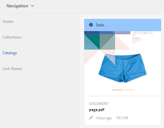

# 카탈로그 프로듀서{#catalog-producer}

AEM Assets에서 Catalog Producer를 사용하여 디지털 에셋을 사용하여 제품 카탈로그를 생성하는 방법을 살펴볼 수 있습니다.

Adobe Experience Manager(AEM) Assets Catalog Producer를 사용하면 InDesign 응용 프로그램에서 가져온 InDesign 템플릿을 사용하여 브랜드 제품의 카탈로그를 만들 수 있습니다. InDesign 템플릿을 가져오려면 먼저 AEM Assets을 InDesign 서버와 통합합니다.

## InDesign 서버 {#integrating-with-indesign-server}과 통합

통합 프로세스의 일부로 InDesign 통합에 적합한 **DAM 자산 업데이트** 작업 과정을 구성합니다. 또한 InDesign 서버에 대한 프록시 워커를 구성합니다. 자세한 내용은 [InDesign Server](/help/assets/indesign.md)과 AEM Assets 통합을 참조하십시오.

>[!NOTE]
>
>InDesign 파일을 AEM Assets으로 가져오기 전에 파일에서 InDesign 템플릿을 생성할 수 있습니다. 자세한 내용은 [파일 및 템플릿 작업](https://helpx.adobe.com/indesign/using/files-templates.html)을 참조하십시오.
>
>InDesign 템플릿의 요소를 XML 태그에 매핑할 수 있습니다. 카탈로그 프로듀서에서 템플릿 속성을 사용하여 제품 속성을 매핑할 때 매핑된 태그가 속성으로 표시됩니다. InDesign 파일의 XML 태그 지정에 대해 알아보려면 [XML용 내용 태그 지정](https://helpx.adobe.com/indesign/using/tagging-content-xml.html)을 참조하십시오.

>[!NOTE]
>
>InDesign 파일(.indd)만 템플릿으로 사용됩니다. 확장명이 .indt인 파일은 지원되지 않습니다.

## 카탈로그 만들기 {#creating-a-catalog}

카탈로그 프로듀서는 PIM(제품 정보 관리) 데이터를 사용하여 템플릿에 표시된 XML 속성과 제품 속성을 매핑합니다. 카탈로그를 만들려면 다음 단계를 수행합니다.

1. 자산 사용자 인터페이스에서 **AEM 로고**&#x200B;를 탭/클릭하고 **자산 > 카탈로그**&#x200B;로 이동합니다.
1. **카탈로그** 페이지의 도구 모음에서 **만들기**&#x200B;를 탭/클릭한 다음 목록에서 **카탈로그**&#x200B;를 선택합니다.
1. **카탈로그 만들기** 페이지에서 카탈로그의 이름과 설명(선택 사항)을 입력하고 태그(있는 경우)를 지정합니다. 카탈로그의 축소판 이미지를 추가할 수도 있습니다.

   

1. **저장**&#x200B;을 탭/클릭합니다. 카탈로그가 생성되었음을 알리는 확인 대화 상자가 표시됩니다. **완료**&#x200B;를 탭/클릭하여 대화 상자를 닫습니다.
1. 만든 카탈로그를 열려면 **카탈로그** 페이지에서 해당 카탈로그를 탭/클릭합니다.

   >[!NOTE]
   >
   >카탈로그를 열려면 이전 단계에서 언급한 확인 대화 상자에서 **열기**&#x200B;를 탭/클릭할 수도 있습니다.

1. 카탈로그에 페이지를 추가하려면 도구 모음에서 **만들기**&#x200B;를 탭/클릭한 다음 **새 페이지** 옵션을 선택합니다.
1. 마법사에서 페이지의 InDesign 템플릿을 선택합니다. 그런 다음 **다음**&#x200B;을 탭/클릭합니다.
1. 페이지의 이름과 선택적 설명을 지정합니다. 태그(있는 경우)를 지정합니다.
1. 도구 모음에서 **만들기**&#x200B;를 탭/클릭합니다. 그런 다음 대화 상자에서 **열기**&#x200B;를 탭/클릭합니다. 제품의 속성은 왼쪽 창에 표시됩니다. InDesign 템플릿에 대한 사전 정의된 속성이 오른쪽 창에 나타납니다.
1. 왼쪽 창에서 제품 속성을 InDesign 템플릿 속성으로 드래그하고 두 속성 간의 매핑을 만듭니다.

   페이지가 실시간으로 표시되는 방식을 보려면 오른쪽 창에서 **미리 보기** 탭을 탭/클릭합니다.

1. 페이지를 더 만들려면 6-9단계를 반복합니다. 다른 제품에 대한 유사한 페이지를 만들려면 페이지를 선택하고 도구 모음에서 **비슷한 페이지 만들기** 아이콘을 탭/클릭합니다.

   

   >[!NOTE]
   >
   >구조가 비슷한 제품의 유사한 페이지만 만들 수 있습니다.

   추가 아이콘을 탭/클릭하고 제품 선택기에서 제품을 선택한 다음 도구 모음에서 **선택**&#x200B;을 탭/클릭합니다.

   

1. 도구 모음에서 **만들기**&#x200B;를 클릭/탭합니다. **완료**&#x200B;를 탭/클릭하여 대화 상자를 닫습니다. 비슷한 페이지가 카탈로그에 포함됩니다.
1. 기존 InDesign 파일을 카탈로그에 추가하려면 도구 모음에서 **만들기**&#x200B;를 탭/클릭하고 **기존 페이지에 추가** 옵션을 선택합니다.
1. InDesign 파일을 선택하고 도구 모음에서 **추가**&#x200B;를 탭/클릭합니다. 그런 다음 **확인**&#x200B;을 탭/클릭하여 대화 상자를 닫습니다.

   카탈로그 페이지에서 참조하는 제품의 메타데이터가 변경되는 경우 변경 내용이 카탈로그 페이지에 자동으로 반영되지 않습니다. 참조하는 카탈로그 페이지의 제품 이미지에 참조되는 제품에 대한 메타데이터가 최신 상태가 아님을 나타내는 **오래된** 배너가 표시됩니다.

   

   제품 이미지가 최신 메타데이터 변경 내용을 반영하도록 하려면 카탈로그 콘솔에서 페이지를 선택하고 도구 모음에서 **업데이트 페이지** 아이콘을 클릭/탭합니다.

   

   >[!NOTE]
   >
   >참조된 제품에 대한 메타데이터를 변경하려면 제품 콘솔(**AEM 로고** > **커머스** > **제품**)로 이동한 다음 제품을 선택합니다. 그런 다음 도구 모음에서 **속성 보기** 아이콘을 클릭/탭하고 자산의 속성 페이지에서 메타데이터를 편집합니다.

1. 카탈로그에서 페이지를 재정렬하려면 도구 모음에서 **만들기** 아이콘을 탭/클릭한 다음 메뉴에서 **병합**&#x200B;을 선택합니다. 마법사의 맨 위에 있는 회전판을 사용하면 페이지를 드래그하여 페이지의 순서를 변경할 수 있습니다. 페이지를 제거할 수도 있습니다.

1. **다음**&#x200B;을 탭/클릭합니다. 기존 InDesign 파일을 표지 페이지로 추가하려면 **표지 페이지 선택** 상자 옆에 있는 **찾아보기**&#x200B;를 탭/클릭하고 표지 페이지 템플릿의 경로를 지정합니다.
1. **저장**&#x200B;을 탭/클릭한 다음 **완료**를 탭/클릭하여 확인 대화 상자를 닫습니다.
**완료** 옵션을 선택하면 .pdf 변환 여부를 선택할 수 있는 대화 상자가 열립니다.
   
내보내기Acrobat(PDF) 옵션을 선택한 경우 indesign 변환 외에   **/jcr:content/** rendition에서 pdf 변환이 생성됩니다. 다운로드 대화 상자에서 &quot;변환&quot; 확인란을 선택하여 모든 변환을 다운로드할 수 있습니다.

1. 만든 카탈로그에 대한 미리 보기를 생성하려면 **카탈로그** 콘솔에서 선택한 다음 도구 모음에서 **미리 보기** 아이콘을 클릭합니다.

   

   미리 보기에서 카탈로그의 페이지를 검토합니다. **닫기**&#x200B;를 탭/클릭하여 미리 보기를 닫습니다.

