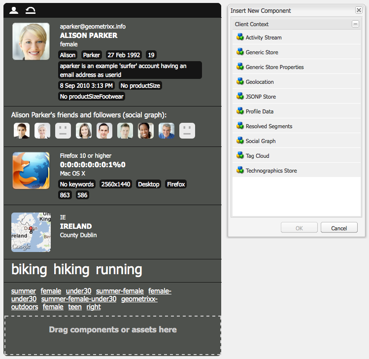
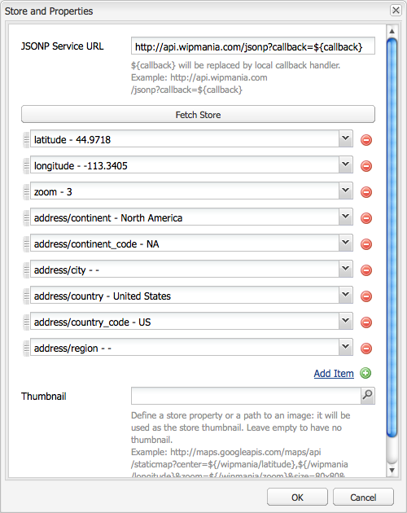

# Client Context{#client-context}

>[!NOTE]
>
>클라이언트 컨텍스트가 ContextHub로 대체되었습니다. 자세한 내용은 관련 []구성-configuring.md) 및 [개발자](/help/sites-developing/contexthub.md) 설명서를 참조하십시오.

클라이언트 컨텍스트는 현재 페이지 및 방문자에 대한 특정 정보를 제공하는 메커니즘입니다. Ctrl- **Alt-c** (windows) 또는 **control-option-c** (Mac)를 사용하여 열 수 있습니다.

게시 및 작성 환경 모두에서 [다음 사항에 대한 정보가](#propertiesavailableintheclientcontext) 표시됩니다.

* 방문자;인스턴스에 따라 특정 정보가 요청되거나 파생됩니다.
* 페이지 태그 및 현재 방문자가 이러한 태그에 액세스한 횟수(특정 태그 위로 마우스를 이동할 때 표시됨).
* 페이지 정보.
* 기술 환경 정보IP 주소, 브라우저 및 화면 해상도 등
* 현재 해결된 모든 세그먼트

아이콘(작성 환경에서만 사용 가능)을 사용하면 클라이언트 컨텍스트의 세부 사항을 구성할 수 있습니다.

* **편집**&#x200B;프로필 속성을 [편집, 추가 또는 제거할 수 있는 새 페이지가 열립니다](#editingprofiledetails).

* **로드**&#x200B;프로필 [목록에서 선택하고 테스트할 프로필을](#loading-a-new-user-profile) 로드할 수 있습니다.

* **재설정**&#x200B;프로필을 [현재 사용자의 프로필로](#resetting-the-profile-to-the-current-user) 재설정할 수 있습니다.

## 사용 가능한 클라이언트 컨텍스트 구성 요소 {#available-client-context-components}

클라이언트 컨텍스트는 편집을 사용하여 선택한 속성에[따라 다음 속성을 표시할 수 있습니다](#adding-a-property-component).

**서퍼 정보** 다음과 같은 클라이언트측 정보를 표시합니다.

* IP **주소**
* **검색 엔진 참조에 사용되는** 키워드
* 사용 중인 **브라우저**
* 사용 중인 **OS** (운영 체제)
* 화면 **해상도**
* 마우스 **X** 위치
* 마우스 **Y** 위치

**활동 스트림** 다양한 플랫폼에서 사용자의 소셜 활동에 대한 정보를 제공합니다.예를 들어 AEM 포럼, 블로그, 등급 등이 있습니다.

**캠페인** 작성자가 캠페인에 대한 특정 경험을 시뮬레이션할 수 있습니다. 이 구성 요소는 일반적인 캠페인 해상도 및 경험 선택을 무시하고 다양한 순열에 대한 테스트를 활성화합니다.

캠페인 해결은 일반적으로 캠페인의 우선 순위 속성을 기반으로 합니다. 일반적으로 경험은 세그먼테이션을 기반으로 선택됩니다.

**장바구니** 제품 항목(제목, 수량, 가격 형식 지정 등), 해결된 프로모션(제목, 메시지 등)을 포함한 장바구니 정보를 보여줍니다. 및 바우처(코드, 설명 등)를 참조하십시오.

또한 장바구니 세션 저장소는 ClientContextCartServlet을 사용하여 해결된 프로모션 변경 사항(세그멘테이션 변경 사항 기반)에 대해 서버에 알립니다.

**범용 저장소** 스토어의 컨텐츠를 표시하는 일반 구성 요소입니다. 일반 저장소 속성 구성 요소의 하위 버전입니다.

범용 스토어는 사용자 지정 방식으로 데이터를 표시하는 JS 렌더러를 사용하여 구성해야 합니다.

**범용 저장소 속성** 스토어의 컨텐츠를 표시하는 일반 구성 요소입니다. 일반 스토어 구성 요소의 상위 버전입니다.

범용 저장소 속성 구성 요소에는 축소판과 함께 구성된 속성을 나열하는 기본 렌더러가 포함되어 있습니다.

**지리적 위치** 클라이언트의 위도 및 경도를 보여줍니다. HTML5 지리적 위치 API를 사용하여 현재 위치에 대한 브라우저를 쿼리합니다. 그러면 방문자에게 팝업이 표시되고, 브라우저가 방문자가 위치를 공유하는 것에 동의하는지 묻는 메시지가 표시됩니다.

Context Cloud에 표시될 때 구성 요소는 Google API를 사용하여 맵을 축소판으로 표시합니다. 구성 요소는 Google API [사용 제한 사항의 적용을 받습니다](https://developers.google.com/maps/documentation/staticmaps/intro#Limits).

>[!NOTE]
>
>AEM 6.1에서 Geolocation 스토어는 더 이상 역 지오코딩 기능을 제공하지 않습니다. 따라서 Geolocation 스토어는 더 이상 도시 이름이나 국가 코드와 같은 현재 위치에 대한 세부 사항을 검색하지 않습니다. 이 저장소 데이터를 사용하는 세그먼트가 제대로 작동하지 않습니다. 지리적 위치 저장소는 위치의 위도와 경도만 포함합니다.

**JSONP 스토어** 설치에 따라 컨텐츠를 표시하는 구성 요소입니다.

JSONP 표준은 동일한 원본 정책을 우회하는 것을 허용하는 JSON을 보완하는 기능으로, 웹 앱이 다른 도메인에 있는 서버와 통신할 수 없도록 합니다. JSON 개체를 함수 호출에서 래핑하여 다른 도메인 `<script>` 에서 로딩할 수 있습니다(동일한 원본 정책에 대해 허용되는 예외 사항).

JSONP 스토어는 다른 스토어와 비슷하지만 현재 도메인에 있는 해당 정보에 대한 프록시를 사용할 필요 없이 다른 도메인에서 오는 정보를 로드합니다. JSONP를 통해 클라이언트 [컨텍스트에 데이터 저장의 예를 참조하십시오](/help/sites-administering/client-context.md#storing-data-in-client-context-via-jsonp).

>[!NOTE]
>
>JSONP 저장소는 쿠키에 정보를 캐시하지 않고 각 페이지 로드 시 해당 데이터를 검색합니다.

**프로필 데이터** 사용자 프로필에 수집된 정보를 보여줍니다. 예를 들어 성별, 연령, 이메일 주소 등이 있습니다.

**해결된 세그먼트** 현재 해결된 세그먼트를 표시합니다(클라이언트 컨텍스트에 표시된 다른 정보에 따라 다름). 이것은 캠페인을 구성할 때 유용합니다.

예를 들어 현재 마우스가 창의 왼쪽 또는 오른쪽 부분 위에 있는지 여부를 나타냅니다. 이 세그먼트는 변경 사항을 즉시 볼 수 있으므로 테스트에 주로 사용됩니다.

**소셜 그래프** 사용자의 친구 및 팔로우어의 소셜 그래프를 표시합니다.

>[!NOTE]
>
>현재 이 데모 기능은 데모 사용자의 프로필 노드에 미리 구성된 데이터 세트를 사용합니다. 예를 들어 다음을 참조하십시오.
>
>`/home/users/geometrixx/aparker@geometrixx.info/profile` => friends 속성

**태그 클라우드** 현재 페이지에 설정된 태그와 사이트를 탐색하는 동안 수집된 태그를 표시합니다. 태그 위로 마우스를 이동하면 현재 사용자가 특정 태그를 포함하는 페이지에 액세스한 횟수가 표시됩니다.

>[!NOTE]
DAM 자산에 설정된 태그는 방문 페이지에 표시되지 않습니다.

**테크노그래픽 저장소** 이 구성 요소는 설치에 따라 다릅니다.

**열람제품** 구매자가 본 제품을 추적합니다. 최근에 본 제품 또는 장바구니에 아직 없는 가장 최근에 본 제품에 대해 쿼리할 수 있습니다.

이 세션 저장소에 기본 클라이언트 컨텍스트 구성 요소가 없습니다.

자세한 내용은 [클라이언트 컨텍스트를 참조하십시오](/help/sites-developing/client-context.md).

>[!NOTE]
페이지 데이터가 더 이상 클라이언트 컨텍스트에 기본 구성 요소로 포함되지 않습니다. 필요한 경우 클라이언트 컨텍스트를 편집하고, **일반 저장소 속성** 구성 요소를 추가한 다음 이 구성 요소를 구성하여 **스토어를** `pagedata`로정의할 수 있습니다.

## 클라이언트 컨텍스트 프로필 변경 {#changing-the-client-context-profile}

클라이언트 컨텍스트를 사용하여 인터랙티브한 방식으로 세부 사항을 변경할 수 있습니다.

* 클라이언트 컨텍스트에 사용되는 프로필을 변경하면 다양한 사용자가 현재 페이지에 대해 보게 될 서로 다른 경험을 볼 수 있습니다.
* 사용자 프로필을 변경할 수 있을 뿐만 아니라 페이지 환경이 다양한 조건에 따라 어떻게 다른지를 확인하기 위해 일부 프로필 세부 사항을 변경할 수도 있습니다.

### 새 사용자 프로필 로드 {#loading-a-new-user-profile}

다음 방법 중 하나를 사용하여 프로필을 변경할 수 있습니다.

* [로드 아이콘 사용](#loading-a-new-visitor-profile-with-the-load-profile-icon)
* [선택 슬라이더 사용](#loadinganewvisitorprofilewiththeselectionslider)

완료되면 프로필 [을 재설정할 수 있습니다](#resetting-the-profile-to-the-current-user).

#### 프로필 로드 아이콘을 사용하여 새 방문자 프로필 로드 {#loading-a-new-visitor-profile-with-the-load-profile-icon}

1. 프로필 로드 아이콘을 클릭합니다.

   

1. 그러면 대화 상자가 열립니다. 여기에서 로드할 프로파일을 선택할 수 있습니다.

   

1. Click **OK** to load.

#### 선택 슬라이더를 사용하여 새 사용자 프로필 로드 {#loading-a-new-user-profile-with-the-selection-slider}

선택 슬라이더를 사용하여 프로파일을 선택할 수도 있습니다.

1. 현재 사용자를 나타내는 아이콘을 두 번 클릭합니다. 선택기가 열리고 화살표를 사용하여 탐색하고 사용 가능한 프로필을 확인합니다.

   

1. 로드할 프로필을 클릭합니다. 세부 사항이 로드되면 선택기 바깥쪽을 클릭하여 닫습니다.

#### 현재 사용자로 프로필 재설정 {#resetting-the-profile-to-the-current-user}

1. 재설정 아이콘을 사용하여 클라이언트 컨텍스트의 프로파일을 현재 사용자의 프로필로 반환합니다.

   

### 브라우저 플랫폼 변경 {#changing-the-browser-platform}

1. 브라우저 플랫폼을 나타내는 아이콘을 두 번 클릭합니다. 선택기가 열리고, 화살표를 사용하여 탐색하고 사용 가능한 플랫폼/브라우저를 확인합니다.

   

1. 로드할 플랫폼 브라우저를 클릭합니다. 세부 사항이 로드되면 선택기 바깥쪽을 클릭하여 닫습니다.

### 지리적 위치 변경 {#changing-the-geolocation}

1. 지리적 위치 아이콘을 두 번 클릭합니다. 확장된 맵이 열립니다. 여기에서 마커를 새 위치로 드래그할 수 있습니다.

   

1. 지도 바깥을 클릭하여 닫습니다.

### 태그 선택 변경 {#changing-the-tag-selection}

1. 클라이언트 컨텍스트의 태그 클라우드 섹션을 두 번 클릭합니다. 대화 상자가 열리고 여기에서 태그를 선택할 수 있습니다.

   

1. 확인을 클릭하여 클라이언트 컨텍스트에 로드합니다.

## 클라이언트 컨텍스트 편집 {#editing-the-client-context}

클라이언트 컨텍스트를 편집하여 특정 속성의 값을 설정(또는 재설정)하거나, 새 속성을 추가하거나, 더 이상 필요하지 않은 속성을 제거할 수 있습니다.

### 속성 세부 사항 편집 {#editing-property-details}

클라이언트 컨텍스트를 편집하여 특정 속성의 값을 설정(또는 재설정)할 수 있습니다. 이를 통해 특정 시나리오를 테스트할 수 있습니다(특히 [세그멘테이션](/help/sites-administering/campaign-segmentation.md) 및 [캠페인](/help/sites-classic-ui-authoring/classic-personalization-campaigns.md)에 유용합니다.).

### 속성 구성 요소 추가 {#adding-a-property-component}

ClientContext 디자인 페이지를 **연 후에는 사용 가능한 구성 요소를 사용하여****완전히 새로운 속성을** 추가할 **수도** 있습니다. 구성 요소는 사이드 킥이나 새 구성 요소 **삽입 대화 상자에 모두 나열되며, 구성 요소는 여기에 있는 구성 요소나 자산을 드래그하여** 에서 두 번 클릭한 후 여는 [새 구성 요소삽입] 대화 상자에서열립니다.

### 속성 구성 요소 제거 {#removing-a-property-component}

ClientContext **디자인 페이지를**&#x200B;연 후 더 이상 필요하지 않은 경우 **속성을 제거할** 수도 있습니다. 여기에는 기본적으로 제공되는 속성이 포함됩니다. **재설정은 제거되면** 다시 설정됩니다.

## JSONP를 통해 클라이언트 컨텍스트에 데이터 저장 {#storing-data-in-client-context-via-jsonp}

JSONP 스토어 컨텍스트 저장소 구성 요소를 사용하여 클라이언트 컨텍스트에 외부 데이터를 추가하려면 이 예를 따르십시오. 그런 다음 해당 데이터의 정보를 기반으로 세그먼트를 만듭니다. 이 예에서는 WIPmania.com에서 제공하는 JSONP 서비스를 사용합니다. 서비스는 웹 클라이언트의 IP 주소를 기반으로 위치 정보를 반환합니다.

이 예에서는 Geometrixx Outdoors 샘플 웹 사이트를 사용하여 클라이언트 컨텍스트에 액세스하고 생성된 세그먼트를 테스트합니다. 페이지가 클라이언트 컨텍스트를 활성화한 경우 다른 웹 사이트를 사용할 수 있습니다. ( [페이지에 클라이언트 컨텍스트 추가를 참조하십시오](/help/sites-developing/client-context.md#adding-client-context-to-a-page).)

### JSONP 스토어 구성 요소 추가 {#add-the-jsonp-store-component}

JSONP 스토어 구성 요소를 클라이언트 컨텍스트에 추가하고 이 구성 요소를 사용하여 웹 클라이언트에 대한 지리적 위치 정보를 검색하고 저장합니다.

1. AEM 작성자 인스턴스에서 Geometrixx Outdoors 사이트의 영어 홈 페이지를 엽니다. ([https://localhost:4502/content/geometrixx-outdoors/en.html](https://localhost:4502/content/geometrixx-outdoors/en.html)).
1. 클라이언트 컨텍스트를 열려면 Ctrl-Alt-c(windows) 또는 Control-option-c(Mac)를 누릅니다.
1. 클라이언트 컨텍스트 상단에 있는 편집 아이콘을 클릭하여 클라이언트 컨텍스트 디자이너를 엽니다.

   

1. JSONP 스토어 구성 요소를 클라이언트 컨텍스트에 드래그합니다.

   

1. 구성 요소를 두 번 클릭하여 편집 대화 상자를 엽니다.
1. [JSONP 서비스 URL] 상자에 다음 URL을 입력한 다음 [스토어 가져오기]를 클릭합니다.

   `https://api.wipmania.com/jsonp?callback=${callback}`

   이 구성 요소는 JSONP 서비스를 호출하고 반환된 데이터에 포함된 모든 속성을 나열합니다. 목록에 있는 속성은 클라이언트 컨텍스트에서 사용할 수 있는 속성입니다.

   

1. 확인을 클릭합니다.
1. Geometrixx Outdoors 홈 페이지로 돌아가서 페이지를 새로 고칩니다. 이제 클라이언트 컨텍스트에 JSONP 스토어 구성 요소의 정보가 포함됩니다.

   

### 세그먼트 만들기 {#create-the-segment}

JSONP 저장소 구성 요소를 사용하여 만든 세션 저장소의 데이터를 사용합니다. 이 세그먼트는 세션 스토어의 위도와 현재 날짜를 사용하여 클라이언트의 위치에 겨울 시간이 있는지 확인합니다.

1. 웹 브라우저에서 도구 콘솔을 엽니다(`https://localhost:4502/miscadmin#/etc`).
1. 폴더 트리에서 도구/세그멘테이션 폴더를 클릭한 다음 새로 만들기 > 새 폴더를 클릭합니다. 다음 속성 값을 지정하고 만들기를 클릭합니다.

   * 이름:mysegments
   * 제목:내 세그먼트

1. 내 세그먼트 폴더를 선택하고 새로 만들기 > 새 페이지를 클릭합니다.

   1. [제목]에 [겨울]을 입력합니다.
   1. 세그먼트 템플릿을 선택합니다.
   1. 만들기를 클릭합니다.

1. 겨울 세그먼트를 마우스 오른쪽 단추로 클릭하고 열기를 클릭합니다.
1. 범용 저장소 속성을 기본 AND 컨테이너로 드래그합니다.

   

1. 구성 요소를 두 번 클릭하여 편집 대화 상자를 열고 다음 속성 값을 지정한 다음 확인을 클릭합니다.

   * 스토어:마니아
   * 속성 이름:latitude
   * 연산자:보다 큼
   * 속성 값:30

1. 스크립트 구성 요소를 동일한 AND 컨테이너로 드래그하고 해당 편집 대화 상자를 엽니다. 다음 스크립트를 추가한 다음 확인을 클릭합니다.

   `3 < new Date().getMonth() < 12`

