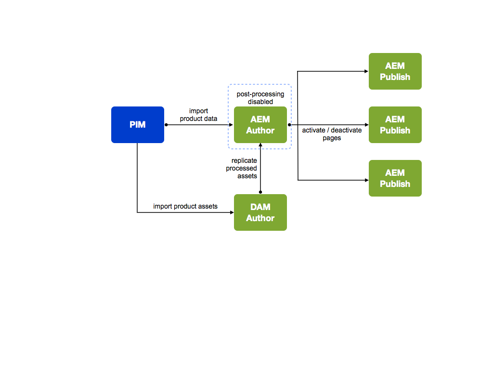

# 개념{#concepts}

통합 프레임워크는 다음과 같은 메커니즘과 구성 요소를 제공합니다.

* eCommerce 엔진에 연결
* aem으로 데이터 가져오기
* 데이터 표시 및 구매자의 응답 수집
* 트랜잭션 세부 사항 반환
* 두 시스템에서 데이터를 검색합니다.

이는 다음 사항을 의미합니다.

* 쇼핑객은 기다릴 필요 없이 등록 및 쇼핑을 할 수 있습니다.
* 가격 변경은 바로 쇼핑객들에게 보일 것이다.
* 필요에 따라 제품을 추가할 수 있습니다.

>[!NOTE]
>
>eCommerce 프레임워크는 다음과 함께 사용할 수 있습니다.
>
>* [Magento](https://www.adobe.io/apis/experiencecloud/commerce-integration-framework/integrations.html#!AdobeDocs/commerce-cif-documentation/master/integrations/02-AEM-Magento.md)
>* [SAP Commerce Cloud](/help/sites-administering/sap-commerce-cloud.md)
>* [Salesforce Commerce Cloud](https://github.com/adobe/commerce-salesforce)

>

>[!CAUTION]
>
>[eCommerce 통합 프레임워크](https://www.adobe.com/solutions/web-experience-management/commerce.html)는 AEM Add-On입니다.
>
>해당 엔진에 따라 영업 담당자가 자세한 내용을 제공할 수 있습니다.

>[!CAUTION]
>
>프레임워크는 프로젝트에 대한 기본 요구 사항을 제공합니다.
>
>프레임워크를 사양에 맞게 조정하기 위해서는 특정 양의 개발 작업이 항상 필요합니다.

>[!CAUTION]
>
>표준 AEM 설치에는 일반 AEM(JCR) 전자 상거래 구현이 포함됩니다.
>
>현재 이것은 데모용으로 사용하거나 요구 사항에 따라 사용자 정의 구현의 기본 기반으로 사용됩니다.

운영을 최적화하기 위해 AEM과 e커머스 엔진은 자체 전문 분야에 집중할 수 있습니다. 두 사람 사이에 실시간으로 정보가 전달된다.예를 들면 다음과 같습니다.

* AEM은 다음을 수행할 수 있습니다.

   * 요청:

      * eCommerce 엔진의 제품 정보.
   * 제공:

      * 제품 정보, 장바구니 및 체크아웃에 대한 사용자 보기.
      * 장바구니 및 체크아웃 정보를 eCommerce 엔진에 제공합니다.
      * 검색 엔진 최적화(SEO).
      * 커뮤니티 기능을 참조하십시오.
      * 비정형 마케팅 인터랙션

* eCommerce 엔진은 다음과 같은 이점을 제공합니다.

   * 제공:

      * 데이터베이스의 제품 정보.
      * 제품 변형 관리.
      * 주문 관리.
      * ERP(Enterprise Resource Planning).
      * 제품 정보 내에서 검색합니다.
   * 프로세스:

      * 장바구니.
      * 체크아웃.
      * 주문 이행.

>[!NOTE]
>
>정확한 세부 사항은 eCommerce 엔진 및 프로젝트 구현에 따라 다릅니다.

통합 레이어를 사용할 수 있도록 다양한 기본 AEM 구성 요소가 제공됩니다. 현재 다음과 같습니다.

* 제품 정보
* 장바구니
* 체크 아웃
* 내 계정

다양한 검색 옵션도 사용할 수 있습니다.

## 아키텍처 {#architecture}

통합 프레임워크는 API를 제공하여 기능을 표현할 수 있는 다양한 구성 요소 및 연결 메서드의 예를 제공합니다.

프레임워크에서는 다음과 같은 기능에 액세스할 수 있습니다.

### 구현 {#implementations}

AEM eCommerce는 eCommerce 엔진을 사용하여 구현됩니다.

* 전자 상거래 통합 프레임워크는 eCommerce 엔진을 AEM과 쉽게 통합할 수 있도록 구축되었습니다. 내장된 e커머스 엔진은 제품 데이터, 장바구니, 체크아웃 및 주문 처리를 제어하는 한편, AEM은 데이터 표시 및 마케팅 캠페인을 제어합니다.

>[!NOTE]
>
>표준 AEM 설치에는 일반 AEM(JCR) 전자 상거래 구현이 포함됩니다.
>
>현재 이것은 데모용으로 사용하거나 요구 사항에 따라 사용자 정의 구현의 기본 기반으로 사용됩니다.
>
>AEM eCommerce는 JCR을 기반으로 하는 범용 개발을 사용하여 AEM 내에서 구현됩니다.
>
>* API의 사용을 설명하기 위한 AEM 기본 전자 상거래 독립형 예입니다. 기존 데이터 표시 및 마케팅 캠페인과 함께 제품 데이터, 장바구니 및 결제를 제어하는 데 사용할 수 있습니다. 이 경우 제품 데이터베이스가 AEM의 기본 저장소에 저장됩니다(Adobe의 [JCR](https://docs.adobe.com/content/docs/en/spec/jcr/2.0/index.html) 구현).
>
>  
표준 AEM 설치에는 [일반 eCommerce 구현](/help/sites-administering/generic.md)의 기본 사항이 포함되어 있습니다.

### 상거래 공급자 {#commerce-providers}

상거래 엔진의 데이터를 AEM eCommerce 사이트로 가져올 때 상거래 공급자가 데이터를 Importer에 제공하는 데 사용됩니다. 한 상거래 공급자가 여러 가져오기 도구를 지원할 수 있습니다.

상거래 공급자는 다음 중 하나로 사용자 지정된 AEM 코드입니다.

* 백엔드 상거래 엔진에 대한 인터페이스
* JCR 저장소 위에 상거래 시스템 구현

현재 AEM에 대한 두 가지 상거래 공급자를 사용할 수 있습니다.

* geometrixx hybris용 one
* geometrixx-generic(JCR)의 또 다른 기능

일반적으로 프로젝트는 PIM 및 제품 데이터 스키마에 대한 고유한 사용자 지정 상거래 공급자를 개발해야 합니다.

>[!NOTE]
>
>geometrixx 가져오기는 CSV 파일을 사용합니다.구현 위의 주석에 허용된 사용자 지정 속성 포함) 스키마에 대한 설명이 있습니다.

[ProductServicesManager](https://helpx.adobe.com/experience-manager/6-5/sites/developing/using/reference-materials/javadoc/com/adobe/cq/commerce/pim/api/ProductServicesManager.html)는 [OSGi](/help/sites-deploying/configuring.md#osgi-configuration-settings)를 통해 [ProductImporter](https://helpx.adobe.com/experience-manager/6-5/sites/developing/using/reference-materials/javadoc/com/adobe/cq/commerce/pim/api/ProductImporter.html) 및 [CatalogBlueprintImporter](https://helpx.adobe.com/experience-manager/6-5/sites/developing/using/reference-materials/javadoc/com/adobe/cq/commerce/pim/api/CatalogBlueprintImporter.html) 인터페이스의 구현 목록을 유지 관리합니다. 이러한 항목은 가져오기 마법사의 **Importer/Commerce Provider** 드롭다운 필드에 나열되어 있습니다(`commerceProvider` 속성을 이름으로 사용).

드롭다운에서 특정 가져오기/상거래 공급자를 사용할 수 있는 경우 필요한 보충 데이터는 다음 중 하나에서 정의(가져오기 유형에 따라)해야 합니다.

* `/apps/commerce/gui/content/catalogs/importblueprintswizard/importers`
* `/apps/commerce/gui/content/products/importproductswizard/importers`

해당 `importers` 폴더 아래의 폴더는 importer 이름과 일치해야 합니다.예를 들면 다음과 같습니다.

* `.../importproductswizard/importers/geometrixx/.content.xml`

소스 가져오기 파일의 형식은 가져오기가 정의합니다. 또는 가져오기를 사용하여 상거래 엔진에 대한 연결(예: WebDAV 또는 http)을 설정할 수 있습니다.

## 역할 {#roles}

통합 시스템은 데이터를 유지하기 위해 다음 역할을 충족합니다.

* PIM(제품 정보 관리) 사용자 유지:

   * 제품 정보.
   * 분류, 분류, 승인.
   * 디지털 에셋 관리와 인터랙션
   * 가격 - 일반적으로 이것은 ERP 시스템에서 비롯되며 상거래 시스템에서 명시적으로 유지되지 않습니다.

* 유지 관리하는 작성자/마케팅 관리자:

   * 모든 채널에 적합한 마케팅 콘텐츠
   * 프로모션.
   * 바우처.
   * 캠페인.

* Surfer/Shopper who:

   * 제품 정보를 봅니다.
   * 장바구니에 품목을 넣습니다.
   * 주문을 확인합니다.
   * 주문 처리 예상

실제 위치는 구현에 따라 달라질 수 있지만예를 들어, 일반 또는 eCommerce 엔진과 함께

## 제품 {#products}

### 제품 데이터 대 마케팅 데이터 {#product-data-versus-marketing-data}

#### 구조적 대 마케팅 카테고리 {#structural-versus-marketing-categories}

다음 두 카테고리가 차별화될 수 있는 경우 의미 있는 구조(`cq:Page` 노드 트리)를 사용하여 URL을 명확히 할 수 있으므로 클래식 AEM 컨텐츠 관리에 매우 가까운 URL을 파악할 수 있습니다.

* *구조 *종류

   *제품*;을(를) 정의하는 카테고리 트리예를 들면 다음과 같습니다.

   `/products/mens/shoes/sneakers`

* *마케팅* 카테고리

   *제품의 다른 모든 카테고리는*;에 속할 수 있습니다.예를 들면 다음과 같습니다.

   `/special-offers/christmas/shoes`)

### 제품 데이터 {#product-data}

제품에 대한 다양한 정보를 보유해야 합니다.

제품 데이터는 다음과 같습니다.

* aem(일반)에서 바로 유지 관리됩니다.
* 유지 관리되고 AEM에서 사용할 수 있게 되었습니다.

   데이터 유형에 따라 필요에 따라 [동기화된](#catalog-maintenance-data-synchronization)이거나 직접 액세스되는 경우;예를 들어 제품 가격과 같은 매우 휘발성 및 중요 데이터는 항상 최신 상태로 유지되도록 모든 페이지 요청의 ecommerce 엔진에서 검색됩니다.

두 경우 모두 제품 데이터를 AEM에 입력/가져온 경우 **제품** 콘솔에서 볼 수 있습니다. 다음은 제품의 카드 및 목록 보기 정보입니다.

* 이미지
* SKU 코드
* 마지막 수정 날짜

### 제품 변형 {#product-variants}

적절한 제품에 대한 변형에 대한 정보도 저장할 수 있습니다. 예를 들어 의류 항목의 경우 사용할 수 있는 다른 색상이 변형으로 보유됩니다.

### 제품 특성 {#product-attributes}

각 제품에 대한 개별 속성은 사용 중인 eCommerce 엔진 및 AEM 구현에 따라 달라질 수 있습니다. 제품 페이지를 보거나 제품 정보를 편집할 때 적절한 방법으로 사용할 수 있으며 다음이 포함될 수 있습니다.

* **이미지**

   제품의 이미지입니다.

* **제목**

   제품 이름입니다.

* **설명**

   제품에 대한 텍스트 설명입니다.

* **태그**

   관련 제품을 그룹화하는 데 사용되는 태그입니다.

* **기본 자산 범주**

   자산에 대한 기본 카테고리.

* **ERP 데이터**

   ERP(Enterprise Resource Planning) 정보.

   * **SKU**

      SKU(Stock-Keeping Unit) 정보.

   * **색상**
   * **크기**
   * **가격**

      제품의 단가입니다.

* **요약**

   제품 기능에 대한 요약입니다.

* **기능**

   제품 기능에 대한 자세한 정보입니다.

### 제품 자산 {#product-assets}

개별 제품에 대해 다양한 자산을 보유할 수 있습니다. 일반적으로 이미지 및 비디오가 포함됩니다.

## 카탈로그 {#catalogs}

카탈로그는 고객이 손쉽게 관리하고 표시할 수 있도록 제품 데이터를 그룹화합니다. 종종 카탈로그는 다른 많은 것들 중에서 언어, 지리적 영역, 브랜드, 계절, 취미, 스포츠 등과 같은 특성에 따라 짜여져 있다.

### 카탈로그 구조 {#catalog-structure}

#### 여러 언어로 된 카탈로그 {#catalogs-in-multiple-languages}

AEM은 여러 언어로 제품 컨텐츠를 지원합니다. 데이터를 요청할 때 통합 프레임워크는 현재 트리에서 언어를 검색합니다(예: `/content/geometrixx-outdoors/en_US` 아래의 페이지에 대해 `en_US`).

다중 언어 저장소의 경우 각 언어 트리에 대한 카탈로그를 개별적으로 가져올 수 있습니다(또는 [MSM](/help/sites-administering/msm.md))를 통해 복사할 수 있습니다.

#### 여러 브랜드에 대한 카탈로그 {#catalogs-for-multiple-brands}

언어와 마찬가지로 대형 다국적 기업은 다양한 브랜드의 요구 사항을 충족해야 합니다.

#### 태그별 카탈로그 {#catalogs-by-tags}

태그를 사용하여 제품을 카탈로그로 그룹화할 수도 있습니다. 계절별 오퍼와 같은 동적 카탈로그에 사용할 수 있습니다.

### 카탈로그 설정(초기 가져오기) {#catalog-setup-initial-import}

구현에 따라 다음 위치에서 기본 카탈로그에 필요한 제품 데이터를 AEM으로 가져올 수 있습니다.

* CSV 파일(일반 구현용)
* eCommerce 엔진

### 카탈로그 유지 관리(데이터 동기화) {#catalog-maintenance-data-synchronization}

제품 데이터에 대한 추가 변경은 불가피 합니다.

* 일반 구현의 경우 [제품 편집기](/help/sites-administering/generic.md#editing-product-information)로 관리할 수 있습니다.
* [eCommerce 엔진을 사용하는 경우 변경 사항을 동기화해야 합니다.](#data-synchronization-with-an-ecommerce-engine-ongoing)

#### eCommerce 엔진과의 데이터 동기화(진행 중) {#data-synchronization-with-an-ecommerce-engine-ongoing}

처음 가져온 후 제품 데이터에 대한 변경 사항이 불가피합니다.

eCommerce 엔진을 사용하는 경우 제품 데이터가 계속 유지되고 AEM에서 사용 가능해야 합니다. 업데이트가 수행되면 이 제품 데이터를 동기화해야 합니다.

데이터 유형에 따라 달라질 수 있습니다.

* [정기적인 동기화는 변경 사항](/help/sites-developing/sap-commerce-cloud.md#product-synchronization-and-publishing)의 데이터 피드와 함께 사용됩니다.

   이 외에도 익스프레스 업데이트에 대한 특정 업데이트를 선택할 수 있습니다.

* 가격 정보와 같은 매우 휘발성 데이터는 항상 최신 상태로 유지되도록 각 페이지 요청에 대해 상거래 엔진에서 검색됩니다.

### 카탈로그 - 성능 및 비율 {#catalogs-performance-and-scaling}

eCommerce 엔진(PIM)에서 제품 수가 많은 대형 카탈로그(일반적으로 10만 개 초과)를 가져오면 노드 수가 많기 때문에 시스템에 영향을 줄 수 있습니다. 제품에 연결된 자산(예: 제품 이미지)이 있는 경우 제작 인스턴스를 느리게 할 수도 있습니다. 이는 이러한 에셋의 사후 처리가 CPU와 메모리 사용량이 많기 때문입니다.

다음과 같은 문제를 해결할 수 있는 다양한 전략이 있습니다.

* [Bucketing](#bucketing)  - 많은 수의 노드를 처리하기 위해
* [자산 게시 처리를 전용 인스턴스로 오프로드](#offload-asset-post-processing-to-a-dedicated-instance)
* [제품 데이터만 가져오기](#only-import-product-data)
* [조정 및 일괄 저장 가져오기](#import-throttling-and-batch-saves)
* [성능 테스트](#performance-testing)
* [성능 - 기타](#performance-miscellaneous)

#### {#bucketing} 버켓팅

JCR 노드에 많은 직접 하위 노드(예: 1000 이상)가 있는 경우 성능에 영향을 미치지 않도록 버킷(phantom 폴더)이 필요합니다. 가져올 때 알고리즘에 따라 생성됩니다.

이러한 버킷은 카탈로그 구조에 도입된 팬텀 폴더 형태를 취하지만 공개 URL에서 명확히 드러나지 않도록 구성할 수 있습니다.

#### 자산 게시 처리를 전용 인스턴스 {#offload-asset-post-processing-to-a-dedicated-instance}로 오프로드

이 시나리오는 작성자 인스턴스 2개를 설정하는 것입니다.

1. 기본 작성자 인스턴스

   PIM에서 제품 데이터를 가져옵니다. 자산 경로에 대한 사후 처리가 비활성화되어 있습니다.

1. 전용 DAM 작성자 인스턴스

   PIM에서 제품 에셋을 가져오고 사후 처리 중인 다음 마스터 작성자 인스턴스에 다시 복제하여 사용할 수 있습니다.

#### 제품 데이터 {#only-import-product-data}만 가져오기

제품을 가져올 자산(이미지)이 포함되지 않은 경우 자산 사후 처리의 영향을 받지 않고 제품 데이터를 가져올 수 있습니다.

<!--delete
#### Import Throttling and Batch Saves {#import-throttling-and-batch-saves}

[Import throttling](/help/sites-deploying/scaling.md#import-throttling) and [batch saves](/help/sites-deploying/scaling.md#batch-saves) are two general [scaling](/help/sites-deploying/scaling.md) mechanisms that can help when importing large volumes of data.-->

#### 성능 테스트 {#performance-testing}

성능 테스트는 AEM eCommerce 구현에서 고려해야 합니다.

* 작성자 환경:

   백그라운드(예: 가져오기) 활동은 일반 사용자 활동(예: 페이지 편집)과 동시에 발생할 수 있으며, 온라인 작성자가 보는 성능 중 우선 순위가 더 높은 경우 프런트 엔드 성능이 (일반적으로) 중요하더라도 라이브 결정을 차단할 수 있는 좌절을 초래할 수 있습니다.

* 게시 환경:

   복제는 컨텐츠가 신속하고 안전하게 게시되도록 보장하는 중요한 프로세스입니다. 이는 작성자가 게시할 컨텐츠를 그룹화하는 방식의 영향을 받을 수 있습니다.

* 프런트 엔드:

   프런트 엔드와 캐시 무효화가 혼합되면 성능이 놀라울 정도로 떨어질 수 있습니다. 테스트를 통해 이러한 문제를 방지할 수 있습니다.

이 성능 테스트를 수행하려면 대상에 대한 지식과 분석이 필요합니다.

* 콘텐트 볼륨

   * 자산
   * 현지화, I18필요 제품 및 SKU

* 사용자 활동:

   * Bulk edition
   * 일괄 게시
   * 강력한 검색 요청

* 백그라운드 프로세스

   * 가져오기
   * 동기화 업데이트(예: 가격)

* 유지 관리 요구 사항(백업, Tar PM 최적화, 데이터 저장소 가비지 수집 등)

#### 성능 - 기타 {#performance-miscellaneous}

모든 구현에 대해 다음 사항을 염두에 둘 수 있습니다.

* 제품, 재고 관리 단위 및 카테고리는 수가 많을 수 있으므로, 컨텐츠를 모델링하는 데 가능한 최소 노드 수를 사용해 보십시오.

   노드가 많을수록 컨텐츠가 유연해집니다(예: parsys). 그러나 모든 것이 상쇄되므로(예:) 30K 제품을 조작할 때 기본적으로 개별 유연성이 필요합니까?

* 복제할 수 있는 만큼(로컬라이제이션 참조) 또는 복제할 때 복제할 노드 수에 대해 생각해 보십시오.
* 쿼리 최적화를 준비하기 위해 가능한 한 컨텐츠에 태그를 지정해 보십시오.

   예:

   `/content/products/france/fr/shoe/reebok/pump/46 SKU`

   컨텐츠 수준당 하나의 태그를 포함해야 합니다(예: 국가, 언어, 카테고리, 브랜드, 제품). 검색 중

   `//element(*,my:Sku)[@country=’france’ and @language=’fr’`

   및

   `@category=’shoe’ and @brand=’reebok’ and @product=’pump’]`

   검색 속도가

   `/jcr:root/content/france/fr/shoe/reebok/pump/element(*,my:Sku)`

* 기술 스택에서 매우 요인 있는 컨텐츠 액세스 모델 및 서비스를 계획하십시오. 이 방법은 일반적인 우수 사례이지만, 최적화 단계에서 자주 읽히는 데이터의 애플리케이션 캐시를 추가합니다(번들 캐시를 채우지 않으려는 경우).

   예를 들어 속성 관리는 제품 가져오기를 통해 업데이트되는 데이터에 대해 우려하므로 캐시하기에 매우 좋은 후보 중 하나입니다.
* [프록시 페이지](/help/sites-administering/concepts.md#proxy-pages)의 사용을 고려합니다.

### 카탈로그 섹션 페이지 {#catalog-section-pages}

카탈로그 섹션에는 다음과 같은 기능이 제공됩니다.

* 카테고리에 대한 소개(이미지 및/또는 텍스트);이 기능은 배너 및 Teaser에서 특별 오퍼를 홍보할 때도 사용할 수 있습니다.
* 해당 카테고리의 개별 제품에 대한 링크
* 다른 카테고리에 대한 링크

### 제품 페이지 {#product-pages}

제품 페이지는 개별 제품에 대한 포괄적인 정보를 제공합니다. 동적 업데이트도 반영됩니다.예를 들어 eCommerce 엔진에 등록된 가격 변경입니다.

제품 페이지는 **제품** 구성 요소를 사용하는 AEM 페이지입니다.예를 들어 **커머스 제품** 템플릿 내에서 다음을 수행합니다.

제품 구성 요소는 다음을 제공합니다.

* 일반 제품 정보;텍스트 및 이미지 포함
* 가격;일반적으로 페이지가 표시/새로 고쳐질 때마다 eCommerce 엔진에서 검색됩니다.
* 제품 변형 정보;예: 색상 및 크기.

이 정보를 통해 구매자는 장바구니에 품목을 추가할 때 다음 사항을 선택할 수 있습니다.

* 색상 및 크기 변형
* 수량

#### 제품 랜딩 페이지 {#product-landing-pages}

주로 정적 정보를 제공하는 AEM 페이지입니다.예를 들어 기본 제품 페이지에 대한 링크가 포함된 소개 및 개요를 제공합니다.

### 제품 구성 요소 {#product-component}

**제품** 구성 요소는 필요한 메타데이터를 제공하는 상위 페이지가 있는 모든 페이지에 추가할 수 있습니다(예: `cartPage` 및 `cartObject` 경로). 데모 사이트의 Geometrixx Outdoors에서 이 값은 `UserInfo.jsp`에서 제공합니다.

개별 요구 사항에 따라 **제품** 구성 요소를 사용자 정의할 수도 있습니다.

### 프록시 페이지 {#proxy-pages}

프록시 페이지는 저장소 구조를 간소화하고 대규모 카탈로그에 대한 저장소를 최적화하는 데 사용됩니다.

카탈로그를 만들면 AEM 내에서 업데이트하고 사용자 지정할 수 있는 각 제품에 대한 개별 구성 요소를 제공하므로 제품당 10개의 노드가 사용됩니다. 카탈로그에 수백 또는 수천 개의 제품이 포함되어 있는 경우 이러한 많은 수의 노드가 문제가 될 수 있습니다. 문제를 방지하기 위해 프록시 페이지를 사용하여 카탈로그를 만들 수 있습니다.

프록시 페이지는 실제 제품 콘텐트를 포함하지 않는 2노드 구조( `cq:Page` 및 `jcr:content`)를 사용합니다. 요청 시 제품 데이터 및 템플릿 페이지를 참조하여 컨텐츠가 생성됩니다.

그러나, 교역이 있다. AEM 내에서 제품 정보를 사용자 정의할 수 없으며 사이트에 대해 정의된 표준 템플릿이 사용됩니다.

>[!NOTE]
>
>프록시 페이지가 없는 큰 카탈로그를 가져오는 경우 문제가 발생하지 않습니다.
>
>한 방법에서 다른 방법으로도 언제든지 변환할 수 있습니다. 카탈로그의 하위 섹션을 변환할 수도 있습니다.

## 프로모션 및 바우처 {#promotions-and-vouchers}

### 바우처 {#vouchers}

바우처는 구매자를 유도하여 구매를 하도록 유도하거나 고객의 충성도를 보상하는 데 도움을 주는 시험되고 테스트된 방법입니다.

* 바우처 제공:

   * 바우처 코드(구매자가 장바구니에 입력).
   * 할인권 레이블(구매자가 장바구니에 입력한 후 표시됨).
   * 프로모션 경로(바우처가 적용되는 작업을 정의합니다.)

* 외부 상거래 엔진은 바우처를 제공할 수도 있습니다.

AEM:

* 바우처는 웹 사이트 콘솔에서 만들거나 편집하는 페이지 기반 구성 요소입니다.
* **바우처** 구성 요소는 다음을 제공합니다.

   * 바우처 관리를 위한 렌더러현재 장바구니에 있는 바우처가 표시됩니다.
   * 바우처를 관리(추가/제거)하기 위한 편집 대화 상자(양식)입니다.
   * 장바구니에 바우처를 추가/제거하는 데 필요한 작업.

* 바우처는 자체 설정 및 해제 날짜/시간을 가지고 있지 않지만 상위 캠페인의 일정을 사용합니다.

>[!NOTE]
>
>AEM은 **바우처**&#x200B;라는 용어를 사용하며, 이것은 **쿠폰**&#x200B;이라는 용어와 같습니다.

### 프로모션 {#promotions}

프로모션은 바우처와 함께 다음과 같은 시나리오를 실현할 수 있습니다.

* 한 회사는 수공예 사용자 목록인 종업원을 위한 맞춤 가격을 제공한다.
* 장기 고객은 모든 주문에 대해 할인 혜택을 받습니다.
* 잘 정의된 기간 동안 제공되는 판매 가격.
* 이전 주문이 특정 금액을 초과하면 고객은 바우처를 받습니다.
* *product-X*&#x200B;을(를) 구매하는 고객은 *product-Y*(두 제품)에 대한 할인 혜택을 제공합니다.

판촉 행사는 보통 제품 정보 관리자가 유지 관리하는 것이 아니라 마케팅 관리자가 관리합니다.

* 프로모션은 웹 사이트 콘솔에서 만들거나 편집하는 페이지 기반 구성 요소입니다. &quot;
* 판촉 공급:

   * 우선 순위
   * 프로모션 처리기 경로

* 판촉 행사를 캠페인에 연결하여 온/오프 날짜/시간을 정의할 수 있습니다.
* 프로모션을 경험에 연결하여 세그먼트를 정의할 수 있습니다.
* 경험에 연결되지 않은 프로모션은 자체적으로 실행되지는 않지만 바우처를 통해 실행할 수 있습니다.
* 프로모션 구성 요소에는 다음이 포함됩니다.

   * 판촉 관리를 위한 렌더러 및 대화 상자
   * 프로모션 핸들러와 관련된 구성 매개 변수를 렌더링 및 편집하는 하위 구성 요소

AEM에서 프로모션은 [캠페인 관리](/help/sites-authoring/personalization.md)에도 통합됩니다.

* [캠페인](/help/sites-authoring/personalization.md)이 설정/해제 시간을 지정합니다.
* [캠페인 내 ](/help/sites-authoring/personalization.md) ** 경험은

판촉 행사는 경험에서 또는 캠페인에서 직접 가질 수 있습니다.

* 판촉 행사가 경험에서 개최되면 자동으로 대상 세그먼트에 적용할 수 있습니다.

   예를 들어 geometrixx-outdoors 샘플 사이트에서 판촉 행사는 다음과 같습니다.

   `/content/campaigns/geometrixx-outdoors/big-spender/ordervalueover100/free-shipping`

   가 경험에 있으므로 세그먼트( `ordervalueover100`)가 확인될 때마다 자동으로 실행됩니다.

* 판촉 행사가 경험(캠페인에만 해당) 내에 나타나지 않으면 대상에 자동으로 적용할 수 없습니다. 하지만 구매자가 카트에 바우처를 입력하고 바우처가 프로모션을 참조하는 경우에도 여전히 실행할 수 있습니다.

   예를 들어 판촉 행사는 다음과 같습니다.

   `/content/campaigns/geometrixx-outdoors/article/10-bucks-off`

   가 경험 밖에 있으므로 자동으로 실행되지 않습니다(예:를 참조하십시오.) 하지만 아티클 캠페인 내 여러 경험에서 찾을 수 있는 바우처에 의해 참조됩니다. 이러한 바우처 코드를 장바구니에 입력하면 프로모션이 시작됩니다.

>[!NOTE]
>
>[hybris ](https://www.hybris.com/modules/promotion) 판촉 및  [hybris는 장바구니에 영향을 주고 가격과 관련된 모든 것을 ](https://www.hybris.com/en/modules/voucher) 보증합니다. 특정 마케팅 컨텐츠(예: 배너 등)를 홍보하는 것은 하이브리스 프로모션의 일부가 아닙니다.

## 개인화 {#personalization}

### 고객 등록 및 계정 {#customer-registration-and-accounts}

구매자가 등록하면 AEM과 eCommerce 엔진 간에 계정 세부 정보를 동기화해야 합니다. 중요한 데이터는 독립적으로 유지되지만 프로필은 공유됩니다.

정확한 메커니즘은 시나리오에 따라 달라질 수 있습니다.

1. 사용자 계정은 두 시스템 모두에 있습니다.

   1. 필요한 작업이 없습니다.

1. 사용자 계정은 AEM에만 있습니다.

   1. 사용자가 동일한 계정 ID와 임의의 암호를 사용하여 전자 상거래 엔진에서 생성되며 이 암호는 AEM에 저장됩니다.
   1. AEM은 첫 번째 호출 시 e커머스 엔진에 로그인하려고 할 때(예: 제품 페이지가 요청되고 e커머스 엔진이 가격에 대해 참조될 때) 무작위 암호가 필요합니다. 이 문제는 AEM 로그인 후 발생하므로 암호를 사용할 수 없습니다.

1. 사용자 계정은 eCommerce 엔진에만 있습니다.

   1. 계정은 계정 ID와 암호가 동일한 AEM에서 생성됩니다.

eCommerce 엔진을 사용하는 경우 AEM은 계정 ID와 암호(선택적으로 사용자 그룹)만 저장합니다. 기타 모든 정보는 eCommerce 엔진에 저장됩니다.

>[!NOTE]
>
>eCommerce 엔진을 사용하는 경우 AEM 인스턴스에 로그인하는 사용자에 대해 만들어진 계정이 해당 엔진과 통신하는 다른 AEM 인스턴스로 복제되는지(예: 워크플로우를 통해) 확인해야 합니다.
>
>그렇지 않으면 이러한 다른 AEM 인스턴스는 엔진에서 동일한 사용자에 대한 계정을 만들려고 합니다. 엔진에서 `DuplicateUidException`이(가) 오며 이러한 작업이 실패합니다.

### 고객 등록 {#customer-sign-up}

쇼핑객이 장바구니에 액세스하려면 종종 등록이 필요합니다. 고객별 계정을 만들 수 있도록 등록(계정 만들기)이 필요합니다.

>[!NOTE]
>
>익명의 장바구니 및 체크아웃도 지원됩니다.

### 고객 로그인 {#customer-sign-in}

등록 후 구매자는 자신의 계정을 사용하여 로그인할 수 있으므로 행동을 추적하고 주문을 이행하도록 할 수 있습니다.

### 단일 사인온 {#single-sign-on}

SSO(Single Sign-On)가 제공되므로 작성자는 두 번 로그인하지 않고도 AEM 및 eCommerce 시스템에서 모두 알 수 있습니다.

### myAccount {#myaccount}

eCommerce 엔진의 거래 데이터는 구매자에 대한 개인 정보와 결합됩니다. AEM에서는 이 데이터 중 일부를 프로필 데이터로 사용합니다. AEM에서 양식의 동작은 정보를 전자 상거래 엔진에 다시 기록합니다.

계정 정보를 쉽게 관리할 수 있는 페이지가 있습니다. geometrixx 페이지의 맨 위에 있는 **내 계정**&#x200B;을 클릭하거나 `/content/geometrixx-outdoors/en/user/account.html`로 이동하여 액세스할 수 있습니다.

### 주소록 {#address-book}

사이트에 다양한 주소를 저장해야 합니다.배달, 청구 및 대체 주소를 포함합니다. 기본 주소 형식을 기반으로 양식을 사용하거나 AEM에서 제공하는 주소록 구성 요소를 사용할 수 있습니다.

이 주소록 구성 요소를 사용하면 다음을 수행할 수 있습니다.

* 책의 주소 편집
* 배송 주소록에서 주소를 선택합니다.
* 청구 주소록에서 주소 선택

원하는 주소를 기본값으로 선택할 수 있습니다.

주소록 구성 요소는 **주소록**&#x200B;을 클릭하거나 `/content/geometrixx-outdoors/en/user/account/address-book.html`으로 이동하여 **내 계정** 페이지에서 연결할 수 있습니다.

**새 주소 추가...를 클릭할 수 있습니다.**&#x200B;을(를) 사용하여 주소록에 새 주소를 추가합니다. 입력한 다음 **주소 추가**&#x200B;를 클릭합니다.

>[!NOTE]
>
>주소록에 여러 개의 주소를 입력할 수 있습니다.

장바구니를 체크아웃할 때 주소록이 사용됩니다.

주소는 `user_home/profile/addresses` 아래로 유지됩니다.
예를 들어 Alison Parker의 경우 /home/users/geometrixx/aparker@geometrixx.info/profile/address 아래에 있습니다.

원하는 주소를 기본값으로 선택할 수 있습니다. 이 정보는 구매자의 프로필에 주소가 아닌 그대로 유지됩니다. 프로필 속성 `address.default`은(는) 값에 대해 선택한 주소의 경로로 설정됩니다.

### 고객별 가격 {#customer-specific-pricing}

eCommerce 엔진은 컨텍스트(기본적으로 구매자 정보)를 사용하여 보유하려는 가격을 결정한 다음 올바른 정보를 다시 AEM에 제공합니다.

## 장바구니 및 주문 {#shopping-cart-and-orders}

쇼핑할 때 구매자는 제품 페이지를 탐색하고 장바구니에 놓을 항목을 선택합니다. 결제를 진행할 때 주문을 제출할 수 있습니다.

### 익명의 쇼핑 고객 {#anonymous-shoppers}

익명의 고객은 다음을 수행할 수 있습니다.

* 제품 보기
* 장바구니에 제품 추가
* 주문 시 체크 아웃 수행

>[!NOTE]
>
>인스턴스 주소 정보 또는 고객 등록의 구성에 따라 결제 전에 이 정보가 필요할 수 있습니다.

### 등록된 구매자 {#registered-shoppers}

등록된 고객은 다음을 수행할 수 있습니다.

* 계정에 로그인
* 제품 보기
* 장바구니에 제품 추가
* 주문 시 체크 아웃 수행
* 이전 주문 보기 및 추적

### 장바구니 컨텐츠 개요 {#shopping-cart-content-overview}

장바구니는 다음과 같은 이점을 제공합니다.

* 선택한 항목 개요
* 선택한 항목에 대한 제품 페이지로 링크
* 기능:

   * 개별 항목의 수/수량을 업데이트합니다.
   * 개별 항목 제거

장바구니는 사용되는 엔진에 따라 저장됩니다.

* AEM 일반은 카트를 쿠키에 저장합니다.
* 특정 eCommerce 엔진은 세션에 카트를 저장할 수 있습니다.

두 경우 모두, 항목은 로그인/로그아웃(동일한 컴퓨터/브라우저에서만)에 장바구니에 있고 복원할 수 있습니다. 예:

* `anonymous`으로 찾아보고 장바구니에 제품 추가
* `Allison Parker`으로 로그인 - 장바구니가 비어 있음
* 장바구니에 제품 추가
* 로그아웃 - 장바구니에 `anonymous`에 대한 제품이 표시됩니다.

* `Allison Parker`(으)로 다시 로그인 - 그녀의 제품이 복원됨

>[!NOTE]
>
>익명의 장바구니는 동일한 컴퓨터/브라우저에서만 복원할 수 있습니다.

>[!NOTE]
>
>eCommerce 엔진의 `admin` 계정(예: hybris)과 충돌할 수 있으므로, 카트 컨텐츠를 `admin` 계정으로 복원하는 것을 테스트하지 않는 것이 좋습니다.

>[!NOTE]
>
>hybris는 정의된 시간 후에 보류 중인 장바구니를 제거하도록 구성할 수 있습니다.

체크아웃 전에 가격 변경 사항이 발생할 때(두 시스템 모두) 반영됩니다.

### 주문 정보 {#order-information}

주문에 대한 구현 정보에 따라 eCommerce 엔진 또는 AEM에서 이 정보가 AEM에 의해 렌더링됩니다.

다음과 같은 다양한 정보가 저장됩니다.

* **주문 ID**

   주문에 대한 참조 번호입니다.

* **주문 날짜**

   주문 날짜.

* **상태**

   주문 현황예: 배송됨

* **통화**

   주문의 통화입니다.

* **컨텐츠 항목**

   주문한 항목 목록.

* **소계**

   주문한 품목의 총 비용.

* **세금**

   주문에 대한 모든 세금 금액입니다.

* **배송**

   배송 비용.

* **합계**

   주문 총액주문 품목, 세금 및 할인.

* **청구 주소**

   송장을 보낼 주소입니다.

* **결제 토큰**

   결제 방법.

* **결제 상태**

   지불 상태.

* **배송 주소**

   화물을 선적할 주소.

* **배송 방법**

   배송 방법예를 들면, 육지, 바다 또는 공기와 같습니다.

* **추적 번호**

   배송 회사가 사용하는 모든 추적 번호입니다.

* **추적 링크**

   배송되는 동안 주문 추적에 사용되는 링크입니다.

>[!NOTE]
>
>주문 만들기 마법사에서 사용되는 필드는 해당 위치에 대해 정의된 터치에 적합한 스캐폴딩에 따라 달라집니다. 일반적인 예에서 이것은 다음 위치에 있습니다.
>`/etc/scaffolding/geometrixx-outdoors/order/jcr:content/cq:dialog`

AEM 내에서 주문이 유지되면 주문 콘솔에 각 주문에 대해 다음 내용이 표시됩니다.

* 장바구니에 있는 항목 수
* 주문의 합계 값
* 주문이 제출되었을 때
* 상태

### 주문 추적 {#order-tracking}

주문을 한 후 구매자는 종종 다음 주소로 돌아옵니다.

* 주문 상태 확인
* 주문에서 제품 제거
* 주문에 제품 추가

주문 배달을 받은 후, 구매자는 일정 기간 동안 이루어진 주문 내역을 조회하려고 할 수도 있습니다.

주문 처리 및 추적은 일반적으로 eCommerce 엔진에서 관리합니다. 적용된 바우처 및 프로모션을 포함하여 모든 관련 세부 사항을 보여주는 주문 내역 구성 요소를 사용하여 AEM에서 정보를 표시할 수 있습니다. 예:

## 체크아웃 {#checkout}

체크아웃은 표준 AEM 양식으로 구현됩니다. 이를 통해 마케팅 관리자는 마케팅 컨텐츠에 대한 경험을 사용자 정의할 수 있습니다.

그러면 eCommerce가 AEM 양식의 입력을 사용하여 체크아웃 프로세스를 관리합니다.

### 지불 보안 {#payment-security}

신용 카드 정보를 포함한 결제 세부 사항은 종종 전자 상거래 엔진에서 관리됩니다. AEM은 이러한 트랜잭션 정보를 엔진에 전달합니다(그런 다음 결제 처리 서비스로 전달되는 경우).

결제 카드 업계(PCI) 규정 준수를 실현할 수 있습니다.

### 주문 확인 {#confirmation-of-order}

주문은 화면에서 확인되며 [주문 추적](#order-tracking)으로 추적할 수 있습니다.

## 검색 {#search-features}

AEM은 제품에 표준 페이지를 사용하기 때문에 표준 검색 구성 요소를 사용하여 검색 페이지를 만들 수 있습니다.

보다 철저한 구현이 필요한 경우 다음 중 하나를 수행할 수 있습니다.

* 필요한 기능으로 기본 검색 구성 요소를 확장합니다.
* `CommerceService`에서 검색 방법을 구현한 다음 검색 페이지에서 eCommerce 검색 구성 요소를 사용합니다.

eCommerce 엔진을 사용하는 경우 eCommerce 검색 API를 eCommerce 엔진 솔루션에서 완전히 구현할 수 있으므로 즉시 제공되는 eCommerce 검색 구성 요소를 사용할 수 있습니다. 패싯된 검색을 사용하여 JCR 및/또는 엔진을 검색할 수 있습니다.

