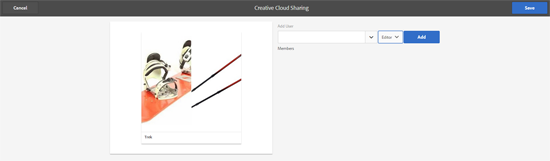

# Adobe Creative Cloud {#folder-sharing-with-adobe-creative-cloud}과(와) 폴더 공유

>[!CAUTION]
>
>AEM-Creative Cloud 폴더 공유 기능은 더 이상 사용되지 않습니다. 고객은 [Adobe 에셋 링크](https://helpx.adobe.com/kr/enterprise/using/adobe-asset-link.html) 또는 [AEM 데스크탑 앱](https://helpx.adobe.com/kr/experience-manager/desktop-app/aem-desktop-app.html)과 같은 최신 기능을 사용해야 합니다. [AEM 및 Creative Cloud 통합 우수 사례](/help/assets/aem-cc-integration-best-practices.md)에서 자세한 내용을 살펴보십시오.

Adobe Experience Manager (AEM) 자산을 사용하여 에셋이 포함된 폴더를 Adobe Creative Cloud 사용자와 공유할 수 있습니다. Adobe Creative Cloud과 자산을 공유할 수 있도록 Adobe Marketing Cloud을 구성하는 방법에 대한 자세한 내용은 [자산 Creative Cloud 통합 구성](/help/sites-administering/configure-assets-cc-integration.md)을 참조하십시오.

1. 자산 콘솔에서 Creative Cloud과 공유할 폴더를 선택합니다.

   

1. 도구 모음에서 **공유**&#x200B;를 클릭합니다.

   

1. 목록에서 **Adobe Creative Cloud** 옵션을 선택합니다.

   

1. **Creative Cloud 공유** 페이지에서 폴더를 공유할 사용자를 추가한 다음 **저장**&#x200B;을 클릭합니다.

   

1. 확인 메시지를 닫으려면 **확인**&#x200B;을 클릭합니다.
1. 폴더를 공유한 사용자의 자격 증명으로 Creative Cloud에 로그온합니다. 공유 폴더는 Creative Cloud에서 사용할 수 있습니다.