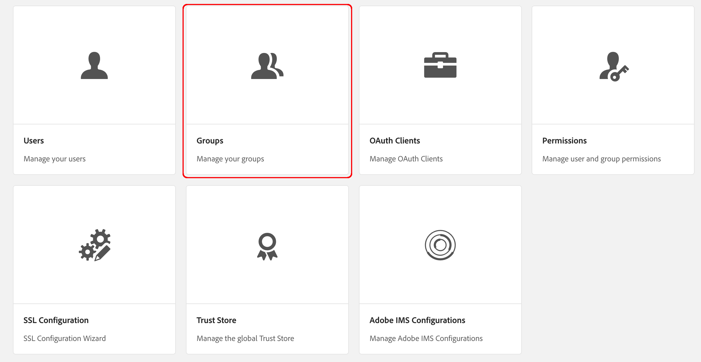

# 폐쇄된 사용자 그룹 생성{#creating-a-closed-user-group}

폐쇄된 사용자 그룹(CUG)은 게시된 인터넷 사이트 내에 있는 특정 페이지에 대한 액세스를 제한하는 데 사용됩니다. 이러한 페이지는 지정된 구성원이 로그인하고 보안 자격 증명을 제공해야 합니다.

웹 사이트 내에서 이러한 영역을 구성하려면 다음 작업을 수행합니다.

* [실제 마감 사용자 그룹을 만들고 구성원 할당](#creating-the-user-group-to-be-used).

* [이 그룹을 필요한 페이지에 적용](#applying-your-closed-user-group-to-content-pages) 및 CUG 구성원이 사용할 로그인 페이지를 선택(또는 생성)합니다. 또한 콘텐츠 페이지에 CUG를 적용할 때도 지정됩니다.

* [일부 양식의 링크를 보호 영역 내 하나 이상의 페이지에 만듭니다.](#linking-to-the-cug-pages), 그렇지 않으면 표시되지 않습니다.

* [dispatcher 구성](#configure-dispatcher-for-cugs) 사용 중인 경우.

>[!CAUTION]
>
>CUG(폐쇄형 사용자 그룹)는 항상 성능을 염두에 두고 만들어야 합니다.
>
>CUG의 사용자 및 그룹 수는 제한되지 않지만, 페이지에서 CUG의 수가 많으면 렌더링 성능이 저하될 수 있습니다.
>
>성능 테스트를 수행할 때 CUG의 영향을 항상 고려해야 합니다.

## 사용할 사용자 그룹 만들기 {#creating-the-user-group-to-be-used}

폐쇄된 사용자 그룹을 생성하려면:

1. 다음으로 이동 **도구 - 보안** AEM 홈스크린에서.

   >[!NOTE]
   >
   >다음을 참조하십시오 [사용자 및 그룹 관리](/help/sites-administering/security.md#managing-users-and-groups) 사용자 및 그룹 만들기 및 구성에 대한 전체 정보를 제공합니다.

1. 다음 항목 선택 **그룹** 다음 화면의 카드.

   

1. 누르기 **만들기** 단추를 클릭하여 새 그룹을 만듭니다.
1. 새 그룹의 이름을 지정합니다(예: ). `cug_access`.

   

1. 로 이동 **구성원** 을(를) 탭하고 필요한 사용자를 이 그룹에 할당합니다.

   

1. CUG에 할당한 모든 사용자를 활성화합니다. 이 경우 의 모든 멤버입니다. `cug_access`.
1. 닫힌 사용자 그룹을 활성화하여 게시 환경에서 사용할 수 있습니다. 이 예에서는 다음과 같습니다. `cug_access`.

## 컨텐츠 페이지에 폐쇄된 사용자 그룹 적용 {#applying-your-closed-user-group-to-content-pages}

CUG를 페이지에 적용하려면 다음을 수행합니다.

1. CUG에 지정할 제한된 섹션의 루트 페이지로 이동합니다.
1. 해당 썸네일을 클릭한 다음 를 선택하여 페이지를 선택합니다 **속성** 을 클릭합니다.

   

1. 다음 창에서 **고급** 탭.

1. 아래로 스크롤하여 **인증 요구 사항** 섹션.

   1. 활성화 **사용** 틱박스.

   1. 에 경로 추가 **로그인 페이지**.
선택 사항입니다. 비워 두면 표준 로그인 페이지가 사용됩니다.

   

1. 다음으로 이동 **권한** 탭하고 선택 **폐쇄된 사용자 그룹 편집**.

   

   >[!NOTE]
   >
   >권한 탭의 CUG는 블루프린트에서 Live Copy로 롤아웃할 수 없습니다. Live Copy를 구성할 때 이를 염두에 두고 계획을 세우십시오.
   >
   >자세한 내용은 [이 페이지](closed-user-groups.md#aem-livecopy).

1. 다음 **폐쇄된 사용자 그룹 편집** 대화 상자가 열립니다. 여기에서 CUG를 검색하고 선택한 다음 를 사용하여 그룹 선택을 확인할 수 있습니다. **저장**.

   그룹이 목록에 추가됩니다(예: 그룹). **cug_access**.

   

1. 변경 내용을 확인합니다. **저장 및 닫기**.

>[!NOTE]
>
>다음을 참조하십시오 [Identity Management](/help/sites-administering/identity-management.md) 게시 환경의 프로필 및 로그인과 로그아웃을 위한 양식 제공에 대한 정보입니다.

## CUG 페이지에 연결 {#linking-to-the-cug-pages}

CUG 페이지에 대한 모든 링크의 대상이 익명 사용자에게 표시되지 않으므로 링크 검사기는 이러한 링크를 제거합니다.

이를 방지하려면 CUG 영역 내의 페이지를 가리키는 보호되지 않는 리디렉션 페이지를 만드는 것이 좋습니다. 그러면 링크 검사기에 문제가 발생하지 않고 탐색 항목이 렌더링됩니다. 리디렉션 페이지에 실제로 액세스할 때만 사용자가 로그인 자격 증명을 성공적으로 제공한 후 CUG 영역 내에서 리디렉션됩니다.

## CUG에 대한 Dispatcher 구성 {#configure-dispatcher-for-cugs}

Dispatcher를 사용하는 경우 다음 속성을 사용하여 Dispatcher 팜을 정의해야 합니다.

* [virtualhosts](https://experienceleague.adobe.com/docs/experience-manager-dispatcher/using/configuring/dispatcher-configuration.html?lang=en#identifying-virtual-hosts-virtualhosts): CUG가 적용되는 페이지의 경로와 일치합니다.
* \sessionmanagement: 아래를 참조하십시오.
* [캐시](https://experienceleague.adobe.com/docs/experience-manager-dispatcher/using/configuring/dispatcher-configuration.html?lang=en#configuring-the-dispatcher-cache-cache): CUG가 적용되는 파일 전용 캐시 디렉터리입니다.

### CUG에 대한 Dispatcher 세션 관리 구성 {#configuring-dispatcher-session-management-for-cugs}

구성 [dispatcher.any 파일의 세션 관리](https://experienceleague.adobe.com/docs/experience-manager-dispatcher/using/configuring/dispatcher-configuration.html?lang=en#enabling-secure-sessions-sessionmanagement) CUG를 위해서요 CUG 페이지에 대한 액세스가 요청될 때 사용되는 인증 핸들러는 세션 관리를 구성하는 방법을 결정합니다.

```xml
/sessionmanagement
    ...
    /header "Cookie:login-token"
    ...
```

>[!NOTE]
>
>Dispatcher 팜에 세션 관리가 활성화되어 있으면 팜이 처리하는 모든 페이지가 캐시되지 않습니다. CUG 외부에 있는 페이지를 캐시하려면 dispatcher.any에서 두 번째 팜을 만듭니다
>비 CUG 페이지를 처리합니다.

1. 구성 [/sessionmanagement](https://experienceleague.adobe.com/docs/experience-manager-dispatcher/using/configuring/dispatcher-configuration.html?lang=en#enabling-secure-sessions-sessionmanagement) 다음을 정의하여 `/directory`; 예:

   ```xml
   /sessionmanagement
     {
     /directory "/usr/local/apache/.sessions"
     ...
     }
   ```

1. 설정 [/allowAuthorized](https://experienceleague.adobe.com/docs/experience-manager-dispatcher/using/configuring/dispatcher-configuration.html?lang=en#caching-when-authentication-is-used) 끝 `0`.
