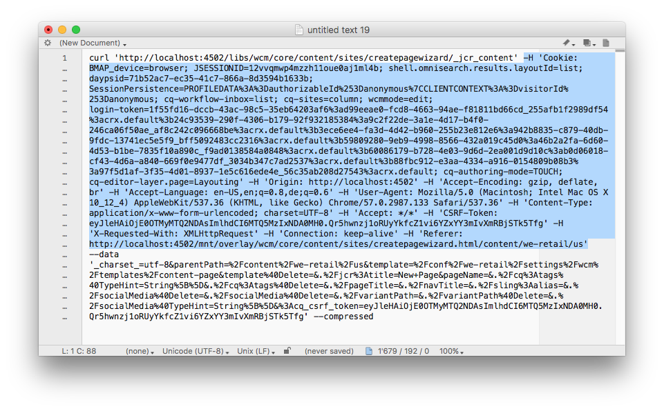

# AEM에서 cURL 사용{#using-curl-with-aem}

관리자는 종종 모든 시스템 내에서 일반적인 작업을 자동화하거나 간소화해야 합니다. 예를 들어 AEM에서 사용자 관리, 패키지 설치 및 OSGi 번들 관리는 일반적으로 수행해야 하는 작업입니다.

AEM이 빌드되는 Sling 프레임워크의 RESTful 특성 때문에 대부분의 작업을 URL 호출로 줄일 수 있습니다. cURL은 이러한 URL 호출을 실행하는 데 사용할 수 있으며 AEM 관리자에게 유용한 도구가 될 수 있습니다.

## cURL 소개 {#what-is-curl}

cURL은 URL 조작을 수행하는 데 사용되는 오픈 소스 명령줄 도구입니다. HTTP, HTTPS, FTP, FTPS, SCP, SFTP, TFTP, LDAP, DAP, DICT, TELNET, FILE, IMAP, POP3, SMTP 및 RTSP를 비롯한 다양한 인터넷 프로토콜을 지원합니다.

cURL은 URL 구문을 사용하여 데이터를 가져오거나 전송하는 데 널리 사용되는 도구로서 원래 1997년에 릴리스되었습니다. 원래 cURL 이름은 &quot;URL 참조&quot;였습니다.

AEM이 빌드되는 Sling 프레임워크의 RESTful 특성 때문에 대부분의 작업을 cURL로 실행할 수 있는 URL 호출로 줄일 수 있습니다. [페이지 활성화와 같은 컨텐츠 조작 작업](/help/sites-administering/curl.md#common-content-manipulation-aem-curl-commands) , 워크플로우 시작, 패키지 관리 및 사용자 관리와 같은 [작업](/help/sites-administering/curl.md#common-operational-aem-curl-commands) 등은 cURL을 사용하여 자동화할 수 있습니다. 또한 AEM의 대부분의 작업에 대해 자체 cURL [명령을](/help/sites-administering/curl.md#building-a-curl-ready-aem-command) 만들 수 있습니다.

>[!NOTE]
>
>cURL을 통해 실행되는 모든 AEM 명령은 AEM에 대한 모든 사용자와 마찬가지로 인증되어야 합니다. cURL을 사용하여 AEM 명령을 실행할 때 모든 ACL 및 액세스 권한이 유지됩니다.

## cURL 다운로드 {#downloading-curl}

cURL은 macOS와 일부 Linux 장치의 표준 부분입니다. 그러나 대부분의 운영 체제에서 사용할 수 있습니다. 최신 다운로드는 https://curl.haxx.se/download.html에서 찾을 수 [있습니다](https://curl.haxx.se/download.html).

cURL의 소스 저장소는 GitHub에서도 찾을 수 있습니다.

## cURL 준비 AEM 명령 작성 {#building-a-curl-ready-aem-command}

워크플로우 트리거, OSGi 구성 확인, JMX 명령 트리거, 복제 에이전트 만들기 등과 같은 AEM의 대부분의 작업에 대해 cURL 명령을 작성할 수 있습니다.

특정 작업에 필요한 정확한 명령을 찾으려면 브라우저의 개발자 도구를 사용하여 AEM 명령을 실행할 때 서버에 대한 POST 호출을 캡처해야 합니다.

다음 단계에서는 Chrome 브라우저에서 새 페이지를 만들어 이를 사용하는 방법을 예로 설명합니다.

1. AEM 내에서 호출할 작업을 준비합니다. 이 경우 페이지 만들기 마법사가 끝날 때까지 진행했지만 **만들기를** 아직 클릭하지 **않았습니다**.

   

1. 개발자 도구를 시작하고 네트워크 **탭을** 선택합니다. 콘솔을 **지우기 전에 로그** 유지 옵션을 클릭합니다.

   

1. 페이지 **만들기** **마법사에서 만들기를 클릭하여** 실제로 워크플로우를 만듭니다.
1. 결과 POST 작업을 마우스 오른쪽 버튼으로 클릭하고 복사 -> **cURL로** **복사를 선택합니다**.

   

1. cURL 명령을 텍스트 편집기에 복사하고 명령에서 모든 헤더를 제거합니다. 이 명령은 `-H` (아래 이미지에서 파란색으로 강조 표시) 및 적절한 인증 매개 변수( `-u admin:admin`예:

   

1. 명령줄을 통해 cURL 명령을 실행하고 응답을 봅니다.

   

## 일반적인 작동 AEM cURL 명령 {#common-operational-aem-curl-commands}

다음은 일반적인 관리 및 운영 작업을 위한 AEM cURL 명령 목록입니다.

>[!NOTE]
>
>다음 예에서는 AEM이 `localhost` 포트에서 실행되고 `4502` 암호를 `admin` 가진 사용자를 사용한다고 가정합니다 `admin`. 추가 명령 자리 표시자는 꺾쇠 괄호로 설정됩니다.

### 패키지 관리 {#package-management}

#### 패키지 만들기 {#create-a-package}

```shell
curl -u admin:admin -X POST http://localhost:4502/crx/packmgr/service/.json/etc/packages/mycontent.zip?cmd=create -d packageName=<name> -d groupName=<name>
```

#### 패키지 미리 보기 {#preview-a-package}

```shell
curl -u admin:admin -X POST http://localhost:4502/crx/packmgr/service/.json/etc/packages/mycontent.zip?cmd=preview
```

#### 목록 패키지 컨텐츠 {#list-package-content}

```shell
curl -u admin:admin -X POST http://localhost:4502/crx/packmgr/service/console.html/etc/packages/mycontent.zip?cmd=contents
```

#### 패키지 빌드 {#build-a-package}

```shell
curl -X POST http://localhost:4502/crx/packmgr/service/.json/etc/packages/mycontent.zip?cmd=build
```

#### 패키지 다시 래핑 {#rewrap-a-package}

```shell
curl -u admin:admin -X POST http://localhost:4502/crx/packmgr/service/.json/etc/packages/mycontent.zip?cmd=rewrap
```

#### 패키지 이름 변경 {#rename-a-package}

```shell
curl -u admin:admin -X POST -Fname=<New Name> http://localhost:4502/etc/packages/<Group Name>/<Package Name>.zip/jcr:content/vlt:definition
```

#### 패키지 업로드 {#upload-a-package}

```shell
curl -u admin:admin -F cmd=upload -F force=true -F package=@test.zip http://localhost:4502/crx/packmgr/service/.json
```

#### 패키지 설치 {#install-a-package}

```shell
curl -u admin:admin -F cmd=install http://localhost:4502/crx/packmgr/service/.json/etc/packages/my_packages/test.zip
```

#### 패키지 제거 {#uninstall-a-package}

```shell
curl -u admin:admin -F cmd=uninstall http://localhost:4502/crx/packmgr/service/.json/etc/packages/my_packages/test.zip
```

#### 패키지 삭제 {#delete-a-package}

```shell
curl -u admin:admin -F cmd=delete http://localhost:4502/crx/packmgr/service/.json/etc/packages/my_packages/test.zip
```

#### 패키지 다운로드 {#download-a-package}

```shell
curl -u admin:admin http://localhost:4502/etc/packages/my_packages/test.zip
```

### 사용자 관리 {#user-management}

#### Create a New User {#create-a-new-user}

```shell
curl -u admin:admin -FcreateUser= -FauthorizableId=hashim -Frep:password=hashim http://localhost:4502/libs/granite/security/post/authorizables
```

#### Create a New Group {#create-a-new-group}

```shell
curl -u admin:admin -FcreateGroup=group1 -FauthorizableId=testGroup1 http://localhost:4502/libs/granite/security/post/authorizables
```

#### 기존 사용자에 속성 추가 {#add-a-property-to-an-existing-user}

```shell
curl -u admin:admin -Fprofile/age=25 http://localhost:4502/home/users/h/hashim.rw.html
```

#### 프로필을 사용하여 사용자 만들기 {#create-a-user-with-a-profile}

```shell
curl -u admin:admin -FcreateUser=testuser -FauthorizableId=hashimkhan -Frep:password=hashimkhan -Fprofile/gender=male http://localhost:4502/libs/granite/security/post/authorizables
```

#### 그룹의 구성원으로 새 사용자 만들기 {#create-a-new-user-as-a-member-of-a-group}

```shell
curl -u admin:admin -FcreateUser=testuser -FauthorizableId=testuser -Frep:password=abc123 -Fmembership=contributor http://localhost:4502/libs/granite/security/post/authorizables
```

#### 그룹에 사용자 추가 {#add-a-user-to-a-group}

```shell
curl -u admin:admin -FaddMembers=testuser1 http://localhost:4502/home/groups/t/testGroup.rw.html
```

#### 그룹에서 사용자 제거 {#remove-a-user-from-a-group}

```shell
curl -u admin:admin -FremoveMembers=testuser1 http://localhost:4502/home/groups/t/testGroup.rw.html
```

#### 사용자 그룹 구성원 설정 {#set-a-user-s-group-membership}

```shell
curl -u admin:admin -Fmembership=contributor -Fmembership=testgroup http://localhost:4502/home/users/t/testuser.rw.html
```

#### 사용자 삭제 {#delete-a-user}

```shell
curl -u admin:admin -FdeleteAuthorizable= http://localhost:4502/home/users/t/testuser

```

#### 그룹 삭제 {#delete-a-group}

```shell
curl -u admin:admin -FdeleteAuthorizable= http://localhost:4502/home/groups/t/testGroup
```

### 백업 {#backup}

자세한 [내용은 백업 및](/help/sites-administering/backup-and-restore.md#automating-aem-online-backup) 복원을 참조하십시오.

### OSGi {#osgi}

#### 번들 시작 {#starting-a-bundle}

```shell
curl -u admin:admin -Faction=start http://localhost:4502/system/console/bundles/<bundle-name>
```

#### 번들 중지 {#stopping-a-bundle}

```shell
curl -u admin:admin -Faction=stop http://localhost:4502/system/console/bundles/<bundle-name>
```

### Dispatcher {#dispatcher}

#### 캐시 무효화 {#invalidate-the-cache}

```shell
curl -H "CQ-Action: Activate" -H "CQ-Handle: /content/test-site/" -H "CQ-Path: /content/test-site/" -H "Content-Length: 0" -H "Content-Type: application/octet-stream" http://localhost:4502/dispatcher/invalidate.cache
```

#### 캐시 제거 {#evict-the-cache}

```shell
curl -H "CQ-Action: Deactivate" -H "CQ-Handle: /content/test-site/" -H "CQ-Path: /content/test-site/" -H "Content-Length: 0" -H "Content-Type: application/octet-stream" http://localhost:4502/dispatcher/invalidate.cache
```

### 복제 에이전트 {#replication-agent}

#### 에이전트의 상태 확인 {#check-the-status-of-an-agent}

```shell
curl -u admin:admin "http://localhost:4502/etc/replication/agents.author/publish/jcr:conten t.queue.json?agent=publish"
http://localhost:4502/etc/replication/agents.author/publish/jcr:content.queue.js on?agent=publish
```

#### 에이전트 삭제 {#delete-an-agent}

```shell
curl -X DELETE http://localhost:4502/etc/replication/agents.author/replication99 -u admin:admin
```

#### 에이전트 만들기 {#create-an-agent}

```shell
curl -u admin:admin -F "jcr:primaryType=cq:Page" -F "jcr:content/jcr:title=new-replication" -F "jcr:content/sling:resourceType=/libs/cq/replication/components/agent" -F "jcr:content/template=/libs/cq/replication/templates/agent" -F "jcr:content/transportUri=http://localhost:4503/bin/receive?sling:authRequestLogin=1" -F "jcr:content/transportUser=admin" -F "jcr:content/transportPassword={DES}8aadb625ced91ac483390ebc10640cdf"http://localhost:4502/etc/replication/agents.author/replication99
```

#### 에이전트 일시 중지 {#pause-an-agent}

```shell
curl -u admin:admin -F "cmd=pause" -F "name=publish"  http://localhost:4502/etc/replication/agents.author/publish/jcr:content.queue.js on
```

#### 에이전트 큐 지우기 {#clear-an-agent-queue}

```shell
curl -u admin:admin -F "cmd=clear" -F "name=publish"  http://localhost:4502/etc/replication/agents.author/publish/jcr:content.queue.js on
```

### 커뮤니티 {#communities}

#### 배지 할당 및 취소 {#assign-and-revoke-badges}

자세한 [내용은 커뮤니티 점수](/help/communities/implementing-scoring.md#assign-and-revoke-badges) 및 배지를 참조하십시오.

자세한 [내용은 점수 및](/help/communities/configure-scoring.md#example-setup) 배지 필수 항목을 참조하십시오.

#### MSRP 다시 인덱싱 {#msrp-reindexing}

자세한 [내용은 MSRP - MongoDB 저장소 리소스](/help/communities/msrp.md#running-msrp-reindex-tool-using-curl-command) 공급자를 참조하십시오.

### 보안 {#security}

#### CRX DE Lite 활성화 및 비활성화 {#enabling-and-disabling-crx-de-lite}

자세한 [내용은 AEM에서 CRXDE](/help/sites-administering/enabling-crxde-lite.md) Lite 활성화를 참조하십시오.

### 데이터 저장소 가비지 컬렉션 {#data-store-garbage-collection}

자세한 [내용은 데이터 저장소](/help/sites-administering/data-store-garbage-collection.md#automating-data-store-garbage-collection) 가비지 컬렉션을 참조하십시오.

### 분석 및 타겟 통합 {#analytics-and-target-integration}

자세한 [내용은 Adobe Analytics 및 Adobe Target](/help/sites-administering/opt-in.md#configuring-the-setup-and-provisioning-via-script) 사용을 참조하십시오.

### 단일 사인온 {#single-sign-on}

#### 테스트 헤더 보내기 {#send-test-header}

자세한 [내용은 단일](/help/sites-deploying/single-sign-on.md) 사인온을 참조하십시오.

## 일반적인 컨텐츠 조작 AEM cURL 명령 {#common-content-manipulation-aem-curl-commands}

다음은 컨텐츠 조작을 위한 AEM cURL 명령 목록입니다.

>[!NOTE]
>
>다음 예에서는 AEM이 `localhost` 포트에서 실행되고 `4502` 암호를 `admin` 가진 사용자를 사용한다고 가정합니다 `admin`. 추가 명령 자리 표시자는 꺾쇠 괄호로 설정됩니다.

### 페이지 관리 {#page-management}

#### 페이지 활성화 {#page-activation}

```shell
curl -u admin:admin -X POST -F path="/content/path/to/page" -F cmd="activate" http://localhost:4502/bin/replicate.json
```

#### 페이지 비활성화 {#page-deactivation}

```shell
curl -u admin:admin -X POST -F path="/content/path/to/page" -F cmd="deactivate" http://localhost:4502/bin/replicate.json
```

#### 트리 활성화 {#tree-activation}

```shell
curl -u admin:admin -F cmd=activate -F ignoredeactivated=true -F onlymodified=true -F path=/content/geometrixx http://localhost:4502/etc/replication/treeactivation.html
```

#### 페이지 잠금 {#lock-page}

```shell
curl -u admin:admin -X POST -F cmd="lockPage" -F path="/content/path/to/page" -F "_charset_"="utf-8" http://localhost:4502/bin/wcmcommand
```

#### 페이지 잠금 해제 {#unlock-page}

```shell
curl -u admin:admin -X POST -F cmd="unlockPage" -F path="/content/path/to/page" -F "_charset_"="utf-8" http://localhost:4502/bin/wcmcommand
```

#### 페이지 복사 {#copy-page}

```shell
curl -u admin:admin -F cmd=copyPage -F destParentPath=/path/to/destination/parent -F srcPath=/path/to/source/location http://localhost:4502/bin/wcmcommand
```

### 워크플로우 {#workflows}

자세한 [내용은 프로그래밍 방식으로](/help/sites-developing/workflows-program-interaction.md) 워크플로우와 상호 작용을 참조하십시오.

### Sling Content {#sling-content}

#### Create a Folder {#create-a-folder}

```shell
curl -u admin:admin -F jcr:primaryType=sling:Folder http://localhost:4502/etc/test
```

#### 노드 삭제 {#delete-a-node}

```shell
curl -u admin:admin -F :operation=delete http://localhost:4502/etc/test/test.properties
```

#### 노드 이동 {#move-a-node}

```shell
curl -u admin:admin -F":operation=move" -F":applyTo=/sourceurl"  -F":dest=/target/parenturl/" https://localhost:4502/content
```

#### 노드 복사 {#copy-a-node}

```shell
curl -u admin:admin -F":operation=copy" -F":applyTo=/sourceurl"  -F":dest=/target/parenturl/" https://localhost:4502/content
```

#### Sling PostServlet을 사용하여 파일 업로드 {#upload-files-using-sling-postservlet}

```shell
curl -u admin:admin -F"*=@test.properties"  http://localhost:4502/etc/test
```

#### Sling PostServlet 및 노드 이름 지정을 사용하여 파일 업로드 {#upload-files-using-sling-postservlet-and-specifying-node-name}

```shell
curl -u admin:admin -F"test2.properties=@test.properties"  http://localhost:4502/etc/test
```

#### 콘텐트 유형을 지정하는 파일 업로드 {#upload-files-specifying-a-content-type}

```shell
curl -u admin:admin -F "*=@test.properties;type=text/plain" http://localhost:4502/etc/test
```

### 자산 조작 {#asset-manipulation}

자세한 [내용은 자산 HTTP](/help/assets/mac-api-assets.md) API를 참조하십시오.
